# (二十五)-Dart 中多线程 Isolate

我们在之前的文章中已经讲解了怎么使用`Future`和`scheduleMicrotask`，但是我们发现，这两个都是同步的，其执行顺序都是可以确定的。接下来我们介绍`Dart`中的异步多线程操作；

## Isolate

我们先来看一段代码执行的结果：

```js
void testIsolate() {
  print('1');
  Future(() => print('3'));
  sleep(const Duration(seconds: 2));
  print('2');
}
```

我们根据之前的学习，可以知道打印结果是`1、2、3`，我们看一下打印结果：

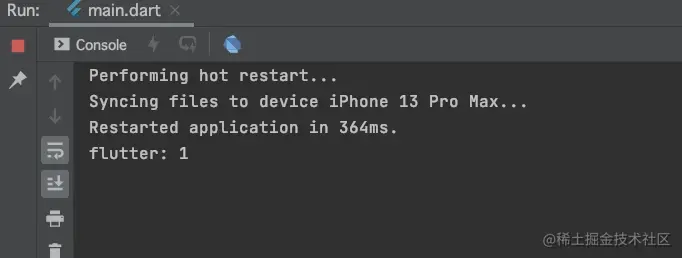

根据打印结果，也确实验证了我们的结论；但是很明显，即使我们阻塞了主线程，`Future`里边的任务依然没有先执行；那么有没有办法能够在主线程阻塞的时候，让`3`先打印出来呢？这个时候就需要用到`Flutter`中的多线程操作`Isolate`了；

我们将代码修改如下：

```js
void testIsolate() {
  print('1');
  Isolate.spawn(func, 10);
  sleep(const Duration(seconds: 2));
  print('2');
}

func (int count) => print('3');
```

此时，我们来看一下打印结果：

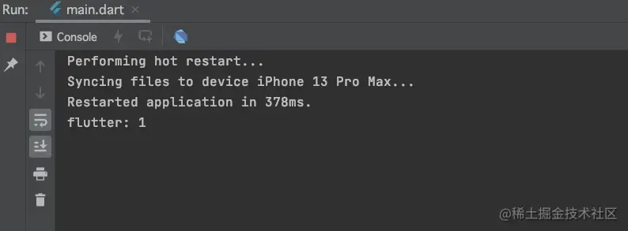

可以看到，我们阻塞了主线程，即使`2`没有第一时间打印出来，但是不影响`3`的输出，也就是`Isolate`没有因为主线程的阻塞，而延后调用；那么`Isolate`是否实在子线程呢？

为了验证`Isolate`是否在子线程，我们将代码修改如下：

```js
void testIsolate() {
  print('1');
  Isolate.spawn(func, 10);
  Isolate.spawn(func2, 10);
  Isolate.spawn(func, 10);
  Isolate.spawn(func2, 10);
  Isolate.spawn(func, 10);
  Isolate.spawn(func2, 10);
  sleep(const Duration(seconds: 2));
  print('2');
}

func (int count) {
  print('第一个');
}

func2 (int count) {
  print('第二个');
}
```

执行结果：

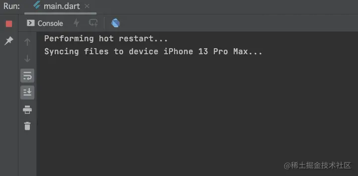

可以看到打印顺序不再是固定的了，变成了随机的，证明了`Isolate`确实是在子线程；

## Isolate 的独立内存空间

需要注意的是，`Dart`中的多线程不仅仅是开辟了一条’线程‘，此处的`Isolate`与其说是线程，不如说他更像一个进程，因为`Isolate`有独立的内存空间 (主要是自己创建的对象 / 数据)；这就意味着，每一个`Isolate`之间的数据是独立的，不会存在资源抢夺的问题，也就不需要使用`锁`进行操作，那么我们访问数据的时候，也就不能直接访问；

我们来看一段代码：

```js
void testIsolate() {
  print('1');
  Isolate.spawn(func, 100);
  sleep(const Duration(seconds: 2));
  print('a = $a');
  print('2');
}

int a = 10;

func (int count) {
  a = count;
  print('func 中 a: $a');
}
```

在这段代码中，我们定义了一个变量`a`，默认值为`10`，然后在`func`方法中奖`count`值赋值给`a`，然后在`Isolate`中，我们将给`func`方法传值为`100`，那么按照正常的逻辑，我们在主线程阻塞`2`秒之后的打印结果应该是`a = 100`，那么是不是这样呢？我们来看一下打印结果：

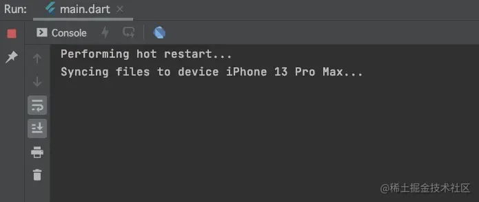

我们看到，即使我们在`func`方法中，给`a`赋值为`100`，但是在之后的打印中`a`还是`10`，这也就意味着`Isolate`中的资源是不能被抢夺的，它是独立的；

## 获取 Isolate 中被修改的数据

但是，我们确实在某些时候，需要在子线程中去修改`a`的值，那么我们应该如何操作呢？我们将代码修改如下：

```js
void testIsolate() {
  print('1');

  // 创建一个接口port
  ReceivePort port = ReceivePort();
  // 创建一个Isolate
  Isolate.spawn(func, port.sendPort);
  // 通过port监听数据的变化
  port.listen((message) {
    a = message;
    print('port中监听到 a = $a');
  });

  sleep(const Duration(seconds: 2));
  print('a = $a');
  print('2');
}

int a = 10;

func (SendPort sendPort) {
  sendPort.send(100);
  print('func 中 a: $a');
}
```

此时，我们再次来查看运行结果：

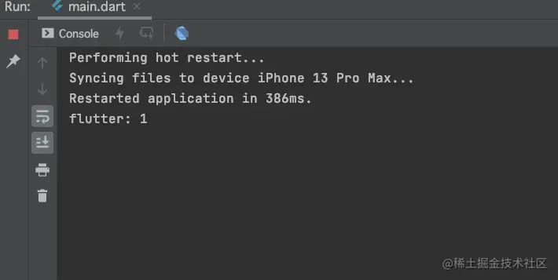

我们看到，此时我们可以监听到`a`被修改了；

在这个过程中，我们做了四件事：

- 创建一个接口：`ReceivePort`;
- 创建一个`Isolate`;
- 使用创建的`ReceivePort`来监听数据的变化;
- 在`Isolate`关联的方法中使用`SendPort`发送消息进行传值；

通过以上四步操作，我们可以修改`Isolate`内部的数据，并获取到新值；

但是需要注意的是，我们使用这种方式开监听数据的时候，相当于开辟了空间，那么就需要我们自己来管理销毁；最终代码如下：

```js
void testIsolate() async {
  print('1');

  // 创建一个接口port
  ReceivePort port = ReceivePort();
  // 创建一个isolate
  Isolate isolate =  await Isolate.spawn(func, port.sendPort);
  // 通过port监听数据的变化
  port.listen((message) {
    a = message;
    print('port中监听到 a = $a');
    // 关闭port
    port.close();
    // 销毁 isolate
    isolate.kill();
  });

  sleep(const Duration(seconds: 2));
  print('a = $a');
  print('2');
}

int a = 10;

func (SendPort sendPort) {
  sendPort.send(100);
  print('func 中 a: $a');
}
```

我们需要将`ReceivePort`关闭掉，将`Isolate`进行销毁；

> 需要注意的是，`Isolate`是多线程操作，所以此处的`await`并不会让后续代码产生类似`Future`的等待效果；

## compute

在`Flutter`中的多线程除了`Isolate`之外，还有一个`compute`，它是对`Isolate`的封装；我们来看一段代码：

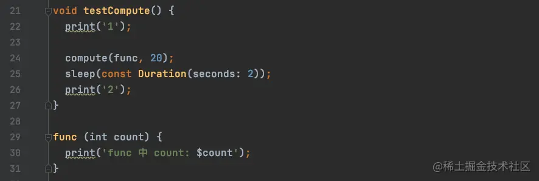

我们来看这段代码的执行效果：

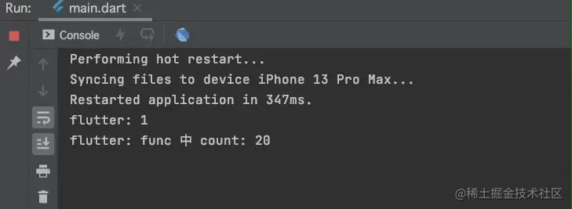

从执行效果我们可以确定，`compute`也是在子线程执行的；

但是`compute`和`Isolate`是有区别的，`compute`可以接收任务`func`中的返回值的；我们将代码修改如下：

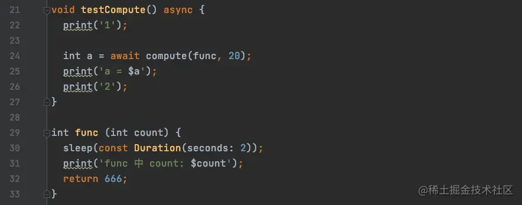

查看运行结果：

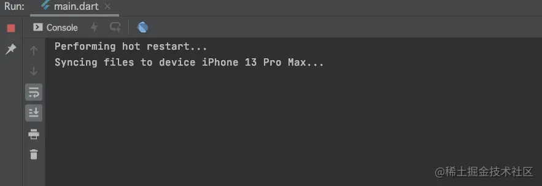

可以看到我们接收到了`func`方法的返回值；

> 需要注意的是，`compute`的`await`会引起和`Future`中同样的等待效果；

那么`compute`是否是数据隔离呢？

我们对代码进行如下修改： 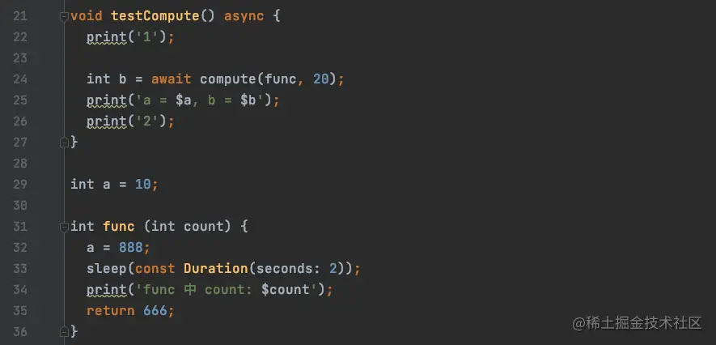

运行结果：

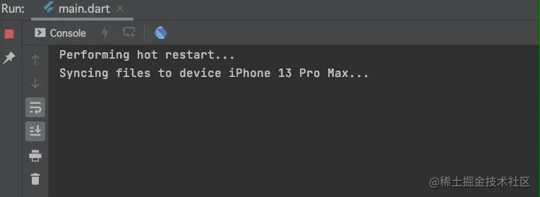

可以看到`compute`可以接收任务的返回数据，但是在任务内部针对全局变量`a`的修改，在外部依然无法获取；
