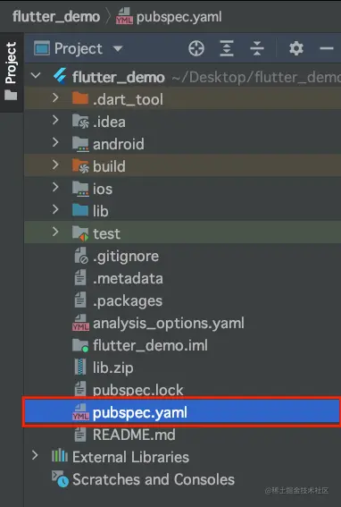
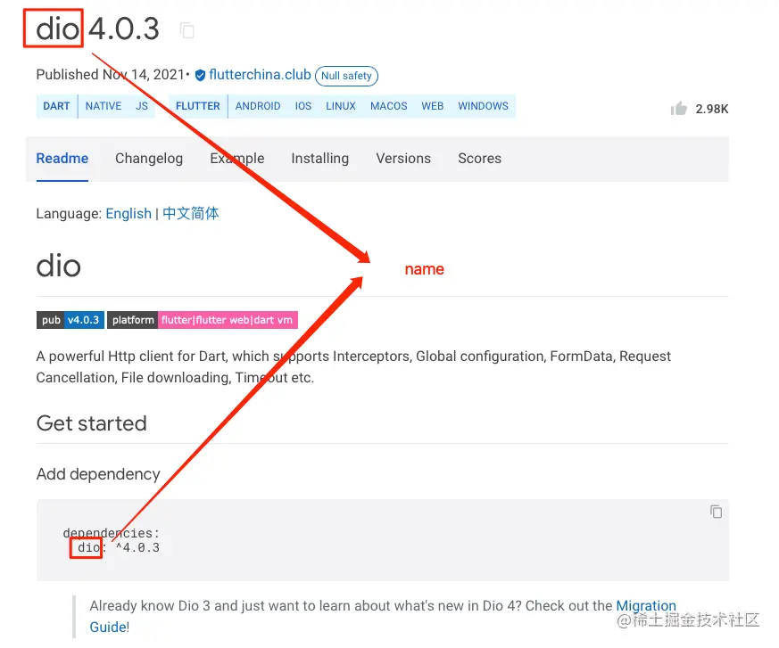
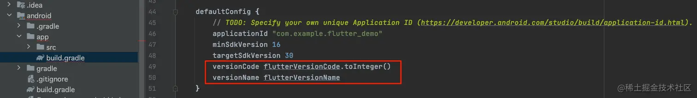
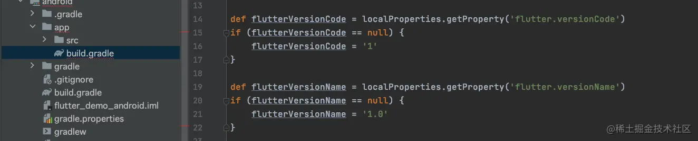

# (二十六)-pubspec.yaml 文件介绍

在`Flutter`中有一个至关重要的文件，它就是`pubspec.yaml`文件，它是`Flutter`项目的配置文件；其作用类似于`Node.js`中的`package.json`，或者`Android`中的`Gradle`文件；

## pubspec.yaml 文件位置

我们创建一个新的`Flutter`工程，其配置文件`pubspec.yaml`文件就位于根目录，如下图所示:



## pubspec.yaml 默认配置

在新工程中，`pubspec.yaml`中的默认配置，去掉注释部分，其配置内容如下：

```js
name: flutter_demo
description: A new Flutter project.

publish_to: 'none'

version: 1.0.0+1

environment:
  sdk: ">=2.12.0 <3.0.0"

dependencies:
  flutter:
    sdk: flutter

  cupertino_icons: ^1.0.2

dev_dependencies:
  flutter_test:
    sdk: flutter

  flutter_lints: ^1.0.0

flutter:

  uses-material-design: true
```

## 配置项介绍

### name

此属性表示包名 (`package name`)，此属性在整个配置中扮演者极其重要的角色，引入其他我么你自己写的文件时，将会使用次报名，比如： 当`name`配置如下时：

```js
name: flutter_demo;
```

我们在导入其他文件时，就需要使用如下方式：

```js
import "package:flutter_demo/listview_demo/listview_demo.dart";
```

如果我们将`name`的配置修改如下：

```js
name: flutter_app;
```

那么，我们在导入文件时，引入的`import`也要做相应的修改：

```js
import "package:flutter_app/listview_demo/listview_demo.dart";
```

> 需要注意的是，如果我们开发了一个`Flutter`插件并对外发布，那么在`pub.dev`网站上，此属性将会作为标题显示，他人使用此插件时，引入也需要使用到此属性；



### description

该属性是一个可选配置项，是对当前`Flutter`工程项目的介绍，作为插件发布时，也会显示在`pub.dev`上边，位置如下：


### publish_to

此属性意为包发布到哪里去？

- `none`：表示此包不发布；
- 也可以指定发布的服务器；根据注释可以看到，如果删除此项配置，那么默认发布到`pub.dev`

### version

此属性表示当前工程的版本，分为`应用程序的版本`和`内部版本号`，格式为`x.x.x+x`，比如`1.0.0+1`，称为`语义版本号`；

- `+`号前面的叫做`version number`；
- `+`号后面的叫做`build number`；

在`Flutter`工程中的`andioid/app`目录下的文件`build.gradle`中有如下配置：





其中`version number`对应`versionName`；`build number`对应`versionCode`；

### environment

此属性下可以配置`Flutter`和`Dart`版本，在我们初始化项目之后，此属性下配置的`sdk`是一个范围值，表示的是`Dart`版本号，比如：

```js
environment: sdk: ">=2.12.0 <3.0.0";
```

表示，当前工程兼容版本号`大于等于2.12.0`并且`小于3.0.0`的`Dart`版本的语法；

我们也可以手动添加上`Flutter`的版本号，比如：

```js
environment: sdk: ">=2.12.0 <3.0.0";
flutter: "1.22.0";
```

### dependencies

此属性下，一般添加我们用到的第三方的`sdk`，默认配置如下：

```js
dependencies:
  flutter:
    sdk: flutter

  cupertino_icons: ^1.0.2
```

- `sdk: flutter`意为默认获取`flutter`的最新版本，也就是我们机器上的`flutter`版本，我们也可以在此处添加`version`来指定`flutter`的版本；

```js
dependencies: flutter: sdk: flutter;
version: "2.5.3";
```

- `cupertino_icons`：给应用程序添加`Cupertino`图标的，一般用于`iOS`;

我们在之前的文章中，介绍过`http`发送网络请求的情况，我们也是在此处配置的`http`，如下：

```js
dependencies:
  flutter:
    sdk: flutter

  cupertino_icons: ^1.0.2
  http: ^0.13.4
```

关于这些第三方的版本号有以下几种写法：

- `不指定/any`：这个时候，默认加载最新的版本；但是一般我们不推荐这样写，因为版本的变化可能会引起调用方式发生变化，导致项目编译出错；
- `x.y.z`：明确指定使用某一个版本号；
- `<=x.y.z/<x.y.z`：使用小于或者小于等于某一个版本的包，这种方式，版本号需要加引号；
- `>=x.y.z <x.y.z`：指定使用某一个区间的版本，这种方式，版本号需要加引号；
- `^x.y.z`：此种方式最为常见，也是比较推荐使用的方式。意为`在大版本不变的情况下，使用最新的小版本`；例如：`^2.12.0`相当于`>=2.12.0 <3.0.0`;

### dev_dependencies

该配置项与`dependencies`的配置基本相似，都是配置应用程序所依赖的包；

不同的是，`dependencies`下配置的依赖包会被编译到项目中，而`dev_dependencies`配置的仅仅是运行期间的包；

### flutter

此配置下一般是`Flutter`相关的配置；

```js
uses-material-design: true
```

上边的默认配置意思是，确保我们的应用程序中包含`Material Icons`字体，以使我们能够使用`material Icons`类中的图标；

我们当资源的配置也是在这个配置下进行设置：

- `assets`：配置图片；
- `fonts`：配置字体；
- `plugin`：该配置只存在于插件项目中，用来配置适配的平台，一般不要修改；如需添加新平台，直接添加即可；

> 需要注意的是，此文件中的配置一定要特别注意格式与缩进，否则配置将可能无法生效；
