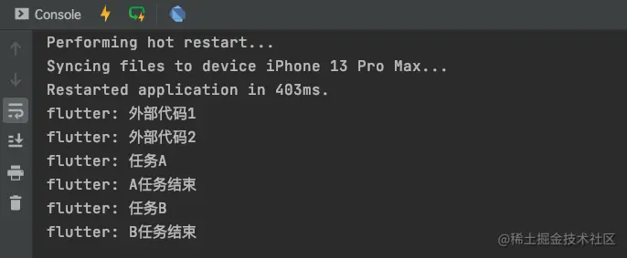
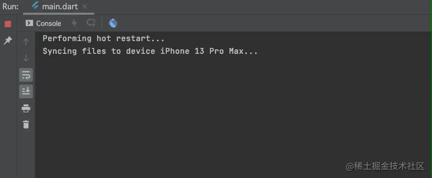
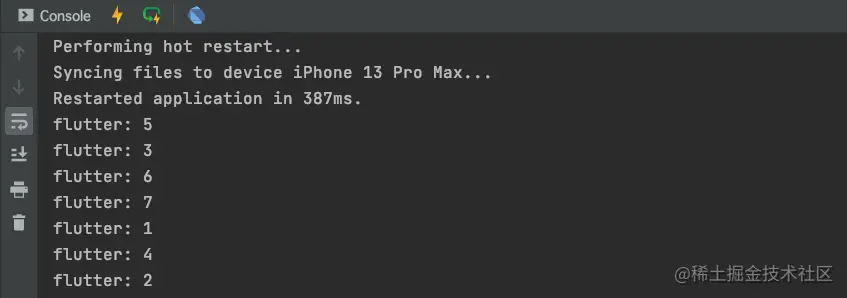
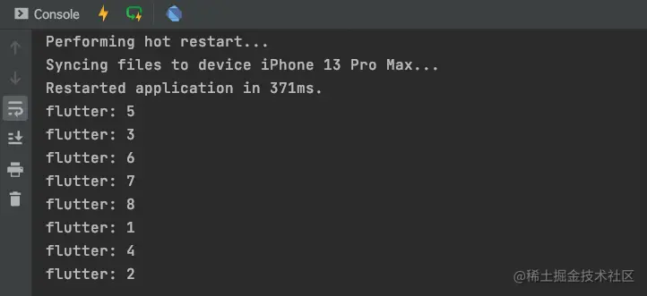

# (二十四)-Dart 事件循环机制

我们在前面已经大致了解了`Flutter`中`Future`的运行机制，那么除了`Future`，`Flutter`中是否还有其他任务机制呢？

我们先来看一段代码：

```js
void testFuture() {
  print('外部代码1');
  Future(() => print('任务A')).then((value) => print('A任务结束'));
  Future(() => print('任务B')).then((value) => print('B任务结束'));
  print('外部代码2');
}
```

按照我们在之前文章中介绍的`Future`的用法及执行流程，我们很容易就能猜到运行结果：



那么，如果在代码运行过程中，突然有紧急任务需要先执行，那么有没有办法处理呢？这就要使用到微任务来做处理了；

## scheduleMicrotask

`scheduleMicrotask`又称为`微任务`，我们将代码修改一下，添加一个微任务看一下代码的执行流程发生了什么变化？我们将代码修改如下：

```js
void testFuture() {
  print('外部代码1');
  Future(() => print('任务A')).then((value) => print('A任务结束'));
  Future(() => print('任务B')).then((value) => print('B任务结束'));
  scheduleMicrotask(() {
    print('微任务A');
  });
  sleep(const Duration(seconds: 1));
  print('外部代码2');
}
```

在代码的执行流程中添加了`scheduleMicrotask`微任务，那么代码的执行结果是什么呢？



根据打印信息，我们发现我们在`Future`后边添加的`scheduleMicrotask`微任务竟然优先执行了；`scheduleMicrotask`拥有较高的优先级，进而我们也能够确定在这段代码执行的过程中是有两个队列存在的，否则微任务不发优先执行；

## Dart 中的队列

在`Dart`中是有两种对类存在的：

- `event queue`事件队列：这种队列包含所有的外来事件，如`I/O`、`mouse events`、`drawing events`、`timers`和`Isolate`等之间的信息传递；
- `microtask queue`微任务队列：这种队列表示一个短时间内就会完成的异步任务。它的优先级最高，只要此队列中还有任务，就可以一直霸占着事件循环。`microtask queue`添加的任务主要是由`Dart`内部产生的。

> 需要注意的是，正因为`microtask queue`队列的优先级高于`event queue`队列，所以如果在`microtask queue`中的微任务过多，那么就有可能一直霸占当前的事件循环 (`event loop`)。从而对`event queue`中的触摸、绘制等事件产生影响，导致这些时间产生阻塞卡顿；

在每一次的事件循环中，`Dart`总是会优先在`microtask queue`队列中查询是否还有可执行的任务，如果该队列中没有需要处理的任务，那么才会处理`event queue`队列中的任务及其流程；

在异步任务中，我们使用的最多的还是优先级较低的`event queue`。`Dart`中为`event queue`的任务做了一层封装，也就是我们之前使用过的`Future`；

`Dart`中`Future`异步任务的执行流程：

- 声明一个`Future`时，`Dart`会将异步任务的函数执行体放入`event queue`中，然后立即返回，后续的代码继续进行同步执行；
- 当同步执行的代码执行完毕后，`event queue`会按照加入的顺序也就是声明顺序，依次取出事件，最后同步执行`Future`的函数体及后续操作；

## 事件示例

我们来定义一串任务，代码如下：

```js
void testFuture() {
  Future f1 = Future(() => null);
  f1.then((value) {
   print('6');
  }).then((value) => print('7'));

  Future f2 = Future(() => print('1'));
  f2.then((value){
    print('4');
  });

  Future(() => print('2'));

  scheduleMicrotask(() {
    print('3');
  });

  print('5');
}
```

按照我们对`Future`任务执行顺序的理解，以及`scheduleMicrotask`具有较高优先级的执行权，那么其打印顺序应该是：

> 5、3、6、7、1、4、2

我们查看打印结果：



确实和我们预料的一样，那么我们将代码作如下修改呢？

```js
void testFuture() {
  Future f1 = Future(() => null);
  f1.then((value) {
   print('6');
   scheduleMicrotask(() {
     print('8');
   });
  }).then((value) => print('7'));

  Future f2 = Future(() => print('1'));
  f2.then((value){
    print('4');
  });

  Future(() => print('2'));

  scheduleMicrotask(() {
    print('3');
  });

  print('5');
}
```

我们在`f1`的任务中，添加了一个微任务，那么我们来看一下此时的打印结果：



看到这个结果，我们不免会产生疑问？`scheduleMicrotask`是微任务，那么他的优先级应该是最高的，那么`8`为什么会在`7`的后边打印呢？

此处需要注意的是，`then`内部的代码，我们可以看做这部分代码被扔在了微任务队列中，而`scheduleMicrotask`虽然也是微任务，但是此时它仅仅是扔在了微任务队列中，当前的微任务队列中还有打印`7`的任务，所以最终是`7`在`8`的前边打印；
