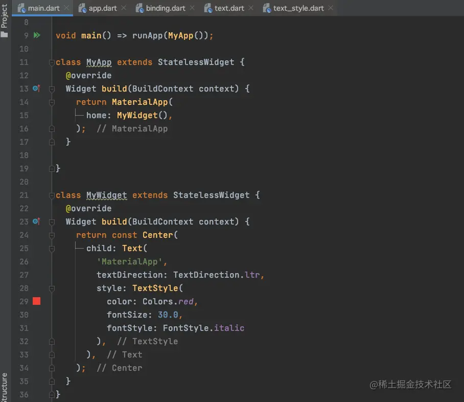
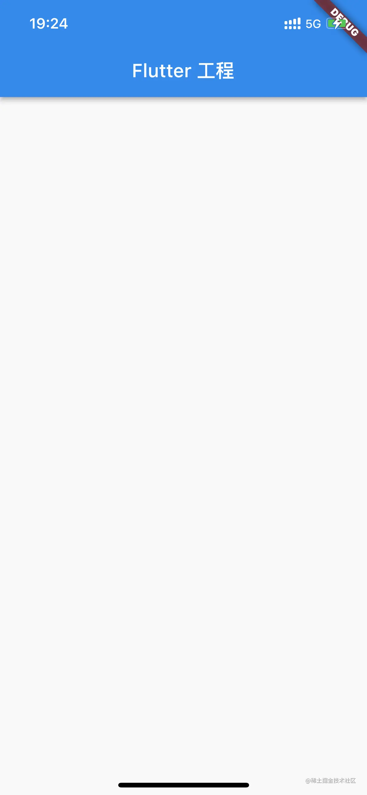
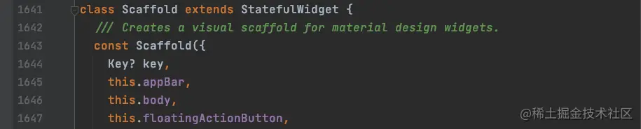
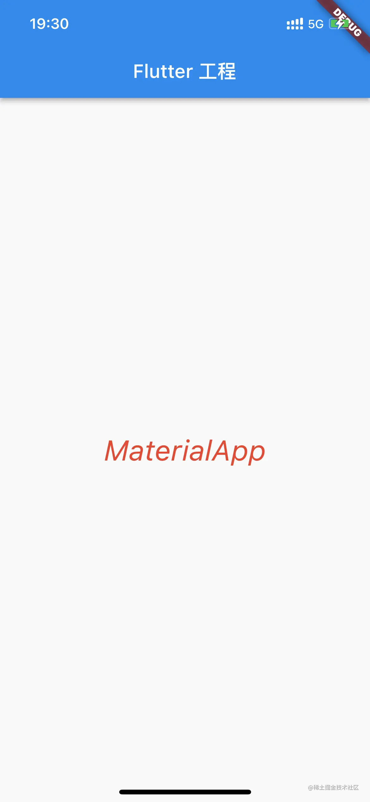
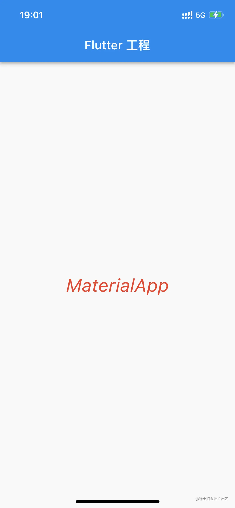

# (五)常用部件 MaterialApp

到目前为止，我们使用的几个小部件都是在`material.dart`中的，其实在它里边`Flutter`还为我们封装了其他好用的组件；

## MaterialApp

在`Flutter`中，`runApp`推荐返回一个`MaterialApp`，那么我们来看一下它是个什么样的部件：

```
class MaterialApp extends StatefulWidget
```

我们从它的继承关系中可以看到，它继承自一个`StatefulWidget`，这是一个有状态的`Widget`，那么它有可能封装了一套方便我们使用的`UI`效果； ​

我们将代码修改如下： ​

 运行工程，显示效果：  比起之前的显示效果多了两行下划线和`debug`标识； ​

## Scaffold

​

我们在使用`MaterialApp`的时候，一般配合`Scaffold`使用，而`Scaffold`中含有`AppBar`的定义：

我们编写如下代码：

```
void main() => runApp(MyApp());

class MyApp extends StatelessWidget {
  @override
  Widget build(BuildContext context) {
    return MaterialApp(
      home: Scaffold(
        appBar: AppBar(
          title: const Text('Flutter 工程'),
        ),
      ),
    );
  }
}
```

直接运行项目，查看显示效果： 

这个时候已经接近于我们常用的`App`样式了； ​

那么我们如果将自定义的`MyWidget`显示在界面上呢？我们查看一下`Scaffold`除了`appBar`是否还有其他属性？ ​

我们发现`Scaffold`还有一个`body`属性，并且它也是一个`Widget`：`final Widget? body;`  我们将自定义的`MyWidget`赋值给`Scaffold`的`body`属性试试看：

```
class MyApp extends StatelessWidget {
  @override
  Widget build(BuildContext context) {
    return MaterialApp(
      home: Scaffold(
        appBar: AppBar(
          title: const Text('Flutter 工程'),
        ),
        body: MyWidget(),
      ),
    );
  }
}
```

运行项目，查看效果：  自定义的`MyWidget`已经显示在界面上了，而且我们发现`Center`部件并不是在屏幕正中间，而是基于它的父部件也就是`body`居中的； ​

我们正常开发`App`的过程中，一般情况下也是基于`MaterialApp`来进行开发的；

## Flutter 小知识

### debug 标识

我们发现，在我们使用了`MaterialApp`之后，在`App`显示界面的右上角出现了一个`debug`的标识，那么如何将其隐藏掉呢？ ​

既然是跟随`MaterialApp`这个部件出现的，那么在此部件内部是否有属性可以设置`debug`标识的显示与否呢？ ​

`MaterialApp`中`debugShowCheckedModeBanner`就是控制`debug`标识的显示与隐藏的，我们将代码修改如下：

```
class MyApp extends StatelessWidget {
  @override
  Widget build(BuildContext context) {
    return MaterialApp(
      debugShowCheckedModeBanner: false,
      home: Scaffold(
        appBar: AppBar(
          title: const Text('Flutter 工程'),
        ),
        body: MyWidget(),
      ),
    );
  }
}
```

运行查看效果： 
