# (八)线性布局 Row&Column

线性布局也就是子部件沿水平或者垂直方向排列。在`Flutter`中线性布局是通过`Row`和`Column`来实现的；这类似于`Android`的`LinearLayout`的控件；而`Row`和`Column`都继承自`Flex`(弹性布局)；

## 主轴和纵轴

对于`线性布局`而言，是由`主轴`和`纵轴`之分的；

- 如果布局是沿`水平方向`，那么主轴就是指`水平方向`，纵轴就是`垂直方向`；
- 如果布局是沿`垂直方向`，那么主轴就是指`垂直方向`，纵轴就是`水平方向`；
- `MainAxisAlignment`主轴对齐；
- `CrossAxisAlignment`纵轴对齐；

## 准备工作

在之前的学习中，我们已经知道了`Container`不见会根据其内部的子部件改变自身大小，比如： 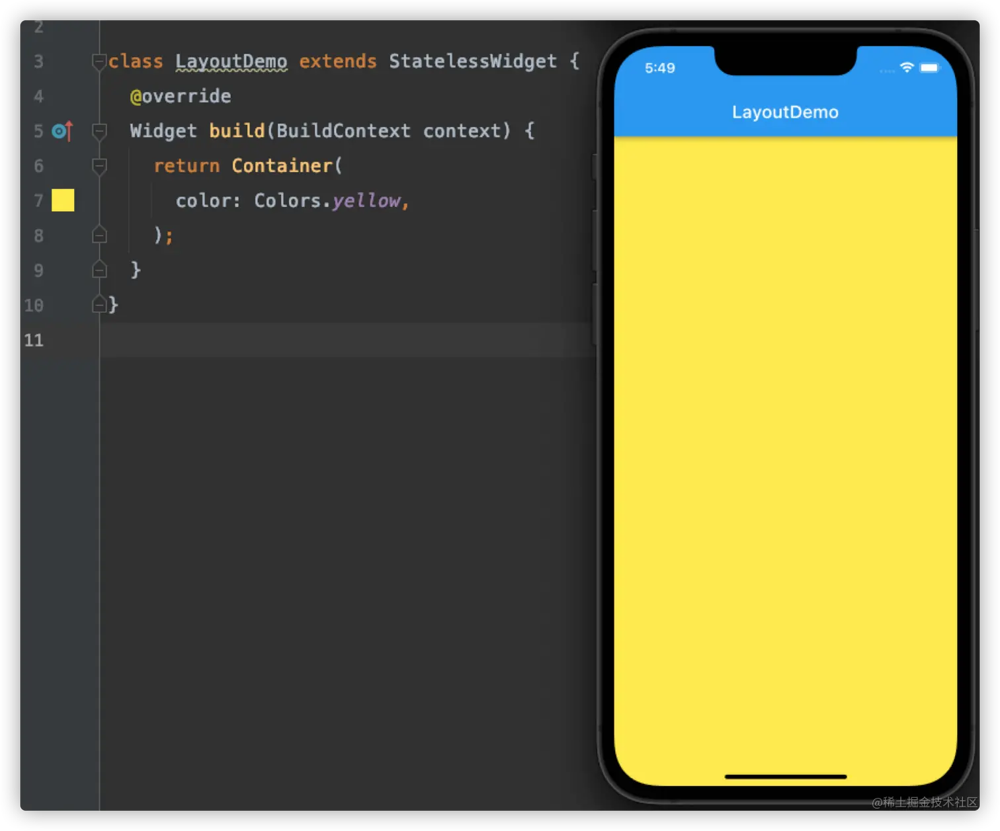一个默认的满屏的黄色背景的`Container`，如果我们在其内部添加一个子部件`Text`： 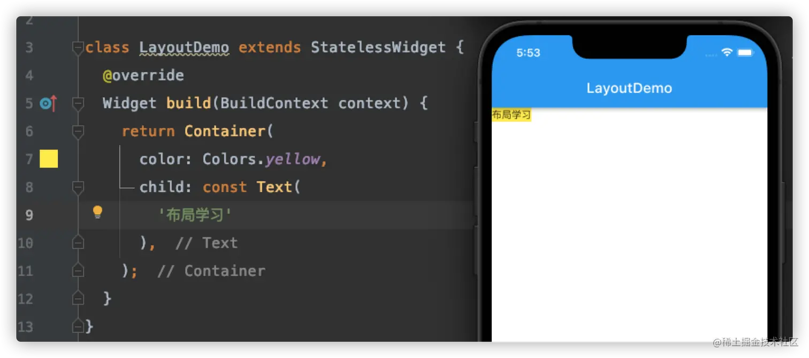 原来满屏的黄色背景的`Container`变成了`Text`部件一样的大小； ​

接下来我们再来看一个`Container`的属性：`alignment`对齐方式，其定义如下：

```
final AlignmentGeometry? alignment;
```

> `aligment`需要一个`AlignmentGeometry`类型的值，表示子部件在父部件中的起始位置。`AlignmentGeometry`是一个抽象类，它有两个常用的子类：`Alignment`和`FractionOffset`；

这里我们先使用`Alignment`来进行布局，其构造函数为：

```
const Alignment(this.x, this.y)
```

> `x`,`y`取值范围为`-1`到`1`；中心点是 (0，0)

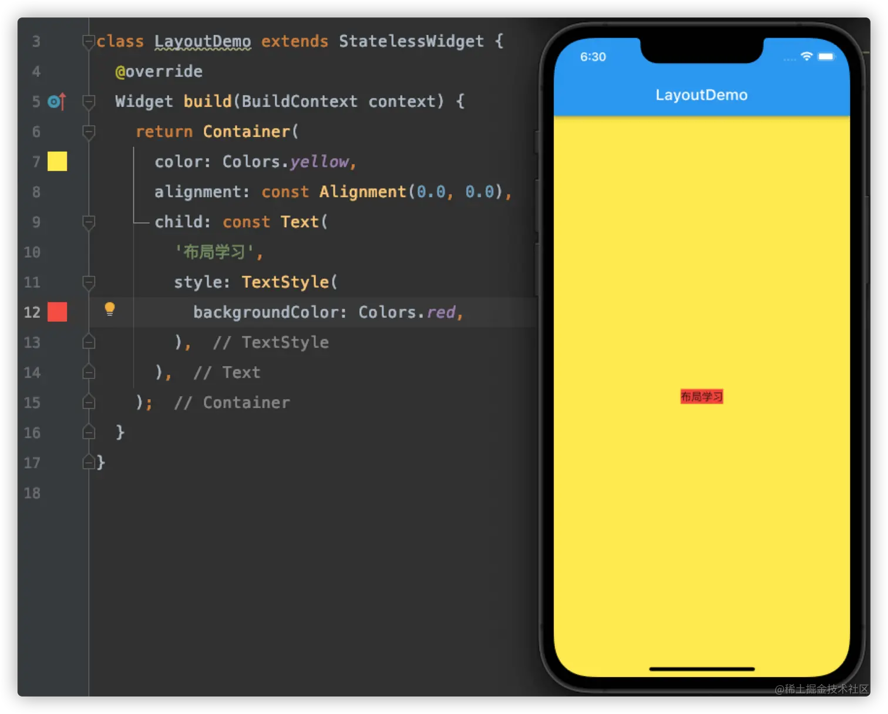 `Container`被拉大，而`Text`放在了`Container`的中心点上； ​

那么，接下来，我们来分析一下`Row`的布局方式；

## Row

`Row`可以沿水平方向布局其`子Widget`；其定义如下：

```
Row({
    Key? key,
    MainAxisAlignment mainAxisAlignment = MainAxisAlignment.start,
    MainAxisSize mainAxisSize = MainAxisSize.max,
    CrossAxisAlignment crossAxisAlignment = CrossAxisAlignment.center,
    TextDirection? textDirection,
    VerticalDirection verticalDirection = VerticalDirection.down,
    TextBaseline? textBaseline, // NO DEFAULT: we don't know what the text's baseline should be
    List<Widget> children = const <Widget>[],
  })
```

- `textDirection`：表示水平方向子部件的布局顺序是从左到右还是从右到左；默认为系统当前环境的文本方向：中文，英文为从左到右，阿拉伯语为从右到左；
- `mainAxisSize`：表示`Row`在主轴方向也就是水平方向上占用的控件；
  - `MainAxisSize.max`(默认)：意思是尽可能多的占用水平方向的空间；此时不管子部件在水平方向上实际占用多少空间，`Row`的宽度始终都是水平方向的最大宽度；
  - `MainAxisSize.min`：表示尽可能少的占用水平方向的空间；如果子部件没有沾满水平方向剩余空间，那么`Row`的世纪宽度就是所有子部件占用水平空间之和；
- `mainAxisAlignment`：表示子部件在`Row`所占用的水平空间内的对齐方式：
  - `mainAxisSize`值为`MainAxisSize.min`时，`mainAxisAlignment`无意义，此时子部件的总宽度与`Row`的宽度一样；
  - `mainAxisSize`值为`MainAxisSize.max`(默认) 时：
    - `MainAxisAlignment.start`表示沿`textDirection`的初始化方向对齐
      - `TextDirection.ltr`：`MainAxisAlignment.start`表示左对齐；
      - `TextDirection.rtl`：`MainAxisAlignment.start`表示右对齐；
    - `MainAxisAlignment.end`与`MainAxisAlignment.start`表示的初始化对齐方向时相反的；
    - `MainAxisAlignment.center`表示居中对齐；
  - 可以理解为：`textDirection`是`mainAxisAlignment`的参考系；
- `verticalDirection`：表示`Row`纵轴 (垂直) 的对齐方向；
  - `VerticalDirection.down`：表示从上到下；
  - `VerticalDirection.up`：表示从下到上；
- `crossAxisAlignment`：表示子部件在纵轴方向上的对齐方式；`Row`的高度等于子部件中最高的子元素的高度；其取之和`MainAxisAlignment`一样包含`start`，`end`和`center`三个值；不同的是其参考系是`verticalDirection`：
  - `verticalDirection`值为`VerticalDirection.down`时，`CrossAxisAlignment.start`表示顶部对齐；
  - `verticalDirection`值为`VerticalDirection.up`时，`CrossAxisAlignment.start`表示底部对齐；
  - `CrossAxisAlignment.end`和`CrossAxisAlignment.start`相反；
- `children`子部件数组；

我们现在先在`Row`中添加三个`Text`，看一下默认效果： 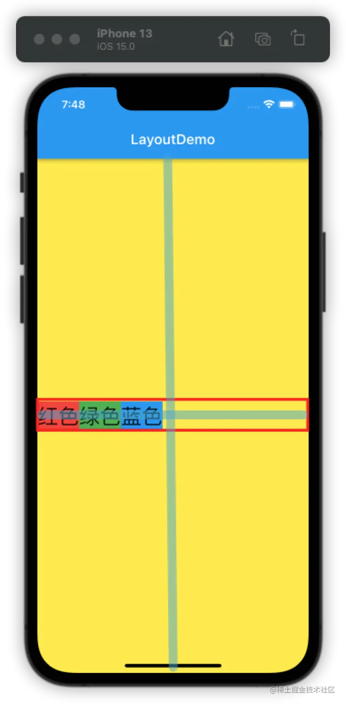 默认三个`Text`为居左对齐；红色线框区域为`Row`的区域，两条蓝色线交叉点为`Row`的中心点； 因为`Row`是横向的，所以此时`Alignment`的`x`的值对`Row`的布局是没有影响的： 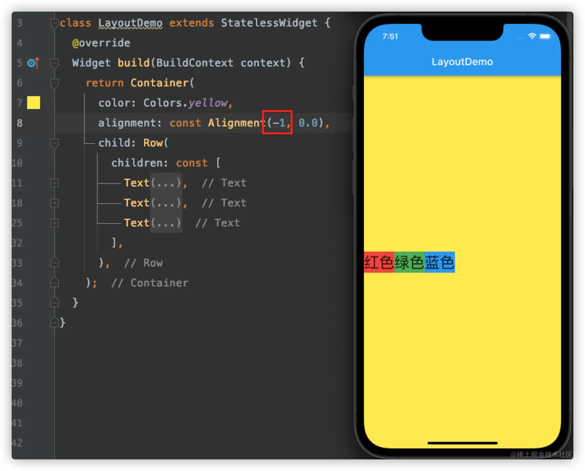

> 同样的`y`值对`Column`的布局也是没有影响的；

接下来我们将`Row`的`textDirection`设置为`TextDirection.rtl`看一下运行效果： 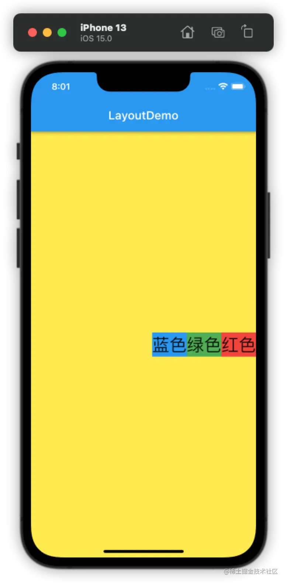 三个`Text`的初始化顺序变为从右开始； 为了便于查看效果，我们将多个`Row`放在界面中，从上到下排列，效果如图： 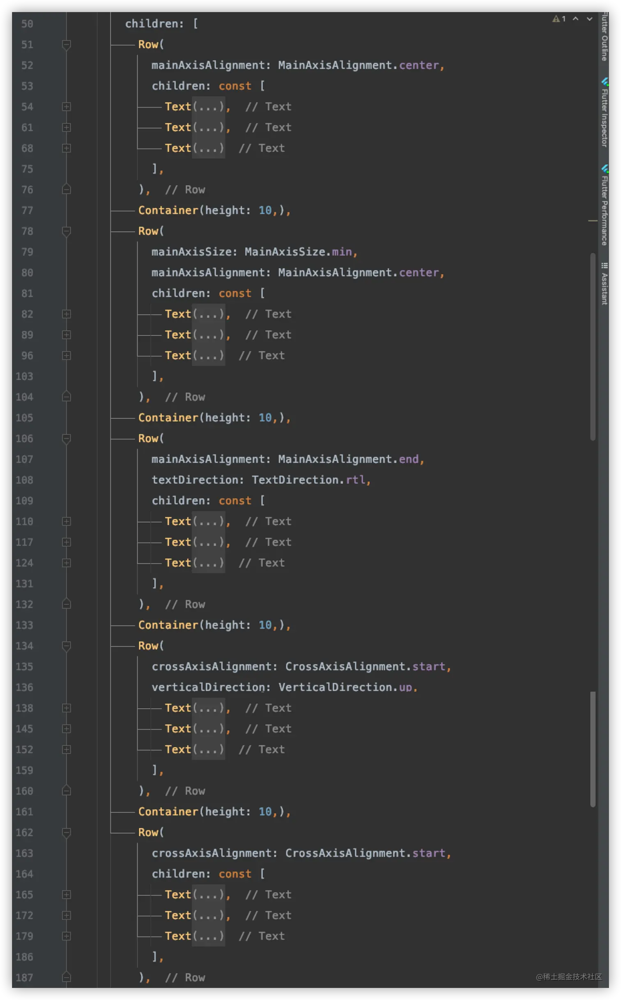 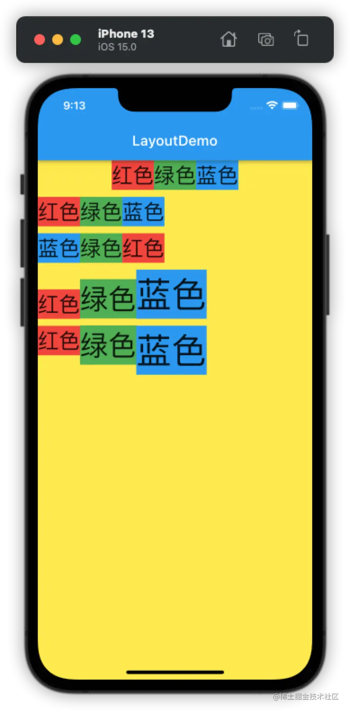

- 第一行：默认居中对齐；
- 第二行：由于设置了`mainAxisSize`的值为`MainAxisSize.min`，所以`Row`的对齐方式`mainAxisAlignment`就没有了意义，子部件会从左到右布局显示，子部件的宽度之和与`Row`的宽度一致；
- 第三行：由于将`textDirection`设置为`TextDirection.rtl`，表示子部件将会从右到左的初始化顺序进行布局，而此时`MainAxisAlignment.end`表示的是左对齐；
- 第四行：由于多个`Text`的字体大小不一致，所以其高度也不一样；而`VerticalDirection.up`表示从下到上的顺序排列，而此时`CrossAxisAlignment.start`表示在纵轴上底部对齐；
- 第五行：`CrossAxisAlignment.start`默认表示顶部对齐；

## Column

`Column`可以在垂直方向上布局其子部件，参数和`Row`是一样的，不同的是`Column`布局方向为垂直，主轴和纵轴与`Row`正好相反； ​

比如，我们将之前布局中的`Row`直接修改为`Column`来看一下效果： 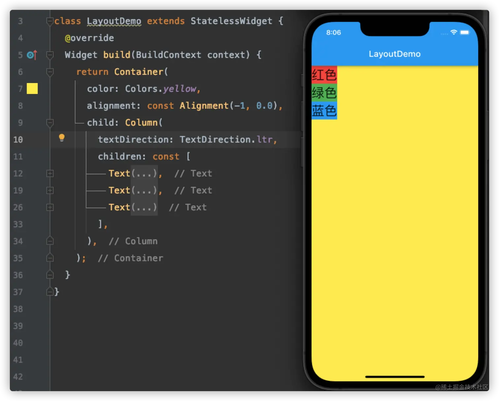

> 本来`Row`中从左到右布局的三个`Text`，换成`Column`之后变为了从上到下布局，并且因为`Alignment`的`x`为`-1`，所以在在水平方向上，先是在了屏幕的最左侧；

## 关于 MainAxisAlignment 的补充

`MainAxisAlignment`是一个枚举类型，其定义如下：

```
enum MainAxisAlignment {
  start,
  end,
  center,
  spaceBetween,
  spaceAround,
  spaceEvenly,
}
```

我们发现`MainAxisAlignment`除了`start`，`end`和`center`三个之和，还有`spaceBetween`，`spaceAround`和`spaceEvenly`三个值，那么这三个值的效果是什么样子的呢？

### spaceBetween

`spaceBetween`意思是：所有的子部件布局完成之后，剩下的空间平均分布到几个子部件之间； ​

演示效果如下： 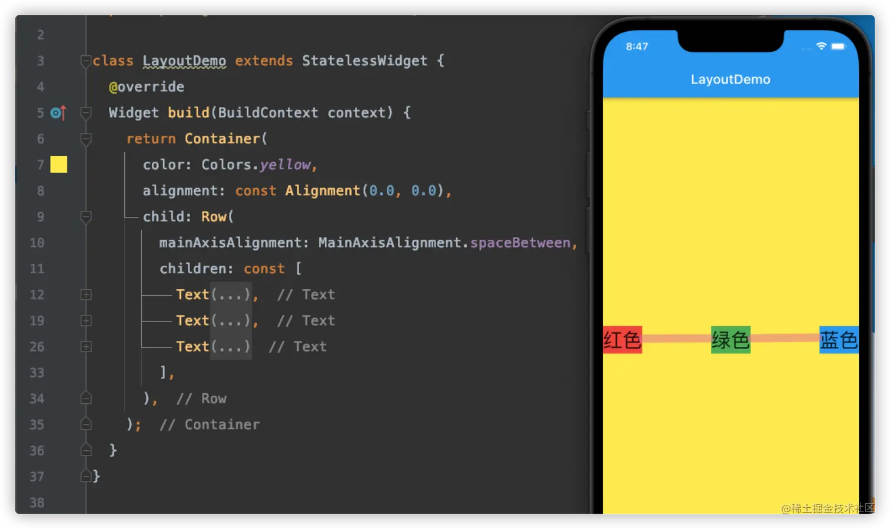

### spaceAround

`spaceAround`意思是：所有的子部件布局完成之后，剩下的空间平均分布到几个子部件周围； ​

为了更好的演示效果，我们此处改变字体大小之后看效果如下： 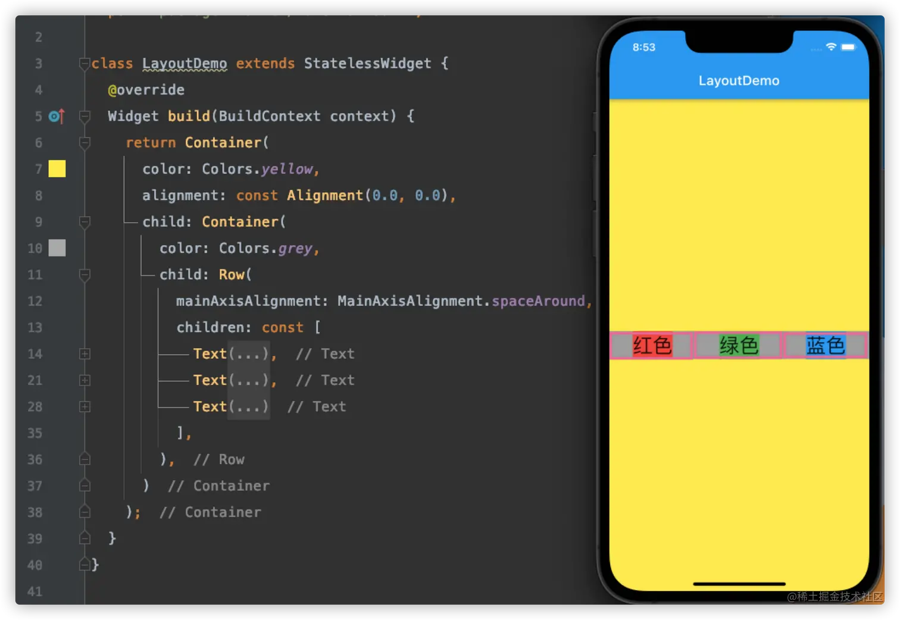 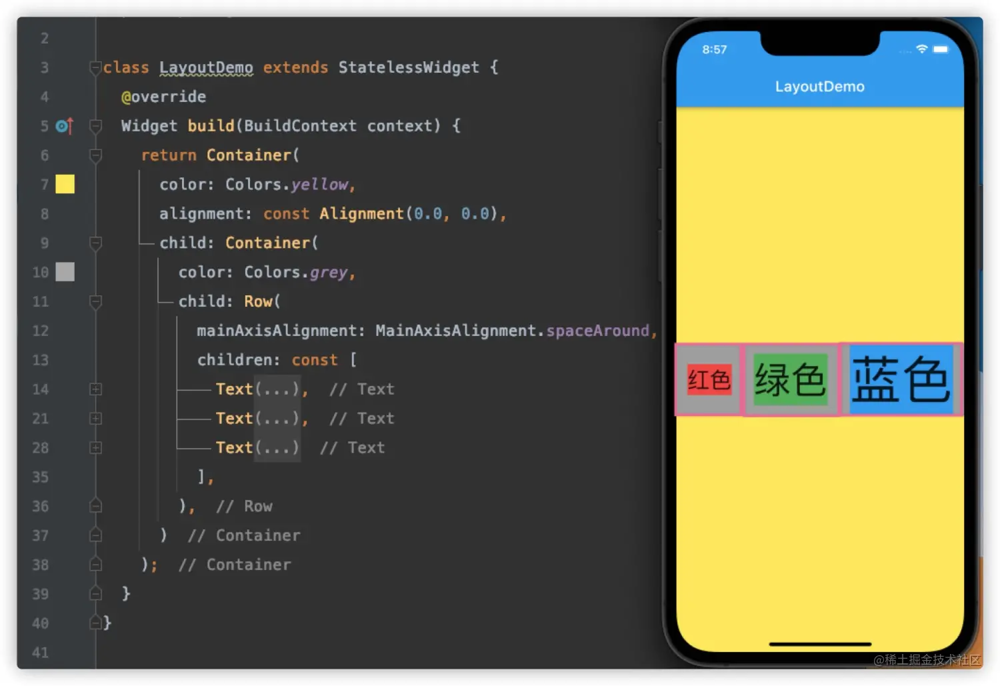

### spaceEvenly

`spaceEvenly`意思是：所有的子部件布局完成之后，剩下的空间和子部件一起平均分； 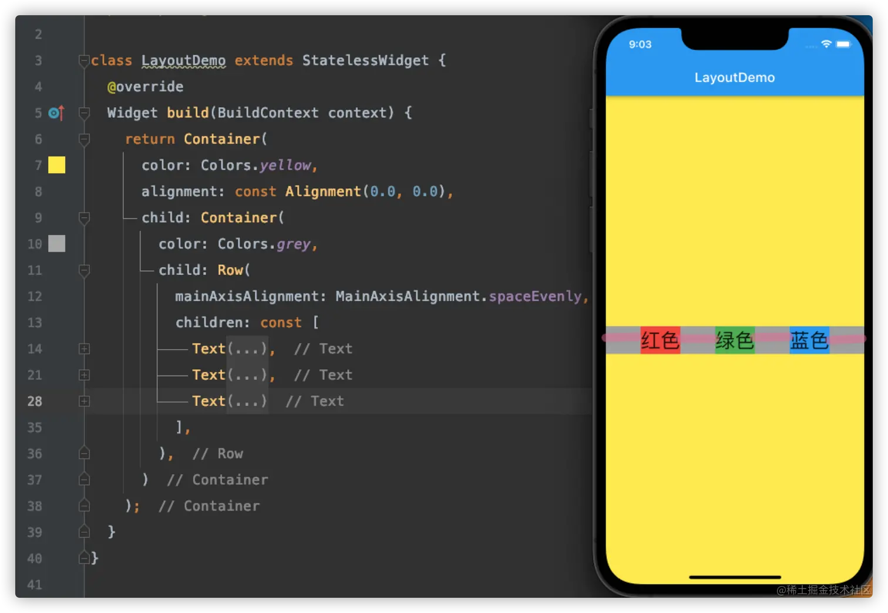

> 图中粉红色横线表示的间隔距离相等；

## 关于 CrossAxisAlignment 的补充

除了我们常用的枚举值之外，`CrossAxisAlignment`还有`baseline`的枚举值，那么效果如何呢？ 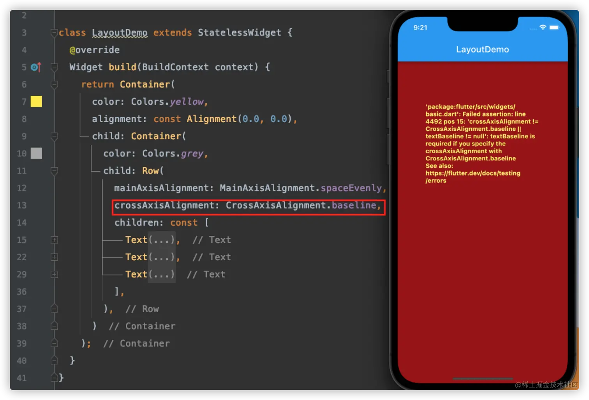 将值改为`baseline`之后，工程直接报错，这是因为`baseline`这个枚举值要结合`textBaseline`属性进行使用；效果如下： 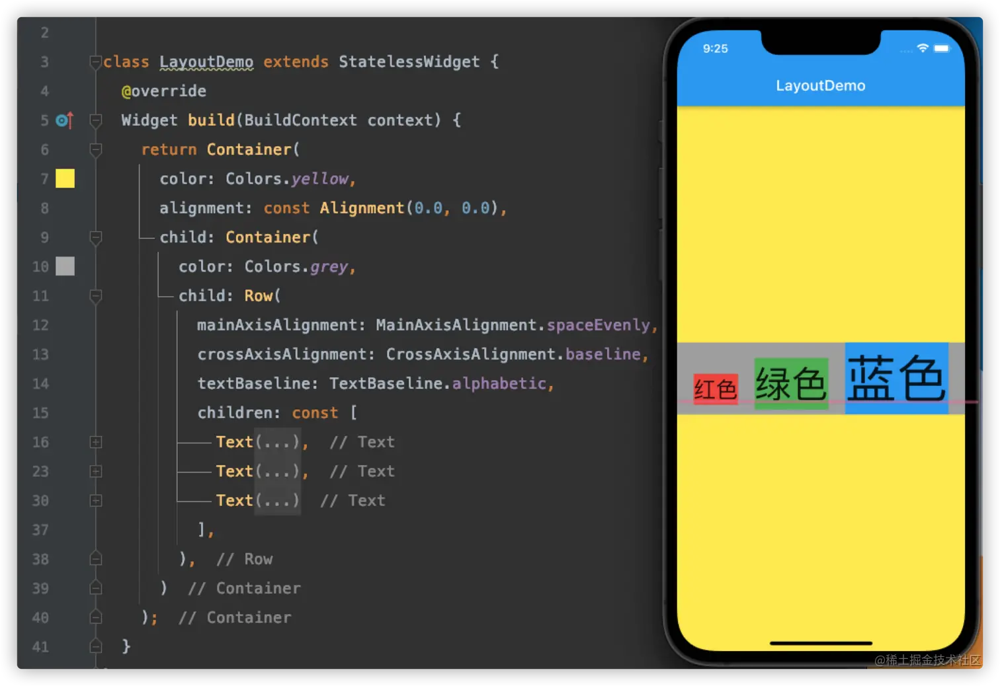

> 最终效果：三个`Text`部件虽然没有对齐，但是其中的文字底部对齐了；

## 关于 Expanded 的补充

`Expandeed`是一个自适应部件；我们简单看一下效果： 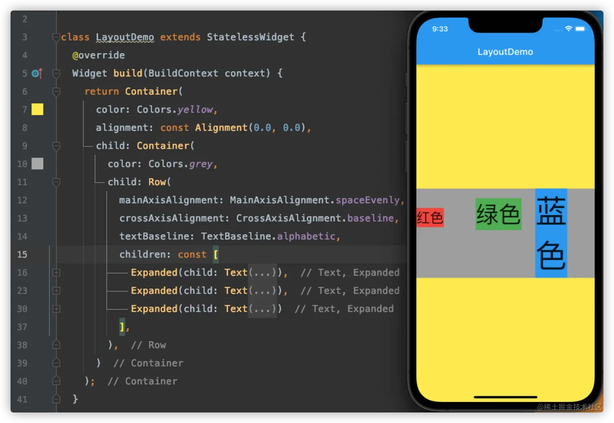 使用`Expanded`部件把`Text`包起来之后，`Text`部件文字超过限制之后，可以自己换行显示了； ​

我们继续修改代码： 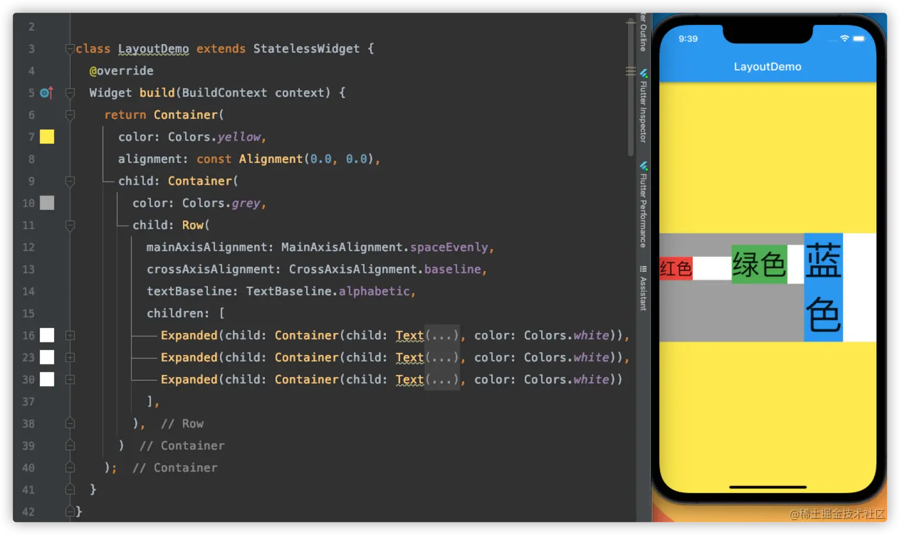 我们把`Text`包括在`Container`里边，此时发现`Container`也自适应的在`主轴方向`上进行了拉伸；

> 许哟啊注意的是`Expanded`所在的`children`数组不可以使用`const`修饰；

此时，我们修改`Container`的高度： 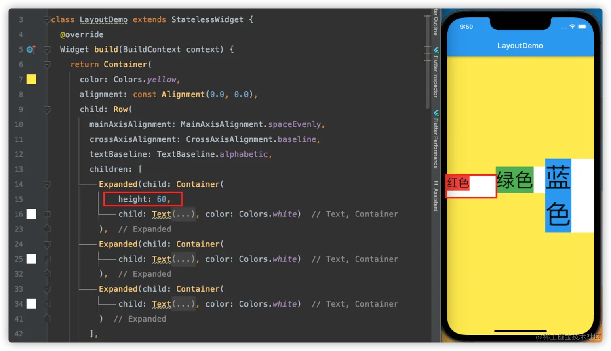 高度生效了；

- 在`Row`中，给`Expanded`的子部件设置高度有意义，宽度无意义
- 在`Column`中，给`Expanded`的子部件设置高度无意义，宽度有意义；

> `Expanded`在主轴方向上不会留下间隙，将被`Expanded`拉伸；
