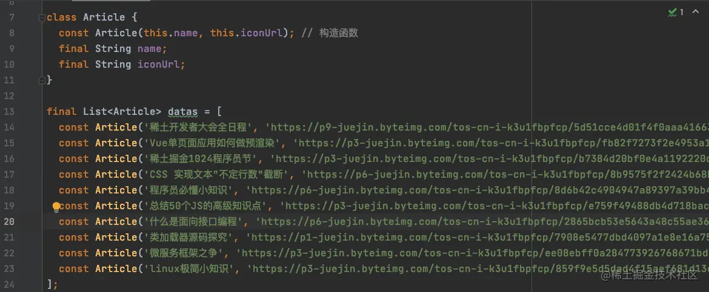
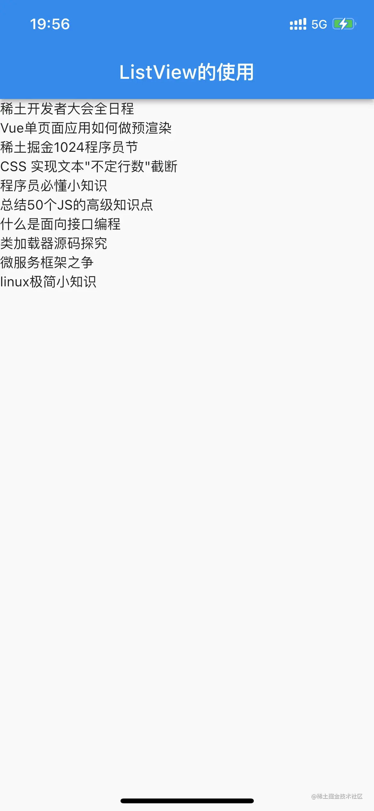

# (六)常用部件 ListView 初体验

我们在开发中，经常会需要显示列表，在`iOS`中我们使用`UITableView`来实现列表，那么在`Flutter`中，对应的部件为`ListView`；我们使用`ListView`来初步实现一个简单的列表界面；

## ListView 的使用

### model 模型

既然要显示一个列表，那么我们就需要在列表中显示一个数据模型，这里我们创建一个`article.dart`文件，在其中创建一个模型：

```js
class Article {
  const Article(this.name, this.iconUrl); // 构造函数
  final String name;
  final String iconUrl;
}
```

模型的创建方式还有另外一种，如下：

```js
class Article {
  const Article({this.name, this.iconUrl}); // 构造函数 可选赋值
  final String? name; // ? 表示空安全
  final String? iconUrl;
}
```

那么，这两种创建方式有什么区别呢？

- `const Article(this.name, this.iconUrl);`是一个构造函数，初始化时`name`和`iconUrl`必须赋值；
- `const Article({this.name, this.iconUrl});`也是一个构造函数，其初始化时`name`和`iconUrl`可以不进行赋值，但是此时需要注意必须满足以下两个条件中的任一个：
  - `name`和`iconUrl`必须有默认值；
  - `name`和`iconUrl`设置为空安全；

### List 数据源

为了方便，我们直接在`article.dart`文件中创建一个数组，来存放`Article`类作为列表的数据源；

```js
final List<Article> datas = [] // 具体内容没有放出来
```

此时，`article.dart`文件如下： 

### ListView

在使用之前，我们首先需要知道如果创建`ListView`，我们在使用`ListView`的时候一般不直接进行构造创建，而是使用其`命名构造函数`进行创建；创建代码如下：

```js
ListView.builder(itemBuilder: itemBuilder)
```

`builder`就是在创建`ListView`的时候，我们需要一个渲染；`itemBuilder`是一个方法回调；根据其定义

```js
required IndexedWidgetBuilder itemBuilder,
```

我们了解到其返回的是`IndexedWidgetBuilder`：

```js
typedef IndexedWidgetBuilder = Widget Function(BuildContext context, int index);
```

此函数返回了一个`Widget`，我们注意到，函数中有两个参数`context`和`index`，这个时候，根据以往`iOS`开发经历，我们马上意识到其作用类似于`UITableView`中的`cellForRow`方法； ​

我们依据此函数，创建一个返回`Widget`的方法：

```js
Widget _itemForRow(BuildContext context, int index) {
    return null
  }

  @override
  Widget build(BuildContext context) {
    return Scaffold(
      appBar: AppBar(
        title: const Text('Flutter 工程'),
      ),
      body: ListView.builder(
          itemBuilder: _itemForRow,
          itemCount: datas.length,
      ),
    );
  }
```

- `_`表示内部访问，文件内部！
- `_itemForRow`方法返回每一个`cell`的视图；
- `itemCount`方法传递整个列表中数据个数；

​

#### 显示文章标题

​

我们先简单返回一个`Text`部件显示文章标题：

```js
Widget _itemForRow(BuildContext context, int index) {
    return Text(datas[index].name);
}
```

​

注意，如果`name`属性为`空安全`的，那么此时需要进行强制解包：

```js
Widget _itemForRow(BuildContext context, int index) {
    return Text(datas[index].name!);
}
```

​

运行效果： 

#### 显示封面图片

加载图片时，我们使用`Image`部件；

```js
Image.network(’‘)
```

我们将`_itemForRow`函数代码修改如下：

```js
Widget _itemForRow(BuildContext context, int index) {
    return Container(
      color: Colors.white,
      margin: const EdgeInsets.all(10),
      child: Image.network(datas[index].iconUrl),
    );
  }
```

> `Container`是一个常用的小部件，方便我们进行布局

显示效果： 

#### 显示标题和封面

​

我们发现`Container`部件的`child`只能显示一个部件，这样我们就不能同时显示文章的标题和封面了； ​

那么，有没有一个部件，它可以存放多个部件呢？我们希望在封面的下方能显示出标题，封面和标题竖着排列，这个时候，就有`Column`部件能够达到这个效果，并且`Column`部件有`children`属性是个数组，能够同时存放多个部件：

```js
Widget _itemForRow(BuildContext context, int index) {
    return Container(
      color: Colors.white,
      margin: const EdgeInsets.all(10),
      child: Column(
        children: [
          Image.network(datas[index].iconUrl),
          Container(height: 10,),
          Text(
            datas[index].name,
            style: const TextStyle(
              fontSize: 20,
          ),)
        ],
      ),
    );
  }
```

> `Container(height: 10,),` ：封面与标题之间间隔 10 像素的距离，同样的效果`SizedBox`部件可能实现；

效果如下：  完整代码如下：

```js
class ListViewDemo extends StatelessWidget {
  // _的内部是指 文件内部！
  Widget _itemForRow(BuildContext context, int index) {
    return Container(
      color: Colors.white,
      margin: const EdgeInsets.all(10),
      child: Column(
        children: [
          Image.network(datas[index].iconUrl),
          const SizedBox(height: 10,),
          Text(
            datas[index].name,
            style: const TextStyle(
              fontWeight: FontWeight.w800,
              fontSize: 20,
            ),)
        ],
      ),
    );
  }

  @override
  Widget build(BuildContext context) {
    return Scaffold(
      backgroundColor: Colors.grey,
      appBar: AppBar(
        title: const Text('ListView的使用'),
      ),
      body: ListView.builder(
        itemBuilder: _itemForRow,
        itemCount: datas.length,
      ),
    );
  }
}
```

## Flutter 小知识

部件的布局只有三种：

- 竖着
- 横着
- 叠着
