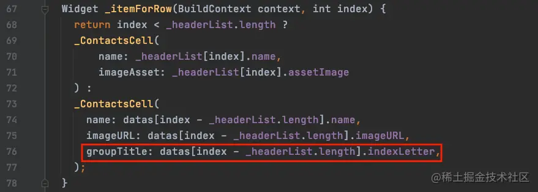
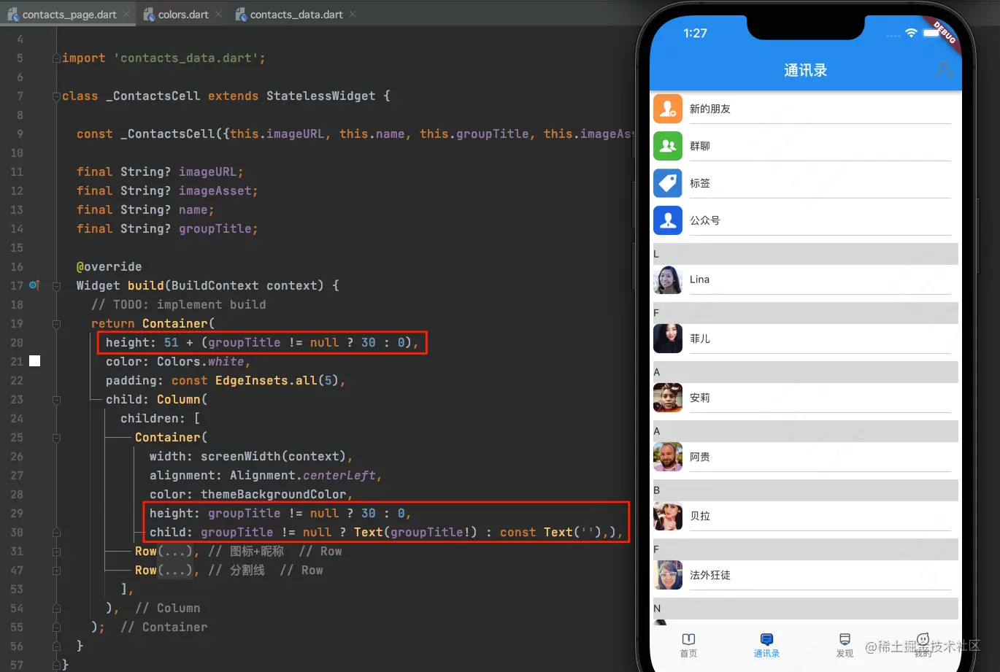
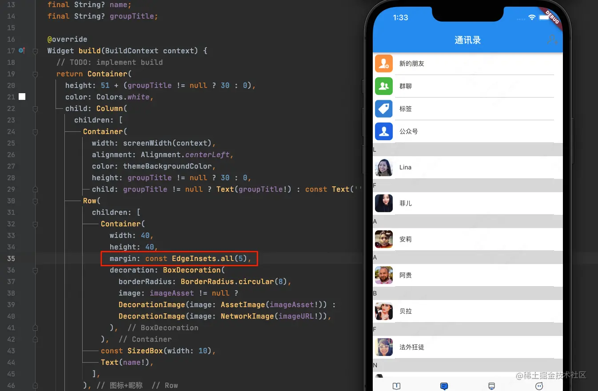
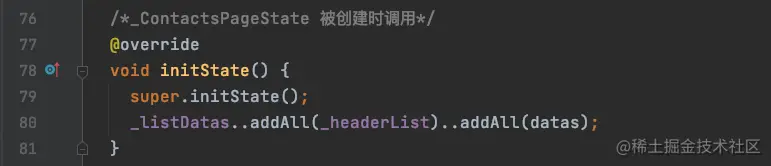
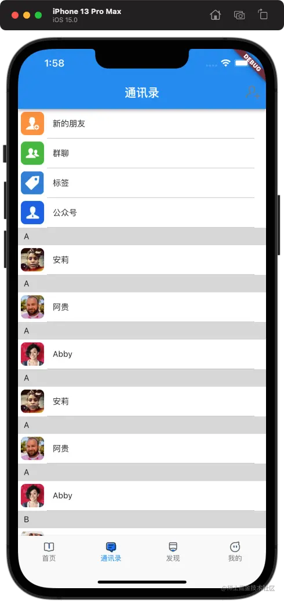
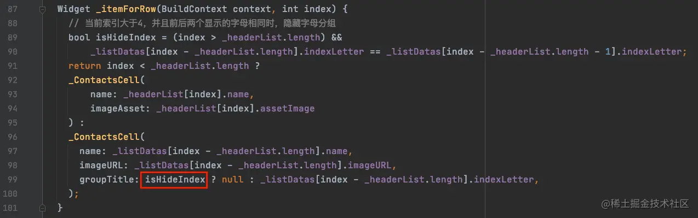

# (十七)实战-通讯录分组

在上一篇文章中，我们已经实现了通讯录界面的初步效果，今天我们来给联系人列表分组；

## 联系人列表分组

在进行分组排列之前，我们要首先知道每一个联系人名字的首字母，这个数据，我们已经在数据模型中给出了定义：

```js
Person(
      imageURL: 'https://randomuser.me/api/portraits/women/37.jpg',
      name: '法外狂徒',
      indexLetter: 'F'),
```

其中的`indexLetter`就是首字母拼音的大写形式；这样的话，我们就需要针对`_ContactsCell`的联系人部分的传值进行修改：  将`indexLetter`传递给`_ContactsCell`的`groupTitle`用来显示分组的文本信息；

在`_ContactsCell`中显示分组文本信息的逻辑如下：

 分组文本显示情况由`groupTitle`来控制，如果`groupTitle`为空，则返回一个空的`Text`，否则返回`Text`显示分组文本；其高度也会根据`groupTitle`进行改变；

> 因为是自适应布局，所以第一个红框中的高度设置其实是可以不用的；

因为我们之前给整个`_ContactsCell`的`Container`设置了`padding`(内边距)，所以此时显示上并不完善，我们将内边距，改为`图标`所在的`Row`的外边距： 

## 在 initState 中添加数据源

由于我们在处理数据的过程中，很可能是通过分页处理来获取多次，那么这几个数据源，那么我们有没有办法给多个数据源合并在一起呢？

我们创建一个新的`List`：

```js
final List<Person> _listDatas = [];
```

我们这里模拟将多个`datas`中的元素都放进`_listDatas`中，这个时候，我们就需要用到一个生命周期的函数：

```js
@override
  void initState() {
    super.initState();
  }
```

> 这个函数会在`_ContactsPageState`被创建时调用；所以此时需要切换出当前页面，然后再重新切换回来才能显示效果；

 其中的：

```js
_listDatas..addAll(datas)..addAll(datas);
```

是一个链式表达，其等同于：

```js
_listDatas.addAll(datas);
_listDatas.addAll(datas);
```

## 数据源排序

我们已经添加了很多联系人信息，那么如果给这么联系人进行排序呢？

在`List`中，有一个排序算法`sort`：

```js
void sort([int compare(E a, E b)?]);
```

在这个方法中，将会比较`a`和`b`两个元素，实现如下：

```js
@override
  void initState() {
    super.initState();
    _listDatas..addAll(datas)..addAll(datas);
    // 数组排序
    _listDatas.sort((Person a, Person b) {
      return a.indexLetter!.compareTo(b.indexLetter!);
    });
  }
```

 我们可以看到，联系人列表已经按照首字母顺序排序了；

## 头部分组显示隐藏

我们已经显示出了分组的头部分组字母，但是很明显，相邻的两个如果首字母一样的话，那么第二个应该是不显示首字母的，所以我们应该判断：**如果当前数据首字母与上一条数据的首字母相同时，当前数据不显示首字母分组；**

```js
bool isHideIndex = (index > _headerList.length) &&
        _listDatas[index - _headerList.length].indexLetter == _listDatas[index - _headerList.length - 1].indexLetter;
```

最终，`_itemForRow`方法实现修改为：  此时列表显示效果如下：


