# (十九)实战-网络请求与模型转换

在项目开发过程中，发送网络请求获取数据是避免不了的需求，今天我们来讲解一下`Flutter`中的网络请求如何发送；

## 网络请求

在`Flutter`中，发送网络请求一般会用到两个库：

- [http](https://link.juejin.cn?target=https%3A%2F%2Fpub.dev%2Fpackages%2Fhttp "https://pub.dev/packages/http")（官方的）

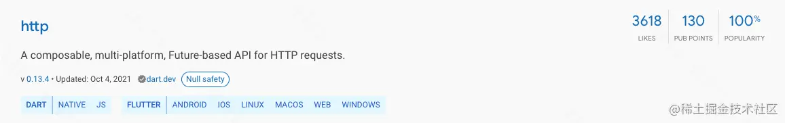

- [dio](https://link.juejin.cn?target=https%3A%2F%2Fpub.dev%2Fpackages%2Fdio "https://pub.dev/packages/dio")


今天我们先使用官方的`http`发送网络请求；

## 配置网络请求库

首先进入 [http](https://link.juejin.cn?target=https%3A%2F%2Fpub.dev%2Fpackages%2Fhttp "https://pub.dev/packages/http") 的地址：[pub.dev/packages/ht…](https://link.juejin.cn?target=https%3A%2F%2Fpub.dev%2Fpackages%2Fhttp "https://pub.dev/packages/http")，网页内容如下：


点击图片中红框所示的按钮进行复制操作：


可以看到，我们拷贝了一串字符串：

```js
http: ^0.13.4
```

那么，这个字符串有什么用呢？打开工程的`pubspec.yaml`文件，找到红框所示区域：


注意不要找错区域；

我们发现，在红框区域中，`cupertina_icons: ^1.0.2`跟我们刚才复制的`http: ^0.13.4`格式一模一样了；在此处配置的就是我们需要用到的一些库，我们将`http`的配置信息添加进去，该操作类似`iOS`中`CocoaPods`的用法：

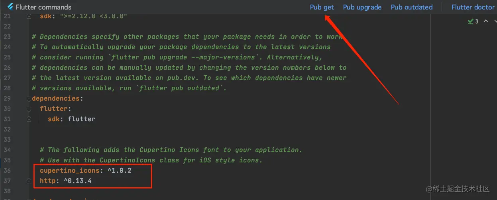

然后点击图中箭头所示的`Pub get`按钮，控制台输入如下信息即为载入成功，我们就可以使用`http`库了：

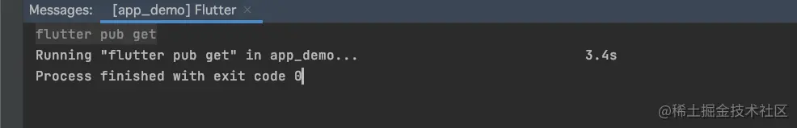

## 网络请求库的使用

我们已经将`http`载入成功，那么如何使用呢？首先，我们需要在使用`http`的页面，引入`http`，引入代码如下：

```js
import 'package:http/http.dart' as http;
```

然后我们定义一个方法来请求数据，并且在`initState`中调用该方法：

```js
@override
void initState() {
  super.initState();
  // 发送网络请求
  getConversationList();
}

getConversationList() {

}
```

但是需要注意的是，我们在`getConversationList`方法中发送网络请求，那么很明显，该方法应该是异步执行的，不能影响其他代码的执行，所以我们需要给`getConversationList`方法添加异步的标识：

```js
getConversationList() async {

}
```

### http 发送请求

接下来就是放松网络请求了，`http`发送网络请求方式如下：

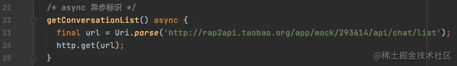

需要注意的是，`get()`是放松了一个`Get`方式的网络请求，其方法定义如下：

```js
Future<Response> get(Uri url, {Map<String, String>? headers}) =>
    _withClient((client) => client.get(url, headers: headers));
```

可以看到，该方法是有返回值的；我们在开发`iOS`项目中，发送网络请求，请求的结果数据一般都是通过`block`回调返回；但是在`Flutter`的`http`网络请求中，数据方法的直接返回值，而`get()`很明显应该是异步请求，所以我们需要使用`await`标记一下：

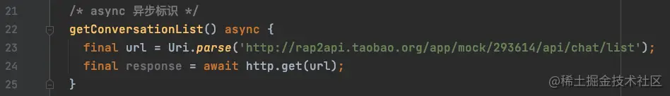

我们打印一下看看网络请求的结果：

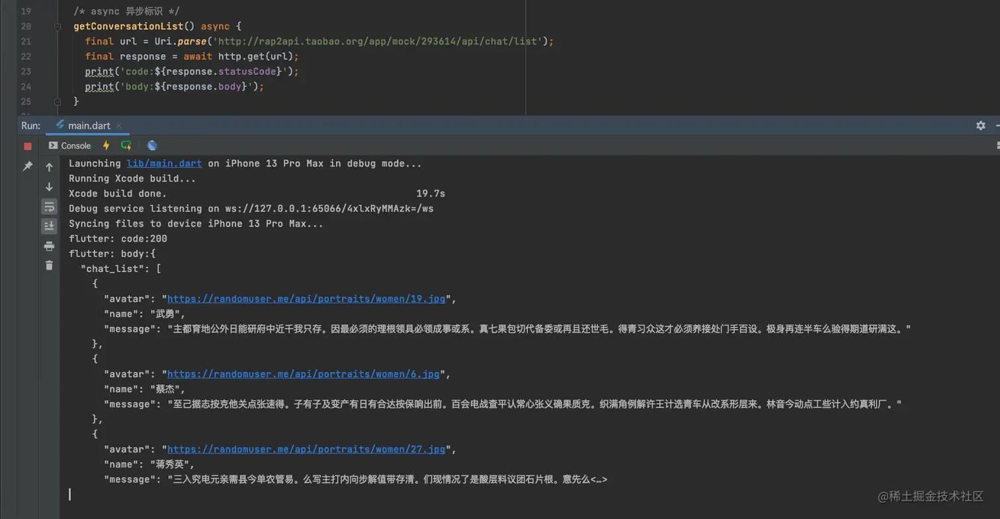

#### 解析数据

我们已经从服务器获取到了数据，接下来就是解析数据：

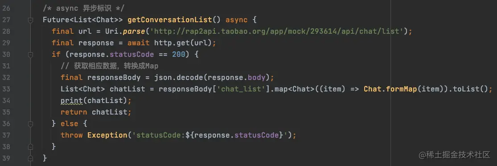

```js
List<Chat> chatList = responseBody['chat_list'].map<Chat>((item) => Chat.formMap(item)).toList();
```

这句代码的意思是：从`responseBody`中取出`chat_list`这个数组，然后`map`方法将会循环遍历此数组，遍历的元素为`item`，将`item`通过`Chat.fromMap`方法转换成`Chat`模型数据，最终`toList()`意为将所有的转换之后的`Chat`放进数组中，返回一个`List`； ​

我们来看一下打印结果：

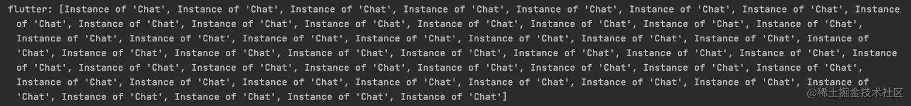

#### 异步方法返回值

在以往`iOS`的开发中，网络请求的数据，经过方法的处理之后，我们通常通过`block`的形式跑出来，那么在`Flutter`中，异步的方法能够接收返回值呢？答案当然是可以的，我们需要将方法作如下修改：

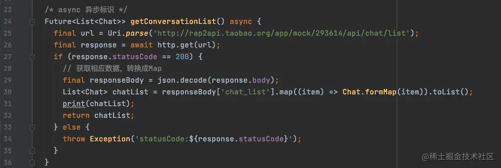

> 用`Future`来接收返回值；表示这是一个未来的数据；

接下来看一下，`getConversationList`方法的返回值是如何处理的：


也可以使用链式调用：

```js
getConversationList().then((value) {
	print('===$value');
});
```

我们看一下打印结果：

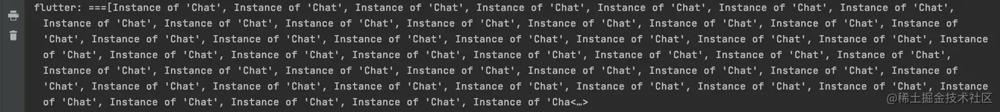

#### 网络请求的处理

我们已经知道在`then`中能够获取到网络请求的数据，那么是否还有其他状态的处理呢？

- 错误处理

`catchError`用来捕获错误信息；

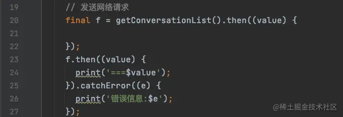

- 请求完成

`whenComplete`在网络请求完成时回调；

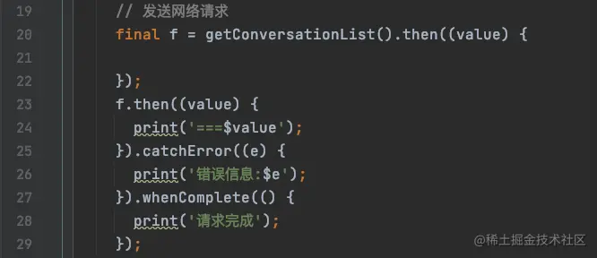

- 设置超时时间

`timeout`可以设置网络请求的超时时间； 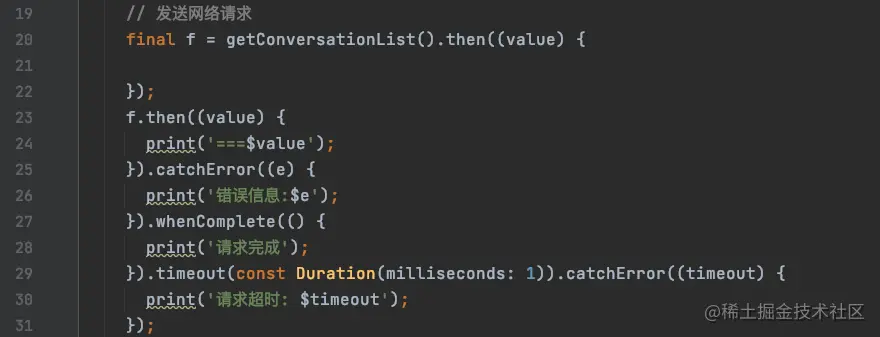

我们将超时时间设置为`1毫秒`，看一下打印信息：

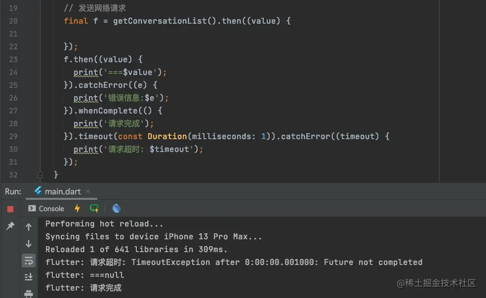

我们发现，即使网络请求超时了，但是`then`和`whenComplete`的回调依然执行了，这是因为在`Flutter`中即使只要网络请求发出，那么就一定会有结果，而结果的状态需要我们自己去控制，比如通过自定义的`bool`值：

### dio 发送请求

`dio`是国内的大神开发的请求框架，我们后续再细讲； 想研究的，可以前往 [dio 使用](https://link.juejin.cn?target=https%3A%2F%2Fpub.dev%2Fpackages%2Fdio "https://pub.dev/packages/dio")

## 模型转换

我们的网络请求返回的数据一般是`json`格式的，那么我们如果将`json`字符串转换成`模型`数据呢？

### Map 转 json

引入头文件：

```js
import "dart:convert";
```

引入头文件之后，可直接使用`json`调用`encode`方法转换； ​

json 转 map 方式如下：

```js
final map = {'name': '张三','age': '30','nickName': '法外狂徒',};
final jsonStr = json.encode(map);
print('map: $map');
print('json: $jsonStr');
```

- `json`：调用者，引入头文件之后可直接使用；
- `map`：`Map`类型数据；
- `jsonStr`：转换之后的`json`字符串；

打印结果：

```js
flutter: map: {name: 张三, age: 30, nickName: 法外狂徒}
flutter: json: {"name":"张三","age":"30","nickName":"法外狂徒"}
```

### json 转 Map

```js
final newMap = json.decode(jsonStr);
print('new: $newMap');
```

- `json`：调用者，引入头文件之后可直接使用
- `jsonStr`：需要转换的`json`字符串；
- `newMap`：转换之后的`Map`类型数据；

打印结果：

```js
flutter: new: {name: 张三, age: 30, nickName: 法外狂徒}
```

### json 转模型

我们先定义一个`Chat`的模型数据，格式如下：

```js
class Chat {
  final String? name;
  final String? message;
  final String? avatar;
  Chat({this.name, this.message, this.avatar});

  factory Chat.formMap(Map map) {
    return Chat(
      name: map['name'],
      message: map['message'],
      avatar: map['avatar']
    );
  }
}
```

- `factory`：工厂构造，可以定义构造方法的返回值；

转换方式如下：

```js
final map = {'name': '张三','message': '你好','avatar': 'https://randomuser.me/api/portraits/men/21.jpg',};
final chat = Chat.formMap(map);
print('name:${chat.name}; avatar:${chat.avatar}; message:${chat.message}');
```

打印结果：

```js
flutter: name:张三; avatar:https://randomuser.me/api/portraits/men/21.jpg; message:你好
```
