# (十二)实战-工程配置及本地资源使用

在上一篇文章中，我们已经简单的操作了如何搭建一个项目的主要框架，但是到目前为止，我们还没有给项目使用我们本地的资源文件，比如图片，那么今天这边文章，我们主要介绍一下，本地资源文件如何使用；

## Android 工程的配置

身为一个`iOS`开发者，在`Xcode`中配置图标，启动图修改`App`名字等操作我们已经非常熟练了，我们现在来看一下安卓工程的相关配置如何进行设置；

### 修改 App 名字

在工程目录下，我们找到`AndroidManifest.xml`文件，其路径为：

> 工程 ->android->app->src->main->AndroidManifest.xml

在该文件中，修改`Android:label`为`Flutter工程`： 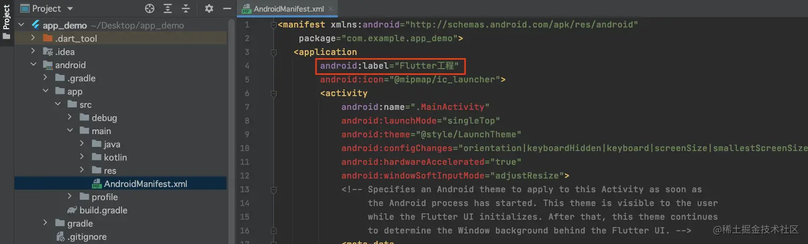 然后运行`App`，之后退到后台，我们可以看到，在安卓模拟器中，`App`的名字已经显示为`Flutter工程`： 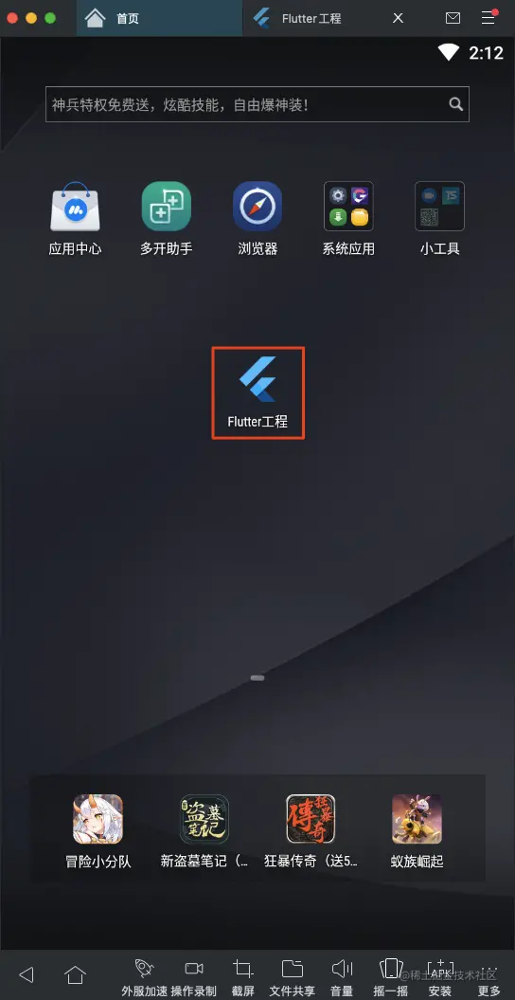

### 修改 App 图标

我们在`iOS`中，图标分为`1x`，`2x`和`3x`；在`Android`中，不同大小的图标，放在不同的文件夹下： 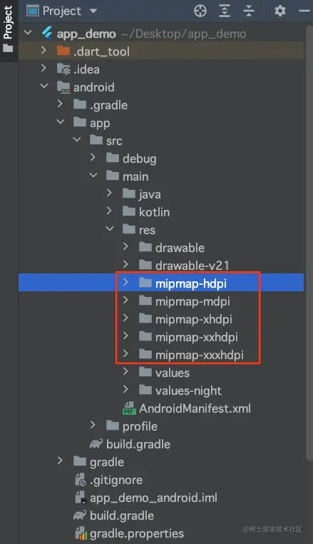 其中`mipmap-xhdpi`文件夹中存放图片相当于`iOS`中的`2x`；`mipmap-xxhdpi`中存放的图片相当于`iOS`中的`3x`；一般设计在给出图标的时候，`Android`的图标会分好文件夹给到开发；

这里为了方便，我们直接使用微信的图标： 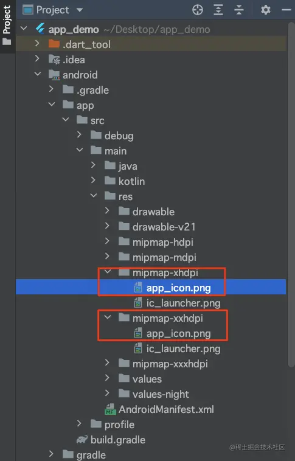

> 需要注意的是，图片的名字也不能使用`驼峰命名`的方式，推荐使用`_`下划线；

然后在`AndroidManifest.xml`文件中修改`android:icon`为`@mipmap/app_icon`，注意不用添加后缀名；然后运行`App`之后，查看效果： 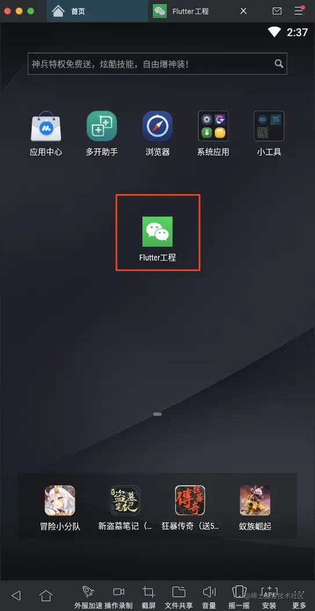

### 添加 App 启动图

我们将对应尺寸的启动图放在`mipmap-hdpi`和`mipmap-mdpi`文件夹下；然后修改`launch_background.xml`文件： 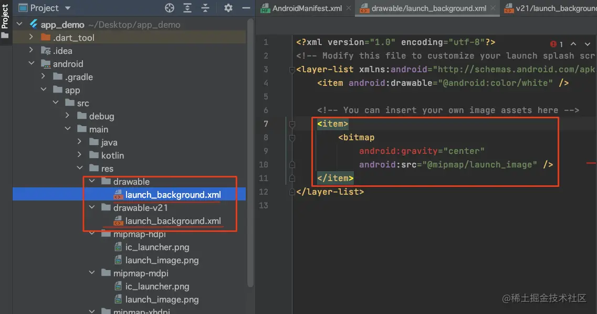

> 如果`launch_background.xml`文件有多个，那么这些文件都要修改；

将文件中，红框部分解注释，然后修改`android:src`为`@mipmap/launch_image`;

运行效果： 

### 使用本地图片

在与`ios`和`android`同级目录下，创建文件夹`images`(可以自定义文件夹名字)，将所需要用到的图片复制到此文件夹下；然后修改文件`pubspec.yaml`；文件位置如下： 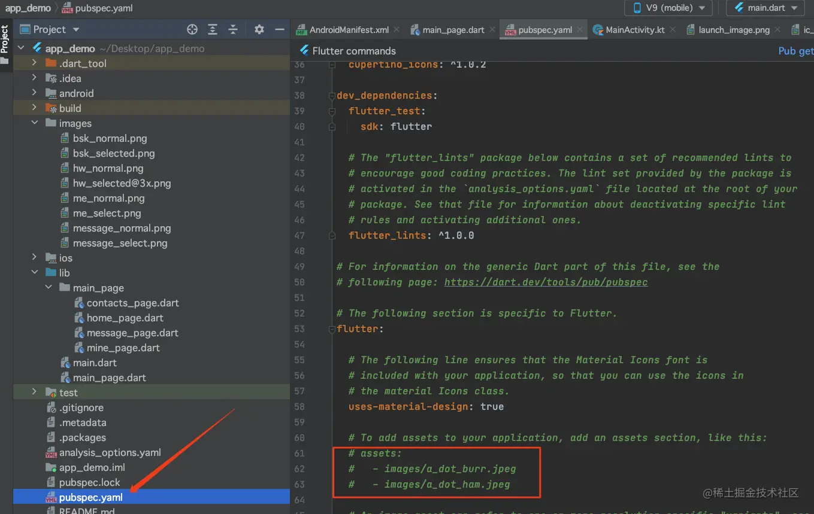 将红框内容解注释，需要特别注意的是，解注释之后，格式是有问题的，此时运行项目会直接报错： 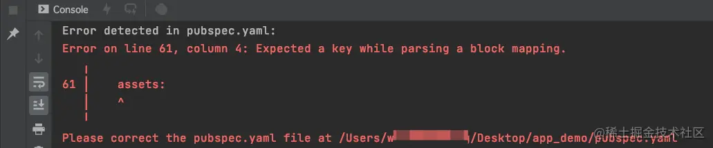 此文件对格式要求极其严格，`assets`必须与上边的`uses-material-design`对齐，然后下边的内容一次往前进一个空格：

最终如下： 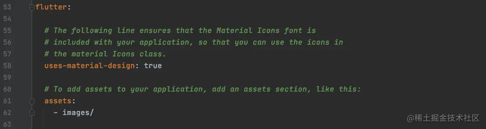

> `images`就是刚才存放图片的文件夹名字；

使用图片，更换底部导航啦图标： 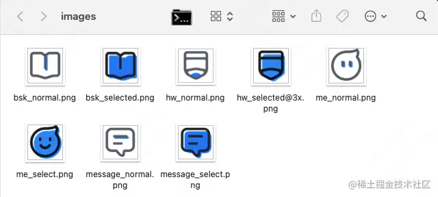 最终代码如下： 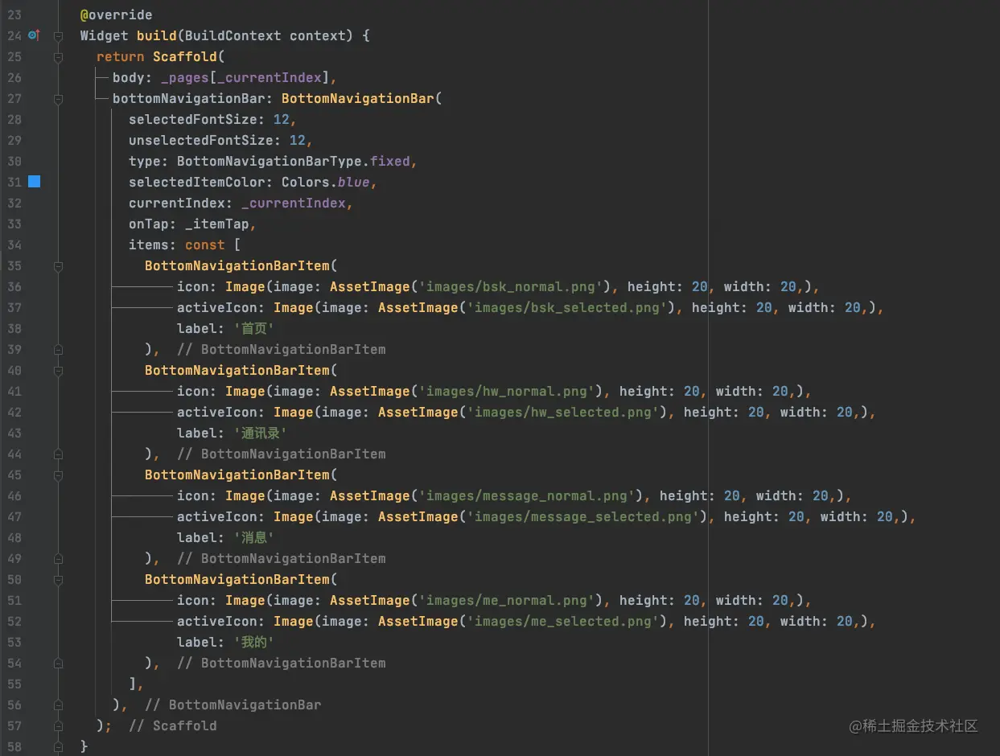

- `icon`：底部导航`item`的默认图标；
- `activeIcon`：底部导航`item`的选中图标；

> 需要注意的是，此处一定要跟上图片的后缀，不然图片无法显示

最终界面效果：

- Android 效果：

- iPhone 效果

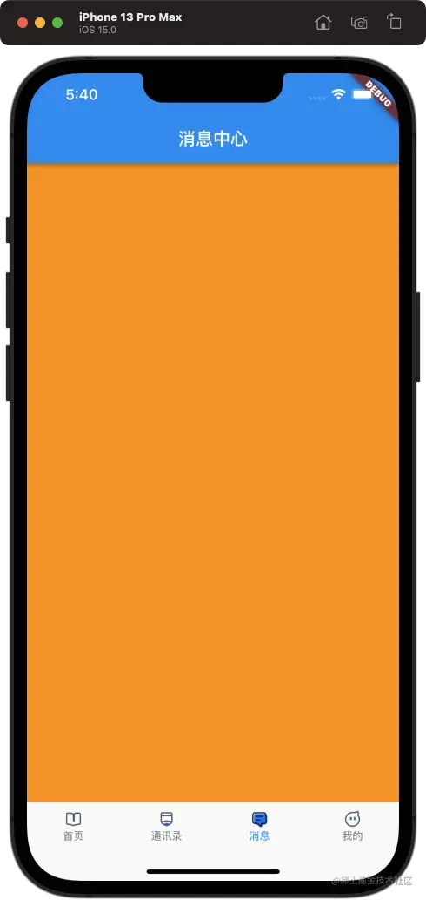
