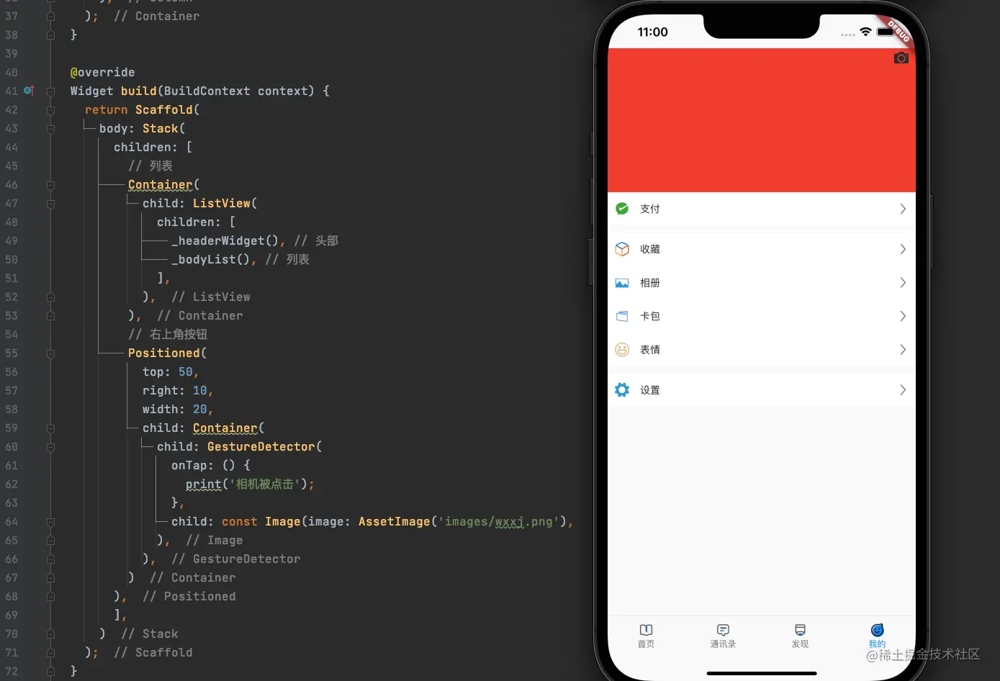
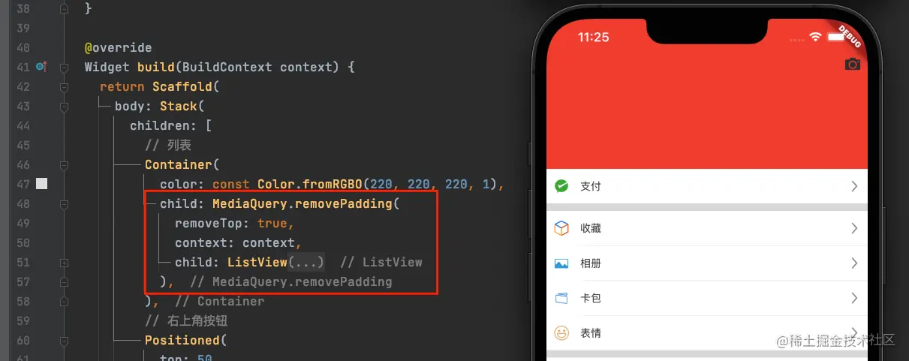
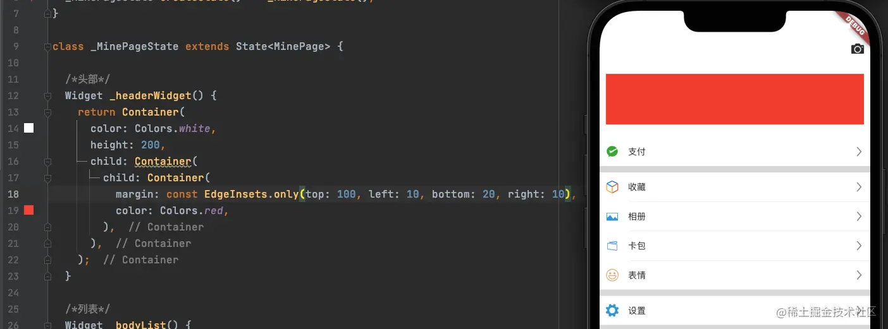
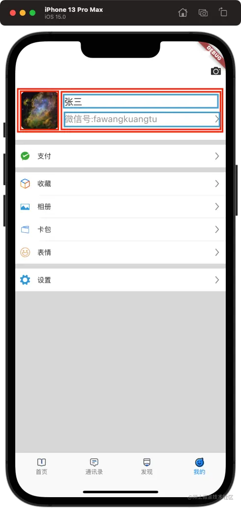
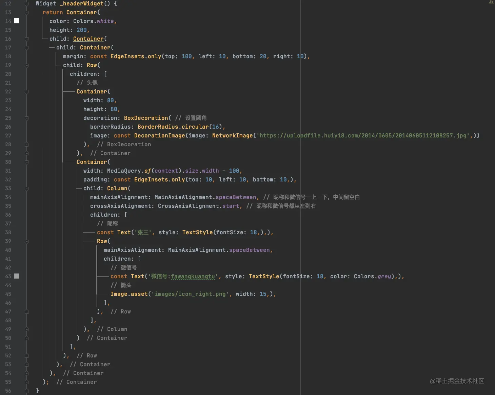

# (十五)实战-微信我的界面

我们已经实现了微信的发现界面，今天这篇文章我们来实现微信的我的界面；我的界面总体分为两部分，一部分时同发现界面一样的`ListView`，另一部分就是头部的个人信息；

针对下部的`ListView`我们不再详细讲解，今天主要讲一下头部的构建方式；

## 页面布局

我们先来总体的看一下我的界面的布局代码： 

- 我的界面中，没有头部导航栏，所以在布局时，我们删除了`Scaffold`的`appBar`属性；
- 页面整体布局采用`Stack`，因为在右上角有一个悬浮的相机按钮，该按钮不会随着页面的滑动而改变位置；
- 底部的`ListView`有两个子部件，`_headerWidget()`和`_bodyList()`，其中`_bodyList()`我们直接采用的是发现页面的`cell`来进行搭建的，此处不在赘述；我们主要来看一下头部的布局；

## 头部布局

当前，我们只在头部创建了一个空白的`Container`：

```js
/*头部*/
  Widget _headerWidget() {
    return Container(
      color: Colors.red,
      height: 200,
    );
  }
```

### 移除头部安全区

我们注意到，此时我们的界面并没有在最上边还是渲染，而是留出了刘海屏的头部安全区；这其实是`Flutter`官方为刘海屏设置的`padding`；我们可以通过以下方式将头部的`padding`去掉：  我们将`ListView`包装进`MediaQuery.removePadding`里边，然后通过`removeTop`来移除头部的`padding`；这种方式仅限于`Flutter`官方封装的属性；

### 调整头部布局区域

接下来，我们需要调整在头部布局的部件所在区域的大小：  红色区域即为我们要布局头像及昵称的区域； 我们先来看一下，我们这个头部的布局思路：  整体布局思路如下：

- 整体使用`Row`布局：
  - 左侧显示头像；
  - 右侧显示昵称，微信号及箭头；
    - 右侧区域整体布局使用`Column`：
      - 上部显示昵称；
      - 下部显示微信号和箭头；

代码如下：  需要注意的地方：

- 头像的圆角：设置圆角，需要使用到`Container`的`decoration`属性，该属性是`Decoration`类型，通常使用`BoxDecoration`就可以，我们需要将图片定义为`ImageProvider`�，也就是`NetworkImage`或者`AssetImage`，然后使用`DecorationImage`将`NetworkImage`包起来，最终赋值给`BoxDecoration`的`image`属性；设置圆角时，`Container`的宽高必须设置，否则图片不会显示；
- 因为微信号和箭头是分在两端显示的，此时我们可以使用`MainAxisAlignment.spaceBetween`来布局，那么我们就需要计算后侧区域整体的宽度；否则因为自适应布局的原因，微信号和箭头将无法通过主轴进行布局；
- 整个屏幕宽度获取方式：`MediaQuery.of(context).size.width`
