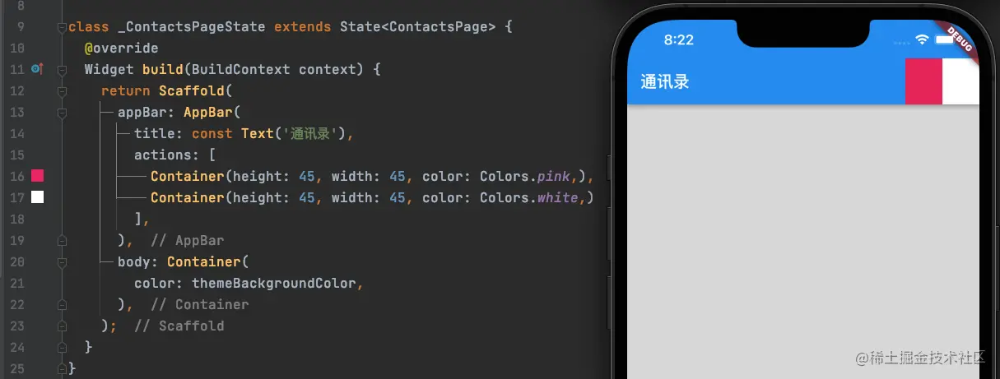
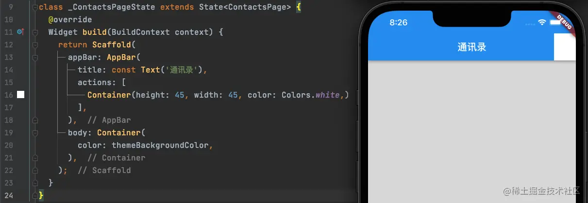
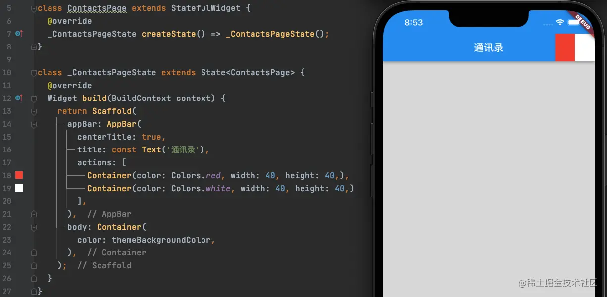
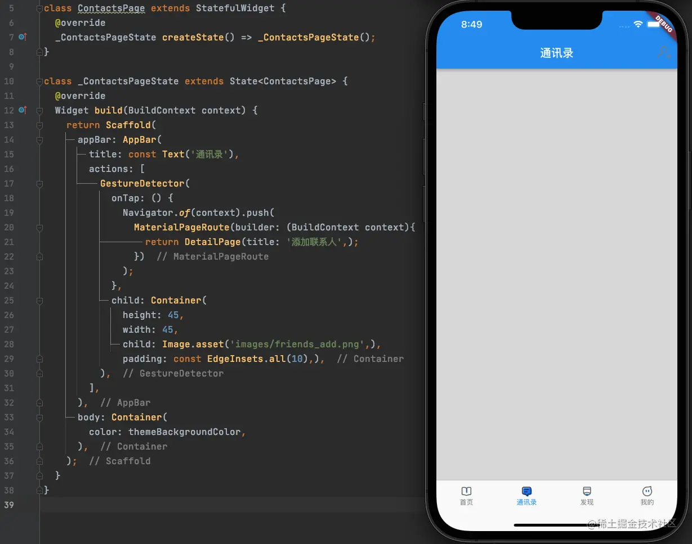
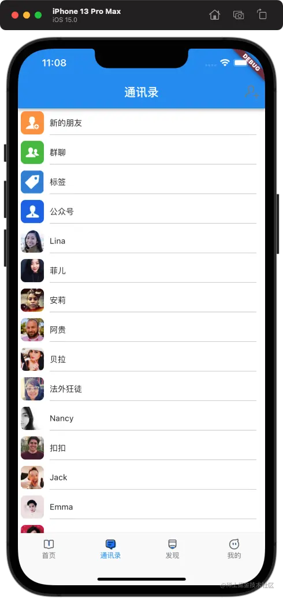
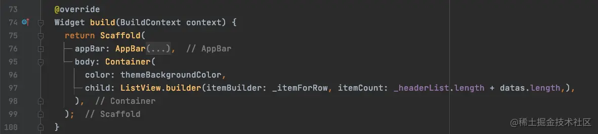
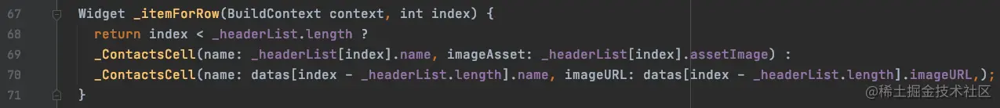
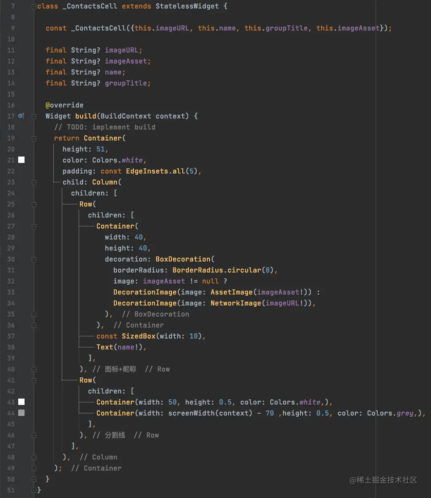

# (十六)实战-微信通讯录界面

在之前的几篇文章中，我们已经通过所学知识，成功的搭建了微信的发现界面和我的界面；今天我们来尝试实现微信的通讯录界面

## 通讯录

### 导航栏按钮

在微信的通讯录界面中，导航栏右侧是有一个添加联系人按钮的，那么这个按钮如何实现呢？

在`Flutter`的`AppBar`中有一个`actions`的属性，其定义如下：

```js
final List<Widget>? actions;
```

通过定义我们发现，`actions`属性是一个数组，里边用来存放`Widget`，那么我们放进去两个简单的`Container`看一下效果：  我们在`actions`中添加了一粉一白两个`Container`，结果两个`Container`按照顺序一次显示在`AppBar`的右侧，并且将我们的标题挤到了最左侧，那么我们删除一个`Container`呢？  在只保留一个`Container`的情况下，恢复正常；

如果要保留两个按钮，并且希望标题在中间，可以通过`AppBar`的`centerTitle`属性控制： 

接下来，我们将按钮的逻辑不全，代码如下： 

### 列表布局

我们在之前的文章中已经学会了如果构建一个`ListView`，这里搭建联系人列表的过程，就不再赘述，我们直接看初步效果：  在这个列表中，我们的数据源分为了两部分：

- 第一部分，头部的四条本地数据，这部分数据是固定的；
- 第二部分，下部的联系人列表数据，这部分数据是从其他地方获取的人员信息列表；

 我们在布局的时候，使用同一个`ListView`显示两个数据源的数据；然后，在`_itemForRow`中通过`index`来判断每一行要显示的数据来源： 

- 如果`index`小于`_headerList.length`，说明是前四条数据，那么需要从`_headerList`中获取数据信息，传递给`_ContactsCell`来显示；
- 否则，从`datas`也就是联系人列表中获取人员信息数据，传递给`_ContactsCell`来显示；

接下来，我们来看一下`_ContactsCell`的具体实现： 

- `_ContactsCell`布局主要分为上下两部分，采用`Column`进行纵向布局；
  - 上部：显示`头像(图标)`和`名字`；
  - 下部：显示分割线；
- 在上部显示`头像`和`名字`的布局中，采用`Row`进行横向布局；

在讲数据传入`_ContactsCell`之前，我们已经通过`index`判断，传入了不同的参数，所以在`_ContactsCell`中我们可以通过不同参数的值是否为空来判断需要显示什么部件：

- `imageAsset`不为空，说明是前四条数据，此时需要使用`AssetImage`显示本地图标；
- 否则，就说明是后边的联系人列表数据，就需要我们使用`NetworkImage`来显示网络图片；
