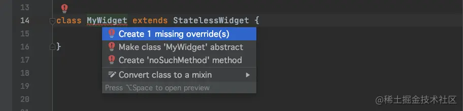
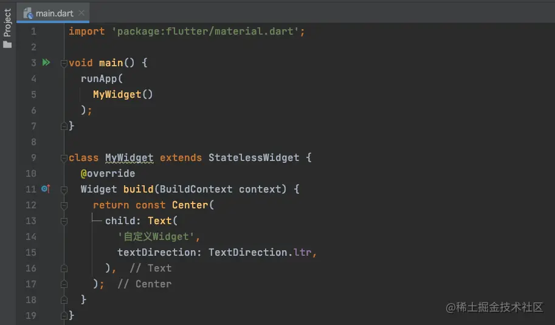
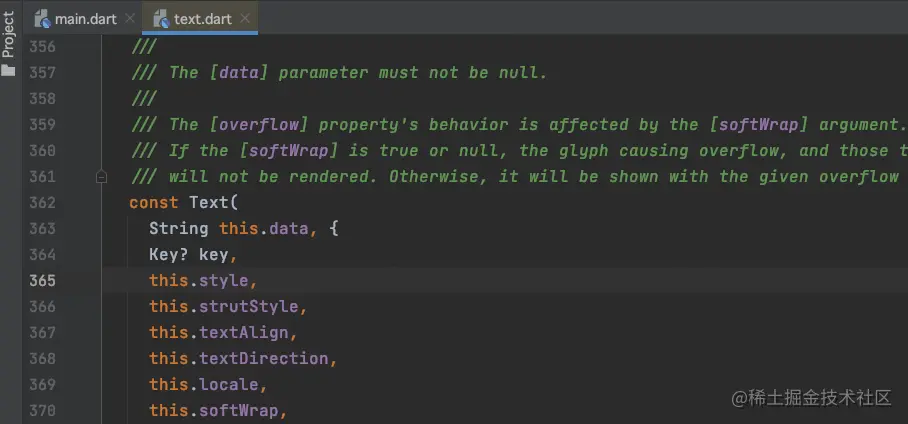
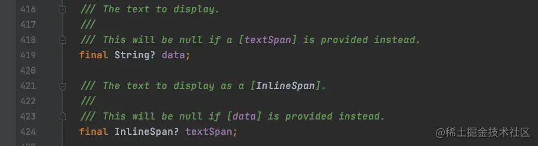
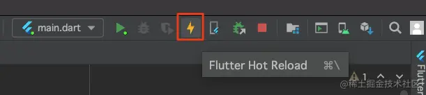
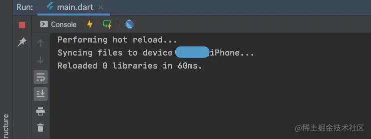

# (四)基础知识自定义 Widget

上一篇文章中，我们简单使用了`Center`和`Text`两个小部件，接下来我们自定义一个`Widget`；

## Widget

在`Flutter`中`Widget`分为两种：

- `stateful`：有状态`Widget`，内部小部件可以变化状态；是`无状态Widget`的变种；实现相对复杂；
- `stateless`：无状态`Widget`，不可变，不能更改；如果想要变化，就需要用其他部件替换掉；

> 在`Flutter`中本质上都是`无状态Widget`，`有状态Widget`是定义了一系列功能，为了方便开发，让其变为有状态的`Widget`

## 自定义 Widget

我们先从简单的无状态`Widget`开始学习，我们来定义一个自定义的`Widget`，名为`MyWidget`：

```
class MyWidget extends StatelessWidget {

}
```

> `Flutter`中类名可以使用驼峰命名格式，工程名和文件名都需要用小写；

这个时候我们的`MyWidget`会报错，将光标移动上去将会出现红色灯泡，点击灯泡或者直接使用快捷键`Alt+回车`，可以提示补全信息：  也就是实现`StatelessWidget`就必须实现`build`方法，`build`方法返回一个`Widget`，也就是我们自定义的`Widget`需要通过`build`方法来进行渲染；

代码补全之后，将会如下：

```
class MyWidget extends StatelessWidget {
  @override
  Widget build(BuildContext context) {
    // TODO: implement build
    throw UnimplementedError();
  }
}
```

## build 方法实现

我们使用`Center`和`Text`两个部件来完成`MyWidget`的渲染效果：

```
class MyWidget extends StatelessWidget {
  @override
  Widget build(BuildContext context) {
    return const Center(
      child: Text(
        '自定义Widget',
        textDirection: TextDirection.ltr,
      ),
    );
  }
}
```

我们已经完成了一个简单的自定义`Widget`，那么如何将`MyWidget`显示到界面上呢？ ​

我们只需要修改`main`函数中的`runApp`即可：

```
void main() {
  runApp(
    MyWidget()
  );
}
```

最终代码如下：  接下来，我们运行项目，效果如下： 

## Text 部件

在之前的代码中，我们使用如下代码创建一个`Text`部件：

```
Text(
	'自定义Widget',
	textDirection: TextDirection.ltr,
)
```

此时，我们调用的其实是`Text`部件的构造函数； ​

我们可以点击`Text`，查看其都有哪些属性：   ​

- `this`表示当前对象，也就是`Text`；
- `{}`表示可选择；
- `?`表示空安全；
- `final`表示只能赋值一次的变量；

### style 属性

我们如果要修改`Text`的样式，那么就需要给`style`属性赋值，那么我们点击`style`属性，发现其定义如下：

```
final TextStyle? style;
```

那么我们就需要创建一个`TextStyle`部件给`style属性赋值`：

```
TextStyle(
	color: Colors.red,
	fontSize: 30.0,
	fontStyle: FontStyle.italic
)
```

我们将`Text`文字定义为红色，字体大小为 30，斜体： 

## Flutter 小技巧

### Hot Reload

在`Android Studio`中工具里边有个闪电图标：  这是`Flutter`的`热重载`（增量文件渲染），比如我们要求改`Text`控件的文本信息如下：

```
class MyWidget extends StatelessWidget {
  @override
  Widget build(BuildContext context) {
    return const Center(
      child: Text(
        '自定义Widget Hot Reload',
        textDirection: TextDirection.ltr,
      ),
    );
  }
}
```

这个时候，我们不需要重新`Run`项目，我们只需要点击这个闪电图标即可：  而在`Android Studio`的控制台中显示此次渲染，只消耗了`60ms`： 

那么什么时候需要重新启动项目，也就是进行`Run`操作呢：

- 渲染树需要重新渲染；
- 有状态`Widget`的状态发生改变，需要重新运行，`Hot Reload`无法对状态进行清零操作；

### 箭头函数

```
void main() {
  runApp(MyWidget());
}
```

在如上代码中，由于`runApp`只有一行代码，那么可以将其修改为：

```
void main() => runApp(MyWidget());
```

这是`Flutter`的一个语法糖；
