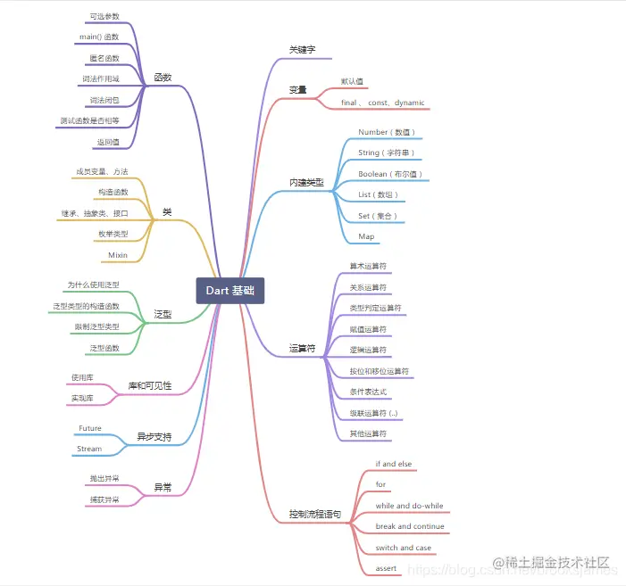

# 一、Dart 基础目录：

## 1.1 思维导图



## 1.2 Dart 基础将分五篇讲解：

<table><thead><tr><th>一</th><th align="left"><a href="https://juejin.cn/post/6928375103780552717" target="_blank" title="https://juejin.cn/post/6928375103780552717">主要讲解关键字、变量、内置类型、操作符、控制流程语句</a></th></tr></thead><tbody><tr><td>二</td><td align="left"><a href="https://juejin.cn/post/6931340267324702733" target="_blank" title="https://juejin.cn/post/6931340267324702733">主要讲解函数</a></td></tr><tr><td>三</td><td align="left"><a href="https://juejin.cn/post/6934661883567800327" target="_blank" title="https://juejin.cn/post/6934661883567800327">主要讲解类</a></td></tr><tr><td>四</td><td align="left"><a href="https://juejin.cn/post/6936901921412382728" target="_blank" title="https://juejin.cn/post/6936901921412382728">主要讲解泛型、库及可见性</a></td></tr><tr><td>五</td><td align="left"><a href="https://juejin.cn/post/6939493546713939982" target="_blank" title="https://juejin.cn/post/6939493546713939982">主要讲解异步支持、异常</a></td></tr></tbody></table>

# 二、开篇（请记住并了解这些重要的概念）

在学习 Dart 语言时, 应该基于以下事实和概念：

*   任何保存在变量中的都是一个对象，并且所有的对象都是对应一个类的实例。无论是数字，函数和 null 都是对象。所有对象继承自 Object 类。
*   尽管 Dart 是强类型的，但是 Dart 可以推断类型，所以类型注释是可选的。 如果要明确说明不需要任何类型， 需要使用特殊类型 dynamic 。
*   Dart 支持泛型，如 List （整数列表）或 List （任何类型的对象列表）。
*   Dart 支持顶级函数（例如 main（））， 同样函数绑定在类或对象上（分别是 静态函数 和 实例函数 ）。 以及支持函数内创建函数 （ 嵌套 或 局部函数 ） 。
*   类似地， Dart 支持顶级 变量 ， 同样变量绑定在类或对象上（静态变量和实例变量）。 实例变量有时称为字段或属性。
*   与 Java 不同，Dart 没有关键字 “public” ， “protected” 和 “private” 。 如果标识符以下划线（_）开头，则它相对于库是私有的。 有关更多信息，参考 库和可见性。
*   标识符 以字母或下划线（_）开头，后跟任意字母和数字组合。
*   Dart 语法中包含 表达式（ expressions ）（有运行时值）和 语句（ statements ）（没有运行时值）。 例如，条件表达式 condition ? expr1 : expr2 的值可能是 expr1 或 expr2 。 将其与 if-else 语句 相比较，if-else 语句没有值。 一条语句通常包含一个或多个表达式，相反表达式不能直接包含语句。
*   Dart 工具提示两种类型问题：警告和错误。 警告只是表明代码可能无法正常工作，但不会阻止程序的执行。 错误可能是编译时错误或者运行时错误。 编译时错误会阻止代码的执行; 运行时错误会导致代码在执行过程中引发 [异常]（#exception）。

# 三、Dart 关键字

Dart 语言关键字列表。

<table><thead><tr><th><a href="https://link.juejin.cn?target=https%3A%2F%2Fwww.dartcn.com%2Fguides%2Flanguage%2Flanguage-tour%23%25E6%258A%25BD%25E8%25B1%25A1%25E7%25B1%25BB" target="_blank" title="https://www.dartcn.com/guides/language/language-tour#%E6%8A%BD%E8%B1%A1%E7%B1%BB" ref="nofollow noopener noreferrer">abstract</a></th><th><a href="https://link.juejin.cn?target=https%3A%2F%2Fwww.dartcn.com%2Fguides%2Flanguage%2Flanguage-tour%23%25E9%2587%258D%25E8%25A6%2581%25E7%259A%2584%25E6%25A6%2582%25E5%25BF%25B5" target="_blank" title="https://www.dartcn.com/guides/language/language-tour#%E9%87%8D%E8%A6%81%E7%9A%84%E6%A6%82%E5%BF%B5" ref="nofollow noopener noreferrer">dynamic</a></th><th><a href="https://link.juejin.cn?target=https%3A%2F%2Fwww.dartcn.com%2Fguides%2Flanguage%2Flanguage-tour%23%25E9%259A%2590%25E5%25BC%258F%25E6%258E%25A5%25E5%258F%25A3" target="_blank" title="https://www.dartcn.com/guides/language/language-tour#%E9%9A%90%E5%BC%8F%E6%8E%A5%E5%8F%A3" ref="nofollow noopener noreferrer">implements</a></th><th><a href="https://link.juejin.cn?target=https%3A%2F%2Fwww.dartcn.com%2Fguides%2Flanguage%2Flanguage-tour%23%25E5%25AF%25BC%25E5%2585%25A5%25E5%25BA%2593%25E7%259A%2584%25E4%25B8%2580%25E9%2583%25A8%25E5%2588%2586" target="_blank" title="https://www.dartcn.com/guides/language/language-tour#%E5%AF%BC%E5%85%A5%E5%BA%93%E7%9A%84%E4%B8%80%E9%83%A8%E5%88%86" ref="nofollow noopener noreferrer">show</a></th></tr></thead><tbody><tr><td><a href="https://link.juejin.cn?target=https%3A%2F%2Fwww.dartcn.com%2Fguides%2Flanguage%2Flanguage-tour%23%25E7%25B1%25BB%25E5%259E%258B%25E5%2588%25A4%25E5%25AE%259A%25E8%25BF%2590%25E7%25AE%2597%25E7%25AC%25A6" target="_blank" title="https://www.dartcn.com/guides/language/language-tour#%E7%B1%BB%E5%9E%8B%E5%88%A4%E5%AE%9A%E8%BF%90%E7%AE%97%E7%AC%A6" ref="nofollow noopener noreferrer">as</a></td><td><a href="https://link.juejin.cn?target=https%3A%2F%2Fwww.dartcn.com%2Fguides%2Flanguage%2Flanguage-tour%23if-%25E5%2592%258C-else" target="_blank" title="https://www.dartcn.com/guides/language/language-tour#if-%E5%92%8C-else" ref="nofollow noopener noreferrer">else</a></td><td><a href="https://link.juejin.cn?target=https%3A%2F%2Fwww.dartcn.com%2Fguides%2Flanguage%2Flanguage-tour%23%25E4%25BD%25BF%25E7%2594%25A8%25E5%25BA%2593" target="_blank" title="https://www.dartcn.com/guides/language/language-tour#%E4%BD%BF%E7%94%A8%E5%BA%93" ref="nofollow noopener noreferrer">import</a></td><td><a href="https://link.juejin.cn?target=https%3A%2F%2Fwww.dartcn.com%2Fguides%2Flanguage%2Flanguage-tour%23%25E7%25B1%25BB%25E5%258F%2598%25E9%2587%258F%25E5%2592%258C%25E6%2596%25B9%25E6%25B3%2595" target="_blank" title="https://www.dartcn.com/guides/language/language-tour#%E7%B1%BB%E5%8F%98%E9%87%8F%E5%92%8C%E6%96%B9%E6%B3%95" ref="nofollow noopener noreferrer">static</a></td></tr><tr><td><a href="https://link.juejin.cn?target=https%3A%2F%2Fwww.dartcn.com%2Fguides%2Flanguage%2Flanguage-tour%23assert" target="_blank" title="https://www.dartcn.com/guides/language/language-tour#assert" ref="nofollow noopener noreferrer">assert</a></td><td><a href="https://link.juejin.cn?target=https%3A%2F%2Fwww.dartcn.com%2Fguides%2Flanguage%2Flanguage-tour%23%25E6%259E%259A%25E4%25B8%25BE%25E7%25B1%25BB%25E5%259E%258B" target="_blank" title="https://www.dartcn.com/guides/language/language-tour#%E6%9E%9A%E4%B8%BE%E7%B1%BB%E5%9E%8B" ref="nofollow noopener noreferrer">enum</a></td><td><a href="https://link.juejin.cn?target=https%3A%2F%2Fwww.dartcn.com%2Fguides%2Flanguage%2Flanguage-tour%23for-%25E5%25BE%25AA%25E7%258E%25AF" target="_blank" title="https://www.dartcn.com/guides/language/language-tour#for-%E5%BE%AA%E7%8E%AF" ref="nofollow noopener noreferrer">in</a></td><td><a href="https://link.juejin.cn?target=https%3A%2F%2Fwww.dartcn.com%2Fguides%2Flanguage%2Flanguage-tour%23%25E6%2589%25A9%25E5%25B1%2595%25E7%25B1%25BB%25E7%25BB%25A7%25E6%2589%25BF" target="_blank" title="https://www.dartcn.com/guides/language/language-tour#%E6%89%A9%E5%B1%95%E7%B1%BB%E7%BB%A7%E6%89%BF" ref="nofollow noopener noreferrer">super</a></td></tr><tr><td><a href="https://link.juejin.cn?target=https%3A%2F%2Fwww.dartcn.com%2Fguides%2Flanguage%2Flanguage-tour%23%25E5%25BC%2582%25E6%25AD%25A5%25E6%2594%25AF%25E6%258C%2581" target="_blank" title="https://www.dartcn.com/guides/language/language-tour#%E5%BC%82%E6%AD%A5%E6%94%AF%E6%8C%81" ref="nofollow noopener noreferrer">async</a></td><td><a href="https://link.juejin.cn?target=https%3A%2F%2Fwww.dartcn.com%2Fguides%2Flibraries%2Fcreate-library-packages" target="_blank" title="https://www.dartcn.com/guides/libraries/create-library-packages" ref="nofollow noopener noreferrer">export</a></td><td><a href="https://link.juejin.cn?target=https%3A%2F%2Fstackoverflow.com%2Fquestions%2F28595501%2Fwas-the-interface-keyword-removed-from-dart" target="_blank" title="https://stackoverflow.com/questions/28595501/was-the-interface-keyword-removed-from-dart" ref="nofollow noopener noreferrer">interface</a></td><td><a href="https://link.juejin.cn?target=https%3A%2F%2Fwww.dartcn.com%2Fguides%2Flanguage%2Flanguage-tour%23switch-%25E5%2592%258C-case" target="_blank" title="https://www.dartcn.com/guides/language/language-tour#switch-%E5%92%8C-case" ref="nofollow noopener noreferrer">switch</a></td></tr><tr><td><a href="https://link.juejin.cn?target=https%3A%2F%2Fwww.dartcn.com%2Fguides%2Flanguage%2Flanguage-tour%23%25E5%25BC%2582%25E6%25AD%25A5%25E6%2594%25AF%25E6%258C%2581" target="_blank" title="https://www.dartcn.com/guides/language/language-tour#%E5%BC%82%E6%AD%A5%E6%94%AF%E6%8C%81" ref="nofollow noopener noreferrer">await</a></td><td><a href="https://link.juejin.cn?target=https%3A%2F%2Fwww.dartcn.com%2Fguides%2Flanguage%2Flanguage-tour%23%25E6%2589%25A9%25E5%25B1%2595%25E7%25B1%25BB%25E7%25BB%25A7%25E6%2589%25BF" target="_blank" title="https://www.dartcn.com/guides/language/language-tour#%E6%89%A9%E5%B1%95%E7%B1%BB%E7%BB%A7%E6%89%BF" ref="nofollow noopener noreferrer">extends</a></td><td><a href="https://link.juejin.cn?target=https%3A%2F%2Fwww.dartcn.com%2Fguides%2Flanguage%2Flanguage-tour%23%25E7%25B1%25BB%25E5%259E%258B%25E5%2588%25A4%25E5%25AE%259A%25E8%25BF%2590%25E7%25AE%2597%25E7%25AC%25A6" target="_blank" title="https://www.dartcn.com/guides/language/language-tour#%E7%B1%BB%E5%9E%8B%E5%88%A4%E5%AE%9A%E8%BF%90%E7%AE%97%E7%AC%A6" ref="nofollow noopener noreferrer">is</a></td><td><a href="https://link.juejin.cn?target=https%3A%2F%2Fwww.dartcn.com%2Fguides%2Flanguage%2Flanguage-tour%23%25E7%2594%259F%25E6%2588%2590%25E5%2599%25A8" target="_blank" title="https://www.dartcn.com/guides/language/language-tour#%E7%94%9F%E6%88%90%E5%99%A8" ref="nofollow noopener noreferrer">sync</a></td></tr><tr><td><a href="https://link.juejin.cn?target=https%3A%2F%2Fwww.dartcn.com%2Fguides%2Flanguage%2Flanguage-tour%23break-%25E5%2592%258C-continue" target="_blank" title="https://www.dartcn.com/guides/language/language-tour#break-%E5%92%8C-continue" ref="nofollow noopener noreferrer">break</a></td><td><a href="https://link.juejin.cn?target=https%3A%2F%2Fstackoverflow.com%2Fquestions%2F24929659%2Fwhat-does-external-mean-in-dart" target="_blank" title="https://stackoverflow.com/questions/24929659/what-does-external-mean-in-dart" ref="nofollow noopener noreferrer">external</a></td><td><a href="https://link.juejin.cn?target=https%3A%2F%2Fwww.dartcn.com%2Fguides%2Flanguage%2Flanguage-tour%23%25E5%25BA%2593%25E5%2592%258C%25E5%258F%25AF%25E8%25A7%2581%25E6%2580%25A7" target="_blank" title="https://www.dartcn.com/guides/language/language-tour#%E5%BA%93%E5%92%8C%E5%8F%AF%E8%A7%81%E6%80%A7" ref="nofollow noopener noreferrer">library</a></td><td><a href="https://link.juejin.cn?target=https%3A%2F%2Fwww.dartcn.com%2Fguides%2Flanguage%2Flanguage-tour%23%25E6%259E%2584%25E9%2580%25A0%25E5%2587%25BD%25E6%2595%25B0" target="_blank" title="https://www.dartcn.com/guides/language/language-tour#%E6%9E%84%E9%80%A0%E5%87%BD%E6%95%B0" ref="nofollow noopener noreferrer">this</a></td></tr><tr><td><a href="https://link.juejin.cn?target=https%3A%2F%2Fwww.dartcn.com%2Fguides%2Flanguage%2Flanguage-tour%23switch-%25E5%2592%258C-case" target="_blank" title="https://www.dartcn.com/guides/language/language-tour#switch-%E5%92%8C-case" ref="nofollow noopener noreferrer">case</a></td><td><a href="https://link.juejin.cn?target=https%3A%2F%2Fwww.dartcn.com%2Fguides%2Flanguage%2Flanguage-tour%23%25E5%25B7%25A5%25E5%258E%2582%25E6%259E%2584%25E9%2580%25A0%25E5%2587%25BD%25E6%2595%25B0" target="_blank" title="https://www.dartcn.com/guides/language/language-tour#%E5%B7%A5%E5%8E%82%E6%9E%84%E9%80%A0%E5%87%BD%E6%95%B0" ref="nofollow noopener noreferrer">factory</a></td><td><a href="https://link.juejin.cn?target=https%3A%2F%2Fwww.dartcn.com%2Fguides%2Flanguage%2Flanguage-tour%23%25E4%25B8%25BA%25E7%25B1%25BB%25E6%25B7%25BB%25E5%258A%25A0%25E5%258A%259F%25E8%2583%25BDmixins" target="_blank" title="https://www.dartcn.com/guides/language/language-tour#%E4%B8%BA%E7%B1%BB%E6%B7%BB%E5%8A%A0%E5%8A%9F%E8%83%BDmixins" ref="nofollow noopener noreferrer">mixin</a></td><td><a href="https://link.juejin.cn?target=https%3A%2F%2Fwww.dartcn.com%2Fguides%2Flanguage%2Flanguage-tour%23throw" target="_blank" title="https://www.dartcn.com/guides/language/language-tour#throw" ref="nofollow noopener noreferrer">throw</a></td></tr><tr><td><a href="https://link.juejin.cn?target=https%3A%2F%2Fwww.dartcn.com%2Fguides%2Flanguage%2Flanguage-tour%23catch" target="_blank" title="https://www.dartcn.com/guides/language/language-tour#catch" ref="nofollow noopener noreferrer">catch</a></td><td><a href="https://link.juejin.cn?target=https%3A%2F%2Fwww.dartcn.com%2Fguides%2Flanguage%2Flanguage-tour%23booleans" target="_blank" title="https://www.dartcn.com/guides/language/language-tour#booleans" ref="nofollow noopener noreferrer">false</a></td><td><a href="https://link.juejin.cn?target=https%3A%2F%2Fwww.dartcn.com%2Fguides%2Flanguage%2Flanguage-tour%23%25E4%25BD%25BF%25E7%2594%25A8%25E6%259E%2584%25E9%2580%25A0%25E5%2587%25BD%25E6%2595%25B0" target="_blank" title="https://www.dartcn.com/guides/language/language-tour#%E4%BD%BF%E7%94%A8%E6%9E%84%E9%80%A0%E5%87%BD%E6%95%B0" ref="nofollow noopener noreferrer">new</a></td><td><a href="https://link.juejin.cn?target=https%3A%2F%2Fwww.dartcn.com%2Fguides%2Flanguage%2Flanguage-tour%23booleans" target="_blank" title="https://www.dartcn.com/guides/language/language-tour#booleans" ref="nofollow noopener noreferrer">true</a></td></tr><tr><td><a href="https://link.juejin.cn?target=https%3A%2F%2Fwww.dartcn.com%2Fguides%2Flanguage%2Flanguage-tour%23%25E5%25AE%259E%25E4%25BE%258B%25E5%258F%2598%25E9%2587%258F" target="_blank" title="https://www.dartcn.com/guides/language/language-tour#%E5%AE%9E%E4%BE%8B%E5%8F%98%E9%87%8F" ref="nofollow noopener noreferrer">class</a></td><td><a href="https://link.juejin.cn?target=https%3A%2F%2Fwww.dartcn.com%2Fguides%2Flanguage%2Flanguage-tour%23final-%25E5%2592%258C-const" target="_blank" title="https://www.dartcn.com/guides/language/language-tour#final-%E5%92%8C-const" ref="nofollow noopener noreferrer">final</a></td><td><a href="https://link.juejin.cn?target=https%3A%2F%2Fwww.dartcn.com%2Fguides%2Flanguage%2Flanguage-tour%23%25E9%25BB%2598%25E8%25AE%25A4%25E5%2580%25BC" target="_blank" title="https://www.dartcn.com/guides/language/language-tour#%E9%BB%98%E8%AE%A4%E5%80%BC" ref="nofollow noopener noreferrer">null</a></td><td><a href="https://link.juejin.cn?target=https%3A%2F%2Fwww.dartcn.com%2Fguides%2Flanguage%2Flanguage-tour%23catch" target="_blank" title="https://www.dartcn.com/guides/language/language-tour#catch" ref="nofollow noopener noreferrer">try</a></td></tr><tr><td><a href="https://link.juejin.cn?target=https%3A%2F%2Fwww.dartcn.com%2Fguides%2Flanguage%2Flanguage-tour%23final-%25E5%2592%258C-const" target="_blank" title="https://www.dartcn.com/guides/language/language-tour#final-%E5%92%8C-const" ref="nofollow noopener noreferrer">const</a></td><td><a href="https://link.juejin.cn?target=https%3A%2F%2Fwww.dartcn.com%2Fguides%2Flanguage%2Flanguage-tour%23finally" target="_blank" title="https://www.dartcn.com/guides/language/language-tour#finally" ref="nofollow noopener noreferrer">finally</a></td><td><a href="https://link.juejin.cn?target=https%3A%2F%2Fwww.dartcn.com%2Fguides%2Flanguage%2Flanguage-tour%23catch" target="_blank" title="https://www.dartcn.com/guides/language/language-tour#catch" ref="nofollow noopener noreferrer">on</a></td><td><a href="https://link.juejin.cn?target=https%3A%2F%2Fwww.dartcn.com%2Fguides%2Flanguage%2Flanguage-tour%23typedefs" target="_blank" title="https://www.dartcn.com/guides/language/language-tour#typedefs" ref="nofollow noopener noreferrer">typedef</a></td></tr><tr><td><a href="https://link.juejin.cn?target=https%3A%2F%2Fwww.dartcn.com%2Fguides%2Flanguage%2Flanguage-tour%23break-%25E5%2592%258C-continue" target="_blank" title="https://www.dartcn.com/guides/language/language-tour#break-%E5%92%8C-continue" ref="nofollow noopener noreferrer">continue</a></td><td><a href="https://link.juejin.cn?target=https%3A%2F%2Fwww.dartcn.com%2Fguides%2Flanguage%2Flanguage-tour%23for-%25E5%25BE%25AA%25E7%258E%25AF" target="_blank" title="https://www.dartcn.com/guides/language/language-tour#for-%E5%BE%AA%E7%8E%AF" ref="nofollow noopener noreferrer">for</a></td><td><a href="https://link.juejin.cn?target=https%3A%2F%2Fwww.dartcn.com%2Fguides%2Flanguage%2Flanguage-tour%23%25E9%2587%258D%25E5%2586%2599%25E8%25BF%2590%25E7%25AE%2597%25E7%25AC%25A6" target="_blank" title="https://www.dartcn.com/guides/language/language-tour#%E9%87%8D%E5%86%99%E8%BF%90%E7%AE%97%E7%AC%A6" ref="nofollow noopener noreferrer">operator</a></td><td><a href="https://link.juejin.cn?target=https%3A%2F%2Fwww.dartcn.com%2Fguides%2Flanguage%2Flanguage-tour%23%25E5%258F%2598%25E9%2587%258F" target="_blank" title="https://www.dartcn.com/guides/language/language-tour#%E5%8F%98%E9%87%8F" ref="nofollow noopener noreferrer">var</a></td></tr><tr><td><a href="https://link.juejin.cn?target=https%3A%2F%2Fwww.dartcn.com%2Fguides%2Flanguage%2Fsound-problems%23the-covariant-keyword" target="_blank" title="https://www.dartcn.com/guides/language/sound-problems#the-covariant-keyword" ref="nofollow noopener noreferrer">covariant</a></td><td><a href="https://link.juejin.cn?target=https%3A%2F%2Fwww.dartcn.com%2Fguides%2Flanguage%2Flanguage-tour%23%25E5%2587%25BD%25E6%2595%25B0" target="_blank" title="https://www.dartcn.com/guides/language/language-tour#%E5%87%BD%E6%95%B0" ref="nofollow noopener noreferrer">Function</a></td><td><a href="https://link.juejin.cn?target=https%3A%2F%2Fwww.dartcn.com%2Fguides%2Flibraries%2Fcreate-library-packages%23organizing-a-library-package" target="_blank" title="https://www.dartcn.com/guides/libraries/create-library-packages#organizing-a-library-package" ref="nofollow noopener noreferrer">part</a></td><td><a href="https://link.juejin.cn?target=https%3A%2F%2Fmedium.com%2Fdartlang%2Fdart-2-legacy-of-the-void-e7afb5f44df0" target="_blank" title="https://medium.com/dartlang/dart-2-legacy-of-the-void-e7afb5f44df0" ref="nofollow noopener noreferrer">void</a></td></tr><tr><td><a href="https://link.juejin.cn?target=https%3A%2F%2Fwww.dartcn.com%2Fguides%2Flanguage%2Flanguage-tour%23switch-%25E5%2592%258C-case" target="_blank" title="https://www.dartcn.com/guides/language/language-tour#switch-%E5%92%8C-case" ref="nofollow noopener noreferrer">default</a></td><td><a href="https://link.juejin.cn?target=https%3A%2F%2Fwww.dartcn.com%2Fguides%2Flanguage%2Flanguage-tour%23getters-%25E5%2592%258C-setters" target="_blank" title="https://www.dartcn.com/guides/language/language-tour#getters-%E5%92%8C-setters" ref="nofollow noopener noreferrer">get</a></td><td><a href="https://link.juejin.cn?target=https%3A%2F%2Fwww.dartcn.com%2Fguides%2Flanguage%2Flanguage-tour%23catch" target="_blank" title="https://www.dartcn.com/guides/language/language-tour#catch" ref="nofollow noopener noreferrer">rethrow</a></td><td><a href="https://link.juejin.cn?target=https%3A%2F%2Fwww.dartcn.com%2Fguides%2Flanguage%2Flanguage-tour%23while-%25E5%2592%258C-do-while" target="_blank" title="https://www.dartcn.com/guides/language/language-tour#while-%E5%92%8C-do-while" ref="nofollow noopener noreferrer">while</a></td></tr><tr><td><a href="https://link.juejin.cn?target=https%3A%2F%2Fwww.dartcn.com%2Fguides%2Flanguage%2Flanguage-tour%23%25E5%25BB%25B6%25E8%25BF%259F%25E5%258A%25A0%25E8%25BD%25BD%25E5%25BA%2593" target="_blank" title="https://www.dartcn.com/guides/language/language-tour#%E5%BB%B6%E8%BF%9F%E5%8A%A0%E8%BD%BD%E5%BA%93" ref="nofollow noopener noreferrer">deferred</a></td><td><a href="https://link.juejin.cn?target=https%3A%2F%2Fwww.dartcn.com%2Fguides%2Flanguage%2Flanguage-tour%23%25E5%25AF%25BC%25E5%2585%25A5%25E5%25BA%2593%25E7%259A%2584%25E4%25B8%2580%25E9%2583%25A8%25E5%2588%2586" target="_blank" title="https://www.dartcn.com/guides/language/language-tour#%E5%AF%BC%E5%85%A5%E5%BA%93%E7%9A%84%E4%B8%80%E9%83%A8%E5%88%86" ref="nofollow noopener noreferrer">hide</a></td><td><a href="https://link.juejin.cn?target=https%3A%2F%2Fwww.dartcn.com%2Fguides%2Flanguage%2Flanguage-tour%23%25E5%2587%25BD%25E6%2595%25B0" target="_blank" title="https://www.dartcn.com/guides/language/language-tour#%E5%87%BD%E6%95%B0" ref="nofollow noopener noreferrer">return</a></td><td><a href="https://link.juejin.cn?target=https%3A%2F%2Fwww.dartcn.com%2Fguides%2Flanguage%2Flanguage-tour%23%25E4%25B8%25BA%25E7%25B1%25BB%25E6%25B7%25BB%25E5%258A%25A0%25E5%258A%259F%25E8%2583%25BDmixins" target="_blank" title="https://www.dartcn.com/guides/language/language-tour#%E4%B8%BA%E7%B1%BB%E6%B7%BB%E5%8A%A0%E5%8A%9F%E8%83%BDmixins" ref="nofollow noopener noreferrer">with</a></td></tr><tr><td><a href="https://link.juejin.cn?target=https%3A%2F%2Fwww.dartcn.com%2Fguides%2Flanguage%2Flanguage-tour%23while-%25E5%2592%258C-do-while" target="_blank" title="https://www.dartcn.com/guides/language/language-tour#while-%E5%92%8C-do-while" ref="nofollow noopener noreferrer">do</a></td><td><a href="https://link.juejin.cn?target=https%3A%2F%2Fwww.dartcn.com%2Fguides%2Flanguage%2Flanguage-tour%23if-%25E5%2592%258C-else" target="_blank" title="https://www.dartcn.com/guides/language/language-tour#if-%E5%92%8C-else" ref="nofollow noopener noreferrer">if</a></td><td><a href="https://link.juejin.cn?target=https%3A%2F%2Fapi.dartlang.org%2Fstable%2Fdart-core%2FSet-class.html" target="_blank" title="https://api.dartlang.org/stable/dart-core/Set-class.html" ref="nofollow noopener noreferrer">set</a></td><td><a href="https://link.juejin.cn?target=https%3A%2F%2Fwww.dartcn.com%2Fguides%2Flanguage%2Flanguage-tour%23%25E7%2594%259F%25E6%2588%2590%25E5%2599%25A8" target="_blank" title="https://www.dartcn.com/guides/language/language-tour#%E7%94%9F%E6%88%90%E5%99%A8" ref="nofollow noopener noreferrer">yield</a></td></tr></tbody></table>

避免使用这些单词作为标识符。 但是，如有必要，标有上标的关键字可以用作标识符：

*   带有 **1** 上标的单词为 **上下文关键字**， 仅在特定位置具有含义。 他们在任何地方都是有效的标识符。
    
*   带有 **2** 上标的单词为 **内置标识符**， 为了简化将 JavaScript 代码移植到 Dart 的工作， 这些关键字在大多数地方都是有效的标识符， 但它们不能用作类或类型名称，也不能用作 import 前缀。
    
*   带有 **3** 上标的单词是与 Dart 1.0 发布后添加的[异步支持](https://link.juejin.cn?target=https%3A%2F%2Fwww.dartcn.com%2Fguides%2Flanguage%2Flanguage-tour%23%25E5%25BC%2582%25E6%25AD%25A5%25E6%2594%25AF%25E6%258C%2581 "https://www.dartcn.com/guides/language/language-tour#%E5%BC%82%E6%AD%A5%E6%94%AF%E6%8C%81")相关的更新，作为限制类保留字。 不能在标记为 `async` ，`async*` 或 `sync*` 的任何函数体中使用 `await` 或 `yield` 作为标识符。
    

关键字表中的剩余单词都是**保留字**。 不能将保留字用作标识符。

# 四、变量

Dart 中定义变量有两种方式:

*   一、显式声明变量类型（String name = 'Bob';）
*   二、不指定类型，自动推断出类型（var name = 'Bob';）

变量仅存储对象引用，这里的变量是 `name` 存储了一个 `String` 类型的**对象引用**。 “Bob” 是这个 `String` 类型对象的值。

## 4.1、默认值

**未初始化的变量默认值是 `null`**。即使变量是数字类型默认值也是 null，因为在 Dart 中一切都是对象，无论是数字，函数和 null 都是对象。所有对象继承自 Object 类。

```dart
int lineCount;
assert(lineCount == null);
```

> **提示：** 在生产环境代码中 `assert()` 函数会被忽略，不会被调用。 在开发过程中, `assert(_condition_)` 会在非 `true` 的条件下抛出异常。

## 4.2 dynamic / object

> dynamic 类型具有所有可能的属性和方法。Dart 语言中函数方法都有 dynamic 类型作为函数的返回类型，函数的参数也都有 dynamic 类型。

上面的定义告诉我们，我们不会获得 warning 当我们调用 dynamic 变量的任何方法。其实 dynamic 不是实际的 type，而是类型检查开关，通过它定义的变量会关闭类型检查，这意味着 dynamic list= 3; list.add();

这段代码静态类型检查不会报错 (**dynamic 不是在编译时确定类型的，而是在运行时**)，但是运行时会 crash，因为 list 并没有 add（） 方法，一个变量被 dynamic 修饰，相当于告诉系统 “相信我，我知道我自己在做什么”。所以在大多数情况下，不推荐直接使用它。

```dart
void main() {
  dynamic name = '字符串';
  print(name.runtimeType); //输出：String
  name.add(); //静态类型检查不会报错,单在运行时会crash
  dynamic year = 2020;
  print(year.runtimeType); //输出：int
}
```

但是用 object 定义变量时则会出现告警, object 是 Dart 对象的基类, 你定义： object o =xxx ; 时这个时候系统会认为 o 是个对象，你可以调用 o 的 toString() 和 hashCode() 方法，但是如果你尝试调用 o.add() 时，静态类型检查会运行报错。

```dart
void main() {
 dynamic list= 3;  
 list.add(); // 不会报错
 object object = 3；
 object.add(); // 会报错
}
```

## 4.3 final / const

使用过程中从来不会被修改的变量， 可以使用 `final` 或 `const`, 而不是 `var` 或者其他类型， Final 变量的值只能被设置一次； Const 变量在编译时就已经固定 (Const 变量 是隐式 Final 的类型.) 最高级 final 变量或类变量在第一次使用时被初始化。

> **提示：** 实例变量可以是 `final` 类型但不能是 `const` 类型。 必须在构造函数体执行之前初始化 final 实例变量 —— 在变量声明中，参数构造函数中或构造函数的[初始化列表](https://link.juejin.cn?target=https%3A%2F%2Fwww.dartcn.com%2Fguides%2Flanguage%2Flanguage-tour%23initializer-list "https://www.dartcn.com/guides/language/language-tour#initializer-list")中进行初始化。

`final`的要求就是 **其声明的变量在赋值之后就不再改变**，它并不要求变量在编译时就已经确定； `final`有两种场景：

*   文件中的变量声明：必须在声明时赋值。
*   类的成员变量声明：可以在声明时赋值，也可以通过构造函数赋值语法糖`Class({this.a})`，或者初始化列表的方式赋值。

```dart
class TestWidget extends StatefulWidget{

  final String name;
  
  final String url ="https://wwww.baidu.com"; // url 不能被修改:

  TestWidget(this.name);

  @override
  State<StatefulWidget> createState() {
    // TODO: implement createState
    return null;
  }
}
```

如果需要在**编译时**就固定变量的值，可以使用 `const` 类型变量。Const 关键字不仅可以用于声明常量变量， 还可以用来创建常量值，以及声明创建常量值的构造函数。 如果 const 变量是类级别的，需要标记为 `static const`。 在这些地方可以使用在编译时就已经固定不变的值，字面量的数字和字符串， 固定的变量，或者是用于计算的固定数字：

### 4.3.1 const 使用在左边

当`const`用在`=`左边时，其作用是 **声明变量**，它要求 **必须在声明变量时赋值，一旦赋值就不允许修改，而声明值一定要是编译时常数**（它们必须由编译期就能被计算出来的数据创建，一个 const 的对象不能使用运行时才能确定的值），`const`在声明变量时可以省略变量的类型如`var, int`等。 这里的关键点在于区分 **什么是编译时常数**，有以下几种场景：

*   数值、字符串、其它的`const`变量

```dart
void main() {
  const a = 1;
  const b = 'hello';
  const c = a;
}
```

*   表达式，表达式的所有值都是编译时可知的。

```dart
void main() {
  const a = 1;
  const b = a > 1 ? 2 : 1;
}
```

*   集合或对象。集合必须用`const`修饰，对象的构造函数必须用`const`修饰。

```dart
void main() {
  const a = const [1,2,3];
  const b = ConstObject(2);
  b.log();
}
class ConstObject {
  
  final value;
  
  const ConstObject(this.value);
  
  log() {
    print(value);
  }
}
```

### 4.3.2 const 使用在右边

当`const`用在`=`右边，其作用是 **修饰值**，**它意味着对象的整个深度状态可以在编译时完全确定，并且对象将被冻结并且完全不可变**。如果你有一个 final 的集合字段，集合里面的内容是可以改变的。如果你有一个 const 的集合对象，集合里面的一切都是 const 的，都是不能改变的。 一般用于修饰集合，它要求两点：

*   集合的元素都必须是编译时常数。

```dart
void main() {
  var c = 2;
  //ERROR, 集合元素必须是编译时常数。
  var a = const [c,2,3];
}
```

*   不允许对集合做任何改变。

```dart
void main() {
  const a = const [1,2,3];
  //ERROR, 不允许修改。
  a[1] = 2;
}
```

### 4.3.3 const 修饰类的构造函数

它们是规范化的，这点有些像字符串：对于一个 const 的 value，无论这个 value 被创建或者使用多少次，都是相同的；当`const`修饰类的构造函数时，它要求该类的所有成员都必须是`final`的。

```dart
class ConstObject {
  
  final value;
  //ERROR, 必须是 final 变量。
  int value2;
  
  const ConstObject(this.value);
  
  log() {
    print(value);
  }
}

main() {
  var a = ConstObject();
  var b = ConstObject();
  print(a===b); // true
}
```

# 五、类型

Dart 语言支持以下内建类型：

**Number**  
**String**  
**Boolean**  
**List (也被称为 Array)**  
**Map**  
**Set**  
**Rune (用于在字符串中表示 Unicode 字符)**  
**Symbol**  
这些类型都可以被初始化为字面量。 例如, 'this is a string' 是一个字符串的字面量， true 是一个布尔的字面量。

因为在 Dart 所有的变量终究是一个对象（一个类的实例）， 所以变量可以使用 构造涵数 进行初始化。 一些内建类型拥有自己的构造函数。 例如， 通过 Map() 来构造一个 map 变量。

## 5.1 Number

Dart 语言的 Number 有两种类型:

### 5.1.1 int 类型

整数值不大于 64 位， 具体取决于平台。 在 Dart VM 上， 值的范围从 -2 到 2 - 1. Dart 被编译为 JavaScript 时，使用 [JavaScript numbers,](https://link.juejin.cn?target=https%3A%2F%2Fstackoverflow.com%2Fquestions%2F2802957%2Fnumber-of-bits-in-javascript-numbers%2F2803010%232803010 "https://stackoverflow.com/questions/2802957/number-of-bits-in-javascript-numbers/2803010#2803010") 值的范围从 -2 到 2 - 1.

### 5.1.2 double 类型

64 位（双精度）浮点数，依据 IEEE 754 标准，`int` 和 `double` 都是 `[number](https://api.dartlang.org/stable/dart-core/num-class.html)` 的亚类型。 num 类型包括基本运算 +， -， /， 和 *， 以及 `abs()`， `ceil()`， 和 `floor()`， 等函数方法。 （按位运算符，例如 » 等，定义在 int 类中） 如果 num 及其亚类型找不到你想要的方法， 可以尝试查找使用 [dart:math](https://link.juejin.cn?target=https%3A%2F%2Fapi.dartlang.org%2Fstable%2Fdart-math "https://api.dartlang.org/stable/dart-math") 库。

整数类型不包含小数点。 下面是定义整数类型字面量的例子:

```dart
var x = 1;
var hex = 0xDEADBEEF;
```

如果一个数字包含小数点，那么就是小数类型。 下面是定义小数类型字面量的例子:

```dart
var y = 1.1;
var exponents = 1.42e5;
```

> 从 Dart 2.1 开始，必要的时候 int 字面量会自动转换成 double 类型。 double z = 1; // 相当于 double z = 1.0. **版本提示：** 在 2.1 之前，在 double 上下文中使用 int 字面量是错误的。

以下是将字符串转换为数字的方法，反之亦然（转换时最好添加异常处理）：

```dart
// String -> int
var one = int.parse('1');
assert(one == 1);

// String -> double
var onePointOne = double.parse('1.1');
assert(onePointOne == 1.1);

// int -> String
String oneAsString = 1.toString();
assert(oneAsString == '1');

// double -> String
String piAsString = 3.14159.toStringAsFixed(2);
assert(piAsString == '3.14');
```

int 特有的传统按位运算操作，移位（<<，>>），按位与（&）以及 按位或（|）。 例如：

```dart
assert((3 << 1) == 6); // 0011 << 1 == 0110
assert((3 >> 1) == 1); // 0011 >> 1 == 0001
assert((3 | 4) == 7); // 0011 | 0100 == 0111
```

数字类型字面量是编译时常量。 在算术表达式中，只要参与计算的因子是编译时常量， 那么算术表达式的结果也是编译时常量。

```dart
const msPerSecond = 1000;
const secondsUntilRetry = 5;
const msUntilRetry = secondsUntilRetry * msPerSecond;
```

## 5.2 String

Dart 字符串是一组 UTF-16 单元序列。 字符串通过单引号或者双引号创建。

```dart
var s1 = 'Single quotes work well for string literals.';
var s2 = "Double quotes work just as well.";
var s3 = 'It's easy to escape the string delimiter.';
var s4 = "It's even easier to use the other delimiter.";
```

**字符串可以通过 ${expression} 的方式内嵌表达式。 如果表达式是一个标识符，则 {} 可以省略。 在 Dart 中通过调用就对象的 toString() 方法来得到对象相应的字符串。**

```dart
var s = 'string interpolation';

assert('Dart has $s, which is very handy.' ==
    'Dart has string interpolation, ' +
        'which is very handy.');
assert('That deserves all caps. ' +
        '${s.toUpperCase()} is very handy!' ==
    'That deserves all caps. ' +
        'STRING INTERPOLATION is very handy!');
```

> 提示： == 运算符用来测试两个对象是否相等。 在字符串中，如果两个字符串包含了相同的编码序列，那么这两个字符串相等.

可以使用 + 运算符来把多个字符串连接为一个，也可以把多个字面量字符串写在一起来实现字符串连接：

```dart
var s1 = 'String '
    'concatenation'
    " works even over line breaks.";
assert(s1 ==
    'String concatenation works even over '
    'line breaks.');

var s2 = 'The + operator ' + 'works, as well.';
assert(s2 == 'The + operator works, as well.');
```

使用连续三个单引号或者三个双引号实现多行字符串对象的创建：

```dart
var s1 = '''
You can create
multi-line strings like this one.
''';

var s2 = """This is also a
multi-line string.""";
```

使用 r 前缀，可以创建 “原始 raw” 字符串：

```dart
var s = r"In a raw string, even \n isn't special.";
print(s) // "In a raw string, even \n isn't special.", \n中的转义符\失效了
```

一个编译时常量的字面量字符串中，如果存在插值表达式，表达式内容也是编译时常量， 那么该字符串依旧是编译时常量。 插入的常量值类型可以是 null，数值，字符串或布尔值。

```dart
// const 类型数据
const aConstNum = 0;
const aConstBool = true;
const aConstString = 'a constant string';

// 非 const 类型数据
var aNum = 0;
var aBool = true;
var aString = 'a string';
const aConstList = [1, 2, 3];

const validConstString = '$aConstNum $aConstBool $aConstString'; //const 类型数据
// const invalidConstString = '$aNum $aBool $aString $aConstList'; //非 const 类型数据
```

更多关于 String 的使用, 参考[字符串和正则表达式](https://link.juejin.cn?target=https%3A%2F%2Fwww.dartcn.com%2Fguides%2Flibraries%2Flibrary-tour%23%25E5%25AD%2597%25E7%25AC%25A6%25E5%2592%258C%25E6%25AD%25A3%25E5%2588%2599%25E8%25A1%25A8%25E8%25BE%25BE%25E5%25BC%258F "https://www.dartcn.com/guides/libraries/library-tour#%E5%AD%97%E7%AC%A6%E5%92%8C%E6%AD%A3%E5%88%99%E8%A1%A8%E8%BE%BE%E5%BC%8F")

## 5.3 Bool

Dart 使用 `bool` 类型表示布尔值。 Dart 只有字面量 `true` and `false` 是布尔类型， 这两个对象都是编译时常量。 Dart 的类型安全意味着不能使用 `if (_nonbooleanValue_)` 或者 `assert (_nonbooleanValue_)`。 而是应该像下面这样，明确的进行值检查：

```dart
// 检查空字符串。
var fullName = '';
assert(fullName.isEmpty);

// 检查 0 值。
var hitPoints = 0;
assert(hitPoints <= 0);

// 检查 null 值。
var unicorn;
assert(unicorn == null);

// 检查 NaN 。
var iMeantToDoThis = 0 / 0;
assert(iMeantToDoThis.isNaN);
```

## 5.4 List

几乎每种编程语言中最常见的集合可能是 array 或有序的对象集合。 在 Dart 中的 Array 就是 List 对象， 通常称之为 List 。 Dart 中的 List 字面量非常像 JavaScript 中的 array 字面量。 下面是一个 Dart List 的示例：

```dart
var list = [1, 2, 3];
```

> 提示： Dart 推断 list 的类型为 List 。 如果尝试将非整数对象添加到此 List 中， 则分析器或运行时会引发错误。

Lists 的下标索引从 0 开始，第一个元素的索引是 0。 list.length - 1 是最后一个元素的索引。

```dart
var list = [1, 2, 3];
assert(list.length == 3);
assert(list[1] == 2);
list[1] = 1;
assert(list[1] == 1);
```

在 List 字面量之前添加 const 关键字，可以定义 List 类型的编译时常量：

```dart
var constantList = const [1, 2, 3];
// constantList[1] = 1; // 取消注释会引起错误。
```

List 类型包含了很多 List 的操作函数, 这里就不一一展开了。

## 5.5 Set

在 Dart 中 Set 是一个元素唯一且无序的集合。 Dart 为 Set 提供了 Set 字面量和 Set 类型。

> 版本提示： 虽然 Set 类型 一直是 Dart 的核心部分， 但在 Dart2.2 中才引入了 Set 字面量 。

下面是通过字面量创建 Set 的一个简单示例：

```dart
var halogens = {'fluorine', 'chlorine', 'bromine', 'iodine', 'astatine'};
// Dart 推断 halogens 类型为 Set 。如果尝试为它添加一个 错误类型的值，分析器或执行时会抛出错误。
```

要创建一个空集，使用前面带有类型参数的 {} ，或者将 {} 赋值给 Set 类型的变量：

```dart
var names = <String>{};
// Set<String> names = {}; // 这样也是可以的。
// var names = {}; // 这样会创建一个 Map ，而不是 Set 。
```

> 是 Set 还是 Map ？ Map 字面量语法同 Set 字面量语法非常相似。 因为先有的 Map 字母量语法，所以 {} 默认是 Map 类型。 如果忘记在 {} 上注释类型或赋值到一个未声明类型的变量上， 那么 Dart 会创建一个类型为 Map<dynamic, dynamic> 的对象。

使用 add() 或 addAll() 为已有的 Set 添加元素：

```dart
var elements = <String>{};
elements.add('fluorine');
elements.addAll(halogens);
```

使用 .length 来获取 Set 中元素的个数：

```dart
var elements = {};
elements.add('fluorine');
elements.addAll(halogens);
assert(elements.length == 5);
```

在 Set 字面量前增加 const ，来创建一个编译时 Set 常量：

```dart
final constantSet = const {
'fluorine',
'chlorine',
'bromine',
'iodine',
'astatine',
};
// constantSet.add('helium'); // Uncommenting this causes an error.
```

## 5.6 Map

通常来说， Map 是用来关联 keys 和 values 的对象。 keys 和 values 可以是任何类型的对象。在一个 Map 对象中一个 key 只能出现一次。 但是 value 可以出现多次。 Dart 中 Map 通过 Map 字面量 和 Map 类型来实现。 下面是使用 Map 字面量的两个简单例子：

```dart
var gifts = {
// Key:    Value
'first': 'partridge',
'second': 'turtledoves',
'fifth': 'golden rings'
};
var nobleGases = {
2: 'helium',
10: 'neon',
18: 'argon',
};
```

> 提示： Dart 会将 gifts 的类型推断为 Map<String, String>， nobleGases 的类型推断为 Map<int, String> 。 如果尝试在上面的 map 中添加错误类型，那么分析器或者运行时会引发错误。 有关更多信息，请阅读类型推断。

以上 Map 对象也可以使用 Map 构造函数创建：

```dart
var gifts = Map();
gifts['first'] = 'partridge';
gifts['second'] = 'turtledoves';
gifts['fifth'] = 'golden rings';

var nobleGases = Map();
nobleGases[2] = 'helium';
nobleGases[10] = 'neon';
nobleGases[18] = 'argon';
```

> 提示: 这里为什么只有 Map() ，而不是使用 new Map()。 因为在 Dart 2 中，new 关键字是可选的。 有关更多信息，参考 构造函数的使用。

类似 JavaScript ，添加 key-value 对到已有的 Map 中：

```dart
var gifts = {'first': 'partridge'};
gifts['fourth'] = 'calling birds'; // Add a key-value pair
```

类似 JavaScript ，从一个 Map 中获取一个 value：

```dart
var gifts = {'first': 'partridge'};
assert(gifts['first'] == 'partridge');
```

如果 Map 中不包含所要查找的 key，那么 Map 返回 null：

```dart
var gifts = {'first': 'partridge'};
assert(gifts['fifth'] == null);
```

使用 .length 函数获取当前 Map 中的 key-value 对数量：

```dart
var gifts = {'first': 'partridge'};
gifts['fourth'] = 'calling birds';
assert(gifts.length == 2);
```

创建 Map 类型运行时常量，要在 Map 字面量前加上关键字 const。

```dart
final constantMap = const {
2: 'helium',
10: 'neon',
18: 'argon',
};
// constantMap[2] = 'Helium'; // 取消注释会引起错误。
```

## 5.7 Rune

**在 Dart 中， Rune 用来表示字符串中的 UTF-32 编码字符。** Unicode 定义了一个全球的书写系统编码， 系统中使用的所有字母，数字和符号都对应唯一的数值编码。 由于 Dart 字符串是一系列 UTF-16 编码单元， 因此要在字符串中表示 32 位 Unicode 值需要特殊语法支持。

表示 Unicode 编码的常用方法是， \uXXXX, 这里 XXXX 是一个 4 位的 16 进制数。 例如，心形符号 (♥) 是 \u2665。 对于特殊的非 4 个数值的情况， 把编码值放到大括号中即可。 例如，emoji 的笑脸 (�) 是 \u{1f600}。

String 类有一些属性可以获得 rune 数据。 属性 codeUnitAt 和 codeUnit 返回 16 位编码数据。 属性 runes 获取字符串中的 Rune 。

> 提示： 谨慎使用 list 方式操作 Rune 。 这种方法很容易引发崩溃， 具体原因取决于特定的语言，字符集和操作。

## 5.8 Symbol

一个 Symbol 对象表示 Dart 程序中声明的运算符或者标识符。 你也许永远都不需要使用 Symbol ，但要按名称引用标识符的 API 时， Symbol 就非常有用了。 因为代码压缩后会改变标识符的名称，但不会改变标识符的符号。 通过字面量 Symbol ，也就是标识符前面添加一个 # 号，来获取标识符的 Symbol 。

```dart
#radix
#bar
```

Symbol 字面量是编译时常量。

# 六、运算符

下表是 Dart 定义的运算符。 多数运算符可以被重载，详情参考 [重写运算符](https://link.juejin.cn?target=https%3A%2F%2Fwww.dartcn.com%2Fguides%2Flanguage%2Flanguage-tour%23%25E9%2587%258D%25E5%2586%2599%25E8%25BF%2590%25E7%25AE%2597%25E7%25AC%25A6 "https://www.dartcn.com/guides/language/language-tour#%E9%87%8D%E5%86%99%E8%BF%90%E7%AE%97%E7%AC%A6")。

<table><thead><tr><th>Description</th><th align="left">Operator</th></tr></thead><tbody><tr><td>unary postfix</td><td align="left"><code>_expr_++</code> <code>_expr_--</code> <code>()</code> <code>[]</code> <code>.</code> <code>?.</code></td></tr><tr><td>unary prefix</td><td align="left"><code>-_expr_</code> <code>!_expr_</code> <code>~_expr_</code> <code>++_expr_</code> <code>--_expr_</code></td></tr><tr><td>multiplicative</td><td align="left"><code>*</code> <code>/</code> <code>%</code> <code>~/</code></td></tr><tr><td>additive</td><td align="left"><code>+</code> <code>-</code></td></tr><tr><td>shift</td><td align="left"><code>&lt;&lt;</code> <code>&gt;&gt;</code> <code>&gt;&gt;&gt;</code></td></tr><tr><td>bitwise AND</td><td align="left"><code>&amp;</code></td></tr><tr><td>bitwise XOR</td><td align="left"><code>^</code></td></tr><tr><td>bitwise OR</td><td align="left">`</td><td>`</td></tr><tr><td>relational and type test</td><td align="left"><code>&gt;=</code> <code>&gt;</code> <code>&lt;=</code> <code>&lt;</code> <code>as</code> <code>is</code> <code>is!</code></td></tr><tr><td>equality</td><td align="left"><code>==</code> <code>!=</code></td></tr><tr><td>logical AND</td><td align="left"><code>&amp;&amp;</code></td></tr><tr><td>logical OR</td><td align="left">`</td><td></td><td>`</td></tr><tr><td>if null</td><td align="left"><code>??</code></td></tr><tr><td>conditional</td><td align="left"><code>_expr1_ ? _expr2_ : _expr3_</code></td></tr><tr><td>cascade</td><td align="left"><code>..</code></td></tr><tr><td>assignment</td><td align="left"><code>=</code> <code>*=</code> <code>/=</code> <code>+=</code> <code>-=</code> <code>&amp;=</code> <code>^=</code> <em>etc.</em></td></tr></tbody></table>

> **提示：** 上述表格中描述的运算符优先级近似于 Dart 解析器实际行为。 更准确的描述，请参阅 [Dart language specification](https://link.juejin.cn?target=https%3A%2F%2Fwww.dartcn.com%2Fguides%2Flanguage%2Fspec "https://www.dartcn.com/guides/language/spec") 中的语法。

下面示例演示一个类重写 `+` 和 `-` 操作符：

```dart
class Vector {
  final int x, y;

  Vector(this.x, this.y);

  Vector operator +(Vector v) => Vector(x + v.x, y + v.y);
  Vector operator -(Vector v) => Vector(x - v.x, y - v.y);

  // 运算符 == 和 hashCode 部分没有列出。 有关详情，请参考下面的注释。
  // ···
}

void main() {
  final v = Vector(2, 3);
  final w = Vector(2, 2);

  assert(v + w == Vector(4, 5));
  assert(v - w == Vector(0, 1));
}
```

创建表达式的时候会用到运算符。 下面是一些运算符表达式的实例：

```dart
a++
a + b
a = b
a == b
c ? a : b
a is T
```

在 [运算符表](https://link.juejin.cn?target=https%3A%2F%2Fwww.dartcn.com%2Fguides%2Flanguage%2Flanguage-tour%23operators "https://www.dartcn.com/guides/language/language-tour#operators") 中， 每一行的运算符优先级，由上到下依次排列，第一行优先级最高，最后一行优先级最低。 例如 `%` 运算符优先级高于 `==` ， 而 `==` 高于 `&&`。 根据优先级规则，那么意味着以下两行代码执行的方式相同：

```dart
// 括号可以提高可读性。
if ((n % i == 0) && (d % i == 0)) ...

// 可读性差，但是是等效的。
if (n % i == 0 && d % i == 0) ...
```

> 警告：对于有两个操作数的运算符，运算符的功能由左边的操作数决定。 例如, 如果有两个操作数 Vector 和 Point， `aVector + aPoint` 使用的是 Vector 中定义的 + 运算符。

## 6.1 算术运算符

Dart 支持常用的运算运算符，如下表所示：

<table><thead><tr><th>Operator</th><th align="left">Meaning</th></tr></thead><tbody><tr><td><code>+</code></td><td align="left">Add</td></tr><tr><td><code>–</code></td><td align="left">Subtract</td></tr><tr><td><code>-_expr_</code></td><td align="left">Unary minus, also known as negation (reverse the sign of the expression)</td></tr><tr><td><code>*</code></td><td align="left">Multiply</td></tr><tr><td><code>/</code></td><td align="left">Divide</td></tr><tr><td><code>~/</code></td><td align="left">Divide, returning an integer result</td></tr><tr><td><code>%</code></td><td align="left">Get the remainder of an integer division (modulo)</td></tr></tbody></table>

示例：

```dart
assert(2 + 3 == 5);
assert(2 - 3 == -1);
assert(2 * 3 == 6);
assert(5 / 2 == 2.5); // 结果是双浮点型
assert(5 ~/ 2 == 2); // 结果是整型
assert(5 % 2 == 1); // 余数
assert('5/2 = ${5 ~/ 2} r ${5 % 2}' == '5/2 = 2 r 1');
```

Dart 还支持前缀和后缀，自增和自减运算符。

<table><thead><tr><th>Operator</th><th align="left">Meaning</th></tr></thead><tbody><tr><td><code>++_var_</code></td><td align="left"><code>_var_ = _var_ + 1</code> (expression value is <code>_var_ + 1</code>)</td></tr><tr><td><code>_var_++</code></td><td align="left"><code>_var_ = _var_ + 1</code> (expression value is <code>_var_</code>)</td></tr><tr><td><code>--_var_</code></td><td align="left"><code>_var_ = _var_ – 1</code> (expression value is <code>_var_ – 1</code>)</td></tr><tr><td><code>_var_--</code></td><td align="left"><code>_var_ = _var_ – 1</code> (expression value is <code>_var_</code>)</td></tr></tbody></table>

示例：

```dart
var a, b;
a = 0;
b = ++a; // a自加后赋值给b。
assert(a == b); // 1 == 1

a = 0;
b = a++; // a先赋值给b后，a自加。
assert(a != b); // 1 != 0

a = 0;
b = --a; // a自减后赋值给b。
assert(a == b); // -1 == -1
```

## 6.2 关系运算符

下表列出了关系运算符及含义：

<table><thead><tr><th>Operator</th><th align="left">Meaning</th></tr></thead><tbody><tr><td><code>==</code></td><td align="left">Equal; see discussion below</td></tr><tr><td><code>!=</code></td><td align="left">Not equal</td></tr><tr><td><code>&gt;</code></td><td align="left">Greater than</td></tr><tr><td><code>&lt;</code></td><td align="left">Less than</td></tr><tr><td><code>&gt;=</code></td><td align="left">Greater than or equal to</td></tr><tr><td><code>&lt;=</code></td><td align="left">Less than or equal to</td></tr></tbody></table>

要测试两个对象 x 和 y 是否表示相同的事物， 使用 `==` 运算符。 (在极少数情况下， 要确定两个对象是否完全相同，需要使用 [identical()](https://link.juejin.cn?target=https%3A%2F%2Fapi.dartlang.org%2Fstable%2Fdart-core%2Fidentical.html "https://api.dartlang.org/stable/dart-core/identical.html") 函数。) 下面给出 `==` 运算符的工作原理：

1.  如果 _x_ 或 _y_ 可以 null，都为 null 时返回 true ，其中一个为 null 时返回 false。
    
2.  结果为函数 `_x_.==(_y_)` 的返回值。 (如上所见, `==` 运算符执行的是第一个运算符的函数。 我们甚至可以重写很多运算符，包括 `==`， 运算符的重写，参考 [重写运算符](https://link.juejin.cn?target=https%3A%2F%2Fwww.dartcn.com%2Fguides%2Flanguage%2Flanguage-tour%23%25E9%2587%258D%25E5%2586%2599%25E8%25BF%2590%25E7%25AE%2597%25E7%25AC%25A6 "https://www.dartcn.com/guides/language/language-tour#%E9%87%8D%E5%86%99%E8%BF%90%E7%AE%97%E7%AC%A6")。）
    

这里列出了每种关系运算符的示例：

```dart
assert(2 == 2);
assert(2 != 3);
assert(3 > 2);
assert(2 < 3);
assert(3 >= 3);
assert(2 <= 3);
```

## 6.3 类型判定运算符

`as`， `is`， 和 `is!` 运算符用于在**运行时处理类型检查**：

<table><thead><tr><th>Operator</th><th align="left">Meaning</th></tr></thead><tbody><tr><td><code>as</code></td><td align="left">Typecast (也被用于<a href="https://link.juejin.cn?target=https%3A%2F%2Fwww.dartcn.com%2Fguides%2Flanguage%2Flanguage-tour%23%25E6%258C%2587%25E5%25AE%259A%25E5%25BA%2593%25E5%2589%258D%25E7%25BC%2580" target="_blank" title="https://www.dartcn.com/guides/language/language-tour#%E6%8C%87%E5%AE%9A%E5%BA%93%E5%89%8D%E7%BC%80" ref="nofollow noopener noreferrer">指定库前缀</a>)</td></tr><tr><td><code>is</code></td><td align="left">True if the object has the specified type</td></tr><tr><td><code>is!</code></td><td align="left">False if the object has the specified type</td></tr></tbody></table>

例如， `obj is Object` 总是 true。 但是只有 `obj` 实现了 `T` 的接口时， `obj is T` 才是 true。 **使用 `as` 运算符将对象强制转换为特定类型**。 通常，可以认为是 `is` 类型判定后，被判定对象调用函数的一种缩写形式。 请考虑以下代码：

```dart
if (emp is Person) {
  // Type check
  emp.firstName = 'Bob';
}
使用 as 运算符进行缩写：
(emp as Person).firstName = 'Bob';
```

> **提示：** 以上代码并不是等价的。 如果 `emp` 为 null 或者不是 Person 对象， 那么第一个 `is` 的示例，后面将不回执行； 第二个 `as` 的示例会抛出异常。

## 6.4 赋值运算符

使用 `=` 为变量赋值。 使用 `??=` 运算符时，只有当被赋值的变量为 null 时才会赋值给它。

```dart
// 将值赋值给变量a
a = value;
// 如果b为空时，将变量赋值给b，否则，b的值保持不变。
b ??= value;
```

复合赋值运算符（如 `+=` ）将算术运算符和赋值运算符组合在了一起。

<table><thead><tr><th><code>=</code></th><th><code>–=</code></th><th><code>/=</code></th><th><code>%=</code></th><th><code>&gt;&gt;=</code></th><th><code>^=</code></th></tr></thead><tbody><tr><td><code>+=</code></td><td><code>*=</code></td><td><code>~/=</code></td><td><code>&lt;&lt;=</code></td><td><code>&amp;=</code></td><td>`</td><td>=`</td></tr></tbody></table>

以下说明复合赋值运算符的作用：

<table><thead><tr><th></th><th>Compound assignment</th><th>Equivalent expression</th></tr></thead><tbody><tr><td><strong>For an operator <em>op</em>:</strong></td><td><code>a _op_= b</code></td><td><code>a = a _op_ b</code></td></tr><tr><td><strong>Example:</strong></td><td><code>a += b</code></td><td><code>a = a + b</code></td></tr></tbody></table>

以下示例使用赋值和复合赋值运算符：

```dart
var a = 2; // 使用 = 复制
a *= 3; // 复制并做乘法运算： a = a * 3
assert(a == 6);
```

## 6.5 逻辑运算符

逻辑操作符可以反转或组合布尔表达式。

<table><thead><tr><th>Operator</th><th align="left">Meaning</th></tr></thead><tbody><tr><td><code>!_expr_</code></td><td align="left">inverts the following expression (changes false to true, and vice versa)</td></tr><tr><td>`</td><td align="left"></td><td>`</td><td>logical OR</td></tr><tr><td><code>&amp;&amp;</code></td><td align="left">logical AND</td></tr></tbody></table>

下面是关于逻辑表达式的示例：

```dart
if (!done && (col == 0 || col == 3)) {
  // ...Do something...
}
```

## 6.6 按位和移位运算符

在 Dart 中，可以单独操作数字的某一位。 通常情况下整数类型使用按位和移位运算符来操作。

<table><thead><tr><th>Operator</th><th align="left">Meaning</th></tr></thead><tbody><tr><td><code>&amp;</code></td><td align="left">AND</td></tr><tr><td>`</td><td align="left">`</td><td>OR</td></tr><tr><td><code>^</code></td><td align="left">XOR</td></tr><tr><td><code>~_expr_</code></td><td align="left">Unary bitwise complement (0s become 1s; 1s become 0s)</td></tr><tr><td><code>&lt;&lt;</code></td><td align="left">Shift left</td></tr><tr><td><code>&gt;&gt;</code></td><td align="left">Shift right</td></tr></tbody></table>

下面是关于按位和移位运算符的示例：

```dart
final value = 0x22;
final bitmask = 0x0f;

assert((value & bitmask) == 0x02); // AND
assert((value & ~bitmask) == 0x20); // AND NOT
assert((value | bitmask) == 0x2f); // OR
assert((value ^ bitmask) == 0x2d); // XOR
assert((value << 4) == 0x220); // Shift left
assert((value >> 4) == 0x02); // Shift right
```

## 6.7 条件表达式

Dart 有两个运算符，有时可以替换 [if-else](https://link.juejin.cn?target=https%3A%2F%2Fwww.dartcn.com%2Fguides%2Flanguage%2Flanguage-tour%23if-%25E5%2592%258C-else "https://www.dartcn.com/guides/language/language-tour#if-%E5%92%8C-else") 表达式， 让表达式更简洁： `_condition_ ? _expr1_ : _expr2_`如果条件为 true, 执行 _expr1_ (并返回它的值)： 否则, 执行并返回 _expr2_ 的值。

`_expr1_ ?? _expr2_`如果 _expr1_ 是 non-null， 返回 _expr1_ 的值； 否则, 执行并返回 _expr2_ 的值。

如果赋值是根据布尔值， 考虑使用 `?:`。 var visibility = isPublic ? 'public' : 'private'; 如果赋值是基于判定是否为 null， 考虑使用 `??`。 String playerName(String name) => name ?? 'Guest'; 下面给出了其他两种实现方式， 但并不简洁：

```dart
// Slightly longer version uses ?: operator.
String playerName(String name) => name != null ? name : 'Guest';

// Very long version uses if-else statement.
String playerName(String name) {
  if (name != null) {
    return name;
  } else {
    return 'Guest';
  }
}

String playerName(String name) => name ?? 'Guest';
```

## 6.8 级联运算符 (..)

**级联运算符 (`..`) 可以实现对同一个对像进行一系列的操作。 除了调用函数， 还可以访问同一对象上的字段属性**。 这通常可以节省创建临时变量的步骤， 同时编写出更流畅的代码。 考虑一下代码：

```dart
querySelector('#confirm') // 获取对象。
  ..text = 'Confirm' // 调用成员变量。
  ..classes.add('important')
  ..onClick.listen((e) => window.alert('Confirmed!'));
```

第一句调用函数 `querySelector()` ， 返回获取到的对象。 获取的对象依次执行级联运算符后面的代码， 代码执行后的返回值会被忽略。 上面的代码等价于：

```dart
var button = querySelector('#confirm');
button.text = 'Confirm';
button.classes.add('important');
button.onClick.listen((e) => window.alert('Confirmed!'));
```

级联运算符可以嵌套，例如：

```dart
final addressBook = (AddressBookBuilder()
      ..name = 'jenny'
      ..email = 'jenny@example.com'
      ..phone = (PhoneNumberBuilder()
            ..number = '415-555-0100'
            ..label = 'home')
          .build())
    .build();
```

在返回对象的函数中谨慎使用级联操作符。 例如，下面的代码是错误的：

```dart
var sb = StringBuffer();
sb.write('foo')
  ..write('bar'); // Error: 'void' 没哟定义 'write' 函数
```

。`sb.write()` 函数调用返回 void， 不能在 `void` 对象上创建级联操作。

> **提示：** 严格的来讲， “两个点” 的级联语法不是一个运算符。 它只是一个 Dart 的特殊语法。

## 6.9 其他运算符

大多数剩余的运算符，已在示例中使用过：

<table><thead><tr><th>Operator</th><th>Name</th><th align="left">Meaning</th></tr></thead><tbody><tr><td><code>()</code></td><td>Function application</td><td align="left">Represents a function call</td></tr><tr><td><code>[]</code></td><td>List access</td><td align="left">Refers to the value at the specified index in the list</td></tr><tr><td><code>.</code></td><td>Member access</td><td align="left">Refers to a property of an expression; example: <code>foo.bar</code> selects property <code>bar</code> from expression <code>foo</code></td></tr><tr><td><code>?.</code></td><td>Conditional member access</td><td align="left">Like <code>.</code>, but the leftmost operand can be null; example: <code>foo?.bar</code> selects property <code>bar</code> from expression <code>foo</code> unless <code>foo</code> is null (in which case the value of <code>foo?.bar</code> is null)</td></tr></tbody></table>

更多关于 `.` `?.` 和 `..` 运算符介绍，参考 [Classes](https://link.juejin.cn?target=https%3A%2F%2Fwww.dartcn.com%2Fguides%2Flanguage%2Flanguage-tour%23classes "https://www.dartcn.com/guides/language/language-tour#classes").

# 七、控制流程语句

你可以通过下面任意一种方式来控制 Dart 程序流程：

*   `if` and `else`
    
*   `for` loops
    
*   `while` and `do`-`while` loops
    
*   `break` and `continue`
    
*   `switch` and `case`
    
*   `assert`
    

使用 `try-catch` 和 `throw` 也可以改变程序流程， 详见 [Exceptions](https://link.juejin.cn?target=https%3A%2F%2Fwww.dartcn.com%2Fguides%2Flanguage%2Flanguage-tour%23exceptions "https://www.dartcn.com/guides/language/language-tour#exceptions")。

## 7.1 if 和 else

Dart 支持 `if - else` 语句，其中 `else` 是可选的， 比如下面的例子， 另参考 [conditional expressions](https://link.juejin.cn?target=https%3A%2F%2Fwww.dartcn.com%2Fguides%2Flanguage%2Flanguage-tour%23conditional-expressions "https://www.dartcn.com/guides/language/language-tour#conditional-expressions").

```dart
if (isRaining()) {
  you.bringRainCoat();
} else if (isSnowing()) {
  you.wearJacket();
} else {
  car.putTopDown();
}
```

Dart 的判断条件必须是布尔值，不能是其他类型。 更多信息，参考 [Booleans](https://link.juejin.cn?target=https%3A%2F%2Fwww.dartcn.com%2Fguides%2Flanguage%2Flanguage-tour%23booleans "https://www.dartcn.com/guides/language/language-tour#booleans") 。

## 7.2 for 循环

进行迭代操作，可以使用标准 `for` 语句。 例如：

```dart
var message = StringBuffer('Dart is fun');
for (var i = 0; i < 5; i++) {
  message.write('!');
}
```

闭包在 Dart 的 `for` 循环中会捕获循环的 index 索引值， 来避免 JavaScript 中常见的陷阱。 请思考示例代码：

```dart
var callbacks = [];
for (var i = 0; i < 2; i++) {
  callbacks.add(() => print(i));
}
callbacks.forEach((c) => c());
```

和期望一样，输出的是 `0` 和 `1`。 但是示例中的代码在 JavaScript 中会连续输出两个 `2` 。 如果要迭代一个实现了 Iterable 接口的对象， 可以使用 [forEach()](https://link.juejin.cn?target=https%3A%2F%2Fapi.dartlang.org%2Fstable%2Fdart-core%2FIterable%2FforEach.html "https://api.dartlang.org/stable/dart-core/Iterable/forEach.html") 方法， 如果不需要使用当前计数值， 使用 `forEach()` 是非常棒的选择；

```dart
candidates.forEach((candidate) => candidate.interview());
```

实现了 Iterable 的类（比如， List 和 Set）同样也支持使用 `for-in` 进行迭代操作 [iteration](https://link.juejin.cn?target=https%3A%2F%2Fwww.dartcn.com%2Fguides%2Flibraries%2Flibrary-tour%23iteration "https://www.dartcn.com/guides/libraries/library-tour#iteration") ：

```dart
var collection = [0, 1, 2];
for (var x in collection) {
  print(x); // 0 1 2
}
```

## 7.3 while 和 do-while

**`while` 循环在执行前判断执行条件：**

```dart
while (!isDone()) {
  doSomething();
}
```

**`do`-`while` 循环在执行`后`判断执行条件：**

```dart
do {
  printLine();
} while (!atEndOfPage());
```

## 7.4 break 和 continue

使用 `break` 停止程序循环：

```dart
while (true) {
  if (shutDownRequested()) break;
  processIncomingRequests();
}
```

使用 `continue` 跳转到下一次迭代：

```dart
for (int i = 0; i < candidates.length; i++) {
  var candidate = candidates[i];
  if (candidate.yearsExperience < 5) {
    continue;
  }
  candidate.interview();
}
```

如果对象实现了 [Iterable](https://link.juejin.cn?target=https%3A%2F%2Fapi.dartlang.org%2Fstable%2Fdart-core%2FIterable-class.html "https://api.dartlang.org/stable/dart-core/Iterable-class.html") 接口 （例如，list 或者 set）。 那么上面示例完全可以用另一种方式来实现：

```dart
candidates
    .where((c) => c.yearsExperience >= 5)
    .forEach((c) => c.interview());
```

## 7.5 switch 和 case

在 Dart 中 switch 语句使用 `==` 比较整数，字符串，或者编译时常量。 比较的对象必须都是同一个类的实例（并且不可以是子类）， 类必须没有对 `==` 重写。 [枚举类型](https://link.juejin.cn?target=https%3A%2F%2Fwww.dartcn.com%2Fguides%2Flanguage%2Flanguage-tour%23%25E6%259E%259A%25E4%25B8%25BE%25E7%25B1%25BB%25E5%259E%258B "https://www.dartcn.com/guides/language/language-tour#%E6%9E%9A%E4%B8%BE%E7%B1%BB%E5%9E%8B") 可以用于 `switch` 语句。

> **提示：** 在 Dart 中 Switch 语句仅适用于有限的情况下， 例如在 interpreter 或 scanner 中。

在 `case` 语句中，每个非空的 `case` 语句结尾需要跟一个 `break` 语句。 除 `break` 以外，还有可以使用 `continue`, `throw`，或者 `return`。 当没有 `case` 语句匹配时，执行 `default` 代码：

```dart
var command = 'OPEN';
switch (command) {
  case 'CLOSED':
    executeClosed();
    break;
  case 'PENDING':
    executePending();
    break;
  case 'APPROVED':
    executeApproved();
    break;
  case 'DENIED':
    executeDenied();
    break;
  case 'OPEN':
    executeOpen();
    break;
  default:
    executeUnknown();
}
```

下面的 `case` 程序示例中缺省了 `break` 语句，导致错误：

```dart
var command = 'OPEN';
switch (command) {
  case 'OPEN':
    executeOpen();
    // ERROR: 丢失 break
  case 'CLOSED':
    executeClosed();
    break;
}
```

但是， Dart 支持空 `case` 语句， 允许程序以 fall-through 的形式执行。

```dart
var command = 'CLOSED';
switch (command) {
  case 'CLOSED': // Empty case falls through.
  case 'NOW_CLOSED':
    // Runs for both CLOSED and NOW_CLOSED.
    executeNowClosed();
    break;
}
```

在非空 `case` 中实现 fall-through 形式， 可以使用 `continue` 语句结合 `lable` 的方式实现:

```dart
var command = 'CLOSED';
switch (command) {
  case 'CLOSED':
    executeClosed();
    continue nowClosed;
  // Continues executing at the nowClosed label.
  nowClosed:
  case 'NOW_CLOSED':
    // Runs for both CLOSED and NOW_CLOSED.
    executeNowClosed();
    break;
}
```

> `case` 语句可以拥有局部变量， 这些局部变量只能在这个语句的作用域中可见。

## 7.6 assert

如果 `assert` 语句中的布尔条件为 false ， 那么正常的程序执行流程会被中断。

```dart
// 确认变量值不为空。
assert(text != null);

// 确认变量值小于100。
assert(number < 100);

// 确认 URL 是否是 https 类型。
assert(urlString.startsWith('https'));
```

> **提示：** assert 语句只在开发环境中有效， 在生产环境是无效的； Flutter 中的 assert 只在 [debug 模式](https://link.juejin.cn?target=https%3A%2F%2Fflutter.io%2Fdebugging%2F%23debug-mode-assertions "https://flutter.io/debugging/#debug-mode-assertions") 中有效。 开发用的工具，例如 [dartdevc](https://link.juejin.cn?target=https%3A%2F%2Fwebdev.dartlang.org%2Ftools%2Fdartdevc "https://webdev.dartlang.org/tools/dartdevc") 默认是开启 assert 功能。 其他的一些工具， 例如 [dart](https://link.juejin.cn?target=https%3A%2F%2Fwww.dartcn.com%2Fserver%2Ftools%2Fdart-vm "https://www.dartcn.com/server/tools/dart-vm") 和 [dart2js,](https://link.juejin.cn?target=https%3A%2F%2Fwebdev.dartlang.org%2Ftools%2Fdart2js "https://webdev.dartlang.org/tools/dart2js") 支持通过命令行开启 assert ： `--enable-asserts`。

assert 的第二个参数可以为其添加一个字符串消息。 assert(urlString.startsWith('https'), 'URL ($urlString) should start with"https".'); assert 的第一个参数可以是解析为布尔值的任何表达式。 如果表达式结果为 true ， 则断言成功，并继续执行。 如果表达式结果为 false ， 则断言失败，并抛出异常 ([AssertionError](https://link.juejin.cn?target=https%3A%2F%2Fapi.dartlang.org%2Fstable%2Fdart-core%2FAssertionError-class.html "https://api.dartlang.org/stable/dart-core/AssertionError-class.html"))

# 参考资料：

1.  [Dart 中文官网](https://link.juejin.cn?target=https%3A%2F%2Fwww.dartcn.com%2Fguides%2Flanguage%2Flanguage-tour "https://www.dartcn.com/guides/language/language-tour")
2.  [Flutter 知识梳理 (Dart) - Dart 中 static, final, const 区别](https://juejin.cn/post/6844903897123799054#heading-1 "https://juejin.cn/post/6844903897123799054#heading-1")
3.  [40 分钟快速入门 Dart 基础](https://juejin.cn/post/6850037270368485384 "https://juejin.cn/post/6850037270368485384")