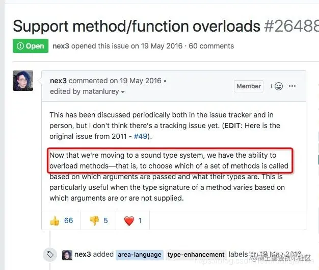
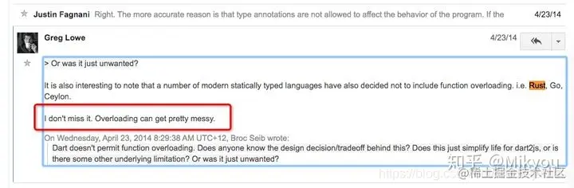

# 一、Dart 基础目录：

## 1.1 思维导图


## 1.2 Dart 基础将分五篇讲解：

<table><thead><tr><th>一</th><th align="left"><a href="https://juejin.cn/post/6928375103780552717" target="_blank" title="https://juejin.cn/post/6928375103780552717">主要讲解关键字、变量、内置类型、操作符、控制流程语句</a></th></tr></thead><tbody><tr><td>二</td><td align="left"><a href="https://juejin.cn/post/6931340267324702733" target="_blank" title="https://juejin.cn/post/6931340267324702733">主要讲解函数</a></td></tr><tr><td>三</td><td align="left"><a href="https://juejin.cn/post/6934661883567800327" target="_blank" title="https://juejin.cn/post/6934661883567800327">主要讲解类</a></td></tr><tr><td>四</td><td align="left"><a href="https://juejin.cn/post/6936901921412382728" target="_blank" title="https://juejin.cn/post/6936901921412382728">主要讲解泛型、库及可见性</a></td></tr><tr><td>五</td><td align="left"><a href="https://juejin.cn/post/6939493546713939982" target="_blank" title="https://juejin.cn/post/6939493546713939982">主要讲解异步支持、异常</a></td></tr></tbody></table>

# 二、函数

**Dart 是一门真正面向对象的语言， 甚至其中的函数也是对象，并且有它的类型 **[**Function**](https://link.juejin.cn?target=https%3A%2F%2Fapi.dartlang.org%2Fstable%2Fdart-core%2FFunction-class.html "https://api.dartlang.org/stable/dart-core/Function-class.html")** 。** 这也意味着函数可以被赋值给变量或者作为参数传递给其他函数。 也可以把 Dart 类的实例当做方法来调用。 有关更多信息，参考 [Callable classes](https://link.juejin.cn?target=https%3A%2F%2Fwww.dartcn.com%2Fguides%2Flanguage%2Flanguage-tour%23callable-classes "https://www.dartcn.com/guides/language/language-tour#callable-classes").  
已下是函数实现的示例：

```dart
bool isNoble(int atomicNumber) {
  return _nobleGases[atomicNumber] != null;
}
```

虽然在 Effective Dart 中推荐 [公共 API 中声明类型](https://link.juejin.cn?target=https%3A%2F%2Fwww.dartcn.com%2Fguides%2Flanguage%2Feffective-dart%2Fdesign%23prefer-type-annotating-public-fields-and-top-level-variables-if-the-type-isnt-obvious "https://www.dartcn.com/guides/language/effective-dart/design#prefer-type-annotating-public-fields-and-top-level-variables-if-the-type-isnt-obvious"), 但是省略了类型声明 (不推荐)，函数依旧是可以正常使用的：

```dart
isNoble(atomicNumber) {
  return _nobleGases[atomicNumber] != null;
}
```

如果函数中只有一句表达式，可以使用简写语法：

```dart
bool isNoble(int atomicNumber) => _nobleGases[atomicNumber] != null;
```

`=> _expr_` 语法是 `{ return _expr_; }` 的简写。 `=>` 符号 有时也被称为 _箭头_ 语法。

> **提示：** 在箭头 (=>) 和分号 (；) 之间只能使用一个 _表达式_ ，不能是 _语句_ 。 例如：不能使用 [if 语句](https://link.juejin.cn?target=https%3A%2F%2Fwww.dartcn.com%2Fguides%2Flanguage%2Flanguage-tour%23if-%25E5%2592%258C-else "https://www.dartcn.com/guides/language/language-tour#if-%E5%92%8C-else") ，但是可以是用 [条件表达式](https://link.juejin.cn?target=https%3A%2F%2Fwww.dartcn.com%2Fguides%2Flanguage%2Flanguage-tour%23conditional-expressions "https://www.dartcn.com/guides/language/language-tour#conditional-expressions")，表达式及语句区别请查看开篇的重要概念

在 Dart 中方法可以有两种类型的参数：必需的（ required）和可选的（optional）， required 类型参数在参数最前面， 随后是 optional 类型参数。 命名的可选参数也可以标记为 “@ required” 。

## 2.1 函数是一等对象

**函数也是对象，并且有它的类型 **[**Function**](https://link.juejin.cn?target=https%3A%2F%2Fapi.dartlang.org%2Fstable%2Fdart-core%2FFunction-class.html "https://api.dartlang.org/stable/dart-core/Function-class.html")** ，** 这也意味着函数可以被赋值给变量或者作为参数传递给其他函数。  
一个函数可以作为另一个函数的参数。 例如：

```dart
void printElement(int element) {
  print(element);
}
var list = [1, 2, 3];
// 将 printElement 函数作为参数传递。
list.forEach(printElement);
```

在 Java 的回调函数中, 如 View 的 onClickListener 需要定义一个接口，但在 Dart 中，我们可以直接指定一个回调方法给调用的方法，由调用的方法在合适的时机执行这个回调。

```dart
// 第一种调用者根本不确定 回调函数的返回值、参数是些什么
void setListener(Function listener){
    listener("Success");
}
// 第二种，返回值为void，参数为一个String的方法
void setListener(void listener(String result)){
    listener("Success");
}

//第三种：类型定义 将返回值为void，参数为一个String的方法定义为一个类型。
typedef void Listener(String result)；
  
void setListener(Listener listener){
  listener("Success");
}
```

  
同样的我们可以将一个函数赋值给一个变量，例如：

```dart
var loudify = (msg) => '!!! ${msg.toUpperCase()} !!!';
assert(loudify('hello') == '!!! HELLO !!!');
```

示例中使用了匿名函数。 后续会继续介绍。  

## 2.2 函数的可选参数

**可选参数可以是命名参数或者位置参数，但一个参数只能选择其中一种方式修饰。**  

### 2.2.1 命名可选参数

调用函数时，可以使用指定命名参数 `_paramName_: _value_`。 例如：

```dart
enableFlags(bold: true, hidden: false);
```

定义函数时使用 `{_param1_, _param2_, …}` 来指定命名参数：

```dart
/// Sets the [bold] and [hidden] flags ...
void enableFlags({bool bold, bool hidden}) {...}
```

[Flutter](https://link.juejin.cn?target=https%3A%2F%2Fflutter.io%2F "https://flutter.io/") 创建实例的表达式可能很复杂， 因此窗口小部件构造函数仅使用命名参数。 这样创建实例的表达式更易于阅读, 使用 [@required](https://link.juejin.cn?target=https%3A%2F%2Fpub.dartlang.org%2Fdocumentation%2Fmeta%2Flatest%2Fmeta%2Frequired-constant.html "https://pub.dartlang.org/documentation/meta/latest/meta/required-constant.html") 注释表示参数是 _required_ 性质的命名参数， 该方式可以在任何 Dart 代码中使用（不仅仅是 Flutter）。

```dart
const Scrollbar({Key key, @required Widget child})
```

此时 `Scrollbar` 是一个构造函数， 当 `child` 参数缺少时，分析器会提示错误。  
[Required](https://link.juejin.cn?target=https%3A%2F%2Fpub.dartlang.org%2Fdocumentation%2Fmeta%2Flatest%2Fmeta%2Frequired-constant.html "https://pub.dartlang.org/documentation/meta/latest/meta/required-constant.html") 被定义在 [meta](https://link.juejin.cn?target=https%3A%2F%2Fpub.dartlang.org%2Fpackages%2Fmeta "https://pub.dartlang.org/packages/meta") package。 无论是直接引入（import） `package:meta/meta.dart` ，或者引入了其他 package，而这个 package 输出（export）了 `meta`，比如 Flutter 的 `package:flutter/material.dart`。  

### 2.2.2 位置可选参数

将参数放到 `[]` 中来标记参数是可选的, 参数需按顺序选择，并且 [] 需放到最后：

```dart
String say(String from, String msg, [String device]) {
  var result = '$from says $msg';
  if (device != null) {
    result = '$result with a $device';
  }
  return result;
}
```

下面是不使用可选参数调用上面方法 的示例：

```dart
assert(say('Bob', 'Howdy') == 'Bob says Howdy');
```

下面是使用可选参数调用上面方法的示例：

```dart
assert(say('Bob', 'Howdy', 'smoke signal') ==
    'Bob says Howdy with a smoke signal');
```

  
在 Dart 中的类型实可选的，也就是在 Dart 中函数类型，参数类型，变量类型是可以直接省略的：  

```dart
sum(a, b, c, d) {//函数参数类型和返回值类型可以省略
  return a + b + c + d;
}
main() {
  print('${sum(10, 12, 14, 12)}');//正常运行
}
```

  
上述的 sum 函数既没有返回值类型也没有参数类型，可能有的人会疑惑如果 sum 函数最后一个形参传入一个 String 类型会是怎么样。  
答案是: **静态类型检查分析正常但是编译运行异常**。  

```dart
sum(a, b, c, d) {
  return a + b + c + d;
}

main() {
  print('${sum(10, 12, 14, "12312")}');//静态检查类型检查正常，运行异常
}

//运行结果
Unhandled exception:
type 'String' is not a subtype of type 'num' of 'other' //请先记住这个子类型不匹配异常问题，因为在后面会详细分析子类型的含义，而且Dart、Flutter开发中会经常看到这个异常。
Process finished with exit code 255
```

  
虽然，可选类型从一方面使得整个代码变得简洁以及具有动态性，但是从另一方面它会使得静态检查类型难以分析。但是这也使得 dart 中失去了基于类型**函数重载**特性。我们都知道函数重载是静态语言中比较常见的语法特性，可是在 dart 中是不支持的。比如在其他语言我们一般使用构造器重载解决多种方式构造对象的场景，但是 dart 不支持构造器重载，所以为了解决这个问题，Dart 推出了命名构造器的概念。那可选类型语法特性为什么会和函数重载特性冲突呢?  
我们可以使用反证法，假设 dart 支持函数重载，那么可能就会有以下这段代码:

```dart
class IllegalCode {
  overloaded(num data) {
  }
  overloaded(List data){//假设支持函数重载，实际上这是非法的
  }
}

main() {
    var data1 = 100; 
    var data2 = ["100"];
    //由于dart中的类型是可选的，以下函数调用，根本就无法分辨下面代码实际上调用哪个overloaded函数。
    overloaded(data1);
    overloaded(data2);
}
```

  
个人一些想法，如果仅从可选类型角度去考虑的话，实际上 dart 现在是可以支持基于类型的函数重载的，因为 Dart 有类型推导功能。如果 dart 能够推导出上述 data1 和 data2 类型，那么就可以根据推导出的类型去匹配重载的函数。Kotlin 就是这样做的，以 Kotlin 为例:  

```dart
fun overloaded(data: Int) {
    //....
}
fun overloaded(data: List<String>) {
   //....
}
fun main(args: Array<String>) {
    val data1 = 100 //这里Kotlin也是采用类型推导为Int
    val data2 = listOf("100")//这里Kotlin也是采用类型推导为List<String>
    //所以以下重载函数的调用在Kotlin中是合理的
    overloaded(data1)
    overloaded(data2)
}
```

  
实际上，Dart 官方在 Github 提到过 Dart 迁移到新的类型系统中，Dart 是有能力支持函数重载的 。具体可以参考这个 dartlang 的 issue:[26488](https://link.juejin.cn?target=https%3A%2F%2Flink.zhihu.com%2F%3Ftarget%3Dhttps%253A%2F%2Fgithub.com%2Fdart-lang%2Fsdk%2Fissues%2F26488 "https://link.zhihu.com/?target=https%3A//github.com/dart-lang/sdk/issues/26488")



  
但是，dart 为什么不支持函数重载呢? 其实，不是没有能力支持，而是没有必要的。其实在很多的现代语言比如 GO，Rust 中的都是没有函数重载。然而在 dart 中函数也是支持默认值参数的，其实函数重载更容易让人困惑，就比如 Java 中的`Thread`类中 7，8 个构造函数重载放在一起，让人就感到困惑，详情[请看](https://link.juejin.cn?target=https%3A%2F%2Flink.zhihu.com%2F%3Ftarget%3Dhttps%253A%2F%2Fgroups.google.com%2Fa%2Fdartlang.org%2Fforum%2F%2523%2521topic%2Fmisc%2FYe9wlWih5PA "https://link.zhihu.com/?target=https%3A//groups.google.com/a/dartlang.org/forum/%23%21topic/misc/Ye9wlWih5PA")  


### 2.2.3 函数里的参数是值传递还是引用传递

上面提到了，当我们调用一个有参函数的时候，会把实际参数传递给形式参数。但是，在程序语言中，这个传递过程中传递的两种情况，即值传递和引用传递。我们来看下程序语言中是如何定义和区分值传递和引用传递的。

> 值传递（pass by value）是指在调用函数时将实际参数复制一份传递到函数中，这样在函数中如果对参数进行修改，将不会影响到实际参数。  
> 引用传递（pass by reference）是指在调用函数时将实际参数的地址直接传递到函数中，那么在函数中对参数所进行的修改，将影响到实际参数。

  
关于这个问题，引发过很多广泛的讨论，看来很多程序员对于这个问题的理解都不尽相同，甚至很多人理解的是错误的。还有的人可能知道 Dart 中的参数传递是值传递，但是说不出来为什么。  
在开始深入讲解之前，有必要纠正一下大家以前的那些错误看法了。如果你有以下想法，那么你有必要好好阅读本文。

1.  值传递和引用传递，区分的条件是传递的内容，如果是个值，就是值传递。如果是个引用，就是引用传递。
2.  Dart 是引用传递。
3.  传递的参数如果是普通类型，那就是值传递，如果是对象，那就是引用传递。

  
**实参与形参**  
我们都知道，在 Dart 中定义方法的时候是可以定义参数的，如上的可选参数，参数在程序语言中分为形式参数和实际参数。  

> 形式参数：是在定义函数名和函数体的时候使用的参数, 目的是用来接收调用该函数时传入的参数。  
> 实际参数：在调用有参函数时，主调函数和被调函数之间有数据传递关系。在主调函数中调用一个函数时，函数名后面括号中的参数称为 “实际参数”。

  
简单举个例子：

```dart
void main() {
  // 实际参数为 Hollis
  sout("Hollis");
}

void sout(String name) {
  // 形式参数为 name
  print(name);
}
```

实际参数是调用有参方法的时候真正传递的内容，而形式参数是用于接收实参内容的参数。  
上面提到了，当我们调用一个有参函数的时候，会把实际参数传递给形式参数。但是，在程序语言中，这个传递过程中传递的两种情况，即值传递和引用传递。我们来看下程序语言中是如何定义和区分值传递和引用传递的。  
有了上面的概念，然后大家就可以写代码实践了，来看看 Dart 中到底是值传递还是引用传递 ，于是，最简单的一段代码出来了：

```dart
void main() {
  int i = 10;
  pass(10);
  print("print in main , i is $i");
}

void pass(int j) {
  j = 20;
  print("print in pass , j is $j");
}

// 输出结果
print in pass , j is 20
print in main , i is 10
```

可见，pass 方法内部对 j 的值的修改并没有改变实际参数 i 的值。那么，按照上面的定义，有人得到结论：Dart 的方法传递是值传递。  
但是，很快就有人提出质疑了（哈哈，所以，不要轻易下结论咯。）。然后，他们会搬出以下代码：

```dart
void main() {
  User user = User();
  user.setName("jame");
  pass(user);
  print("print in main , user name is ${user.name}");
}

class User {
  String name;

  void setName(String name) {
    this.name = name;
  }
}

void pass(User user) {
  user.setName("hollis");
  print("print in pass , user name is ${user.name}");
}

// 输出结果
print in pass , user name is hollis
print in main , user name is hollis
```

经过 pass 方法执行后，实参的值竟然被改变了，那按照上面的引用传递的定义，实际参数的值被改变了，这不就是引用传递了么。于是，根据上面的两段代码，有人得出一个新的结论：Dart 的方法中，在传递普通类型的时候是值传递，在传递对象类型的时候是引用传递。  
但是，这种表述仍然是错误的。不信你看下面这个参数类型为对象的参数传递：

```dart
void main() {
  String name = "jame";
  pass(name);
  print("print in main , name is $name");
}

void pass(String name) {
  name = "Hollis";
  print("print in pass , name is $name");
}

// 输出结果
print in pass , name is Hollis
print in main , name is jame
```

这又作何解释呢？同样传递了一个对象，但是原始参数的值并没有被修改，难道传递对象又变成值传递了？  
上面，我们举了三个例子，表现的结果却不一样，这也是导致很多人对于 Dart 的传递类型有困惑的原因。  
其实，我想告诉大家的是，上面的概念没有错，只是代码的例子有问题。来，我再来给大家画一下概念中的重点，然后再举几个真正恰当的例子。

> 值传递（pass by value）是指在调用函数时将实际参数复制一份传递到函数中，这样在函数中如果对参数进行修改，将不会影响到实际参数。

> 引用传递（pass by reference）是指在调用函数时将实际参数的地址直接传递到函数中，那么在函数中对参数所进行的修改，将影响到实际参数。

  
那么，我来给大家总结一下，值传递和引用传递之前的区别的重点是什么。  
 我们上面看过的几个 pass 的例子中，都只关注了实际参数内容是否有改变。如传递的是 User 对象，我们试着改变他的 name 属性的值，然后检查是否有改变。其实，在实验方法上就错了，当然得到的结论也就有问题了。  

为什么说实验方法错了呢？这里我们来举一个形象的例子。再来深入理解一下值传递和引用传递，然后你就知道为啥错了。  

你有一把钥匙，当你的朋友想要去你家的时候，如果你直接把你的钥匙给他了，这就是引用传递。这种情况下，如果他对这把钥匙做了什么事情，比如他在钥匙上刻下了自己名字，那么这把钥匙还给你的时候，你自己的钥匙上也会多出他刻的名字。  

你有一把钥匙，当你的朋友想要去你家的时候，你复刻了一把新钥匙给他，自己的还在自己手里，这就是值传递。这种情况下，他对这把钥匙做什么都不会影响你手里的这把钥匙。  

但是，不管上面那种情况，你的朋友拿着你给他的钥匙，进到你的家里，把你家的电视砸了。那你说你会不会受到影响？而我们在 pass 方法中，改变 user 对象的 name 属性的值的时候，不就是在 “砸电视” 么。  

还拿上面的一个例子来举例，我们真正的改变参数，看看会发生什么？

```dart
void main() {
  User user = User();
  user.setName("jame");
  pass(user);
  print("print in main , user name is ${user.name}");
}

class User {
  String name;

  void setName(String name) {
    this.name = name;
  }
}

void pass(User user) {
  user = User();
  user.setName("hollis");
  print("print in pass , user name is ${user.name}");
}
```

当我们在 main 中创建一个 User 对象的时候，在堆中开辟一块内存，其中保存了 name 等数据。然后 hollis 持有该内存的地址 0x123456。当尝试调用 pass 方法，并且 user 作为实际参数传递给形式参数 user 的时候，会把这个地址 0x123456 交给 user，这时，形参 user 也指向了这个地址。然后在 pass 方法内对参数进行修改的时候，即 user = new User();，会重新开辟一块 0X456789 的内存，赋值给 user。后面对 user 的任何修改都不会改变内存 0X123456 的内容。  

上面这种传递是什么传递？肯定不是引用传递，如果是引用传递的话，在 user=new User() 的时候，实际参数的引用也应该改为指向 0X456789，但是实际上并没有。  

通过概念我们也能知道，这里是把实际参数的引用的地址复制了一份，传递给了形式参数。所以，上面的参数其实是值传递，把**实参对象引用的地址当做值传递给了形式参数**。  

我们再来回顾下之前的那个 “砸电视” 的例子，看那个例子中的传递过程发生了什么。  

同样的，在参数传递的过程中，实际参数的地址 0X1213456 被拷贝给了形参，只是，在这个方法中，并没有对形参本身进行修改，而是修改的形参持有的地址中存储的内容。  

所以，**值传递和引用传递的区别并不是传递的内容。而是实参到底有没有被复制一份给形参**。在判断实参内容有没有受影响的时候，要看传的的是什么，如果你传递的是个地址，那么就看这个地址的变化会不会有影响，而不是看地址指向的对象的变化。就像钥匙和房子的关系。  

那么，既然这样，为啥上面同样是传递对象，传递的 String 对象和 User 对象的表现结果不一样呢？我们在 pass 方法中使用 name = "hollis"; 试着去更改 name 的值，阴差阳错的直接改变了 name 的引用的地址。因为这段代码，会 new 一个 String，在把引用交给 name，即等价于 name = new String("hollischuang");。而原来的那个”Hollis” 字符串还是由实参持有着的，所以，并没有修改到实际参数的值。  

所以说，**Dart 中其实还是值传递的，只不过对于对象参数，值的内容是对象的引用**，简单点说，Dart 中的传递，是值传递，而这个值，实际上是对象的引用。  

## 2.3 默认参数值

在定义方法的时候，可以使用 `=` 来定义可选参数的默认值。 默认值只能是**编译时常量**。 如果没有提供默认值，则默认值为 null。  
下面是设置可选参数默认值示例：

```dart
/// 设置 [bold] 和 [hidden] 标志 ...
void enableFlags({bool bold = false, bool hidden = false}) {...}

// bold 值为 true; hidden 值为 false.
enableFlags(bold: true);
```

> **不推荐：** 旧版本代码中可能使用的是冒号 (`:`) 而不是 `=` 来设置参数默认值。 原因是起初命名参数只支持 `:` 。 这种支持可能会被弃用。 建议 **[使用 `=` 指定默认值。](https://link.juejin.cn?target=https%3A%2F%2Fwww.dartcn.com%2Ftools%2Fpub%2Fpubspec%23sdk-constraints "https://www.dartcn.com/tools/pub/pubspec#sdk-constraints")**

下面示例演示了如何为位置参数设置默认值：

```dart
String say(String from, String msg,
    [String device = 'carrier pigeon', String mood]) {
  var result = '$from says $msg';
  if (device != null) {
    result = '$result with a $device';
  }
  if (mood != null) {
    result = '$result (in a $mood mood)';
  }
  return result;
}

assert(say('Bob', 'Howdy') ==
    'Bob says Howdy with a carrier pigeon');
```

list 或 map 可以作为默认值传递。 下面的示例定义了一个方法 `doStuff()`， 并分别指定参数 `list` 和 `gifts` 的默认值。

```dart
void doStuff(
    {List<int> list = const [1, 2, 3],
    Map<String, String> gifts = const {
      'first': 'paper',
      'second': 'cotton',
      'third': 'leather'
    }}) {
  print('list:  $list');
  print('gifts: $gifts');
}
```

## 2.4 匿名函数

首先什么叫匿名函数，简单来说：  
大多数方法都是有名字的，比如 main() 或 printElement()。你可以创建一个没有名字的方法，称之为 **匿名函数，或 Lambda 表达式 或 Closure 闭包**。你可以将匿名方法赋值给一个变量然后使用它，比如将该变量添加到集合或从中删除。

```dart
([Type] param1, …) { 
  codeBlock; 
}; 
```

匿名方法看起来与命名方法类似，在括号之间可以定义参数，参数之间用逗号分割。 后面大括号中的内容则为函数体：下面代码定义了只有一个参数 item 且没有参数类型的匿名方法。List 中的每个元素都会调用这个函数，打印元素位置和值的字符串：

```dart
import 'dart:core';
void main() {
  var list = ['黄药师', '杨过', '老顽童'];
  list.forEach((item) {
    print('${list.indexOf(item)}: $item'); //输出：0: 黄药师 1: 杨过 2: 老顽童
  });
  // 如果函数体内只有一行语句，你可以使用箭头语法：
  list.forEach(
          (item) => print('${list.indexOf(item)}: $item')); //输出：0: 黄药师 1: 杨过 2: 老顽童
}
```

## 2.5 main 函数（顶级函数）

Dart 允许你定义顶级函数，这些函数不会封装在一个类或者对象当中，所有的应用程序都至少有一个顶级函数，即 main() 函数。 `main()` 函数返回值为空，参数为一个可选的 `List<String>` 。  
下面是 web 应用的 `main()` 函数：

```dart
void main() {
  querySelector('#sample_text_id')
    ..text = 'Click me!'
    ..onClick.listen(reverseText);
}
```

> **提示：**  
> 以上代码中的 `..` 语法为 [级联调用](https://link.juejin.cn?target=https%3A%2F%2Fwww.dartcn.com%2Fguides%2Flanguage%2Flanguage-tour%23cascade-notation- "https://www.dartcn.com/guides/language/language-tour#cascade-notation-") （cascade）。 使用级联调用， 可以简化在一个对象上执行的多个操作。

下面是一个命令行应用的 `main()` 方法，并且使用了输入参数：

```dart
void main(List<String> arguments) {
  print(arguments);
  assert(arguments.length == 2);
  assert(int.parse(arguments[0]) == 1);
  assert(arguments[1] == 'test');
}
```

使用 [args library](https://link.juejin.cn?target=https%3A%2F%2Fpub.dartlang.org%2Fpackages%2Fargs "https://pub.dartlang.org/packages/args") 可以定义和解析命令行参数。

## 2.6 词法作用域 Lexical scoping

Dart 是一门词法作用域的编程语言，就意味着变量的作用域是固定的， 简单说变量的作用域在编写代码的时候就已经确定了。 花括号内的是变量可见的作用域。  
下面示例关于多个嵌套函数的变量作用域：

```dart
bool topLevel = true;
void main() {
  var insideMain = true;
  void myFunction() {
    var insideFunction = true;
    void nestedFunction() {
      var insideNestedFunction = true;
      assert(topLevel);
      assert(insideMain);
      assert(insideFunction);
      assert(insideNestedFunction);
    }
  }
}
```

> 注意 `nestedFunction()` 可以访问所有的变量， 一直到顶级作用域变量。

  
这样看起来很难理解，詞法作用域 Lexical scoping 也许你对这个词很陌生，但是它却是最熟悉的陌生人，我们先来看下面一段代码。

```dart
void main() {
  var a = 0;
  var a = 1; //  Error：The name 'a' is already defined
}
```

你肯定已经发现了，我们在该段代码中犯了一个明显的错误。那就是定义了两次变量 `a`，而编译器也会提示我们，a 这个变量名已经被定义了。  
这是由于，我们的变量都有它的 **词法作用域** ，在同一个词法作用域中仅允许存在一个名称为 `a` 的变量，且在编译期就能够提示语法错误。  
这很好理解，如果一个 **Lexical scoping** 中存在两个同名变量 `a`，那么我们访问的时候从语法上就无法区分到底你是想要访问哪一个 `a` 了。

> 上述代码中，我们在 `main` 函数的词法作用域中定义了两次 a

仅需稍作修改

```dart
void main() {
  var a = 1;
  print(a); // => 1
}
var a = 0;
```

我们就能够正常打印出 `a` 的值为 1。 简单的解释，`var a = 0;` 是该 **dart 文件**的 **Lexical scoping** 中定义的变量，而 `var a = 1;` 是在 main 函数的 **Lexical scoping** 中定义的变量，二者不是一个空间，所以不会产生冲突  
**Function is Object**  
首先，要证明方法（函数）是一个对象这很简单。

```dart
print( (){} is Object ); // true
```

`(){}` 为一个匿名函数，我们可以看到输出为 `true`。  
知道了 Function is Object 还不够，我们应该如何看待它呢。

```dart
void main() {
  var name = 'Vadaski';
  
  var printName = (){
    print(name);
  };
}
```

可以很清楚的看到，我们可以在 `main` 函数内定义了一个新的方法，而且还能够将这个方法赋值给一个变量 `printName`。  
但是如果你运行这段代码，你将看不到任何输出，这是为什么呢。  
实际上我们在这里定义了 `printName` 之后，并没有真正的去执行它。我们知道，要执行一个方法，需要使用 `XXX()` 才能真正执行。

```dart
void main() {
  var name = 'Vadaski';
  
  var printName = (){
    print(name);
  };
  
  printName(); // Vadaski
}
```

上面这个例子非常常见，在 `printName` 内部访问到了外部定义的变量 `name`。也就是说，一个 Lexical scoping **内部** 是能够访问到 **外部** Lexical scoping 中定义的变量的。  
**  
**Function + Lexical scoping**  
**内部**访问**外部 ** 定义的变量是 ok 的，很容易就能够想到，外部是否可以访问内部定义的变量呢。  
如果是正常访问的话，就像下面这样。

```dart
void main() {
  
  var printName = (){
    var name = 'Vadaski';
  };
  printName();
  
  print(name); // Error：Undefined name 'name'
}
```

这里出现了**未定义该变量**的错误警告，可以看出 `printName` 中定义的变量，对于 `main` 函数中的变量是不可见的。Dart 和 JavaScript 一样具有链式作用域，也就是说，**子作用域**可以访问**父（甚至是祖先）作用域**中的变量，而反过来不行。  
**访问规则**  
从上面的例子我们可以看出，**Lexical scoping** 实际上是以链式存在的。一个 scope 中可以开一个新的 scope，而不同 scope 中是可以允许重名变量的。那么我们在某个 scope 中访问一个变量，究竟是基于什么规则来访问变量的呢。

```dart
void main() {
  var a = 1;
  firstScope(){
    var a = 2;
    print('$a in firstScope'); //2 in firstScope
  }
  print('$a in mainScope'); //1 in mainScope
  firstScope();
}
```

在上面这个例子中我们可以看到，在 main 和 firstScope 中都定义了变量 a。我们在 `firstScope` 中 print，输出了 `2 in firstScope` 而在 main 中 print 则会输出 `1 in mainScope` 。  
我们已经可以总结出规律了：**近者优先**。  
如果你在某个 scope 中访问一个变量，它首先会看当前 scope 中是否已经定义该变量，如果已经定义，那么就使用该变量。如果当前 scope 没找到该变量，那么它就会在它的上一层 scope 中寻找，以此类推，直到最初的 scope。如果所有 scope 链上都不存在该变量，则会提示 `Error：Undefined name 'name'`。

> Tip: Dart scope 中的变量是静态确定的，如何理解呢？

```dart
void main() {
print(a); // Local variable 'a' can't be referenced before it is declared
var a;
}
var a = 0;
```

我们可以看到，虽然在 main 的父 scope 中存在变量 a，且已经赋值，但是我们在 main 的 scope 中也定义了变量 a。因为是静态确定的，所以在 print 的时候会优先使用当前 scope 中定义的 a，而这时候 a 的定义在 print 之后，同样也会导致编译器错误：Local variable 'a' can't be referenced before it is declared。  

## 2.7 词法闭包 **Closure**

有了上面这些知识，我们现在可以来看看 Closure 的定义了。

> A closure is a function object that has access to variables in its lexical scope, even when the function is used outside of its original scope. 闭包 即一个函数对象，即使函数对象的调用在它原始作用域之外，依然能够访问在它词法作用域内的变量。

简要概括 Closure 的话，它就是**有状态**的函数.  
**2.7.1 无状态函数**  
通常我们执行一个函数，它都是**无状态**的。你可能会产生疑问，函数还有状态吗？我们还是看一个例子。

```dart
void main() {
  printNumber(); // 10
  printNumber(); // 10
}
void printNumber(){
  int num = 0;
  for(int i = 0; i < 10; i++){
    num++;
  }
  print(num);
}
```

上面的代码很好预测，它将会输出两次 10，我们多次调用一个函数的时候，它还是会得到一样的输出。  
但是，当我们理解 Function is Object 之后，我们应该如何从 Object 的角度来看待函数的执行呢。  
显然 `printNumber();` 创建了一个 Function 对象，但是我们没有将它赋值给任何变量，下次一个 `printNumber();` 实际上创建了一个新的 Function，两个对象都执行了一遍方法体，所以得到了相同的输出。  
**2.7.2 有状态函数**  
无状态函数很好理解，我们现在可以来看看有状态的函数了。

```dart
void main() {
  var numberPrinter = (){
    int num = 0;
    return (){
      for(int i = 0; i < 10; i++){
        num++;
      }
      print(num);
    };
  };
  
  var printNumber = numberPrinter();
  printNumber(); // 10
  printNumber(); // 20
}
```

上面这段代码同样执行了两次 `printNumber();`，然而我们却得到了不同的输出 10，20。好像有点 **状态** 的味道了呢。  
但看上去似乎还是有些难以理解，让我们一层一层来看。

```dart
var numberPrinter = (){
    int num = 0;
    /// execute function
  };
```

首先我们定义了一个 Function 对象，然后把交给 `numberPrinter` 管理。在创建出来的这个 Function 的 **Lexical scoping** 中定义了一个 num 变量，并赋值为 0。

> 注意：这时候该方法并不会立刻执行，而是等调用了 `numberPrinter()` 的时候才执行。所以这时候 num 是不存在的。

```dart
return (){
    for(int i = 0; i < 10; i++){
        num++;
    }
    print(num);
};
```

然后返回了一个 Function。这个 Function 能够拿到其父级 scope 中的 num ，并让其增加 10，然后打印 `num` 的值。

```dart
var printNumber = numberPrinter();
```

  
然后我们通过调用 numberPrinter()，创建了该 Function 对象，**这就是一个 Closure！** 这个对象**真正执行**我们刚才定义的 `numberPrinter`，并且在它的内部的 scope 中就定义了一个 int 类型的 `num`。然后返回了一个方法给 `printNumber`。

> 实际上返回的 匿名 Function 又是另一个闭包了。

然后我们执行第一次 `printNumber()`，这时候将会获得闭包储存的 num 变量，执行下面的内容。

```dart
// num: 0
for(int i = 0; i < 10; i++){
    num++;
}
print(num);
```

最开始 printNumber 的 scope 中储存的 num 为 0，所以经过 10 次自增，num 的值为 10，最后 `print` 打印了 10。  
而第二次执行 `printNumber()` 我们使用的还是同一个 `numberPrinter` 对象，这个对象在第一次执行完毕后，其 num 已经为 10，所以第二次执行后，是从 10 开始自增，那么最后 `print` 的结果自然就是 20 了。  
在整个调用过程中，printNumber 作为一个 closure，它保存了内部 num 的状态，只要 printNumber 不被回收，那么其内部的所有对象都不会被 GC 掉。

> 所以我们也需要注意到闭包可能会造成内存泄漏，或带来内存压力问题。

### 2.7.3 到底啥是闭包

再回过头来理解一下，我们对于闭包的定义就应该好理解了。

> 闭包 即一个函数对象，即使函数对象的调用在它原始作用域之外，依然能够访问在它词法作用域内的变量。

在刚才的例子中，我们的 num 是在 `numberPrinter` (函数对象) 内部定义的，可是我们可以通过返回的 Function 在外部访问到了这个变量。而我们的 `printNumber` 则一直保存了 `num`。  
在我们使用闭包的时候，我们可以简单将它看为三个阶段。  
**定义阶段**  
这个阶段，我们定义了 Function 作为闭包，但是却没有真正执行它。

```dart
void main() {
  var numberPrinter = (){
    int num = 0;
    return (){
      print(num);
    };
  };
```

这时候，由于我们只是定义了闭包，而没有执行，所以 num 对象是不存在的。  
**创建阶段**

```dart
var printNumber = numberPrinter();
```

这时候，我们真正执行了 numberPrinter 闭包的内容，并返回执行结果，num 被创建出来。这时候，只要 printNumber 不被 GC，那么 num 也会一直存在。  
**访问阶段**

```dart
printNumber();
printNumber();
```

然后我们可以通过某种方式访问 numberPrinter 闭包中的内容。(本例中间接访问了 num)  
以上三个阶段仅方便理解，不是严谨描述。

### **2.7.4 closure 的应用**

如果仅是理解概念，那么我们看了可能也就忘了。来点实在的，到底 Closure 可以怎么用？  
**在传递对象的位置执行方法**  
比如说我们有一个 Text Widget 的内容有些问题，直接给我们 show 了一个 Error Widget。这时候，我想打印一下这个内容看看到底发生了啥，你可以这样做。

```dart
Text((){
    print(data);
    return data;
}())
```

是不是很神奇，竟然还有这种操作。

> Tip 立即执行闭包内容：我们这里通过闭包的语法 `(){}()` 立刻执行闭包的内容，并把我们的 data 返回。

虽然 Text 这里仅允许我们传一个 String，但是我依然可以执行 `print` 方法。  
另一个 case 是，如果我们想要仅在 debug 模式下执行某些语句，也可以通过 closure 配合断言来实现。

```dart
assert(() {
   child.owner._debugElementWasRebuilt(child);// execute some code
   return true;
}());
```

解释一下，首先 assert 断言仅在 debug 模式下才会开启，所以断言内的内容可以仅在 debug 模式才得以执行。  
然后我们知道，Function( ) 调用就会执行，所以这里我们通过匿名闭包 `(){}()` 立刻执行了闭包中的内容，并返回 true 给断言，让它不会挂掉。从而达到了仅在 debug 模式下执行该闭包内的语句。  
**实现策略模式**  
通过 closure 我们可以很方便实现策略模式。

```dart
void main(){
  var res = exec(select('sum'),1 ,2);
  print(res);
}

Function select(String opType){
  if(opType == 'sum') return sum;
  if(opType == 'sub') return sub;
  return (a, b) => 0;
}

int exec(NumberOp op, int a, int b){
  return op(a,b);
}

int sum(int a, int b) => a + b;

int sub(int a, int b) => a - b;

typedef NumberOp = Function (int a, int b);
```

通过 select 方法，可以动态选择我们要执行的具体方法。你可以在 [这里](https://link.juejin.cn?target=https%3A%2F%2Fdartpad.cn%2F143c33897a0eac7e2d627b01983b7307 "https://dartpad.cn/143c33897a0eac7e2d627b01983b7307") 运行这段代码。  
**实现 Builder 模式 / 懒加载**  
如果你有 Flutter 经验，那么你应该使用过 `ListView.builder`，它很好用对不对。我们只向 builder 属性传一个方法，`ListView` 就可以根据这个 `builder` 来构建它的每一个 item。实际上，这也是 closure 的一种体现。

```dart
ListView.builder({
//...
    @required IndexedWidgetBuilder itemBuilder,
//...
  })
  
typedef IndexedWidgetBuilder = Widget Function(BuildContext context, int index);
```

Flutter 通过 typedef 定义了一种 Function，它接收 `BuildContext` 和 `int` 作为参数，然后会返回一个 Widget。对这样的 Function 我们将它定义为 `IndexedWidgetBuilder` 然后将它内部的 Widget 返回出来。这样外部的 scope 也能够访问 `IndexedWidgetBuilder` 的 scope 内部定义的 Widget，从而实现了 builder 模式。

> 同样，ListView 的懒加载（延迟执行）也是闭包很重要的一个特性哦～

## 2.8 返回值

### 2.8.1. 所有函数都会返回一个值。 如果没有明确指定返回值， 函数体会被隐式的添加 `return null;` 语句。

```dart
foo() {}
assert(foo() == null);
```

### 2.8.2 返回值为`void`时，可以省略`void`关键字（开发中不建议这么做）。

函数的返回值可以是`void`, 也可以是`null`，也可以是`具体对象`, 如果没有指定返回值，则该函数返回的是`null`。例如 flutter 新建工程里面的`main.dart`， `_incrementCounter()`函数，可以省略关键字`void`，如下所示：  
操作前：

```dart
void _incrementCounter(){
  //...
}
```

操作后：  

```dart
_incrementCounter(){
  //...
}
```

我们使用`assert(_incrementCounter()==null);`测试一下，发现程序运行正常，可以看出该函数返回值为`null`

> 【注意】函数属于 Function 类型，可以通过断言 assert(XXX is Funtion); 判断出结果，返回值必须是具体类型或者省略，如果返回值写为 void，编译器有错误提示。

举例如下：  

```dart
void testMethod (){
  //...
}
```

例如我们：`assert(testMethod () is Function);`// 这时候编译器会报错。

## 2.9 测试函数是否相等

下面是顶级函数，静态方法和示例方法相等性的测试示例：

```dart
void foo() {} // 顶级函数

class A {
  static void bar() {} // 静态方法
  void baz() {} // 示例方法
}

void main() {
  var x;
  // 比较顶级函数。
  x = foo;
  assert(foo == x);
  
  // 比较静态方法。
  x = A.bar;
  assert(A.bar == x);
  
  // 比较实例方法。
  var v = A(); // A的1号实例
  var w = A(); // A的2号实例
  var y = w;
  x = w.baz;
  // 两个闭包引用的同一实例（2号）,
  // 所以它们相等。
  assert(y.baz == x);
  // 两个闭包引用的非同一个实例，
  // 所以它们不相等。
  assert(v.baz != w.baz);
}
```

参考资料：

1.  [Dart 中文官网](https://link.juejin.cn?target=https%3A%2F%2Fwww.dartcn.com%2Fguides%2Flanguage%2Flanguage-tour "https://www.dartcn.com/guides/language/language-tour")
2.  [40 分钟快速入门 Dart 基础（中）](https://juejin.cn/post/6850037273841860616#heading-0 "https://juejin.cn/post/6850037273841860616#heading-0")
3.  [深入理解 Dart Function & Closure](https://link.juejin.cn?target=https%3A%2F%2Fcloud.tencent.com%2Fdeveloper%2Farticle%2F1644633 "https://cloud.tencent.com/developer/article/1644633")
4.  [Dart 语法篇之类型系统与泛型 (七)](https://link.juejin.cn?target=https%3A%2F%2Fzhuanlan.zhihu.com%2Fp%2F93671943 "https://zhuanlan.zhihu.com/p/93671943")
5.  [Java 到底是值传递还是引用传递？](https://link.juejin.cn?target=https%3A%2F%2Fwww.zhihu.com%2Fquestion%2F31203609 "https://www.zhihu.com/question/31203609")