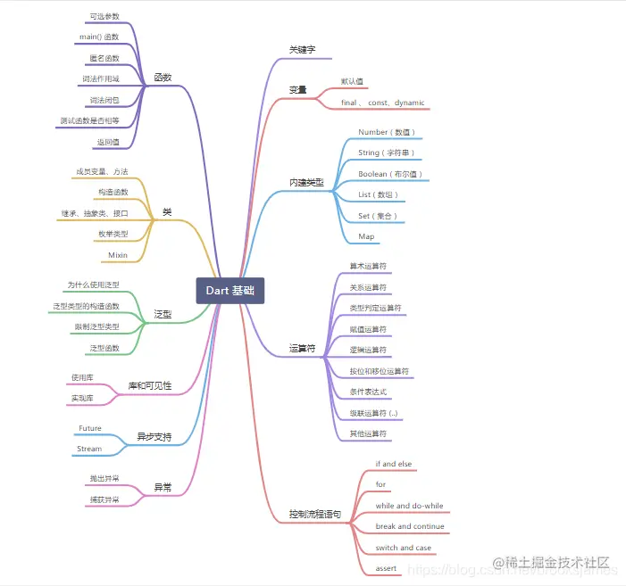
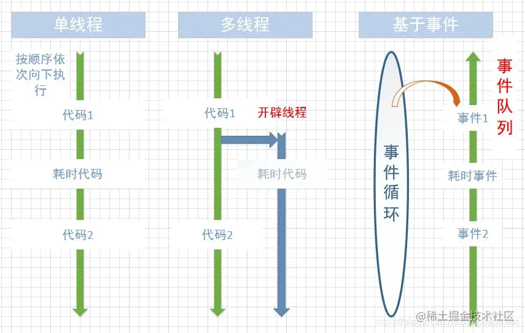
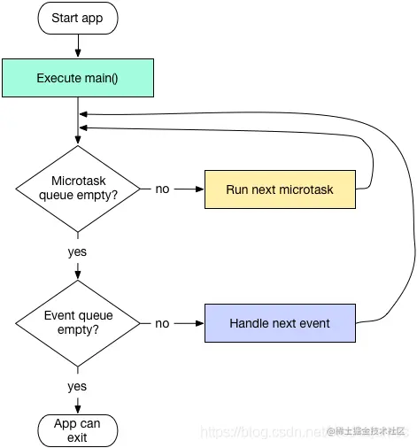
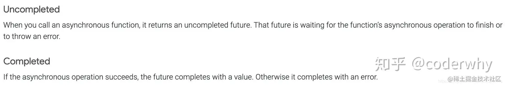
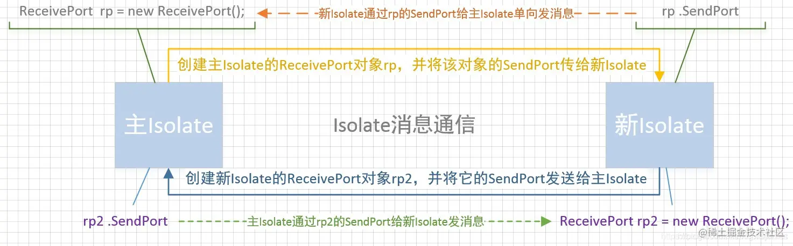
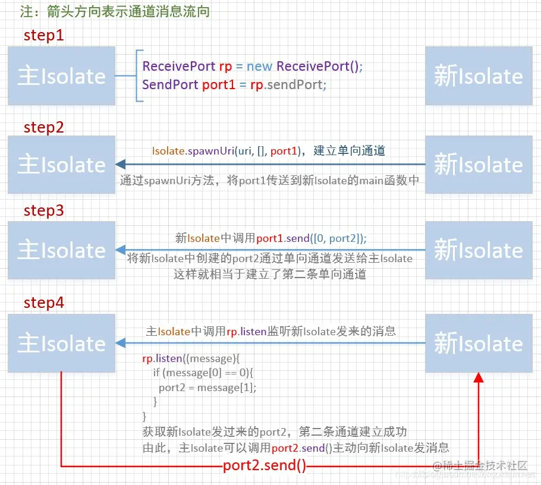

# 一、Dart 基础目录：

## 1.1 思维导图



## 1.2 Dart 基础将分五篇讲解：

<table><thead><tr><th>一</th><th align="left"><a href="https://juejin.cn/post/6928375103780552717" target="_blank" title="https://juejin.cn/post/6928375103780552717">主要讲解关键字、变量、内置类型、操作符、控制流程语句</a></th></tr></thead><tbody><tr><td>二</td><td align="left"><a href="https://juejin.cn/post/6931340267324702733" target="_blank" title="https://juejin.cn/post/6931340267324702733">主要讲解函数</a></td></tr><tr><td>三</td><td align="left"><a href="https://juejin.cn/post/6934661883567800327" target="_blank" title="https://juejin.cn/post/6934661883567800327">主要讲解类</a></td></tr><tr><td>四</td><td align="left"><a href="https://juejin.cn/post/6936901921412382728" target="_blank" title="https://juejin.cn/post/6936901921412382728">主要讲解泛型、库及可见性</a></td></tr><tr><td>五</td><td align="left"><a href="https://juejin.cn/post/6939493546713939982" target="_blank" title="https://juejin.cn/post/6939493546713939982">主要讲解异步支持、异常</a></td></tr></tbody></table>

# 二、Dart 线程模型

编程中的代码执行，通常分为**同步**与**异步**两种。

*   **同步**：  
    简单说，同步就是按照代码的编写顺序，从上到下依次执行，这也是最简单的我们最常接触的一种形式。但是同步代码的缺点也显而易见，如果其中某一行或几行代码非常耗时，那么就会阻塞，使得后面的代码不能被立刻执行。
*   **异步**：  
    异步的出现正是为了解决这种问题，它可以使某部分耗时代码不在当前这条执行线路上立刻执行，那究竟怎么执行呢？最常见的一种方案是使用多线程，也就相当于开辟另一条执行线，然后让耗时代码在另一条执行线上运行，这样两条执行线并列，耗时代码自然也就不能阻塞主执行线上的代码了。

**多线程**虽然好用，但是在大量并发时，仍然存在两个较大的缺陷，一个是开辟线程比较耗费资源，线程开多了机器吃不消，另一个则是线程的锁问题，多个线程操作共享内存时需要加锁，复杂情况下的锁竞争不仅会降低性能，还可能造成死锁。因此又出现了基于事件的异步模型。

　　**异步模型**简单说就是在某个单线程中存在一个事件循环和一个事件队列，事件循环不断的从事件队列中取出事件来执行，这里的事件就好比是一段代码，每当遇到耗时的事件时，事件循环不会停下来等待结果，它会跳过耗时事件，继续执行其后的事件。当不耗时的事件都完成了，再来查看耗时事件的结果。因此，耗时事件不会阻塞整个事件循环，这让它后面的事件也会有机会得到执行。

　　我们很容易发现，这种基于事件的异步模型，只适合 **I/O 密集型**的耗时操作，因为 I/O 耗时操作，往往是把时间浪费在等待对方传送数据或者返回结果，因此这种异步模型往往用于网络服务器并发。如果是**计算密集型**的操作，则应当尽可能利用处理器的多核，实现并行计算。  


## 2.1 单线程的异步操作

  
单线程和异步操作它们并不冲突：

*   因为我们的一个应用程序大部分时间都是处于空闲的状态的，并不是无限制的在和用户进行交互。
*   比如等待用户点击、网络请求数据的返回、文件读写的 IO 操作，这些等待的行为并不会阻塞我们的线程；
*   这是因为类似于网络请求、文件读写的 IO，我们都可以基于非阻塞调用；

如果想搞懂这个点，我们需要知道操作系统中的阻塞式调用和非阻塞式调用的概念。

*   阻塞和非阻塞关注的是**程序在等待调用结果（消息，返回值）时的状态。**
*   **阻塞式调用：** 调用结果返回之前，当前线程会被挂起，调用线程只有在得到调用结果之后才会继续执行。
*   **非阻塞式调用：** 调用执行之后，当前线程不会停止执行，只需要过一段时间来检查一下有没有结果返回即可。

我们用一个生活中的例子来模拟：

*   你中午饿了，需要点一份外卖，点外卖就是我们的调用，拿到外卖就是我们要等待的结果。
*   **阻塞式调用：** 点了外卖，不再做任何事情，就是在傻傻的等待，你的线程停止了任何其他的工作。
*   **非阻塞式调用：** 点了外卖，继续做其他事情：继续工作、打把游戏，你的线程没有继续执行其他事情，只需要偶尔去看一下有没有人敲门，外卖有没有送到即可。

而我们开发中的很多耗时操作，都可以基于这样的非阻塞调用：

*   比如网络请求本身使用了 Socket 通信，而 Socket 本身提供了 select 模型，可以进行`非阻塞方式的工作`；
*   比如文件读写的 IO 操作，我们可以使用操作系统提供的基于事件回调机制；

这些操作都不会阻塞我们单线程的继续执行，我们的线程在等待的过程中可以继续去做别的事情：喝杯咖啡、打把游戏，等真正有了响应，再去进行对应的处理即可。那么，单线程是如何来处理网络通信、IO 操作它们返回的结果呢？  

## 2.2 事件循坏

单线程模型中主要就是在维护着一个事件循环（Event Loop）。  
事件循环是什么呢？

*   事实上事件循环并不复杂，它就是将需要处理的一系列事件（包括点击事件、IO 事件、网络事件）放在一个事件队列（Event Queue）中。
*   不断的从事件队列（Event Queue）中取出事件，并执行其对应需要执行的代码块，直到事件队列清空位置。

我们来写一个事件循环的伪代码：

```dart
// 这里我使用数组模拟队列, 先进先出的原则
List eventQueue = []; 
var event;

// 事件循环从启动的一刻，永远在执行
while (true) {
  if (eventQueue.length > 0) {
    // 取出一个事件
    event = eventQueue.removeAt(0);
    // 执行该事件
    event();
  }
}
```

当我们有一些事件时，比如点击事件、IO 事件、网络事件时，它们就会被加入到`eventLoop`中，当发现事件队列不为空时，就会取出事件，并且执行。  
这里我们来看一段代码，理解点击事件和网络请求的事件是如何被执行的：在按钮 RaisedButton 的 onPressed 函数中，当点击按钮时我们发送了一个网络请求，请求成功后会执行 then 中的回调函数。

```dart
RaisedButton(
  child: Text('Click me'),
  onPressed: () {
    final myFuture = http.get('https://example.com');
    myFuture.then((response) {
      if (response.statusCode == 200) {
        print('Success!');
      }
    });
  },
)
```

这些代码是如何放在事件循环中执行呢？

1.  当用户发生点击的时候，onPressed 回调函数被放入事件循环中执行，执行的过程中发送了一个网络请求。
2.  网络请求发出去后，该事件循环不会被阻塞，在发现要执行的 onPressed 函数已经结束，会将它丢弃掉。
3.  网络请求成功后，会执行 then 中传入的回调函数，这也是一个事件，该事件被放入到事件循环中执行，执行完毕后，事件循环将其丢弃。

尽管 onPressed 和 then 中的回调有一些差异，但是它们对于事件循环来说，都是告诉它：我有一段代码需要执行，快点帮我完成。

## 2.3 Dart 事件循坏

Dart 是事件驱动的体系结构，该结构基于具有**单个事件循环**和**两个队列的单线程执行**模型。  
Dart 在单线程中是以消息循环机制来运行的，其中包含两个任务队列，一个是 “微任务队列” microtask queue，另一个叫做 “事件队列” event queue，从下图中可以发现，微任务队列的执行优先级高于事件队列。Dart 虽然提供调用堆栈，但是事件循环由单个线程支持，因此根本不需要同步和锁定。  



  
**Dart 事件循环执行如上图所示**

1.  如上图中所示，入口函数 main() 执行完后，消息循环机制便启动了。
2.  先查看 MicroTask 队列是否为空，不是则先执行 MicroTask 队列。
3.  一个 MicroTask 任务执行完后，检查有没有下一个 MicroTask 任务，直到 MicroTask 队列为空，才去执行 Event 队列。
4.  在 Evnet 队列取出一个事件处理完后，再次返回第二步，去检查 MicroTask 队列是否为空。

> 注意：我们可以看出，将任务加入到 MicroTask 中可以被尽快执行，但也需要注意，当事件循环在处理 MicroTask 队列时，Event 队列会被卡住，应用程序无法处理鼠标单击、I/O 消息等等事件。

  
但是，在事件任务执行的过程中也可以插入新的微任务和事件任务，在这种情况下，整个线程的执行过程便是一直在循环，不会退出，而 Flutter 中，主线程的执行过程正是如此，永不终止。  
在 Dart 中，所有的外部事件任务都在事件队列中，如 IO、计时器、点击、以及绘制事件等，而微任务通常来源于 Dart 内部，并且微任务非常少，之所以如此，是因为微任务队列优先级高，如果微任务太多，执行时间总和就越久，事件队列任务的延迟也就越久，对于 GUI 应用来说最直观的表现就是比较卡，所以必须得保证微任务队列不会太长。值得注意的是，我们可以通过 Future.microtask(…) 方法向微任务队列插入一个任务。

## 2.4 Dart 执行模型

当你启动一个 Flutter（或任何 Dart）应用时，将创建并启动一个新的线程进程（在 Dart 中为 「Isolate」），该线程将是你在整个应用中唯一需要关注的，所以，此线程创建后，Dart 会自动：

1.  初始化 2 个 FIFO（先进先出）队列（「**MicroTask**」和 「**Event**」）；
2.  并且当该方法执行完成后，执行 **main()** 方法，
3.  启动**事件循环**。

在该线程的整个生命周期中，一个被称为事件循环的单一且隐藏的进程将决定你代码的执行方式及顺序（取决于 MicroTask 和 Event 队列），事件循环是一种无限循环（由一个内部时钟控制），在每个时钟周期内，如果没有其他 Dart 代码执行，则执行以下操作：

```dart
void eventLoop(){
    while (microTaskQueue.isNotEmpty){
        fetchFirstMicroTaskFromQueue();
        executeThisMicroTask();
        return;
    }
 
    if (eventQueue.isNotEmpty){
        fetchFirstEventFromQueue();
        executeThisEventRelatedCode();
    }
}
```

  
正如我们看到的，MicroTask 队列优先于 Event 队列，那这 2 个队列的作用是什么呢？  
MicroTask 队列用于**非常简短且需要异步执行的内部动作**，这些动作需要在其他事情完成之后并在将执行权送还给 Event 队列之前运行，作为 MicroTask 的一个例子，你可以设想必须在资源关闭后立即释放它。由于关闭过程可能需要一些时间才能完成，你可以按照以下方式编写代码：

```dart
MyResource myResource;
 
...
 
void closeAndRelease() {
    scheduleMicroTask(_dispose);
    _close();
}
 
void _close(){
    // 代码以同步的方式运行
    // 以关闭资源
    ...
}
 
void _dispose(){
    // 代码在
    // _close() 方法
    // 完成后执行
}
复制代码
```

这是大多数时候你不必使用的东西。比如，在整个 Flutter 源代码中 scheduleMicroTask() 方法仅被引用了 7 次。  
最好优先考虑使用 Event 队列。  
Event 队列适用于以下参考模型

*   外部事件如
    *   I/O；
    *   手势；
    *   绘图；
    *   计时器；
    *   流；
    *   ……
*   futures

事实上，每次外部事件被触发时，要执行的代码都会被 Event 队列所引用，一旦没有任何 micro task 运行，事件循环将考虑 Event 队列中的第一项并执行它，值得注意的是，**Future 操作也通过 Event 队列处理**。  

### 2.4.1 调度任务

*   将任务添加到 **MicroTask** 队列有两种方法：

1.  使用 **scheduleMicrotask** 方法添加.
2.  使用 **Future** 对象添加.

> **注意**: 以下调用的方法，都定义在 dart:async 库中。

```dart
import 'dart:async';

//我的任务队列
void myTask() {
  print("this is my task");
}

void main() {
  // 1. 使用 scheduleMicrotask 方法添加
  scheduleMicrotask(myTask);

  // 2. 使用Future对象添加
  Future.microtask(myTask);
}
```

*   将任务添加到 Event 队列，使用 Future 对象添加

```dart
import 'dart:async';

//我的任务
void myTask() {
  print("this is my task");
}

void main() {
// 1. 使用Future对象添加
  Future(myTask);
}
```

举个例子验证：

```dart
import 'dart:async';

void main() {

  print('main Start');

   Future((){
    print('this is my task');
  });

   Future.microtask((){
    print('this is microtask');
  });

  print('main Stop');
}

// 运行结果：
main Start
main Stop
this is microtask
this is my task
```

可以看到，代码的运行顺序并不是按照我们的编写顺序来的，将任务添加到队列并不等于立刻执行，它们是异步执行的，当前 main 方法中的代码执行完之后，才会去执行队列中的任务，且 MicroTask 队列运行在 Event 队列之前。  

### 2.4.2 延时任务

如需要将任务延迟执行，则可使用 Future.delayed 方法。

```dart
Future.delayed(new  Duration(seconds:1),(){
    print('task delayed');
});
```

表示在延迟时间到了之后将任务加入到 Event 队列。需要注意的是，这并不是准确的，万一前面有很耗时的任务，那么你的延迟任务不一定能准时运行。

```dart
import 'dart:async';
import 'dart:io';

void main() {
  print("main start");

  Future.delayed(new Duration(seconds: 1), () {
    print('task delayed');
  });

  Future(() {
    // 模拟耗时5秒
    sleep(Duration(seconds: 5));
    print("5s task");
  });

  print("main stop");
}

// 运行结果：
main start
main stop
5s task
task delayed
```

从结果可以看出，**delayed 方法**调用在前面，但是它显然并未**直接将任务加入 Event 队列**，而是需要等待 1 秒之后才会去将任务加入，但在这 1 秒之间，后面的 Future 代码直接将一个耗时任务加入到了 Event 队列，这就直接导致写在前面的 delayed 任务在 1 秒后只能被加入到耗时任务之后，只有当前面耗时任务完成后，它才有机会得到执行。这种机制使得延迟任务变得不太可靠，你无法确定延迟任务到底在延迟多久之后被执行。  

# 三、异步支持

  
Dart 库中包含许多返回 Future 或 Stream 对象的函数. 这些函数在设置完耗时任务（例如 I/O）后， 就立即返回了，不会等待耗任务完成。 使用 async 和 await 关键字实现异步编程， 可以让你像编写同步代码一样实现异步操作。

## 3.1 Future

**Future 是一个异步执行并且在未来的某一个时刻完成（或失败）的任务**, 是对未来结果的一个代理，它返回的并不是被调用的任务的返回值。你可以理解为 Future 就是一个受你委托的委托人，你将未来要执行的任务交给他，并告知他任务类型是耗时任务，还是非耗时任务，然后分类放到事件循环中去，当任务完成后，它会第一时间执行回调方法告知你任务完成，或者会等到你委托给他的所有任务都完成了立马告知你。  
**

### 3.1.1 创建 Future

Future 的几种创建方法 ：  
• Future()  
• Future.microtask()  
• Future.sync()  
• Future.value()  
• Future.delayed()  
• Future.error()  
其中 sync 是同步方法，任务会被立即执行

```dart
import 'dart:async';

void main() {
  print("main start");

  Future.delayed(Duration(seconds: 1), () {
    print("delayed task");
  });
  
  Future.sync(() {
    print("sync task");
  });
  
  Future.microtask(() {
    print("microtask task");
  });
  
  Future(() {
    print("Future task");
  });

  print("main stop");
}

// 运行结果：
main start
sync task
main stop
microtask task
Future task
delayed task
```

### 3.2 Future 状态

事实上 Future 在执行的整个过程中，我们通常把它划分成了两种状态：

**状态一：未完成状态（uncompleted）**

*   执行 Future 内部的操作时，我们称这个过程为未完成状态。

**状态二：完成状态（completed）**

*   当 Future 内部的操作执行完成，通常会返回一个值，或者抛出一个异常。
*   这两种情况，我们都称 Future 为完成状态。

Dart 官网有对这两种状态解析，之所以贴出来是区别于 Promise 的三种状态。  


### 3.3 Future 常用函数

*   **then()** 函数，任务执行完成后会进入 then 函数，能够获取返回的结果；
*   **catchError()** 函数，任务失败时，可以在此捕获异常；
*   **whenComplete()** 函数，任务结束完成后，进入这里；
*   **wait()** 函数，等待多个异步任务执行完成后，再调用 then()；
*   **delayed()** 函数，延迟任务执行；

  
当你实例化一个 Future 时：

*   该 Future 的一个实例被创建并记录在由 Dart 管理的内部数组中；
*   需要由此 Future 执行的代码直接推送到 Event 队列中去；
*   该 future 实例 返回一个状态（= incomplete）；
*   如果存在下一个同步代码，执行它（非 Future 的执行代码）

只要事件循环从 Event 循环中获取它，被 Future 引用的代码将像其他任何 Event 一样执行，当该代码将被执行并将完成（或失败）时，then() 或 catchError() 方法将直接被触发。

为了说明这一点，我们来看下面的例子：

```dart
void main() {
  
  print('Before the Future');
  
  Future(() {
    print('Running the Future');
  }).then((_) {
    print('Future is complete');
  });
  
  Future(() {
    print('Running');
  }).then((_) {
    print('complete');
  });
  
  print('After the Future');
}

// 运行结果
Before the Future
After the Future
Running the Future
Future is complete
Running
complete
```

执行流程如下：

1.  输出 Before the Future；
2.  将 Running the Future 添加到 Event 队列， 将 Running 添加到 Event 队列；
3.  输出 After the Future；
4.  事件循环获取代码并执行它；
5.  当代码执行时，它会查找 then() 语句并执行它；

需要记住一些非常重要的事情：

> **Future** **并非**并行执行，而是遵循**事件循环**处理事件的顺序规则执行，可以再看看创建 Future 的例子。

### 3.4 async 和 await

在 Dart1.9 中加入了 async 和 await 关键字，有了这两个关键字，我们可以更简洁的编写异步代码，而不需要调用 Future 相关的 API。他们允许你像写同步代码一样写异步代码和不需要使用 Future 接口。  
当你使用 async 关键字作为方法声明的后缀时，Dart 会将其理解为：

*   该方法的返回值是一个 Future；
*   它同步执行该方法的代码直到第一个 await 关键字，然后它暂停该方法其他部分的执行；
*   一旦由 await 关键字引用的 Future 执行完成，下一行代码将立即执行。

  
了解这一点是非常重要的，因为很多开发者认为 await 暂停了整个流程直到它执行完成，但事实并非如此。他们忘记了事件循环的运作模式…  
我们先看一个简单的例子：

```dart
Future<String> doTask() async {
  return await Future(() {
    return "Ok";
  });
}

// 定义一个函数用于包装
test() async {
  var r = await doTask();
  print(r);
}

void main() {
  print("main start");
  test();
  print("main end");
}

// 输出结果
main start
main end
Ok
```

如果我们需要顺序输出结果，则需要在 main 方法中添加 async 和 await 关键字。

```dart
Future<String> doTask() async {
  return await Future(() {
    return "Ok";
  });
}

// 定义一个函数用于包装
test() async {
  var r = await doTask();
  print(r);
}

void main() async {
  print("main start");
  await test();
  print("main end");
}

// 输出结果
main start
Ok
main end
```

为了更好地进行说明，让我们通过更复杂的示例并尝试指出其运行的结果：

```dart
main() async {
  methodA();
  await methodB();
  await methodC('main');
  methodD();
}

methodA() {
  print('A');
}

methodB() async {
  print('B start');
  await methodC('B');
  print('B end');
}

methodC(String from) async {
  print('C start from $from');

  Future(() {
    print('C running Future from $from');
  }).then((_) {
    print('C end of Future from $from');
  });

  print('C end from $from');
}

methodD() {
  print('D');
}
```

正确的输出序列为：  
A  
B start  
C start from B  
C end from B  
B end  
C start from main  
C end from main  
D  
C running Future from B  
C end of Future from B  
C running Future from main  
C end of Future from main  
如果你最初希望示例代码中仅在所有代码末尾执行 **methodD()** ，那么你应该按照以下方式编写代码：

```dart
main() async {
  methodA();
  await methodB();
  await methodC('main');
  methodD();
}

methodA() {
  print('A');
}

methodB() async {
  print('B start');
  await methodC('B');
  print('B end');
}

methodC(String from) async {
  print('C start from $from');

  await Future(() {
    print('C running Future from $from');
  }).then((_) {
    print('C end of Future from $from');
  });

  print('C end from $from');
}

methodD() {
  print('D');
}
```

输出序列为：  
A  
B start  
C start from B  
C running Future from B  
C end of Future from B  
C end from B  
B end  
C start from main  
C running Future from main  
C end of Future from main  
C end from main  
D  
事实是通过在 methodC() 中定义 Future 的地方简单地添加 await 会改变整个行，另外，需特别谨记：

> **async** **并非**并行执行，也是遵循**事件循环**处理事件的顺序规则执行。

  
我想向你演示的最后一个例子如下。 运行 **method1** 和 **method2** 的输出是什么？它们会是一样的吗？

```dart
void method1() {
  List<String> myArray = <String>['a', 'b', 'c'];
  print('before loop');
  myArray.forEach((String value) async {
    await delayedPrint(value);
  });
  print('end of loop');
}

void method2() async {
  List<String> myArray = <String>['a', 'b', 'c'];
  print('before loop');
  for (int i = 0; i < myArray.length; i++) {
    await delayedPrint(myArray[i]);
  }
  print('end of loop');
}

Future<void> delayedPrint(String value) async {
  await Future.delayed(Duration(seconds: 1));
  print('delayedPrint: $value');
}
```

答案：

<table><thead><tr><th>method1()</th><th>method2()</th></tr></thead><tbody><tr><td>1. before loop</td><td>1. before loop</td></tr><tr><td>2. end of loop</td><td>2. delayedPrint: a (after 1 second)</td></tr><tr><td>3. delayedPrint: a (after 1 second)</td><td>3. delayedPrint: b (1 second later)</td></tr><tr><td>4. delayedPrint: b (directly after)</td><td>4. delayedPrint: c (1 second later)</td></tr><tr><td>5. delayedPrint: c (directly after)</td><td>5. end of loop (right after)</td></tr></tbody></table>

  
你是否清楚它们行为不一样的区别以及原因呢？  
答案基于这样一个事实，method1 使用 forEach() 函数来遍历数组。每次迭代时，它都会调用一个被标记为 async（因此是一个 Future）的新回调函数。执行该回调直到遇到 await，而后将剩余的代码推送到 Event 队列。一旦迭代完成，它就会执行下一个语句：“print(‘end of loop’)”。执行完成后，事件循环 将处理已注册的 3 个回调。  
对于 method2，所有的内容都运行在一个相同的代码「块」中，因此能够一行一行按照顺序执行（在本例中）, 正如你所看到的，即使在看起来非常简单的代码中，我们仍然需要牢记事件循环的工作方式。  

## 3.2 Stream

如果 Future 表示单个计算的结果，则流是一系列结果，您可以侦听流以获取有关结果（数据和错误）以及流关闭的通知，您还可以在收听流时暂停播放或在流完成之前停止收听。  
Stream 是 Dart 语言中的所谓异步数据序列的东西，简单理解，其实就是一个异步数据队列而已。我们知道队列的特点是先进先出的，Stream 也正是如此。  
更形象的比喻，Stream 就像一个传送带。可以将一侧的物品自动运送到另一侧。如上图，在另一侧，如果没有人去抓取，物品就会掉落消失。  

但如果我们在末尾设置一个监听，当物品到达末端时，就可以触发相应的响应行为。

> 在 Dart 语言中，Stream 有两种类型，一种是点对点的单订阅流（Single-subscription），另一种则是广播流。

### 3.2.1 创建单订阅流 Stream

单一订阅流 最常见的流包含一系列事件，这些事件是较大整体的一部分。事件必须以正确的顺序传递，并且不能丢失任何事件。这是您在读取文件或接收 Web 请求时获得的流。 这样的流只能被收听一次。稍后再次收听可能意味着错过了最初的事件，然后其余部分毫无意义。当您开始收听时，数据将被提取并以块的形式提供。单订阅流的特点是只允许存在一个监听器，即使该监听器被取消后，也不允许再次注册监听器。  
创建一个 Stream 有 9 个构造方法，其中一个是构造广播流的，这里主要看一下其中 5 个构造单订阅流的方法。  
**periodic**

```dart
void main(){
  test();
}
test() async{
  // 使用 periodic 创建流，第一个参数为间隔时间，第二个参数为回调函数
  Stream<int> stream = Stream<int>.periodic(Duration(seconds: 1), callback);
  // await for循环从流中读取
  await for(var i in stream){
    print(i);
  }
}
// 可以在回调函数中对值进行处理，这里直接返回了
int callback(int value){
  return value;
}

// 输出结果：
0
1
2
3
4
...
```

  
该方法从整数 0 开始，在指定的间隔时间内生成一个自然数列，以上设置为每一秒生成一次，`callback`函数用于对生成的整数进行处理，处理后再放入`Stream`中。这里并未处理，直接返回了。要注意，这个流是无限的，它没有任何一个约束条件使之停止。在后面会介绍如何给流设置条件。  
**fromFuture**

```dart
void main(){
  test();
}

test() async{
  print("test start");
  Future<String> fut = Future((){
      return "async task";
  });
  // 从Future创建Stream
  Stream<String> stream = Stream<String>.fromFuture(fut);
  await for(var s in stream){
    print(s);
  }
  print("test end");
}

// 输出结果：
test start
async task
test end
```

  
该方法从一个 Future 创建 Stream，当 Future 执行完成时，就会放入 Stream 中，而后从 Stream 中将任务完成的结果取出。这种用法，很像异步任务队列。  
**fromFutures**  
从多个 Future 创建 Stream，即将一系列的异步任务放入 Stream 中，每个 Future 按顺序执行，执行完成后放入 Stream

```dart
import  'dart:io';
void main() {
  test();
}

test() async {
  print("test start");
  Future<String> fut1 = Future(() {
    // 模拟耗时5秒
    sleep(Duration(seconds:5));
    return "async task1";
  });
  Future<String> fut2 = Future(() {
    return "async task2";
  });
  // 将多个Future放入一个列表中，将该列表传入
  Stream<String> stream = Stream<String>.fromFutures([fut1, fut2]);
  await for (var s in stream) {
    print(s);
  }
  print("test end");
}

// 输出结果：
test start
async task1
async task2
test end
```

**fromIterable**  
该方法从一个集合创建 Stream，用法与上面例子大致相同  

```dart
// 从一个列表创建`Stream`
Stream<int> stream = Stream<int>.fromIterable([1,2,3]);
```

**value** 这是 Dart2.5 新增的方法，用于从单个值创建 Stream  

```dart
test() async{
  Stream<bool> stream = Stream<bool>.value(false);
  // await for循环从流中读取
  await for(var i in stream){
    print(i);
  }
}
```

### 3.2.3 监听单订阅流 Stream

监听 Stream，并从中获取数据也有三种方式，一种就是我们上文中使用的 await for 循环，这也是官方推荐的方式，看起来更简洁友好，除此之外，另两种方式分别是使用 forEach 方法或 listen 方法  

```dart
Stream<int> stream = Stream<int>.periodic(Duration(seconds: 1), callback);
  // 使用forEach，传入一个函数进去获取并处理数据
  stream.forEach((int x){
    print(x);
  });
```

  
使用 listen 监听 >  
StreamSubscription listen(void onData(T event), {Function onError, void onDone(), bool cancelOnError})

```dart
Stream<int> stream = Stream<int>.periodic(Duration(seconds: 1), callback);
  stream.listen((x){
    print(x);
  });
```

  
还可以使用几个可选的参数  

```dart
test() async{
  Stream<int> stream = Stream<int>.periodic(Duration(seconds: 1), callback);
  stream = stream.take(5);
  stream.listen(
    (x)=>print(x),
  onError: (e)=>print(e),
  onDone: ()=>print("onDone"));
}
```

*   onError：发生 Error 时触发
*   onDone：完成时触发
*   unsubscribeOnError：遇到第一个 Error 时是否取消监听，默认为 false

### 3.2.4 Stream 的转换

  
**take 和 takeWhile**  
Stream take(int count) 用于限制 Stream 中的元素数量  

```dart
test() async{
  Stream<int> stream = Stream<int>.periodic(Duration(seconds: 1), callback);
  // 当放入三个元素后，监听会停止，Stream会关闭
  stream = stream.take(3);
  await for(var i in stream){
    print(i);
  }
}
// 输出结果：
0
1
2
```

  
Stream.takeWhile(bool test(T element)) 与 take 作用相似，只是它的参数是一个函数类型，且返回值必须是一个`bool`值  

```dart
stream = stream.takeWhile((x){
    // 对当前元素进行判断，不满足条件则取消监听
    return x <= 3;
  });
```

**skip 和 skipWhile**

```dart
test() async{
  Stream<int> stream = Stream<int>.periodic(Duration(seconds: 1), callback);
  stream = stream.take(5);
  // 表示从Stream中跳过两个元素
  stream = stream.skip(2);
  await for(var i in stream){
    print(i);
  }
}
// 输出结果：
2
3
4
```

  
请注意，该方法只是从 Stream 中获取元素时跳过，被跳过的元素依然是被执行了的，所耗费的时间依然存在，其实只是跳过了执行完的结果而已。  
Stream skipWhile(bool test(T element)) 方法与 takeWhile 用法是相同的，传入一个函数对结果进行判断，表示跳过满足条件的。  
**toList**  
Future<List> toList() 表示将 Stream 中所有数据存储在 List 中

```dart
test() async{
  Stream<int> stream = Stream<int>.periodic(Duration(seconds: 1), callback);
  stream = stream.take(5);
  List <int> data = await stream.toList(); 
  for(var i in data){ 
      print(i);
   } 
}
```

  
**属性 length**  
等待并获取流中所有数据的数量

```dart
test() async{
  Stream<int> stream = Stream<int>.periodic(Duration(seconds: 1), callback);
  stream = stream.take(5);
  var len = await stream.length;
  print(len);
}
```

  
**map**  
我们可以使用 map 方法对流的数据进行遍历，和 listen 的效果类似，例如：

```dart
import 'dart:async';

void main() {
  StreamController controller = StreamController();
  controller.stream.map((data) => data += 1).listen((data) => print(data));
  controller.sink.add(123);
  controller.sink.add(456);
  controller.close();
}

// 输出结果
124
457
```

  
**where**  
我们可以使用 where 对流的数据进行筛选，where 方法接受一个匿名函数作为参数，函数的参数是我们向 sink 中添加的数据，函数的返回值为 true 时，数据才会允许通过，例如：

```dart
import 'dart:async';

void main() {
  StreamController<int> controller = StreamController();

  final whereStream = controller.stream.where((data) => data == 123);
  whereStream.listen((data) => print(data));

  controller.sink.add(123);
  controller.sink.add(456);
  controller.close();
  // output: 123
}

// 输出结果
123
```

上面的代码中，where 条件中定义了数据必须与 123 相同才会被 listen 侦听到，所以向流中添加了 2 条数据，而打印的结果只有 123。  
**expand**  
我们可以使用 expand 扩展现有的流，此方法接受一个方法作为参数，返回值必须是一个 Iterable 类型的数据，例如：

```dart
import 'dart:async';

void main() {
  StreamController controller = StreamController();
  controller.stream
      .expand((data) => [data, data.toDouble()])
      .listen((data) => print(data));
  controller.sink.add(123);
  controller.sink.add(456);
  controller.close();
}
// 输出结果
123
123.0
456
456.0
```

上面的代码中，expand 的回调函数每次返回 list，该 list 包含一个整数及其浮点数，所以最后打印的结果是 4 个数值。  
**transform**  
当我们需要处理更复杂的 Stream 时，我们可以使用 transform 方法，该方法接受一个 StreamTransformer 参数，当我们每次向 sink 中添加数据时，数据会先经过 transform 的处理，例如：

```dart
import 'dart:async';

void main() {
  StreamController controller = StreamController();
  final transformer =
      StreamTransformer<int, String>.fromHandlers(handleData: (value, sink) {
    value == 123 ? sink.add('test success') : sink.addError('test error');
  });
  controller.stream
      .transform(transformer)
      .listen((data) => print(data), onError: (err) => print(err));
  controller.sink.add(123); // output: test success
  controller.sink.add(456); // output: test error
  controller.close();
}
```

上面的代码中，每次向 sink 中添加数据时， StreamTransformer<S,T> 的 fromHandlers 方法就会返回一条新的 Stream，其中 S 代表我们所添加的数据类型，在这里我们添加的是 int 类型，T 代表 handleData 返回的类型，每次 handleData 方法返回的是 String 类型。  
handleData 方法有两个形参，它们分别是 value 与 sink，value 代表我们向 sink 中添加的数据，而 sink 是暴露出来供我们使用的，上面的例子中，我们使用了 sink 的 add 方法以及 addError 方法。  

### 3.2.5 StreamController

它实际上就是 Stream 的一个帮助类，可用于整个 Stream 过程的控制。  

```dart
import 'dart:async';
void main() {
  test();
}
test() async{
  // 创建
  StreamController streamController = StreamController();
  // 放入事件
  streamController.add('element_1');
  streamController.addError("this is error");
  streamController.sink.add('element_2');
  streamController.stream.listen(
    print,
  onError: print,
  onDone: ()=>print("onDone"));
}
```

  
使用该类时，需要导入'dart:async'，其 add 方法和 sink.add 方法是相同的，都是用于放入一个元素，addError 方法用于产生一个错误，监听方法中的 onError 可获取错误。  
还可以在 StreamController 中传入一个指定的 stream  

```dart
test() async{
  Stream<int> stream = Stream<int>.periodic(Duration(seconds: 1), (e)=>e);
  stream = stream.take(5);
  StreamController sc = StreamController();
  // 将 Stream 传入
  sc.addStream(stream);
  // 监听
  sc.stream.listen(
    print,
  onDone: ()=>print("onDone"));
}
```

  
现在来看一下 StreamController 的原型，它有 5 个可选参数  

```dart
factory StreamController(
      {void onListen(),
      void onPause(),
      void onResume(),
      onCancel(),
      bool sync: false})
```

*   onListen 注册监听时回调
*   onPause 当流暂停时回调
*   onResume 当流恢复时回调
*   onCancel 当监听器被取消时回调
*   sync 当值为 true 时表示同步控制器 SynchronousStreamController，默认值为 false，表示异步控制器

```dart
test() async{
  // 创建
  StreamController sc = StreamController(
    onListen: ()=>print("onListen"),
    onPause: ()=>print("onPause"),
    onResume: ()=>print("onResume"),
    onCancel: ()=>print("onCancel"),
    sync:false
  );
  StreamSubscription ss = sc.stream.listen(print);
  sc.add('element_1');
  // 暂停
  ss.pause();
  // 恢复
  ss.resume();
  // 取消
  ss.cancel();
  // 关闭流
  sc.close();
}

// 输出结果
onListen
onPause
onCancel
```

  
因为监听器被取消了，且关闭了流，导致 "element_1" 未被输出，"onResume" 亦未输出

### 3.2.6 广播流

广播流 另一种流是针对可以一次处理的单个消息的。例如，这种流可用于浏览器中的鼠标事件。 您可以随时开始收听这样的流，并且在收听时会触发事件。多个收听者可以同时收听，并且您可以在取消上一个订阅之后稍后再次收听。如下，在普通的单订阅流中调用两次 listen 会报错  

```dart
test() async{
  Stream<int> stream = Stream<int>.periodic(Duration(seconds: 1), (e)=>e);
  stream = stream.take(5);
  stream.listen(print);
  stream.listen(print);
}
```

```dart
Unhandled exception:
Bad state: Stream has already been listened to.
```

  
前面已经说了单订阅流的特点，而广播流则可以允许多个监听器存在，就如同广播一样，凡是监听了广播流，每个监听器都能获取到数据。要注意，如果在触发事件时将监听者正添加到广播流，则该监听器将不会接收当前正在触发的事件。如果取消监听，监听者会立即停止接收事件。  
有两种方式创建广播流，一种直接从 Stream 创建，另一种使用 StreamController 创建  

```dart
test() async{
  // 调用 Stream 的 asBroadcastStream 方法创建
  Stream<int> stream = Stream<int>.periodic(Duration(seconds: 1), (e)=>e)
  .asBroadcastStream();
  stream = stream.take(5);
  stream.listen(print);
  stream.listen(print);
}
```

  
使用 StreamController  

```dart
test() async{
  // 创建广播流
  StreamController sc = StreamController.broadcast();
  sc.stream.listen(print);
  sc.stream.listen(print);
  sc.add("event1");
  sc.add("event2");
}
```

### 3.2.7 StreamTransformer

该类可以使我们在 Stream 上执行数据转换。然后，这些转换被推回到流中，以便该流注册的所有监听器可以接收  
构造方法原型

```dart
factory StreamTransformer.fromHandlers({
      void handleData(S data, EventSink<T> sink),
      void handleError(Object error, StackTrace stackTrace, EventSink<T> sink),
      void handleDone(EventSink<T> sink)
})
```

*   handleData：响应从流中发出的任何数据事件。提供的参数是来自发出事件的数据，以及 EventSink，表示正在进行此转换的当前流的实例
*   handleError：响应从流中发出的任何错误事件
*   handleDone：当流不再有数据要处理时调用。通常在流的 close() 方法被调用时回调

```dart
void test() {
  StreamController sc = StreamController<int>();
  
  // 创建 StreamTransformer对象
  StreamTransformer stf = StreamTransformer<int, double>.fromHandlers(
    handleData: (int data, EventSink sink) {
      // 操作数据后，转换为 double 类型
      sink.add((data * 2).toDouble());
    }, 
    handleError: (error, stacktrace, sink) {
      sink.addError('wrong: $error');
    }, 
    handleDone: (sink) {
      sink.close();
    },
  );
  
  // 调用流的transform方法，传入转换对象
  Stream stream = sc.stream.transform(stf);
  stream.listen(print);
  // 添加数据，这里的类型是int
  sc.add(1);
  sc.add(2); 
  sc.add(3); 
  
  // 调用后，触发handleDone回调
  // sc.close();
}

// 输出结果：
2.0
4.0
6.0
```

# 四、多进程

Dart 是单线程的异步模型，那么我们在 Dart 中能否并行运行代码？如果在多核 CPU 中，单线程是不是就没有充分利用 CPU 呢？这就需要靠 Isolate 了。

## 4.1 Isolate

大多数计算机中，甚至在移动平台上，都在使用多核 CPU。 为了有效利用多核性能，开发者一般使用共享内存数据来保证多线程的正确执行。 然而， 多线程共享数据通常会导致很多潜在的问题，并导致代码运行出错。  
Dart 是基于单线程模型的语言。在 Dart 中也有自己的进程机制 – isolate，在 Dart 中，所有 Dart 代码都在_隔离区_（ isolates ）内运行，而不是线程， 每个隔离区都有自己的内存堆，确保每个隔离区的状态都不会被其他隔离区访问。我们已经知道 Dart 是单线程的，这个线程有自己可以访问的内存空间以及需要运行的事件循环，我们可以将这个空间系统称之为是一个 Isolate，比如 Flutter 中就有一个 Root Isolate，负责运行 Flutter 的代码，比如 UI 渲染、用户交互等等。**Isolate 之间不共享任何资源** **，因此也不存在锁竞争问题，****只能依靠消息机制通信****，因此也就没有资源抢占问题。  
如果在开发中，将非常耗时的任务添加到事件队列后，仍然会拖慢整个事件循环的处理，甚至是阻塞。可见基于事件循环的异步模型仍然是有很大缺点的，这时候我们就需要 Isolate 了，那么如何创建 Isolate 呢？  

创建 Isolate 从主 Isolate 创建一个新的 Isolate  
**spawnUri**

```dart
static Future<Isolate> spawnUri()
```

spawnUri 方法有三个必须的参数:

*   第一个是 Uri，指定一个新 Isolate 代码文件的路径，
*   第二个是参数列表，类型是 List，
*   第三个是动态消息。

  
需要注意，用于运行新 Isolate 的代码文件中，必须包含一个 main 函数，它是新 Isolate 的入口方法，该 main 函数中的 args 参数列表，正对应 spawnUri 中的第二个参数。如不需要向新 Isolate 中传参数，该参数可传空 List。  
主 Isolate 中的代码：

```dart
import 'dart:isolate'; 

void main() {
  print("main isolate start");
  create_isolate();
  print("main isolate stop");
}

// 创建一个新的 isolate
create_isolate() async{
  ReceivePort rp = new ReceivePort();
  SendPort port1 = rp.sendPort;
  Isolate newIsolate = await Isolate.spawnUri(new Uri(path: "./other_task.dart"), ["hello, isolate", "this is args"], port1);
  SendPort port2;
  rp.listen((message){
    print("main isolate message: $message");
    if (message[0] == 0){
      port2 = message[1];
    }else{
      port2?.send([1,"这条信息是 main isolate 发送的"]);
    }
  });
  // 可以在适当的时候，调用以下方法杀死创建的 isolate
  // newIsolate.kill(priority: Isolate.immediate);
}
```

创建 other_task.dart 文件，编写新 Isolate 的代码

```dart
import 'dart:isolate';
import  'dart:io';


void main(args, SendPort port1) {
  print("isolate_1 start");
  print("isolate_1 args: $args");

  ReceivePort receivePort = new ReceivePort();
  SendPort port2 = receivePort.sendPort;

  receivePort.listen((message){
    print("isolate_1 message: $message");
  });

  // 将当前 isolate 中创建的SendPort发送到主 isolate中用于通信
  port1.send([0, port2]);
  // 模拟耗时5秒
  sleep(Duration(seconds:5));
  port1.send([1, "isolate_1 任务完成"]);

  print("isolate_1 stop");
}
```

运行主 Isolate 的结果：

```dart
main isolate start
main isolate stop
isolate_1 start
isolate_1 args: [hello, isolate, this is args]
main isolate message: [0, SendPort]
isolate_1 stop
main isolate message: [1, isolate_1 任务完成]
isolate_1 message: [1, 这条信息是 main isolate 发送的]
```

  
**spawn**

```dart
static Future<Isolate> spawn()
```

spawn 方法有两个必须的参数:

*   第一个是需要运行在新 Isolate 的耗时函数
*   第二个是动态消息，该参数通常用于传送主 Isolate 的 SendPort 对象。

  
除了使用 spawnUri，更常用的是使用 spawn 方法来创建新的 Isolate，我们通常希望将新创建的 Isolate 代码和 main Isolate 代码写在同一个文件，且不希望出现两个 main 函数，而是将指定的耗时函数运行在新的 Isolate，这样做有利于代码的组织和代码的复用。  
spawn 的用法与 spawnUri 相似，且更为简洁，将上面例子稍作修改如下：

```dart
import 'dart:isolate'; 
import  'dart:io';

void main() {
  print("main isolate start");
  create_isolate();
  print("main isolate end");
}

// 创建一个新的 isolate
create_isolate() async{
  ReceivePort rp = new ReceivePort();
  SendPort port1 = rp.sendPort;

  Isolate newIsolate = await Isolate.spawn(doWork, port1);

  SendPort port2;
  rp.listen((message){
    print("main isolate message: $message");
    if (message[0] == 0){
      port2 = message[1];
    }else{
      port2?.send([1,"这条信息是 main isolate 发送的"]);
    }
  });
}

// 处理耗时任务
void doWork(SendPort port1){
  print("new isolate start");
  ReceivePort rp2 = new ReceivePort();
  SendPort port2 = rp2.sendPort;

  rp2.listen((message){
    print("doWork message: $message");
  });

  // 将新isolate中创建的SendPort发送到主isolate中用于通信
  port1.send([0, port2]);
  // 模拟耗时5秒
  sleep(Duration(seconds:5));
  port1.send([1, "doWork 任务完成"]);

  print("new isolate end");
}
```

运行结果：

```dart
main isolate start
main isolate end
new isolate start
main isolate message: [0, SendPort]
new isolate end
main isolate message: [1, doWork 任务完成]
doWork message: [1, 这条信息是 main isolate 发送的]
```

无论是上面的 spawn 还是 spawnUri，运行后都会创建两个进程，一个是主 Isolate 的进程，一个是新 Isolate 的进程，两个进程都双向绑定了消息通信的通道，即使新的 Isolate 中的任务完成了，它的进程也不会立刻退出，因此，当使用完自己创建的 Isolate 后，最好调用 newIsolate.kill(priority: Isolate.immediate); 将 Isolate 立即杀死。  

## 4.2 Isolate 通信机制

  
在真实开发中，我们不会只是简单的开启一个新的 Isolate，而不关心它的运行结果：

*   我们需要新的 Isolate 进行计算，并且将计算结果告知 Main Isolate（也就是默认开启的 Isolate）；
*   Isolate 通过发送管道（SendPort）实现消息通信机制；
*   我们可以在启动并发 Isolate 时将 Main Isolate 的发送管道作为参数传递给它；
*   并发在执行完毕时，可以利用这个管道给 Main Isolate 发送消息； 

整个消息通信过程如上图所示：

两个 Isolate 是通过两对 Port 对象通信，一对 Port 分别由用于接收消息的 ReceivePort 对象，和用于发送消息的 SendPort 对象构成。其中 SendPort 对象不用单独创建，它已经包含在 ReceivePort 对象之中。需要注意，一对 Port 对象只能单向发消息，这就如同一根自来水管，ReceivePort 和 SendPort 分别位于水管的两头，水流只能从 SendPort 这头流向 ReceivePort 这头。因此，两个 Isolate 之间的消息通信肯定是需要两根这样的水管的，这就需要两对 Port 对象。  
理解了 Isolate 消息通信的原理，那么在 Dart 代码中，具体是如何操作的呢？  


  
ReceivePort 对象通过调用 listen 方法，传入一个函数可用来监听并处理发送来的消息。SendPort 对象则调用 send() 方法来发送消息。send 方法传入的参数可以是 null,num, bool, double,String, List ,Map 或者是自定义的类。

## 4.3 在 FLutter 创建 Isolate

无论如何，在 Dart 中创建一个 Isolate 都显得有些繁琐，可惜的是 Dart 官方并未提供更高级封装。但是，如果想在 Flutter 中创建 Isolate，则有更简便的 API，这是由 Flutter 官方进一步封装 ReceivePort 而提供的更简洁 API。如果你只需要运行一些代码来完成一些特定的工作，并且在工作完成之后不需要与 **Isolate** 进行交互，那么这里有一个非常方便的称为 [compute](https://link.juejin.cn?target=https%3A%2F%2Fdocs.flutter.io%2Fflutter%2Ffoundation%2Fcompute.html "https://docs.flutter.io/flutter/foundation/compute.html") 的 **Helper**。  
主要包含以下功能：

*   产生一个 **Isolate**，
*   在该 isolate 上运行一个**回调函数**，并传递一些数据，
*   返回回调函数的处理结果，
*   回调执行后终止 **Isolate**。

> 注意：下面的代码不是 dart 的 API，而是 Flutter 的 API，所以只有在 Flutter 项目中才能运行

```dart
import 'package:flutter/foundation.dart';
import  'dart:io';

// 创建一个新的Isolate，在其中运行任务doWork
create_new_task() async{
  var str = "New Task";
  var result = await compute(doWork, str);
  print(result);
}


void doWork(String value){
  print("new isolate doWork start");
  // 模拟耗时5秒
  sleep(Duration(seconds:5));

  print("new isolate doWork end");
  return "complete:$value";
}
```

  
compute 函数有两个必须的参数，第一个是待执行的函数，这个函数必须是一个**顶级函数**，不能是类的实例方法，可以是类的静态方法，第二个参数为动态的消息类型，可以是被运行函数的参数。  
需要注意，使用 compute 应导入'package:flutter/foundation.dart'包。  

## 4.4 Isolate 使用场景

Isolate 虽好，但也有合适的使用场景，不建议滥用 Isolate，应尽可能多的使用 Dart 中的事件循环机制去处理异步任务，这样才能更好的发挥 Dart 语言的优势。  
那么应该在什么时候使用 Future，什么时候使用 Isolate 呢？ 一个最简单的判断方法是根据某些任务的平均时间来选择： 方法执行在几毫秒或十几毫秒左右的，应使用 Future，如果一个任务需要几百毫秒或之上的，则建议创建单独的 Isolate。  
除此之外，还有一些可以参考的场景  
• JSON 解码  
• 加密  
• 图像处理：比如剪裁  
• 网络请求：加载资源、图片  

# 五、异常

在介绍异常捕获之前必须先了解一下 Dart 单线程模型，只有了解了 Dart 的代码执行流程，我们才能知道该在什么地方去捕获异常。  
在 Java 和 Objective-C（以下简称 “OC”）中，如果程序发生异常且没有被捕获，那么程序将会终止，但是这在 Dart 或 JavaScript 中则不会！究其原因，这和它们的运行机制有关系。Java 和 OC 都是多线程模型的编程语言，任意一个线程触发异常且该异常未被捕获时，就会导致整个进程退出。但 Dart 和 JavaScript 不会，它们都是单线程模型, 在事件循环中，当某个任务发生异常并没有被捕获时，程序并不会退出，而直接导致的结果是当前任务的后续代码就不会被执行了，也就是说一个任务中的异常是不会影响其它任务执行的。

Dart 代码可以抛出和捕获异常。 异常表示一些未知的错误情况。 如果异常没有被捕获， 则异常会抛出， 导致抛出异常的代码终止执行。  
和 Java 有所不同， Dart 中的所有异常是非检查异常。 方法不会声明它们抛出的异常， 也不要求捕获任何异常。

Dart 提供了 [Exception](https://link.juejin.cn?target=https%3A%2F%2Fapi.dartlang.org%2Fstable%2Fdart-core%2FException-class.html "https://api.dartlang.org/stable/dart-core/Exception-class.html") 和 [Error](https://link.juejin.cn?target=https%3A%2F%2Fapi.dartlang.org%2Fstable%2Fdart-core%2FError-class.html "https://api.dartlang.org/stable/dart-core/Error-class.html") 类型， 以及一些子类型。 当然也可以定义自己的异常类型。 但是，此外 Dart 程序可以抛出任何非 null 对象， 不仅限 Exception 和 Error 对象。  

## 5.1 抛出异常

下面是关于抛出或者 引发 异常的示例：

```dart
throw FormatException('Expected at least 1 section');
```

也可以抛出任意的对象：

```dart
throw 'Out of llamas!';
```

> 提示： 高质量的生产环境代码通常会实现 [Error](https://link.juejin.cn?target=https%3A%2F%2Fapi.dartlang.org%2Fstable%2Fdart-core%2FError-class.html "https://api.dartlang.org/stable/dart-core/Error-class.html") 或 [Exception](https://link.juejin.cn?target=https%3A%2F%2Fapi.dartlang.org%2Fstable%2Fdart-core%2FException-class.html "https://api.dartlang.org/stable/dart-core/Exception-class.html") 类型的异常抛出。

因为抛出异常是一个表达式， 所以可以在 => 语句中使用，也可以在其他使用表达式的地方抛出异常：

```dart
void distanceTo(Point other) => throw UnimplementedError();
```

## 5.2 捕获同步异常

Dart 中同步异常可以通过 try/on/catch/finally 来捕获代码块异常，可以通过 throw 关键字用来明确地抛出异常。  
捕获异常可以避免异常继续传递（除非重新抛出（ rethrow ）异常）。 可以通过捕获异常来处理该异常：

```dart
try {
  breedMoreLlamas();
} on OutOfLlamasException {
  buyMoreLlamas();
}
```

  
通过指定多个 catch 语句，可以处理可能抛出多种类型异常的代码。 与抛出异常类型匹配的第一个 catch 语句处理异常。 如果 catch 语句未指定类型， 则该语句可以处理任何类型的抛出对象：

```dart
try {
  breedMoreLlamas();
} on OutOfLlamasException {
  // 一个特殊的异常
  buyMoreLlamas();
} on Exception catch (e) {
  // 其他任何异常
  print('Unknown exception: $e');
} catch (e) {
  // 没有指定的类型，处理所有异常
  print('Something really unknown: $e');
}
```

  
如上述代码所示，捕获语句中可以同时使用 on 和 catch ，也可以单独分开使用。 使用 on 来指定异常类型， 使用 catch 来 捕获异常对象。  
catch() 函数可以指定 1 到 2 个参数， 第一个参数为抛出的异常对象， 第二个为堆栈信息 ( 一个 [StackTrace](https://link.juejin.cn?target=https%3A%2F%2Fapi.dartlang.org%2Fstable%2Fdart-core%2FStackTrace-class.html "https://api.dartlang.org/stable/dart-core/StackTrace-class.html") 对象 )。

```dart
try {
  // ···
} on Exception catch (e) {
  print('Exception details:\n $e');
} catch (e, s) {
  print('Exception details:\n $e');
  print('Stack trace:\n $s');
}
```

如果仅需要部分处理异常， 那么可以使用关键字 rethrow 将异常重新抛出。

```dart
void misbehave() {
  try {
    dynamic foo = true;
    print(foo++); // Runtime error
  } catch (e) {
    print('misbehave() partially handled ${e.runtimeType}.');
    rethrow; // Allow callers to see the exception.
  }
}

void main() {
  try {
    misbehave();
  } catch (e) {
    print('main() finished handling ${e.runtimeType}.');
  }
}
```

try-catch 代码块不能捕获到异步异常，使用 await 关键字声明的同步调用，属于同步异常范围，可以通过 try-catch 捕获。

```dart
try {
  version = await lookUpVersion();
} catch (e) {
  // React to inability to look up the version
}
```

## 5.3 捕获异步异常

使用 catchError 捕获异步异常，第一个参数为 Function error 类型，第二个参数为 {bool test(Object error)}，是一个判断表达式，当此表达式返回值为 true 时，表示需要执行 catch 逻辑，如果返回 false，则不执行 catch 逻辑，即会成为未捕获的异常，默认不传时 认为是 true。  
这里的作用是可以精细化的处理异常，可以理解为同步异常中强化版的 on 关键字，  
入参至多两个 分别为 error 和 stack，均可选。

```dart
Future(() {
}).then((value){

}).catchError((error, stack) {

});

Future.delayed(Duration(seconds: 1)).then((e) => Future.error("xxx"));
```

## 5.4 finally

不管是否抛出异常， finally 中的代码都会被执行。 如果 catch 没有匹配到异常， 异常会在 finally 执行完成后，再次被抛出：

```dart
try {
  breedMoreLlamas();
} finally {
  // Always clean up, even if an exception is thrown.
  cleanLlamaStalls();
}
```

  
任何匹配的 catch 执行完成后，再执行 finally ：

```dart
try {
  breedMoreLlamas();
} catch (e) {
  print('Error: $e'); // Handle the exception first.
} finally {
  cleanLlamaStalls(); // Then clean up.
}
```

更多详情，请参考 [Exceptions](https://link.juejin.cn?target=https%3A%2F%2Fwww.dartcn.com%2Fguides%2Flibraries%2Flibrary-tour%23exceptions "https://www.dartcn.com/guides/libraries/library-tour#exceptions") 章节。

  
**参考资料：**

1.  [Dart 中文官网](https://link.juejin.cn?target=https%3A%2F%2Fwww.dartcn.com%2Fguides%2Flanguage%2Flanguage-tour "https://www.dartcn.com/guides/language/language-tour")
2.  [【dart 学习】-- Dart 之异步编程](https://link.juejin.cn?target=https%3A%2F%2Fwww.cnblogs.com%2Flxlx1798%2Fp%2F11126564.html "https://www.cnblogs.com/lxlx1798/p/11126564.html")
3.  [Flutter(五) 之彻底搞懂 Dart 异步](https://link.juejin.cn?target=https%3A%2F%2Fzhuanlan.zhihu.com%2Fp%2F83781258 "https://zhuanlan.zhihu.com/p/83781258")
4.  [[译] Flutter 异步编程：Future、Isolate 和事件循环](https://juejin.cn/post/6844903796334673933 "https://juejin.cn/post/6844903796334673933")
5.  [Dart 语言 Stream 详解](https://link.juejin.cn?target=https%3A%2F%2Fblog.csdn.net%2Fyingshukun%2Farticle%2Fdetails%2F100855253 "https://blog.csdn.net/yingshukun/article/details/100855253")
6.  [Flutter Dart 回顾 —— 异常捕获、抛出](https://link.juejin.cn?target=https%3A%2F%2Fwww.cnblogs.com%2Flulushen%2Fp%2F14142510.html "https://www.cnblogs.com/lulushen/p/14142510.html")