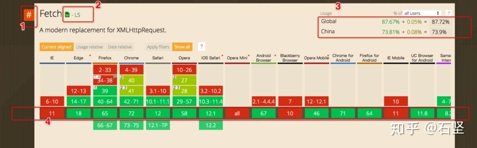
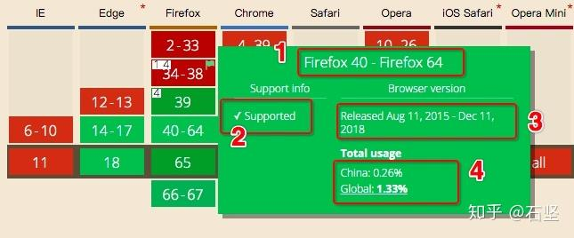

# Caniuse

## 困惑

相信大家都曾用 caniuse 网站查询过 css、js 的一些兼容性问题，并且都从它反馈的兼容性数据中获益，让我们的线上项目更加稳定、和谐的跑在用户电脑里。不过对于 caniuse 页面上的一些细节，我们可能会感到困惑或者模棱两可，今天就带着大家一起来重新认识 caniuse 这个网站，并对它的原理和细节做些探究。

## 1.1 从 babel-preset-env 说起

babel-preset-env 是 babel6 中极力推崇的一个 preset，preset 代表的是 babel plugins 的一个集合，相当于一堆 plugins 的一个统称。在 babel 最开始打江山的时候，es6 标准也发布不久，babelrc 的配置中只需要添加 es2015 这样的 preset。但随着 es2016、es2017 的相继出现，babelrc 很快就会变成一堆挂历式的集合体。所以 babel 给出了 env 这个杀器，既避免了 es20xx 的出现，又可以与 caniuse 的权威数据融合，让配置 preseet 科学而简单。

```
{
  "presets": [
    ["env", {
      "targets": {
        "browsers": ["last 2 versions", "safari >= 7"]
      }
    }]
  ]
}
```

这是 babel 官网给出的 env 配置方案，"last 2 versions", "safari >= 7"，这两个条件是并集的关系，babel 将会分别给出满足这两个条件的浏览器及版本，并会进行合并，最后算出一组浏览器及对应最低版本的数据。

babel 是用来转换 js 语法的一个编译器，为什么还能知道满足 env 条件的浏览器跟版本，这要从 browserslist 这个库说起。

## 1.2 Browserslist

这个库不仅仅用在 babel-preset-env 中，像 autoprefixer 这样知名的库，也是用到了它。

```
last 1 version
> 1%
maintained node versions
not dead
```

browserslist 能够把上面近似于人类语言的配置，转换成一组浏览器集合。不过它的主要职责就是转化上面的配置内容，按照正则过滤出正确浏览器列表内容，而它本身不提供浏览器列表的来源。

## 1.3 caniuse-lite

Browserslist 的浏览器数据来源就是这个 caniuse-lite，而它是 caniuse-db 库的精简版本，是从 caniuse-db 库衍化而来，只不过对 caniuse-db 数据按照一定规则做了简化，使得库的大小减少了许多，并且提供一些查询 api 供他人使用，每当 caniuse-db 更新时，也会跟着一起发布版本。

## 1.4 caniuse-db

caniuse 的 npm 包，提供了 caniuse 网站查询所需的所有数据。

## 2.caniuse 库的介绍

caniuse-db 的 github 地址[在此](https://link.zhihu.com/?target=https%3A//github.com/Fyrd/caniuse)，caniuse 鼓励大家去 [github](https://link.zhihu.com/?target=https%3A//github.com/Fyrd/caniuse) 上提交 pr，经过审核之后就可以被录用到它的官方数据库中。

## 2.1 如何为 caniuse 贡献数据

首先，它为我们准备了 [sample-data.json](https://link.zhihu.com/?target=https%3A//github.com/Fyrd/caniuse/blob/master/sample-data.json) 文件，按照此文件格式把需要增加的特性名称、介绍和浏览器兼容性情况填写清楚，保存并放到 [features-json](https://link.zhihu.com/?target=https%3A//github.com/Fyrd/caniuse/tree/master/features-json) 文件夹中，最后提交 pull request 即可，审核完毕后会自动把这部分新增特性保存到 [data.json](https://link.zhihu.com/?target=https%3A//github.com/Fyrd/caniuse/blob/master/data.json) 中。data.json 就是 caniuse 官方的数据库导出文件，供其他库调用，每次 json 文件变化后，都会 release 一个新版本。

## 2.2 sample-data.json

作为新特性发布的样本文件，内容如下：

```
{
  "title":"Sample title",
  "description":"Sample description",
  "spec":"http://example.com/path/to/spec.html",
  "status":"wd",
  "links":[
    {
      "url":"http://example.com/path/to/link.html",
      "title":"Link title"
    }
  ],
  "bugs":[
    {
      "description":"Sample bug description"
    }
  ],
  "categories":[
    "CSS"
  ],
  "stats":{
    "ie":{
      ...
      "11":"u"
    },
    "edge":{
      ...
      "18":"u"
    },
    "firefox":{
      ...
      "67":"u"
    },
    "chrome":{
      ...
      "75":"u"
    },
    "safari":{
      ...
      "TP":"u"
    },
    "opera":{
      ...
      "58":"u"
    },
    "ios_saf":{
      ...
      "12.2":"u"
    },
    "op_mini":{
      "all":"u"
    },
    "android":{
      ...
      "67":"u"
    },
    "bb":{
      "7":"u",
      "10":"u"
    },
    "op_mob":{
      ...
      "46":"u"
    },
    "and_chr":{
      "71":"u"
    },
    "and_ff":{
      "64":"u"
    },
    "ie_mob":{
      ...
      "11":"u"
    },
    "and_uc":{
      "11.8":"u"
    },
    "samsung":{
      ...
      "8.2":"u"
    },
    "and_qq":{
      "1.2":"u"
    },
    "baidu":{
      "7.12":"u"
    }
  },
  "notes":"Sample notes for feature, explain partial support here",
  "notes_by_num":{
    "1":"First note..."
  },
  "usage_perc_y":0,
  "usage_perc_a":0,
  "ucprefix":false,
  "parent":"parentfeatureid",
  "keywords":"example,keywords",
  "shown":false,
  "ie_id":"",
  "chrome_id":"",
  "firefox_id":"",
  "webkit_id":""
}
```

简要介绍下其中的几个关键字段：

（1）title：特性名称

（2）description：特性介绍（搜索时的关键字）

（3）spec：跳转到详细介绍页面

（4）links：拓展内容介绍

（5）keywords：搜索时的关键字

（6）status：特性在标准中的状态

- ls - 标准
- rec - W3C 推荐
- pr - W3C 建议
- cr - W3C 候选
- wd - W3C 手稿
- other - 非 W3C, 但流行的
- unoff - 非官方

（7）categories：分类

- HTML5
- CSS
- CSS2
- CSS3
- SVG
- PNG
- JS API
- Canvas
- DOM
- Other
- JS
- Security

从上面分类可以看出，caniuse 并不只是一个查询 css 兼容性的网站。

如果想查看目前 caniuse 已经支持了多少种特性，以及特性对应的分组信息，可以点击这个[网址](https://link.zhihu.com/?target=https%3A//caniuse.com/%23index)。

（8）stats：浏览器对特性的支持情况

- y - (Y)es, supported by default 完全支持
- a - (A)lmost supported (aka Partial support) 部分支持
- n - (N)o support, or disabled by default 不支持
- p - No support, but has (P)olyfill 不支持，但有替代方案
- u - Support (u)nknown 未知
- x - Requires prefi(x) to work 需要加前缀
- d - (D)isabled by default (need to enable flag or something) 需要打 flag
- '#n' - Where n is a number, starting with 1, corresponds to the notes_by_num note. 支持，请看介绍第 n 条

（9）stats：浏览器列表

- ie
- edge
- firefox
- chrome
- safari
- opera
- ios_saf
- op_mini
- android
- bb
- op_mob
- and_chr
- and_ff
- ie_mob
- and_uc
- samsung
- and_qq
- baidu

以上浏览器列表是固定的，用户不能增加和缺少某个浏览器类型。

> 总结

每当增加一个新特性时，都要对以上浏览器列表以及对应版本列表进行实测，特性的测试可使用以下两个官方推荐的网站 [https://www.browserstack.com](https://link.zhihu.com/?target=https%3A//www.browserstack.com) 和 [http://saucelabs.com](https://link.zhihu.com/?target=http%3A//saucelabs.com)。

对于第二个网站，可用于因浏览器兼容性造成生产事故的还原测试，在其网站的虚拟机内完成特定浏览器特定版本的实测，在测试完成后可以观看操作视频，并支持导出功能，这对技术解决兼容性问题，提供了第一现场的操作流程，方便问题的解决。

## 3.caniuse 网站介绍

## 3.1 主页面介绍



页面红字标注了 4 个地方

（1）代表了这个介绍框的内容隶属于一个特性，也就是我们在 [features-json](https://link.zhihu.com/?target=https%3A//github.com/Fyrd/caniuse/tree/master/features-json) 看到的一个个跟特性相关的文件，没有 #标志的不属于特性。

（2）代表这个特性在标准中所处的一个状态, 具体参照前文对 sample-data.json 的介绍

（3）对于这个特性，在全球、中国所有浏览器中，分别有多少完全支持和部分支持，把两部分值加起来，得到总份额。

（4）浏览器基线，代表对应浏览器 current 状态的版本号。基线往上是该浏览器的低版本，并对相同支持情况的版本进行合并。基线往下是未来的三个版本，并进行状态合并。

## 3.2 浏览器信息统计

caniuse 关于浏览器的数据，主要都来源于 [statcounter](https://link.zhihu.com/?target=http%3A//gs.statcounter.com/)，此网站统计了全球以及各国的浏览器使用情况。

上面提到的浏览器基线及版本号列表，都是基于 [statcounter](https://link.zhihu.com/?target=http%3A//gs.statcounter.com/) 上个月份的数据统计。 例如 chrome v73 在 3 月 12 号发布了版本，但在 caniuse 网站里，v72 还是作为了 current 版本，就是因为 caniuse 的分析数据来源于 2 月份的统计数据，数据并不是实时更新。

## 3.3 详情

页面红字标注了 4 个地方



（1）浏览器对特性支持情况相同的版本区间

（2）对特性的支持情况

（3）火狐 40 - 火狐 64 的发布时间

（4）火狐 40 - 火狐 64，在全球、中国的使用份额

4. 想法

---

知道了 caniuse 的数据来源及原理之后，我们是否可以打造属于自己公司的 caniuse，暂且就叫做 caniuse-shein

（1） 目前，我司的前端只负责中后台系统，面向的用户群体有限。 而我手头上有一个专门为公司前端而打造的 APM 项目，里面包含了详尽的浏览器版本及份额数据，将 APM 项目中的浏览器数据与 caniuse 的特性数据相结合，可以制作出类似于 caniuse 官网的特性查询分析页面，但报表数据只关心我司的用户群里使用的浏览器，而非依据全球或者全国。

（2） babel-preset-env 这个插件也可以结合 caniuse-shein 的数据，给出对应浏览器份额的 babel 插件列表
