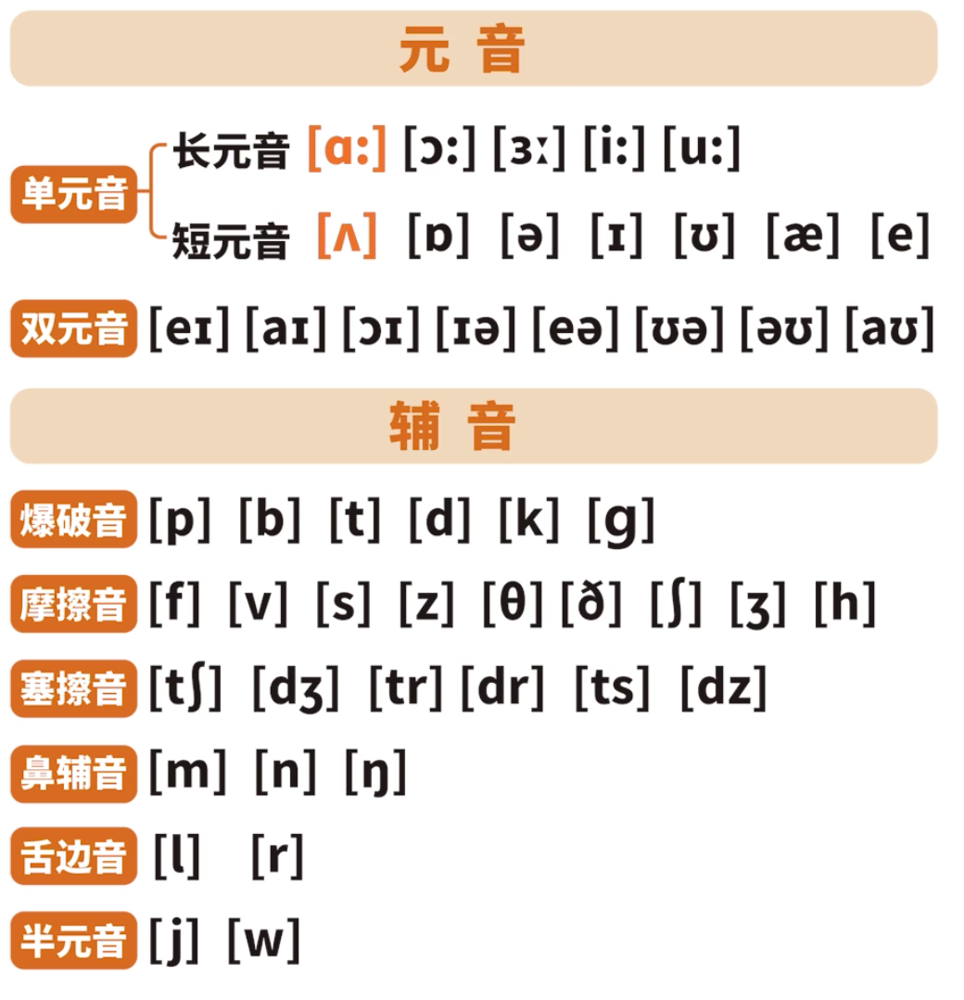

# Lesson0 音标

自然拼读的优势和好处在于什么呢？它把字母和音建立起来了关联，而不像音标是独立的，只是告诉你这个单词的音标是这么写的。可是自然拼读把字母和音之间建立起来关联非常非常的稳固的，非常有体系的告诉你，这样就可以帮助大家很好的去拼读单词了。那据统计，自然拼读是可以帮助我们拼读生活当中所常见的 86. 7% 的单词的，也就意味着说剩下那 13. 3% 的词才是需要通过记忆的方式去学习的，其他的符合读音规则的词都是可以使用自然拼读来搞定的。所以期待大家学完自然拼读，能够很快的实现自己拼读一个单词的能力。

[国际音标发音表](https://en-yinbiao.xiao84.com/yinbiaofayin/)

## 音标速记

[B 站视频速记](https://www.bilibili.com/video/BV1Ms4y1v7DF/?spm_id_from=333.337.search-card.all.click&vd_source=a0356549cad18edc5a7ce95b0f3205f1)

### 元音速记

#### 单元音

大叫一声[a:] [a:] [a:] 尖角扎人 [ʌ] [ʌ] [ʌ]  
恍然大悟[ɔ:] [ɔ:] [ɔ:] 半边圆圈 [ɔ] [ɔ] [ɔ]  
3 天没吃 [ə:] [ə:] [ə:] 小鹅倒立 [ə] [ə] [ə]  
织件毛衣 [i:] [i:] [i:] 喊句口号 [i] [i] [i]  
火车鸣笛[u:] [u:] [u:] 哦哦水坑 [u] [u] [u]  
三指咧嘴[啊（四声）] [æ] [æ] [æ]  
一指微笑[挨] [e] [e] [e]

#### 双元音

应答一声 [ei] [ei] [ei]  
爱的呼唤 [ai] [ai] [ai]  
熬夜男孩 [ɔi] [ɔi] [ɔi]  
一只小鹅 [iə] [iə] [iə]  
挨饿小鹅 [εə] [εə] [εə]  
5 只小鹅 [uə] [uə] [uə]  
疯狂呕吐 [əu] [əu] [əu]  
老虎咆哮 [au] [au] [au]

### 辅音速记

#### 爆破音：

婆婆泼水 [p] [p] [p]  
手拨香蕉 [b] [b] [b]  
两指弹起 [t] [t] [t]  
小马跑步 [d] [d] [d]  
轻轻咳嗽 [k] [k] [k]  
农夫割草 [g] [g] [g]

#### 摩擦音

轻轻抚摸 [f] [f] [f]  
轻咬下唇 [v] [v] [v]  
春蚕吐丝 [s] [s] [s]  
电钻打洞 [z] [z] [z]  
轻咬舌尖 [θ] [θ] [θ]  
舌头发麻 [ð] [ð] [ð]  
一位老师 [ʃ] [ʃ] [ʃ]  
日头高照 [ʒ] [ʒ] [ʒ]  
大口喝水 [h] [h] [h]

#### 塞擦音

大口吃饭 [tʃ] [tʃ] [tʃ]  
蜘蛛织网 [dʒ] [dʒ] [dʒ]  
轻轻戳动 [tr] [tr] [tr]  
小鸟捉虫 [dr] [dr] [dr]  
呲牙咧嘴 [ts] [ts] [ts]  
公人伐木 [dz] [dz] [dz]

#### 鼻辅音

嘴巴紧闭 [m] [m] [m]  
嘴巴微张 [n] [n] [n]  
舌头拱起 [ŋ] [ŋ] [ŋ]

#### 舌边音

气从旁流 [l] [l] [l]  
卷起舌尖[ruo(一声的)] [r] [r] [r]

#### 半元音

一位爷爷 [j] [j] [j]  
学生是我 [w] [w] [w]

## 单词字母发音映射

### 单字母映射

| 字母        | 音标     | 单词                |
| :---------- | :------- | ------------------- |
| A/eɪ/       | \[æ]     | hand                |
| B/biː/      | \[b]     | bag                 |
| C/siː/      | \[k]\[s] | cell phone,cat,city |
| D/diː/      | \[d]     | dig                 |
| E/iː/       | \[e]     | egg                 |
| F/ef/       | \[f]     | fat                 |
| G/dʒiː/     | \[ɡ]     | gas，get            |
| H/eit∫/     | \[h]     | him                 |
| I/aɪ/       | \[ɪ]     | city                |
| J/dʒeɪ/     | \[dʒ]    | jet                 |
| K/keɪ/      | \[k]     | kiss                |
| L/el/       | \[l]     |                     |
| M/em/       | \[m]     | man;milk;monkey;Tim |
| N/en/       | \[n]     | man;milk;monkey;Tim |
| O/əʊ/       | \[ɒ]     | man;milk;monkey;Tim |
| P/piː/      | \[p]     | pig;pen;panda;puppy |
| Q/kjuː/     | -        | queen;question;quit |
| R/ɑː(r)/    | \[r]     | rose;rice;rabbit    |
| S/es/       | \[s]     | sad;sit;solid;set   |
| T/tiː/      | \[t]     | ten;tap;tip;top     |
| U/juː/      | \[ʌ]     | umbrella;cup;but    |
| V/viː/      | \[v]     | very;vivid;voice    |
| W/ˈdʌbljuː/ | \[w]     | what;which;wave     |
| X/eks/      | \[ks]    | fox;exit/ˈeksɪt/    |
| Y/waɪ/      | \[aɪ]    | very;vivid;voice    |
| Z/ziː/      | \[w]     | what;which;wave     |

### 字母组合映射

th 字母组合是需要咬舌头发音的

- 轻轻的咬发滋的音 this/ðɪs/
- 轻轻的咬发丝的音 thank/θæŋk/

- love /lʌv/

ch 字母组合 需要卷舌头发吃的音

- watch/wɒtʃ/

sh 字母组合 需要卷舌头的嘶

- shirt /ʃɜːt/

dr 字母组合，需要卷舌头发短的嘬的音

- dress /dres/

oo [ʊ] 发音为哦
book /bʊk/

[ɪ] 短促有力的发音为：不是发 1 的音，有点像 A 的音，在 1 和 A 中间的音
ticket [tɪkɪt]

ck 字母组合在音标中只有一个发音 [k]

or 字母组合 [ɔː],舌头卷起读喔+尔 morning

ew 字母组合 [juː],需要嘴唇撅起来
ck 字母组合在音标中只有一个发音 [k]

ee
[iː] 微笑音，微笑着发长 E 的声音
