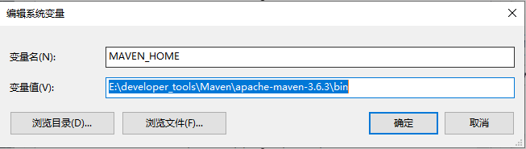
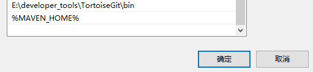
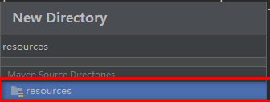
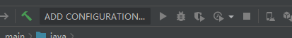
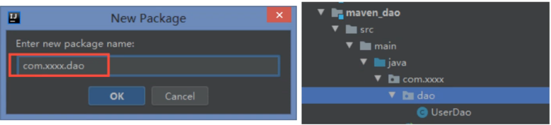
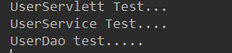
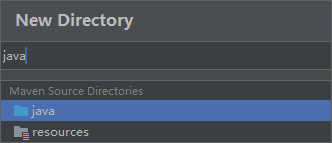
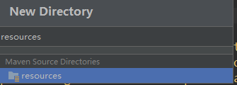
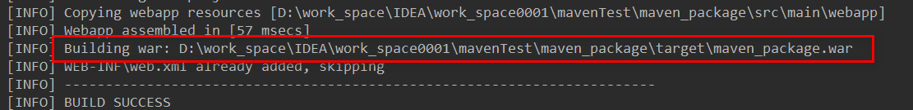

# Maven-基础

*   [Maven](#Maven_5)
*   *   [1. 主要内容](#1_6)
    *   [在这里插入图片描述](#httpsimgblogcsdnimgcn20210122095918468pngxossprocessimagewatermarktype_ZmFuZ3poZW5naGVpdGkshadow_10text_aHR0cHM6Ly9ibG9nLmNzZG4ubmV0L3dlaXhpbl80NDE5MDY2NQsize_16color_FFFFFFt_70_7)
    *   [2.Maven 的简介](#2Maven_9)
    *   *   [2.1 简介](#21__10)
        *   [2.2 项目构建](#22__15)
        *   [2.3 项目构建工具](#23__20)
        *   [2.4 Maven 的四大特性](#24_Maven_33)
        *   *   [2.4.1 依赖管理系统](#241__34)
            *   [2.4.2 多模块构建](#242__60)
            *   [2.4.3 一致的项目结构](#243__64)
            *   [2.4.4 一致的构建模型和插件机制](#244__67)
    *   [3.Maven 的安装配置和目录结构](#3Maven_84)
    *   *   [3.1Maven 的安装配置](#31Maven_85)
        *   *   [3.1.1 检查 JDK 的版本](#311_JDK_86)
            *   [3.1.2 下载 Maven](#312_Maven_88)
            *   [3.1.3 配置 Maven 环境变量](#313_Maven_90)
            *   [3.1.4 检查 Maven 是否安装成功](#314_Maven_96)
        *   [3.2 认识 Maven 目录结构](#32_Maven_99)
        *   [3.3 修改 Maven 配置](#33_Maven_133)
    *   [4.Maven 命令](#4Maven_152)
    *   *   [4.1 常用命令](#41__160)
        *   [4.2 命令参数](#42__179)
        *   *   [4.2.1 -D 传入属性参数](#421_D__181)
            *   [4.2.2 -P 使用指定的 Profile 配置](#422_P_Profile_186)
    *   [5.IDEA 编辑器集成 Maven 环境](#5IDEAMaven_238)
    *   *   [5.1 设置 Maven 版本](#51_Maven_239)
    *   [6.Maven 项目的创建](#6Maven_242)
    *   *   [6.1 创建 Java 项目](#61_Java_243)
        *   *   [6.1.1 新建项目](#611__244)
            *   [6.1.2 编译项目](#612__261)
        *   [6.2 创建 Web 项目](#62_Web_271)
        *   *   [6.2.1 创建项目](#621__272)
        *   [6.2.2 启动项目](#622__277)
        *   *   *   [6.2.2.1 修改 JDK 的版本](#6221_JDK_278)
                *   [6.2.2.2 修改单元测试的版本](#6222__287)
                *   [6.2.2.3 删除 pluginManagement 标签](#6223_pluginManagement_299)
                *   [6.2.2.4 添加 web 部署的插件](#6224_web_307)
                *   [6.2.2.5 启动项目](#6225__341)
    *   [7.Maven 仓库的基本概念](#7Maven_354)
    *   *   [7.1 中央仓库](#71__369)
        *   [7.2 私服](#72__373)
        *   [7.3 其他公共库](#73__377)
    *   [8.Maven 环境下构建多模块项目](#8Maven_388)
    *   *   [8.1 创建 maven_parent 项目](#81maven_parent_402)
        *   [8.2 创建 maven_dao 模块](#82_maven_dao_407)
        *   [8.3 创建 maven_service 模块](#83_maven_service_415)
        *   [8.4 创建 maven_controller 模块](#84_maven_controller_418)
        *   [8.5 修改模块的配置](#85__423)
        *   [8.6 设置模块之间的依赖](#86__428)
        *   *   [8.6.1 maven_dao](#861_maven_dao_429)
            *   [8.6.2 maven_service](#862_maven_service_443)
            *   [8.6.3 maven_controller](#863_maven_controller_466)
    *   [9.Maven 的打包操作](#9Maven_529)
    *   *   [9.1 建立对应的目录结构](#91__532)
        *   [9.2 添加 Profile 配置](#92_Profile_541)
        *   [9.3 设置资源文件配置](#93__570)
        *   [9.4 执行打包操作](#94__587)

Maven
-----

## 1. 主要内容


## 2.Maven 的简介

### 2.1 简介

    Maven 这个词可以翻译为 “专家”“内行”。Maven 主要服务于基于 Java 平台的项目构建，以来管理和项目信息管理。

    无论是小型的开源类库项目，还是大型的企业级项目应用；无论是传统的瀑布开放式，开始流行的敏捷开发，Maven 都能大显身手。

### 2.2 项目构建

   不管你是否意识到，构建是每一个程序员每天都在做的工作。早上来到公司，我们做的第一件事就是从源码库迁出最新的代码，然后进行单元测试，如果测试失败，会找相关的同事一起调试，修复错误代码。接着回到自己的工作上来，编写自己的单元测试产品代码。

    仔细总结一下，我们会发现，除了编写源代码，我们每天有相当一部分时间花在了编译，运行单元测试，生成文档，打包和部署等繁琐且不起眼的工作上，这就是构建。如果我们现在还在手工这样做，那成本太高了，于是有人用软件的方法让这一系列工作完全自动化，使得软件的构建可以像全自动流水线一样，只需要一条简单的命令，所有的繁琐步骤都能自动完成，很快就能得到最终结果。

### 2.3 项目构建工具

**Ant 构建**  
    最早的构建工具，基于 IDE，大概是 2000 年有的，当时是最流行的 java 构建工具，不过它的 XML 脚本编写格式让 XML 文件特别大。对工程构建过程中的过程控制的特别好。

**Maven【Java】**  
    项目对象模型，通过其描述信息来管理项目构建，报告和文档的软件项目管理工具。它填补了 Ant 缺点，Maven 第一次支持了从网络上下载的功能，仍采用 xml 作为配置文件格式。Maven 专注的是依赖管理，使用 java 编写。

**Gradle**  
    属于结合以上两个优点，它继承了 Ant 的灵活和 Maven 的生命周期管理，它最后被 google 作为了 Android 御用管理工具，它最大的区别是不用 xml 作为配置文件格式，采用了 DSL 格式，使得脚本更加简洁。

    目前市面上 Ant 比较老，所以一般是一些比较传统的软件企业公司使用，Maven 使用 java 编写，是当下大多数互联网公司会使用的一个构建工具，中文文档也比较齐全，gradle 是用 groovy 编写，目前比较新型的构建工具一些初创互联网公司会使用，以后会有很大的使用空间。

### 2.4 Maven 的四大特性

#### 2.4.1 依赖管理系统

    Maven 为 java 世界引入了一个新的依赖管理系统 jar 包管理 jar 升级时修改配置文件即可。在 java 世界中，可以用 groupId，artifactId，version 组成的 Coorrdination（坐标）唯一标示一个依赖。

    任何基于 Maven 构建的项目自身也必须定义这三项属性，生成的包可以时 jar 包，也可以是 war 包或者 jar 包。一个典型的依赖引用 如下所示：

```xml
<!-- https://mvnrepository.com/artifact/javax.servlet/javax.servlet-api -->
<dependency>
    <groupId>javax.servlet</groupId>
    <artifactId>javax.servlet-api</artifactId>
    <version>3.1.0</version>
    <scope>provided</scope>
</dependency>

```

**坐标属性的理解**  
    Maven 坐标为各种组件引入了秩序，任何一个组件必须明确定义自己的坐标。

**groupId**  
    定义当前 Maven 项目隶属的实际项目 - 公司名称。（jar 包所在仓库路径）由于 Maven 中模块的概念，一次一个实际项目往往会被划分为很多模块，比如 spring 是一个实际项目，其对应的 Maven 模块会有很多，如 spring-core，spring-webmvc 等。

**artifactId**  
    该元素定义实际项目中的一个 Maven 模块 - 项目名，推荐的做法是使用实际项目名作为 artifactId 的前缀。比如：spring-bean，sping-webmvc 等。

**version**  
    该元素定义 Maven 项目当前所处在的版本。

#### 2.4.2 多模块构建

    项目复查时 dao service controller 层分离将一个项目分解为多个模块已经是很通用的一种方式  
    在 Maven 中需要顶一个 parent POM 作为一组 module 的聚合 POM。在该 POM 中可以使用 `<moudles>` 标签来定义一组子模块。parent POM 不会有什么实际构建产出。而 parent POM 中的 build 配置以及依赖配置都会自动继承给子 module。

#### 2.4.3 一致的项目结构

    Ant 时代大家构建 java 项目目录时比较随意，然后通过 Ant 配置指定哪些属于 source，哪些属于 testSource 等。而 Maven 在设计之初的理念就是 Conversion over configuration（约定大于配置）。其制定了一套项目目录结构为标准的 java 项目结构，解决不同 IDE 带来的文件目录不一致问题。

#### 2.4.4 一致的构建模型和插件机制

```xml
<!--tomcat插件-->
      <plugin>
        <groupId>org.apache.tomcat.maven</groupId>
        <artifactId>tomcat7-maven-plugin</artifactId>
        <version>2.2</version>
        <configuration>
          <url>http://127.0.0.1:8080/manager</url>
          <server>tomcat</server>
          <port>8080</port>
          <path>/maven01</path><!--WEB应用上下文路径-->
          <contextReloadable>true</contextReloadable>
        </configuration>
      </plugin>

```

## 3.Maven 的安装配置和目录结构

### 3.1Maven 的安装配置

#### 3.1.1 检查 JDK 的版本

   JDK 版本 1.7 及以上

#### 3.1.2 下载 Maven

   下载地址 [http://maven.apache.org/download.cgi](./static/20210122112004673.png?x-oss-process=image/watermark,type_ZmFuZ3poZW5naGVpdGk,shadow_10,text_aHR0cHM6Ly9ibG9nLmNzZG4ubmV0L3dlaXhpbl80NDE5MDY2NQ==,size_16,color_FFFFFF,t_70)

#### 3.1.3 配置 Maven 环境变量

   解压后把 Maven 的根目录配置到环境变量 MAVEN_HOME, 将 bin 目录配置到 path 变量中。**注：maven 解压后存放的目录不要包含中文和空格**

新建系统变量 MAVEN_HOME，变量值为 maven 解压目录中的 bin 目录  
  
编辑系统变量 Path，添加变量值：%MAVEN_HOME%

#### 3.1.4 检查 Maven 是否安装成功

   打开 dos 窗口，执行 mvn -v  


### 3.2 认识 Maven 目录结构

```xml
${basedir}
|-- pom.xml
|-- src
|	|-- main
|	|	`-- java
|	|	`-- resources
|	|	`-- filters
|	`-- test
|	|	`-- java
|	|	`-- resources
|	|	`-- filters
|	`-- it
|	`-- assembly
|	`-- site
`-- LICENSE.txt
`-- NOTICE.txt
`-- README.txt

```

*   src/main/java 项目的源代码所在的目录
*   src/main/resources 项目的资源文件所在的目录
*   src/main/filters 项目的资源过滤文件所在的目录
*   src/main/webapp 如果是 web 项目，则该目录是 web 应用源代码所在的目录，比如 html 文件和 web.xml 等都在该目录下。
*   src/test/java 测试代码所在的目录
*   src/test/resources 测试相关的资源文件所在的目录
*   src/test/filters 测试相关的资源过滤文件所在的目录  
    上面的目录结构，我们接触的比较多，而下面的这些目录结构，用的相对不是很多：
*   src/it 集成测试代码所在的目录，主要是供别的插件使用的。
*   src/assembly 组件（Assembly）描述符所在的目录
*   src/site 站点文件
*   LICENSE.txt 项目的许可文件
*   NOTICE.txt 该项目依赖的库的注意事项
*   README.txt 项目的 readme 文件

### 3.3 修改 Maven 配置


1.1 修改默认仓库位置
打开maven目录-> conf -> settings.xml
添加仓库配置位置
<localRepository>E:/developer_tools/Maven/m2/repository</localRepository>
注：仓库位置改为自己本机的指定目录，"/"不要写反

1.2 更换阿里镜像，加快依赖下载
``` xml
<mirror>
	<id>nexus-aliyun</id>
	<mirrorOf>central</mirrorOf>
	<name>Nexus aliyun</name>
	<url>http://maven.aliyun.com/nexus/content/groups/public</url>
</mirror>
# 注：添加到<mirrors></mirrors>标签内
```

## 4.Maven 命令

   作为开发利器的 Maven，为我们提供了十分丰富的命令，了解 maven 的命令行操作并熟练运用常见的 maven 命令还是十分必要的，即使 IDEA 等工具给我们提供图形界面化工具，但其底层还是靠 maven 命令来驱动的。

   _Mavne 的命令格式如下：_

```
	mvn [plugin-name]:[goal-name]

```

   命令代表的含义：执行 plugin-name 插件的 goal-name 目标

### 4.1 常用命令

<table><thead><tr><th>命令</th><th>描述</th></tr></thead><tbody><tr><td>mvn -version</td><td>显示版本信息</td></tr><tr><td>mvn clean</td><td>清理项目产生的临时文件，一般是模块下的 target 目录</td></tr><tr><td>mvn compile</td><td>编译源代码，一般编译模块下的 src/main/java 目录</td></tr><tr><td>mvn package</td><td>项目打包工具，会在模块下的 target 目录生成. jar 或者. war 文件</td></tr><tr><td>mvn test</td><td>测试命令，或执行 src/test/java / 下的 junit 的测试用例</td></tr><tr><td>mvn install</td><td>将打包的 jar/war 文件复制到你的本地仓库中，供其他模块使用</td></tr><tr><td>mvn deploy</td><td>将打包的文件发布到远程参考，提供其他人员进行下载依赖</td></tr><tr><td>mvn site</td><td>生成项目相关信息的网站</td></tr><tr><td>mvn eclipse:eclipse</td><td>将项目转化为 Eclipse 项目</td></tr><tr><td>mvn dependency:tree</td><td>打印出项目的整个依赖树</td></tr><tr><td>mvn archetype:generate</td><td>创建 Maven 的普通 java 项目</td></tr><tr><td>mvn tomcat7:run</td><td>在 Tomcat 容器中运行 web 应用</td></tr><tr><td>mvn jetty:run</td><td>调用 Jetty 插件的 Run 目标在 Jetty Servlet 容器中启动 web 应用</td></tr></tbody></table>

> 注意：运行 maven 命令的时候，首先需要定位到 maven 项目的目录，也就是项目的 pom.xml 文件所在的目录。否则，必以通过参数来指定项目的目录。

### 4.2 命令参数

   上面列举的知识比较通用的命令，其实很多命令都可以携带参数以执行更精准的任务。

#### 4.2.1 -D 传入属性参数

例如：  
   mvn package -Dmaven.test.skip=true  
   以 ==-D 开头，将 maven.test.skip 的值设置为 true==, 就是告诉 maven 打包的时候跳过单元测试，同理，mvn deploy -Dmaven.test.skip=true 代表部署项目并且跳过单元测试。

#### 4.2.2 -P 使用指定的 Profile 配置

   比如项目开发需要多个环境，一般为开发，测试，预发，正式四个环境，在 pom.xml 中的配置如下：

```xml
<profiles>
	<profile>
		<id>dev</id>
		<properties>
			<env>dev</env>
		</properties>
		<!--默认激活方式-->
		<activation>
			<activeByDefault>true</activeByDefault>
		</activation>
	</profile>
	<profile>
		<id>qa</id>
		<properties>
			<env>qa</env>
		</properties>
	</profile>
	<profile>
		<id>pre</id>
		<properties>
			<env>pre</env>
		</properties>
	</profile>
	<profile>
		<id>prod</id>
		<properties>
			<env>prod</env>
		</properties>
	</profile>
</profiles>
......
<build>
	<filters>
		<filter>config/${env}.properties</filter>
	</filters>
	<resources>
		<resouce>
			<directory>src/main/resource</directory>
			<filtering>true</filtering>
		</resource>
	</resources>

```

   _profiles_ 定义了各个环境变量的 _id_，_filters_ 中定义了变量配置文件的地址，其中地址中的环境变量就是上面 _profile_ 中定义定义的值，_resources_ 中是定义哪些目录下的文件会被配置文件中定义的变量替换。  
   通过 maven 可以实现按不同环境进行打包部署，例如：

```
	mvn package -Pdev -Dmaven.test.skip=true

```

   表示打包本地环境，并跳过单元测试

## 5.IDEA 编辑器集成 Maven 环境

### 5.1 设置 Maven 版本

  


## 6.Maven 项目的创建

### 6.1 创建 Java 项目

#### 6.1.1 新建项目

1. 新建 Maven 项目  


2. 设置项目名、命名空间、groupId 等  
3. 检查 Maven 环境，选择 “Finish”  
  
4. 修改配置文件 pom.xml  


注：IDEA 创建 Maven 项目，目录可能不全，如需要其他目录自己手动创建即可。例：创建 resous 目录。  
1、新建目录  
  
2、点击下方 resources，即可完成创建    

  
3、创建 resources 之后的目录。


4、 maven只能把当前项目当成普通目录来解释，如果当成maven的资源目录需要右键当前的目录，选择Mark Directory as --> Resources Root 
#### 6.1.2 编译项目

1、点击右上角的 “Add Configurations”，打开“Run/Debug Configurations” 窗口  
  
  
2. 设置编译项目的命令  
  
3. 执行编译命令，两个图标分别代表 “普通模式” 和“调试模式”  
  
4. 编译成功

### 6.2 创建 Web 项目

#### 6.2.1 创建项目

1. 创建 web 项目与创建 java 项目步骤基本一致，区别在于选择 Maven 模板（web 项目选择 webapp），如图：  
  
2. 项目目录结构如下  


### 6.2.2 启动项目

#### 6.2.2.1 修改 JDK 的版本

```xml
<!--JDK的版本修改为1.11-->
  <properties>
    <project.build.sourceEncoding>UTF-8</project.build.sourceEncoding>
    <maven.compiler.source>1.11</maven.compiler.source>
    <maven.compiler.target>1.11</maven.compiler.target>
  </properties>

```

#### 6.2.2.2 修改单元测试的版本

```xml
<!--Junit的版本修改为4.12-->
  <dependencies>
    <dependency>
      <groupId>junit</groupId>
      <artifactId>junit</artifactId>
      <version>4.12</version>
      <scope>test</scope>
    </dependency>
  </dependencies>

```

#### 6.2.2.3 删除 pluginManagement 标签

```xml
<!--将这个标签及标签中的内容全部删除-->
  <pluginManagement>
  ...
  </pluginManagement>

```

#### 6.2.2.4 添加 web 部署的插件

在 build 标签中添加 plugins 标签  
1.Jetty 插件

```xml
	<!--设置在plugins标签中-->
     <plugin>
          <groupId>org.eclipse.jetty</groupId>
          <artifactId>jetty-maven-plugin</artifactId>
          <version>9.4.11.v20180605</version>
        <configuration>
          <!--热部署，每10s扫描一次-->
          <scanIntervalSeconds>10</scanIntervalSeconds>
          <webAppConfig>
            <contextPath>/test</contextPath>
          </webAppConfig>
        </configuration>
      </plugin>

```

2.Tomcat 插件

```xml
 <plugin>
        <groupId>org.apache.tomcat.maven</groupId>
        <artifactId>tomcat7-maven-plugin</artifactId>
        <version>2.2</version>
        <configuration>
          <port>8080</port><!--启动端口，默认8080-->
          <path>/test</path><!--项目的站点名，即对外访问路径-->
          <uriEncoding>UTF-8</uriEncoding><!--字符集编码 默认：ISO-8859-1-->
          <server>tomcat7</server><!--服务器名称-->
        </configuration>
      </plugin>

```

3. 配置完之后，Reload project 加载插件  


#### 6.2.2.5 启动项目

1. 点击左上角的 “Add Configigurations”，打开“Run/Debug Configurations” 窗口  
  
2.jetty 插件配置  
  
3. 点击启动图标，启动服务  
  
4. 启动成功  
  
浏览器访问效果  
  
Tomcat 同理，把命令换成 tomcat7：run，如图所示：  


## 7.Maven 仓库的基本概念

   当第一次运行 Maven 命令的时候，需要 Internet 链接，因为它需要从网上下载一些文件，那么它从哪里下载呢？它是从 Maven 默认的远程库下载的。这个远程仓库有 Maven 的核心插件和可供下载的 jar 文件。  
   对于 Maven 仓库来说，仓库只分为两类：本地仓库和远程仓库。  
   当 Maven 根据坐标寻找构件的时候，它首先会查看本地仓库，如果本地仓库存在，则直接使用；如果本地没有，Maven 就会去远程仓库查找，发现需要的构件之后，下载到本地仓库再使用。如果本地仓库和远程仓库都没有，Maven 就会报错。  
   远程仓库分为三种：中央仓库，私服，其它公共库。  
   中央仓库是默认配置下，Maven 下载 jar 包的地方，

   私服是一种特殊的远程仓库，为了节省带宽和时间，应该在局域网内架设一个私有的仓库服务器，用其代理所有外部的远程仓库。内部的项目还能部署到私服上供其他项目使用。  
   一般来说，在 Maven 项目目录下，没有诸如 lib / 这样用来存放依赖文件的目录。当 Maven 在执行编译或测试时，如果需要使用依赖文件，它总是基于坐标使用本地仓库的依赖文件。  
   默认情况下，每个用户在自己的用户目录下都有一个路径名为. m2/repository / 的仓库目录。有时候，因为某些原因（如 C 盘空间不足），需要修改本地仓库目录地址。  
   对于仓库路径的修改，可以通过 maven 配置文件 conf 目录下的 settings.xml 来指定仓库路径。

```xml
<!-- 本地仓库的地址，用来存放jar包-->
<localRepository>E:/developer_tools/Maven/m2/repository</localRepository>

```

### 7.1 中央仓库

   由于原始的本地仓库就是空的，maven 必须知道至少一个可用的远程仓库，才能在执行 maven 命令的时候下载到需要的构件。中央仓库就是这样一个默认的远程仓库。  
   maven-model-builder-3.3.9.jar maven 自动的 jar 中包含了一个超级 POM。定义了默认中央仓库的位置。中央仓库包含了 2000 多个开源项目，接受每天 1 亿次以上的访问。

### 7.2 私服

   私服是一种特殊的远程仓库，它是假设在局域网内的仓库服务，私服代理广域网上的远程仓库，供局域网内的 maven 用户使用。当 maven 需要下载构件时，它去私服当中找，如果私服没有，则从外部远程仓库下载，并缓存在私服上，再为 maven 提供。  
   此外，一些无法从外部仓库下载的构件也能从本地上传到私服提供局域网中供他人使用。

### 7.3 其他公共库

   常用的阿里云仓库配置

```xml
    <mirror>
        <id>nexus-aliyun</id>
        <mirrorOf>central</mirrorOf>
        <name>Nexus aliyun</name>
        <url>http://maven.aliyun.com/nexus/content/groups/public</url>
    </mirror>

```

### 7.4 Mavan仓库
https://mvnrepository.com/

## 8.Maven 环境下构建多模块项目

   使用 maven 提供的多模块构建的特性完成 maven 环境下多个模块的项目的管理与构建。

```
这里以四个模块为例来搭建项目，以达到通俗易懂的初衷

模块 maven_parent -- 基模块，就是常说的parent (pom)

模块 maven_dao -- 数据库的访问层，例如jdbc从操作（jar）

模块 maven_service -- 项目的业务逻辑层（jar）

模块 maven_controller -- 用来接收请求，响应数据（war）

```

### 8.1 创建 maven_parent 项目

1. 选择 File-> New -> Project  
  
2. 设置相关信息  


### 8.2 创建 maven_dao 模块

1. 选择项目 maven_parent，右键选择 New，选择 Module  
  
2. 选择 Maven 项目的模板（普通 Java 项目）  
  
3. 设置子模块的相关信息  
  


### 8.3 创建 maven_service 模块

创建 maven_service 的步骤与 maven_dao 模块一致。

### 8.4 创建 maven_controller 模块

创建 maven_controller 模块的步骤与 maven_dao 模块基本一致，只需要将第一步的 Maven 模板设置为 web 项目即可。（模板类型：maven-archetype-webapp）

模块全部创建完成后效果如下：  


### 8.5 修改模块的配置

*   设置 JDK 版本
*   单元测试 JUnit 版本
*   删除多余的配置

### 8.6 设置模块之间的依赖

#### 8.6.1 maven_dao

1. 新建包  
  
2. 在包中创建 UserDao 类  
  
3. 在类中添加方法

```java
public class UserDao {
    public static void testDao(){
        System.out.println("UserDao test.....");
    }
}

```

#### 8.6.2 maven_service

1. 添加 maven_dao 的依赖

```xml
    <!--加入maven_dao模块的依赖-->
    <dependency>
      <groupId>com.xxxx</groupId>
      <artifactId>maven_dao</artifactId>
      <version>1.0-SNAPSHOT</version>
      <scope>compile</scope>
    </dependency>

```

2. 在项目中添加 UserService 类，并添加方法

```java
public class UserService {

    public static void testService(){
        System.out.println("UserService Test....");
        //调用UserDao的方法
        UserDao.testDao();
    }
}

```

#### 8.6.3 maven_controller

1. 添加 maven_service 的依赖

```xml
    <!--加入maven_service模块的依赖-->
        <dependency>
            <groupId>com.xxxx</groupId>
            <artifactId>maven_service</artifactId>
            <version>1.0-SNAPSHOT</version>
        </dependency>

```

2. 添加 Servlet 的依赖

```xml
<!--加入Servlet的依赖-->
<!-- https://mvnrepository.com/artifact/javax.servlet/javax.servlet-api -->
<dependency>
    <groupId>javax.servlet</groupId>
    <artifactId>javax.servlet-api</artifactId>
    <version>3.1.0</version>
    <scope>provided</scope>
</dependency>


```

3. 新建 Java 类，继承 HttpServlet 类并重写 service 方法  


```java
@WebServlet("/user")
public class UserServlet extends HttpServlet {
    @Override
    public void service(ServletRequest req, ServletResponse res) throws ServletException, IOException {
        System.out.println("UserServlett Test...");
        //调用maven_service模块的方法
        UserService.testService();
    }
}

```

4. 添加 Tomcat 插件

```xml
<!--添加tomcat插件-->
            <plugin>
                <groupId>org.apache.tomcat.maven</groupId>
                <artifactId>tomcat7-maven-plugin</artifactId>
                <version>2.2</version>
                <configuration>
                    <path>/web</path>
                    <uriEncoding>UTF-8</uriEncoding>
                    <server>tomcat7</server>
                </configuration>
            </plugin>

```

启动项目  


如果启动项目失败，就把 maven_parent 项目 install 一下  
  
6. 启动成功  


访问  
  
控制台输出结果  


## 9.Maven 的打包操作

   对于企业级项目，无论是进行本地测试，还是测试环境测试以及最终的项目上线，都会涉及项目的打包操作。对于每个环节下的项目打包，对应的项目所需要的配置资源会有所差别，实现打包的方式有很多种，可以通过 ant，或者通过 idea 自带的打包功能实现项目打包，但当项目很大并且需要的外界配置很多时，此时打包的配置就会异常复杂，对于 maven 项目，我们可以通过 pom.xml 配置的方式来实现打包时的环境选择，相比较其他形式打包工具，通过 maven 只需要通过简单的配置，就可以轻松完成不同环境下的项目的整体打包。  
   比如下面这样一个项目，项目中配置了不同环境下所需要的配置文件，这时候需要完成不同环境下的打包操作，此时通过修改 pom.xml 如下：

### 9.1 建立对应的目录结构

   使用 idea 创建目录，目录结构可能会确实，需要手动添加对应的目录。  
1. 添加 java 源文件夹  
  
2. 添加 resources 文件夹  
  
  
3. 添加对应的文件夹目录，添加不同环境下对应的配置文件。（本地环境、测试环境、正式环境）  


### 9.2 添加 Profile 配置

```xml
<!--打包环境配置，开发环境、测试环境、正式环境-->
  <profiles>
    <profile>
      <id>dev</id>
      <properties>
        <env>dev</env>
      </properties>
      <!--未指定环境时，默认打包dev环境-->
      <activation>
        <activeByDefault>true</activeByDefault>
      </activation>
    </profile>
    <profile>
      <id>test</id>
      <properties>
        <env>test</env>
      </properties>
    </profile>
    <profile>
      <id>product</id>
      <properties>
        <env>product</env>
      </properties>
    </profile>
  </profiles>

```

### 9.3 设置资源文件配置

```xml
    <resources>
      <resource>
        <directory>src/main/resources/${env}</directory>
      </resource>
      <resource>
        <directory>src/main/java</directory>
        <includes>
          <include>**/*.xml</include>
          <include>**/*.properties</include>
          <include>**/*.tld</include>
        </includes>
        <filtering>false</filtering>
      </resource>
    </resources>
//放到build标签中
```

### 9.4 执行打包操作

打开 Run/Debug Configuarations 窗口，输入对应的打包命令  


打包成功


##  10.1. 依赖的基本配置


根元素 project 下的 dependencies 可以包含多个 dependence 元素，以声明多个依赖。每个依赖都应 该包含以下元素：

**1. groupId, artifactId, version** : 依赖的基本坐标， 对于任何⼀个依赖来说，基本坐标是最重要的， Maven 根据坐标才能找到需要的依赖。

**2. Type**： 依赖的类型，⼤部分情况下不需要声明。 默认值为 jar

**3. Scope**： 依赖范围（compile,test,provided,runtime,system）

*   compile: 编译依赖范围。 如果没有指定，就会默认使⽤该依赖范围。使⽤此依赖范围的 Maven 依赖，对于编译、测试、运⾏三种 classpath 都有效。
*   test: 测试依赖范围。 使⽤此依赖范围的 Maven 依赖，只对于测试 classpath 有效，在编译主代码或者运⾏项⽬的使⽤时将⽆法使⽤此类依赖。典型的例⼦就是 JUnit，它只有在编译测试代码及运⾏测试的时候才需要。
*   provided: 已提供依赖范围。 使⽤此依赖范围的 Maven 依赖，对于编译和测试 classpath 有效，但在运⾏时⽆效。典型的例⼦是 servlet-api，编译和测试项⽬的时候需要该依赖，但在运⾏项⽬的时候，由于容器已经提供，就不需要 Maven 重复地引⼊⼀遍 (如：servlet-api)。
*   runtime: 运⾏时依赖范围。 使⽤此依赖范围的 Maven 依赖，对于测试和运⾏ classpath 有效，但在编译主代码时⽆效。典型的例⼦是 JDBC 驱动实现，项⽬主代码的编译只需要 JDK 提供的 JDBC 接⼝，只有在执⾏测试或者运⾏项⽬的时候才需要实现上述接⼝的具体 JDBC 驱动。
*   system: 系统依赖范围。 该依赖与三种 classpath 的关系，和 provided 依赖范围完全⼀致。但是，使⽤ system 范围依赖时必须通过 systemPath 元素显式地指定依赖⽂件的路径。由于此类依赖不是通过 Maven 仓库解析的，⽽且往往与本机系统绑定，可能造成构建的不可移植，因此应该谨慎使⽤。

**4. Optional**：标记依赖是否可选

**5. Exclusions**： ⽤来排除传递性依赖

10.2. 依赖范围
----------

⾸先需要知道，Maven 在编译项⽬主代码的时候需要使⽤⼀套 classpath。 ⽐如：编译项⽬代码的时候需要⽤到 spring-core, 该⽂件以依赖的⽅式被引⼊到 classpath 中。 其次， Maven 在执⾏测试的时候会使⽤另外⼀套 classpath。如：junit。

最后在实际运⾏项⽬时，⼜会使⽤⼀套 classpath， spring-core 需要在该 classpath 中，⽽ junit 不需要。

那么依赖范围就是⽤来控制依赖与这三种 classpath(编译 classpath，测试 classpath，运⾏时 classpath) 的关系， **Maven 有以下⼏种依赖范围**：

*   Compile 编译依赖范围。 如果没有指定，就会默认使⽤该依赖范围。 使⽤此依赖范围的 Maven 依赖， 对于编译，测试，运⾏都有效。
*   Test： 测试依赖范围。 只在测试的时候需要。⽐如 junit
*   Provided： 已提供依赖范围。 使⽤此依赖范围的 Maven 依赖，对于编译和测试有效， 但在运⾏时⽆效。 典型的例⼦是 servlet-API, 编译和测试项⽬的需要， 但在运⾏项⽬时， 由于容器已经提供， 就不需要 Maven 重复地引⼊⼀遍。
*   Runtime： 运⾏时依赖范围。 使⽤此依赖范围的 Maven 依赖，对于测试和运⾏有效， 但在编译代码时⽆效。 典型的例⼦是：jdbc 驱动程序， 项⽬主代码的编译只需要 jdk 提供的 jdbc 接⼝，只有在执⾏测试或者运⾏项⽬的时候才需要实现上述接⼝的具体 jdbc 驱动。
*   System： 系统依赖范围。 ⼀般不使⽤

10.3. 传递性依赖
-----------

传递依赖机制， 让我们在使⽤某个 jar 的时候就不⽤去考虑它依赖了什么。也不⽤担⼼引⼊多余的依赖。 Maven 会解析各个直接依赖的 POM，将那些必要的间接依赖，以传递性依赖的形式引⼊到当前项⽬中。

== 注意： 传递依赖有可能产⽣冲突！！==

**冲突场景**：

```
A-->B--->C (2.0)
A-->E--->C (1.0)


```

如果 A 下同时存在两个不同 version 的 C，冲突！！（选取同时适合 A、B 的版本）

```xml
<dependencies> 
 <dependency> 
 <groupId>A</groupId> 
 <artifactId>A</artifactId> 
 <version>xxx</version> 
 <exclusions> 
 <exclusion> 
 <groupId>C</groupId> 
 <artifactId>C</artifactId>
 </exclusion> 
 </exclusions> 
 </dependency>
 <dependency> 
 <groupId>B</groupId> 
 <artifactId>B</artifactId> 
 </dependency> 
</dependencies>


```