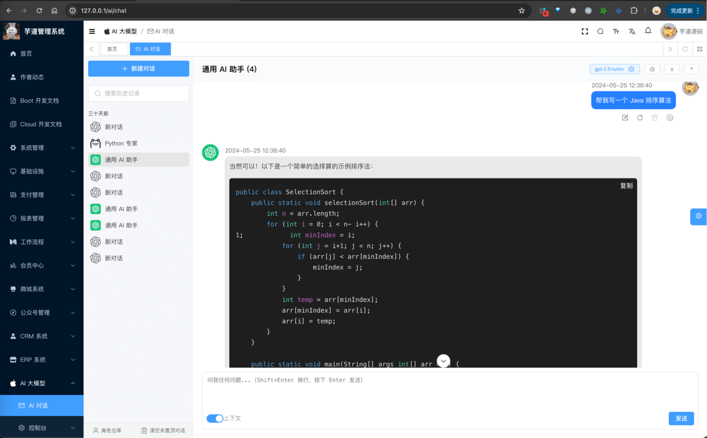
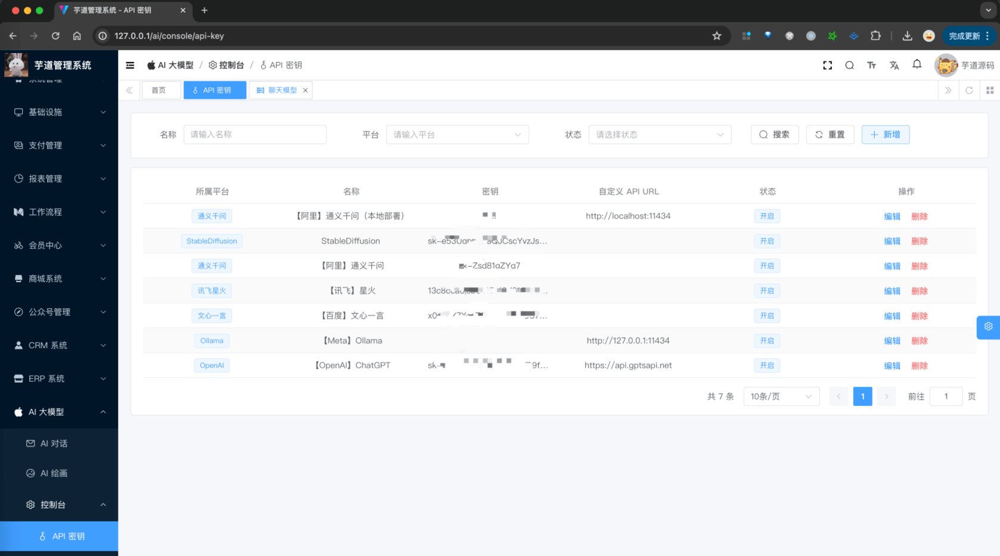
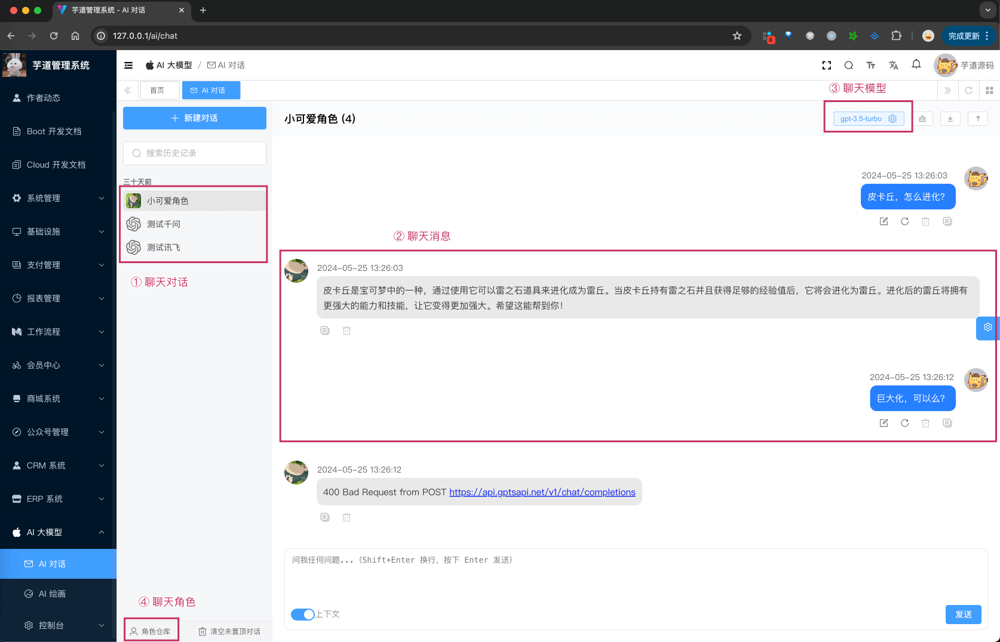
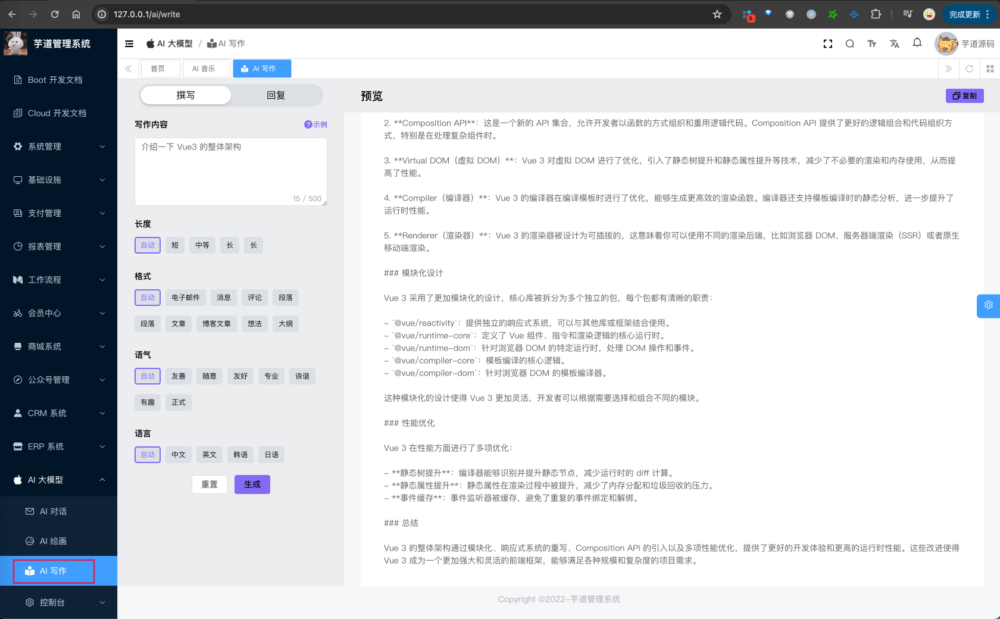

目录

# AI 大模型演示

## [#](#_1-演示地址) 1. 演示地址
### [#](#_1-1-管理后台) 1.1 管理后台

*   演示地址：[http://dashboard-vue3.yudao.iocoder.cn/ (opens new window)](http://dashboard-vue3.yudao.iocoder.cn/) 【暂未部署】
*   菜单：“AI 大模型”下的「AI 聊天」「AI 绘画」「AI 写作」「AI 脑图」「AI 音乐」「控制台」等等
*   仓库：[https://github.com/yudaocode/yudao-ui-admin-vue3 (opens new window)](https://github.com/yudaocode/yudao-ui-admin-vue3) 的 `ai` 目录，基于 Vue3 + Element Plus 实现

### [#](#_1-2-ai-后端) 1.2 AI 后端

支持 Spring Boot 单体、Spring Cloud 微服务架构

*   单体仓库： [https://github.com/YunaiV/ruoyi-vue-pro (opens new window)](https://github.com/YunaiV/ruoyi-vue-pro) 的 `yudao-module-ai` 模块
*   微服务仓库： [https://github.com/YunaiV/yudao-cloud (opens new window)](https://github.com/YunaiV/yudao-cloud) 的 `yudao-module-ai` 服务

## [#](#_2-ai-启动) 2. AI 启动

参见 [《AI 手册 —— 功能开启》](/ai/build/) 文档，一般 3 分钟就可以启动完成。

已经内置多个 AI 大模型（相关密钥已配置）：

*   国内：【百度】文心一言、【阿里】通义千问、【讯飞】星火、【智谱】GLM、【深度求索】DeepSeek
*   国外：【OpenAI】GPT、【Meta】Llama、【Google】Gemini、【Stability】Stable Diffusion

## [#](#_3-ai-交流群) 3. AI 交流群

专属交流社区，欢迎扫码加入。

## [#](#_4-功能描述) 4. 功能描述

主要分为 5 个核心模块：对话、绘画、写作、脑图、音乐。

### [#](#_4-1-模型接入) 4.1 模型接入

模型（可点击链接，查看申请/部署文档）

国内/国外

是否开源（私有化部署）

[《【阿里】通义千问》](/ai/tongyi)

国内

√

[《【百度】文心一言》](/ai/yiyan)

国内

[《【讯飞】星火认知》](/ai/xinghuo)

国内

[《【智谱】GLM》](/ai/glm/)

国内

√

[《【讯飞】星火认知》](/ai/xinghuo)

国内

[《【深度求索】DeepSeek》](/ai/deep-seek)

国内

√

[《【OpenAI】ChatGPT》](/ai/openai)

国外

[《【Meta】LLAMA》](/ai/llama)

国外

√

[《【微软 OpenAI】ChatGPT》](/ai/azure-openai)

国外

[《【谷歌】Gemini》](/ai/yiyan)

国外

√(Gemma)

[《【Stability】Stable Diffusion》](/ai/stable-diffusion)

国外

√

[《【Midjourney】Midjourney》](/ai/midjourney)

国外

√

[《【Suno AI】Suno》](/ai/midjourney)

国外

### [#](#_4-2-ai-对话聊天) 4.2 AI 对话聊天

详细说明，可见 [《AI 对话聊天》](/ai/chat/) 文档

### [#](#_4-3-ai-绘画创作) 4.3 AI 绘画创作

详细说明，可见 [《AI 绘画创作》](/ai/image/) 文档

### [#](#_4-4-ai-音乐创作) 4.4 AI 音乐创作

详细可见，可见 [《AI 音乐创作》](/ai/music/) 文档

### [#](#_4-5-ai-写作助手) 4.5 AI 写作助手

详细可见，可见 [《AI 写作助手》](/ai/write/) 文档

### [#](#_4-6-ai-思维导图) 4.6 AI 思维导图

详细可见，可见 [《AI 思维导图》](/ai/mindmap/) 文档

