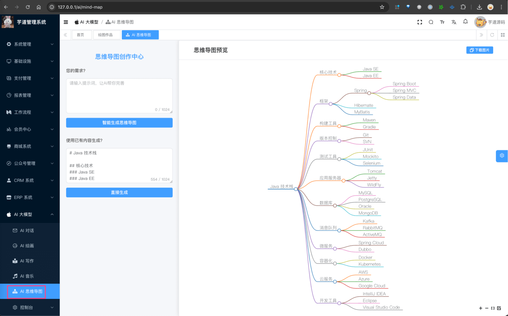
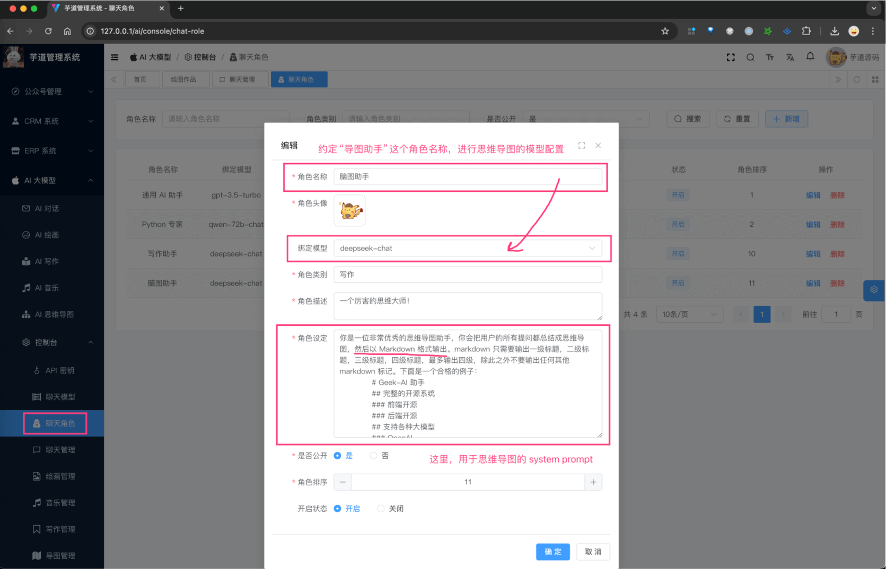
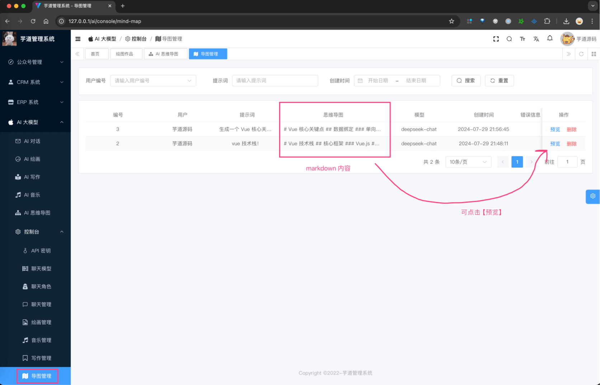

目录

# AI 思维导图

AI 思维导图，基于 LLM 大模型，实现智能思维导图的功能。

它的实现原理，是根据 prompt 提示词生成 markdown 内容，之后再通过 markdown 转换成思维导图。



整个功能，涉及到 2 个表：

*   【配置】`ai_api_key`：API 秘钥表
*   【导图】`ai_mind_map`：思维导图记录表

下面，我们逐个表进行介绍，这个过程中也会讲讲对应的功能。

> 省略 creator/create\_time/updater/update\_time/deleted/tenant\_id 等通用字段

## [#](#_1-api-秘钥表) 1. API 秘钥表

在 [《AI 对话》](/ai/chat/) 中，我们已经介绍了 API 秘钥表，这里就不再赘述了。

你想使用哪个模型生成思维导图，可以参考对应的文档，进行配置：

*   国内模型：[《通义千问》](/ai/tongyi)、[《文心一言》](/ai/yiyan)、[《讯飞星火》](/ai/xinghuo)、[《智谱 GLM》](/ai/glm)、[《DeepSeek》](/ai/deep-seek)
*   国外模型：[《OpenAI（ChatGPT）》](/ai/openai)、[《LLAMA》](/ai/llama)、[《【微软 OpenAI】ChatGPT》](/ai/azure-openai) 、[《谷歌 Gemini》](/ai/gemini)

友情提示：

一般情况下，建议先使用 [《DeepSeek》](/ai/deep-seek) 模型，因为免费送了一些 tokens，可以先体验一下。

### [#](#_1-1-补充说明) 1.1 补充说明

AI 生成思维导图时，使用什么模型和 system prompt 呢？它分成两种情况：

① 情况一：通过【聊天角色】中的“导图助手 ”进行配置。如下图所示：



② 情况二：如果没有配置，那就会使用 `ai_chat_model` 表中的第一个模型（排序 `sort` 最小的）。同时，它对应的 system prompt 在 AiChatRoleEnum 的 `AI_MIND_MAP_ROLE` 进行配置。

## [#](#_2-思维导图记录表) 2. 思维导图记录表

思维导图记录表，用户每发起一次思维导图，都会记录一条记录。

### [#](#_2-1-表结构) 2.1 表结构

```sql
CREATE TABLE `ai_mind_map` (
  `id` bigint NOT NULL AUTO_INCREMENT COMMENT '编号',
  `user_id` bigint NOT NULL COMMENT '用户编号',
  
  `platform` varchar(64) CHARACTER SET utf8mb4 COLLATE utf8mb4_unicode_ci NOT NULL COMMENT '平台',
  `model` varchar(50) CHARACTER SET utf8mb4 COLLATE utf8mb4_unicode_ci NOT NULL COMMENT '模型',
  
  `prompt` text COLLATE utf8mb4_unicode_ci NOT NULL COMMENT '生成内容提示',
  `generated_content` text COLLATE utf8mb4_unicode_ci COMMENT '生成的思维导图内容',
   
   `error_message` varchar(1024) COLLATE utf8mb4_unicode_ci DEFAULT NULL COMMENT '错误信息',
  PRIMARY KEY (`id`)
) ENGINE=InnoDB AUTO_INCREMENT=4 DEFAULT CHARSET=utf8mb4 COLLATE=utf8mb4_unicode_ci COMMENT='AI 思维导图表';

```

① `user_id` 字段：对应 `system_users` 表的 `id` 字段，表示哪个用户生成的思维导图。

② `platform` 字段：表示平台，对应 AiPlatformEnum 枚举，目前支持多个 AI 大模型。

`model` 字段：表示模型标识，对应不同的平台的模型标识，例如说 OpenAI 的 `gpt-3.5-turbo`、`gpt-4-turbo`，通义千问的 `qwen-plus`、`qwen-max` 等等。

③ `prompt` 字段：表示生成内容提示，即生成思维导图的提示词。

`generated_content` 字段：表示生成的思维导图内容，markdown 格式。

④ `error_message` 字段：表示错误信息，如果生成失败，会记录错误信息。

### [#](#_2-2-管理后台) 2.2 管理后台

① 前端对应 \[AI 大模型 -> AI 思维导图\] 菜单，对应 `yudao-ui-admin-vue3` 项目的 `@/views/ai/mindmap/index` 目录，提供给普通用户使用，生成思维导图。


它的后端 HTTP 接口，由 `yudao-module-ai` 模块的 `mindmap` 包的 AiMindMapController 实现。

最最最关键的代码！！！大家可以重点看看！！！

AiMindMapController 提供的 `#generateMindMap(...)` 生成思维导图接口。

它的内部，调用 Spring AI 的 StreamingChatClient 来实现大模型的调用。

② 前端对应 \[AI 大模型 -> 控制台 -> 导图管理\] 菜单，对应 `yudao-ui-admin-vue3` 项目的 `@/views/ai/mindmap/mananger` 目录，提供给管理员使用，查看思维导图记录。

