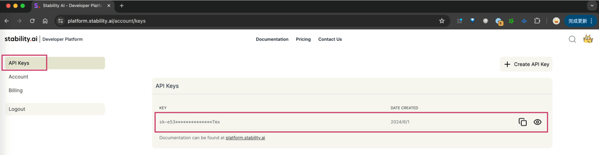
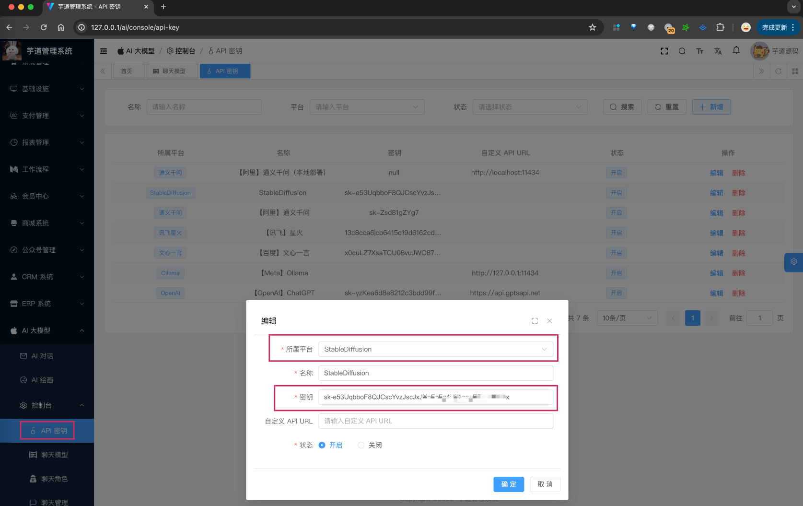

目录

# 【模型接入】Stable Diffusion

项目基于 Spring AI 提供的 [`spring-ai-stability-ai` (opens new window)](https://github.com/spring-projects/spring-ai/tree/main/models/spring-ai-stability-ai)，实现 Stable Diffusion 的接入，提供 AI 作图的功能。

对应的 Spring AI 客户端为 [StabilityAiImageClient (opens new window)](https://docs.spring.io/spring-ai/reference/api/image/stabilityai-image.html)。

## [#](#_1-申请密钥-私有部署) 1. 申请密钥（私有部署）

由于 [Stable Diffusion (opens new window)](https://github.com/CompVis/stable-diffusion) 是开源模型，所以可以私有化部署。

而它的开源它的公司 Stability AI，提供了对应的云服务，可以直接使用。

下面，我们来看看这两种方式怎么申请（部署）？

友情提示：一般情况下，如果是为了体验 AI 作图，建议直接采用“方式一：申请 Stability 密钥”，更加简单方便！

### [#](#_1-1-方式一-申请-stability-密钥) 1.1 方式一：申请 Stability 密钥

① 访问 [Stability AI (opens new window)](https://stability.ai/)，注册账号。

② 访问 [API Keys (opens new window)](https://platform.stability.ai/account/keys) ，获得一个 API Key。



* * *

申请完成后，可以在我们系统的 \[AI 大模型 -> 控制台 -> API 密钥\] 菜单，进行密钥的配置。只需要填写“密钥”，不需要填写“自定义 API URL”（因为 Spring AI 默认官方地址）。如下图所示：



ps：默认官方赠送了 25 Credits，够生成几百张图。如果用完的情况下，要么再申请一个账号，要么参考 [《Stable Diffusion 3 会员 API 充值教学》 (opens new window)](https://juejin.cn/post/7361762150010945570) 充值。

### [#](#_1-2-方式二-私有化部署) 1.2 方式二：私有化部署

友情提示：虽然 Stable Diffusion 可以私有化部署，但是 Spring AI 没兼容私有化部署后的 HTTP API！

这样就导致，即使私有化部署，项目还是无法对接使用！等后续我们看看，怎么可以兼容一下！！！

① 方式一：参考 [https://github.com/AbdBarho/stable-diffusion-webui-docker/wiki/Setup (opens new window)](https://github.com/AbdBarho/stable-diffusion-webui-docker/wiki/Setup) 文档，使用 Docker 部署。不过要注意，如果你是 MacOS + 苹果芯片，不支持！

② 方式二：参考 [https://devwl.com/posts/stable-diffusion-webui/ (opens new window)](https://devwl.com/posts/stable-diffusion-webui/) 文档，直接本机部署。我是 MacOS + 苹果芯片，已经跑通！如果你要开启 API 功能，启动命令得是

```bash
./webui.sh --api

```

这样，你在 [http://127.0.0.1:7860/docs (opens new window)](http://127.0.0.1:7860/docs) 地址，就可以看到 `/sdapi/v1/txt2img` 文字生成图片 API。不过正如我前面所说的，Spring AI 没兼容该接口！！！

③ 方式三：参考 [https://www.cnblogs.com/Serverless/p/18101931 (opens new window)](https://www.cnblogs.com/Serverless/p/18101931) 文档，使用 Serverless 部署。不过我没试过，只是提供个资料哈~

### [#](#_1-3-补充说明) 1.3 补充说明

后续，你就可以参考 [《AI 绘画》](/ai/image/) ，实现文字生成图片。

## [#](#_2-如何使用) 2. 如何使用？

① 如果你的项目里需要直接通过 `@Resource` 注入 OpenAiImageClient 等对象，需要把 `application.yaml` 配置文件里的 `spring.ai.stabilityai` 配置项，替换成你的！

```yaml
spring:
  ai:
    stabilityai:
      api-key: sk-e53UqbboF8QJCscYvzJscJxJXoFcFg4iJjl1oqgE7baJETmx # 你的密钥

```

② 如果你希望使用 \[AI 大模型 -> 控制台 -> API 密钥\] 菜单的密钥配置，则可以通过 AiApiKeyService 的 `#getImageModel(...)` 方法，获取对应的模型对象。

* * *

① 和 ② 这两者的后续使用，就是标准的 Spring AI 客户端的使用，调用对应的方法即可。

另外，StabilityAiImageModelTests 里有对应的测试用例，可以参考。