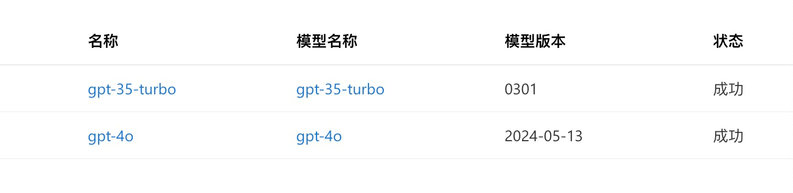
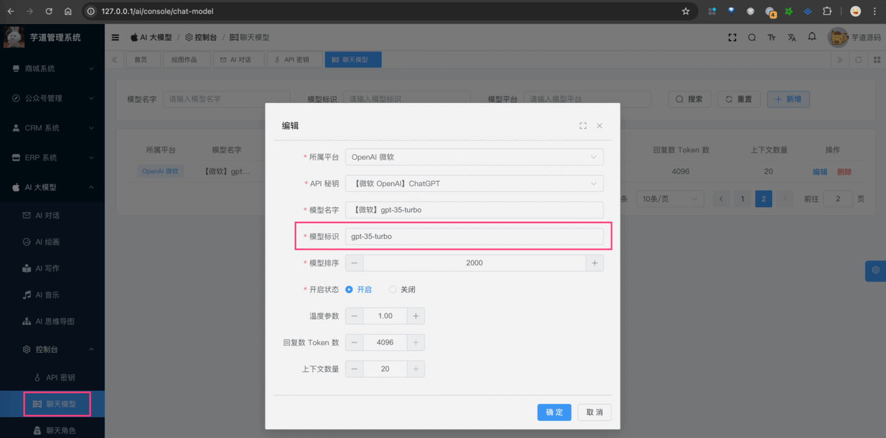

目录

# 【模型接入】微软 OpenAI

项目基于 Spring AI 提供的 [`spring-ai-azure-openai` (opens new window)](https://github.com/spring-projects/spring-ai/tree/main/models/spring-ai-azure-openai)，实现微软 Azure 上部署的 OpenAI 的接入：

功能

模型

Spring AI 客户端

AI 对话

gpt3.5、gpt4.0 等

[Azure OpenAI Chat (opens new window)](https://docs.spring.io/spring-ai/reference/api/chat/azure-openai-chat.html)

AI 绘画

[DALL (opens new window)](https://en.wikipedia.org/wiki/DALL-E)

[Azure OpenAI Image Generation (opens new window)](https://docs.spring.io/spring-ai/reference/api/image/azure-openai-image.html)

## [#](#_1-申请密钥) 1. 申请密钥
### [#](#_1-1-azure-api-申请) 1.1 Azure API 申请

可以在 [微软 Azure AI (opens new window)](https://azure.microsoft.com/en-us/products/ai-services/openai-service) 进行申请申请。

我暂时没申请过，是由 [社区小伙伴 (opens new window)](https://github.com/YunaiV/ruoyi-vue-pro/issues/614) 提供密钥进行接入的，应该不复杂。

申请完成后，应该会有类似的模型列表。如下图所示：



* * *

购买完成后，可以在我们系统的 \[AI 大模型 -> 控制台 -> API 密钥\] 菜单，进行密钥的配置。需要填写“密钥” + “自定义 API URL”。如下图所示：


### [#](#_1-2-补充说明) 1.2 补充说明

如果后续你要体验 [《AI 对话》](/ai/chat/) ，需要在 \[AI 大模型 -> 控制台 -> 聊天模型\] 菜单，配置对应的聊天模型。注意，每个模型标识的 `max_tokens`（回复数 Token 数）是不同的。



例如说：`gpt-35-turbo` 是 4096，`gpt-4o` 是 8192。

不确定的话，就填写 4096 先~跑通之后，再网上查查。

## [#](#_2-如何使用) 2. 如何使用？

① 如果你的项目里需要直接通过 `@Resource` 注入 AzureOpenAIChatModel 等对象，需要把 `application.yaml` 配置文件里的 `spring.ai.openai` 配置项，替换成你的！

```yaml
spring:
  ai:
    azure: # OpenAI 微软
      openai:
        endpoint: https://eastusprejade.openai.azure.com
        api-key: xxx

```

② 如果你希望使用 \[AI 大模型 -> 控制台 -> API 密钥\] 菜单的密钥配置，则可以通过 AiApiKeyService 的 `#getChatModel(...)`，获取对应的模型对象。

* * *

① 和 ② 这两者的后续使用，就是标准的 Spring AI 客户端的使用，调用对应的方法即可。

另外，AzureOpenAIChatModelTests 里有对应的测试用例，可以参考。