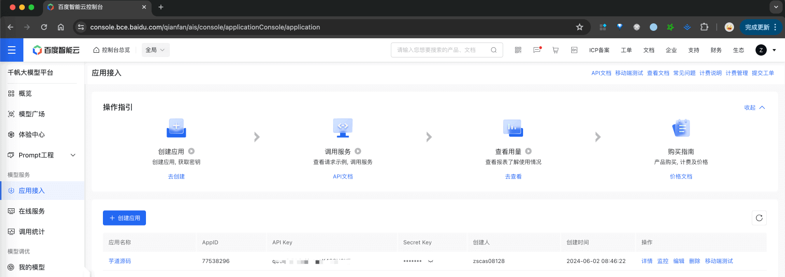

目录

# 【模型接入】文心一言

项目基于 Spring AI 提供的 [`spring-ai-qianfan` (opens new window)](https://github.com/spring-projects/spring-ai/tree/main/models/spring-ai-qianfan)，实现 [文心一言 (opens new window)](https://yiyan.baidu.com/) 的接入：

功能

模型

Spring AI 客户端

AI 对话

ERNIE-4.0、ERNIE-3.5 等

[QianFanChatModel (opens new window)](https://github.com/spring-projects/spring-ai/blob/main/models/spring-ai-qianfan/src/main/java/org/springframework/ai/qianfan/QianFanChatModel.java)

AI 绘画

[ernie\_Vilg (opens new window)](https://cloud.baidu.com/product/creativity/ernie_Vilg)

[QianFanImageModel (opens new window)](https://github.com/spring-projects/spring-ai/blob/main/models/spring-ai-qianfan/src/main/java/org/springframework/ai/qianfan/QianFanImageModel.java)

## [#](#_1-申请密钥) 1. 申请密钥

由于文心一言是非开源的模型，所以无法私有化部署，需要去官网申请 API Key，然后通过 Spring AI 提供的客户端接入。

### [#](#_1-1-申请百度云密钥) 1.1 申请百度云密钥

① 在 [百度智能云 (opens new window)](https://cloud.baidu.com/) 上，注册一个账号。

② 在百度智能云上，创建一个 [应用 (opens new window)](https://console.bce.baidu.com/qianfan/ais/console/applicationConsole/application)，获得到 API Key、Secret Key。



* * *

申请完成后，可以在我们系统的 \[AI 大模型 -> 控制台 -> API 密钥\] 菜单，进行密钥的配置。只需要填写“密钥”（`${API Key}|${Secret Key}`），不需要填写“自定义 API URL”（因为 Spring AI 默认官方地址）。如下图所示：


### [#](#_1-2-补充说明) 1.2 补充说明

① 【对话】如果后续你要体验 [《AI 对话》](/ai/chat/) ，需要在 \[AI 大模型 -> 控制台 -> 聊天模型\] 菜单，配置对应的聊天模型。注意，每个模型标识的 `max_tokens`（回复数 Token 数）一般是 2048。

具体有哪些模型，可以点击 [千帆大模型平台 (opens new window)](https://cloud.baidu.com/doc/WENXINWORKSHOP/s/Nlks5zkzu) 进行查看。例如说：`ernie_speed`、`ernie-tiny-8k` 等等。

② 【绘图】你可以参考 [《AI 绘画》](/ai/image/) ，实现文字生成图片。

注意，分辨率只允许选择 1024x1024、768x768、768x1024、1024x768、576x1024、1024x576 这几个。

## [#](#_2-如何使用) 2. 如何使用？

① 如果你的项目里需要直接通过 `@Resource` 注入 QianFanChatModel、QianFanImageModel 等对象，需要把 `application.yaml` 配置文件里的 `yudao.ai.qianfan` 配置项，替换成你的！

```yaml
spring:
  ai:
    qianfan: # 文心一言
      api-key: x0cuLZ7XsaTCU08vuJWO87Lg
      secret-key: R9mYF9dl9KASgi5RUq0FQt3wRisSnOcK

```

② 如果你希望使用 \[AI 大模型 -> 控制台 -> API 密钥\] 菜单的密钥配置，则可以通过 AiApiKeyService 的 `#getChatModel(...)` 或 `#getImageModel(...)` 方法，获取对应的模型对象。

* * *

① 和 ② 这两者的后续使用，就是标准的 Spring AI 客户端的使用，调用对应的方法即可。

另外，YiYanChatModelTests 里有对应的测试用例，可以参考。