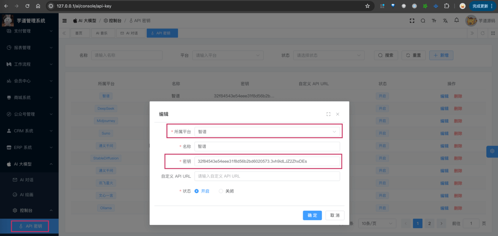

目录

# 【模型接入】智谱 GLM

项目基于 Spring AI 提供的 [`spring-ai-zhipuai` (opens new window)](https://github.com/spring-projects/spring-ai/tree/main/models/spring-ai-zhipuai)，实现 [智谱 GLM (opens new window)](https://zhipuai.cn/) 的接入：

功能

模型

Spring AI 客户端

AI 对话

GLM-4、GLM-3-Turbo 等

[ZhiPuAiChatModel (opens new window)](https://github.com/spring-projects/spring-ai/blob/main/models/spring-ai-zhipuai/src/main/java/org/springframework/ai/zhipuai/ZhiPuAiChatModel.java)

AI 绘画

[CogView (opens new window)](https://github.com/THUDM/CogView)

[ZhiPuAiImageModel (opens new window)](https://github.com/spring-projects/spring-ai/blob/main/models/spring-ai-zhipuai/src/main/java/org/springframework/ai/zhipuai/ZhiPuAiImageModel.java)

## [#](#_1-申请密钥) 1. 申请密钥

智谱 AI 有开源模型，可以私有化部署。

不过它最新、最强的模型 [GLM-4 (opens new window)](https://zhipuai.cn/news/5) 是没有开源的，所以只能通过官方的 API 服务接入。

### [#](#_1-1-申请智谱-ai-密钥) 1.1 申请智谱 AI 密钥

① 在 [智谱 AI 开放平台 (opens new window)](https://bigmodel.cn/) 上，注册一个账号。目前，默认注册就送 2500w tokens，还是蛮爽的。

② 在 [API keys (opens new window)](https://open.bigmodel.cn/usercenter/apikeys) 菜单，复制系统默认 API key 即可。

* * *

申请完成后，可以在我们系统的 \[AI 大模型 -> 控制台 -> API 密钥\] 菜单，进行密钥的配置。只需要填写“密钥”，不需要填写“自定义 API URL”（因为 Spring AI 默认官方地址）。如下图所示：



### [#](#_1-2-补充说明) 1.2 补充说明

① 【对话】如果后续你要体验 [《AI 对话》](/ai/chat/) ，需要在 \[AI 大模型 -> 控制台 -> 聊天模型\] 菜单，配置对应的聊天模型。注意，每个模型标识的 `max_tokens`（回复数 Token 数）默认 1024，最大是 4095。

具体有哪些模型，可以去官方文档查看。例如说：`GLM-4`、`GLM-3-Turbo` 等等。

② 【绘图】你可以参考 [《AI 绘画》](/ai/image/) ，实现文字生成图片。

## [#](#_2-如何使用) 2. 如何使用？

① 如果你的项目里需要直接通过 `@Resource` 注入 ZhiPuAiChatModel、ZhiPuAiImageModel 等对象，需要把 `application.yaml` 配置文件里的 `yudao.ai.zhipuai` 配置项，替换成你的！

```yaml
spring:
  ai:
    zhipuai: # 智谱 AI
      api-key: 32f84543e54eee31f8d56b2bd6020573.3vh9idLJZ2ZhxDEs

```

② 如果你希望使用 \[AI 大模型 -> 控制台 -> API 密钥\] 菜单的密钥配置，则可以通过 AiApiKeyService 的 `#getChatModel(...)` 或 `#getImageModel(...)` 方法，获取对应的模型对象。

* * *

① 和 ② 这两者的后续使用，就是标准的 Spring AI 客户端的使用，调用对应的方法即可。

另外，ZhiPuAiChatModelTests 里有对应的测试用例，可以参考。