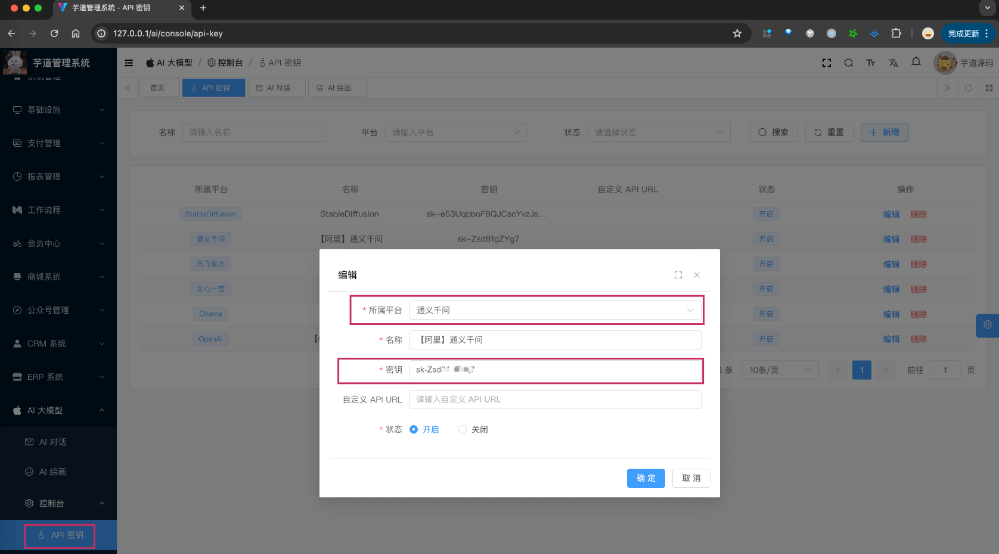
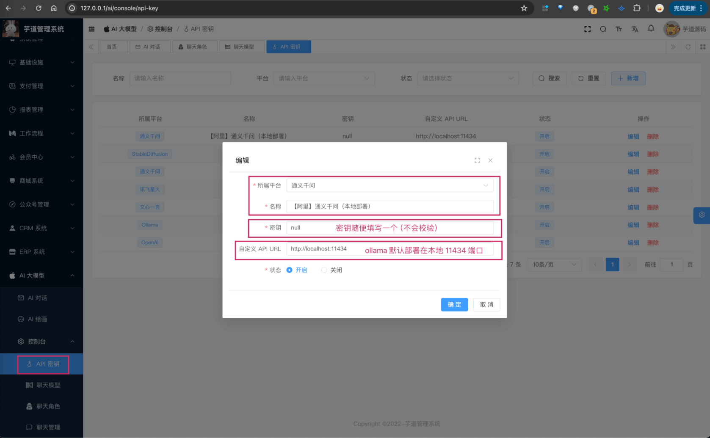

目录

# 【模型接入】通义千问

项目基于 Spring Cloud Alibaba AI 的 [`spring-cloud-alibaba-starters` (opens new window)](https://github.com/alibaba/spring-cloud-alibaba/tree/2023.x/spring-cloud-alibaba-starters)，实现 [通义千问 (opens new window)](https://tongyi.aliyun.com/) 的接入：

功能

模型

Spring AI 客户端

AI 对话

[通义千问 (opens new window)](https://help.aliyun.com/zh/dashscope/developer-reference/quick-start?spm=a2c4g.11186623.0.0.1adc77943sTgBV)

[TongYiChatModel (opens new window)](https://github.com/alibaba/spring-cloud-alibaba/blob/2023.x/spring-cloud-alibaba-starters/spring-cloud-starter-alibaba-ai/src/main/java/com/alibaba/cloud/ai/tongyi/chat/TongYiChatModel.java)

AI 绘画

[通义万象 (opens new window)](https://help.aliyun.com/zh/dashscope/developer-reference/tongyi-wanxiang/?spm=a2c4g.11186623.0.0.2f507794a1KWKV)

[TongYiImagesModel (opens new window)](https://github.com/alibaba/spring-cloud-alibaba/blob/2023.x/spring-cloud-alibaba-starters/spring-cloud-starter-alibaba-ai/src/main/java/com/alibaba/cloud/ai/tongyi/image/TongYiImagesModel.java)

## [#](#_1-申请密钥-私有部署) 1. 申请密钥（私有部署）

通义千问有[开源版本 (opens new window)](https://help.aliyun.com/document_detail/2712818.html)，提供包括 18 亿、70 亿、140 亿和 720亿 等多个规模的版本，所以我们可以私有化部署。

当然，能力更强的模型，就需要使用阿里云提供的[大模型服务 (opens new window)](https://help.aliyun.com/document_detail/2712816.html?spm=a2c4g.2786271.0.0.4e337211cCVTAk)。

下面，我们来看看这两种方式怎么申请（部署）？

友情提示：

一般情况下，建议先采用“方式一：申请阿里云密钥”，因为阿里云提供了一定的免费额度，具体可以看 [阿里云计费管理（需要登录） (opens new window)](https://dashscope.console.aliyun.com/billing)，搜“免费额度”或者“限时免费”关键字。

### [#](#_1-1-方式一-申请阿里云密钥) 1.1 方式一：申请阿里云密钥

参考 [《阿里云大模型 —— 快速模型》 (opens new window)](https://help.aliyun.com/zh/dashscope/developer-reference/quick-start) 文档，重点是“开通 DashScope 并[创建 API-KEY (opens new window)](https://help.aliyun.com/zh/dashscope/developer-reference/activate-dashscope-and-create-an-api-key)”部分，其它都不用关注。一般 1-2 分钟就可以申请完成！

* * *

申请完成后，可以在我们系统的 \[AI 大模型 -> 控制台 -> API 密钥\] 菜单，进行密钥的配置。只需要填写“密钥”，不需要填写“自定义 API URL”（因为 Spring AI 默认官方地址）。如下图所示：



具体它有哪些模型，还是可以通过 [阿里云计费管理（需要登录） (opens new window)](https://dashscope.console.aliyun.com/billing) 查看。例如说：`qwen-turbo`、`qwen-max`、`qwen-max-1201`、`qwen-max-longcontext`、`qwen-plus`。

### [#](#_1-2-方式二-私有化部署) 1.2 方式二：私有化部署

① 访问 [https://ollama.ai/download (opens new window)](https://ollama.ai/download)，下载对应系统 Ollama 客户端，然后安装。

② 安装完成后，在命令中执行 `ollama run qwen` 命令，一键部署 [通义千问开源模型 (opens new window)](https://ollama.com/library/qwen)，默认跑的是 `qwen:4b` 模型。

* * *

部署完成后，可以在我们系统的 \[AI 大模型 -> 控制台 -> API 密钥\] 菜单，进行密钥的配置。需要填写“密钥” + “自定义 API URL”（因为让 Spring AI 使用该地址）。如下图所示：



具体它有哪些模型，还是可以通过 [《Qwen —— README》 (opens new window)](https://github.com/QwenLM/Qwen/blob/main/README_CN.md) 查看。例如说：`Qwen-1.8B`、`Qwen-7B`、`Qwen-14B`、`Qwen-72B`。

### [#](#_1-3-补充说明) 1.3 补充说明

① 【对话】如果后续你要体验 [《AI 对话》](/ai/chat/) ，需要在 \[AI 大模型 -> 控制台 -> 聊天模型\] 菜单，配置对应的聊天模型。注意，每个模型标识的 `max_tokens`（回复数 Token 数）是不同的。

目前 [官方文档 (opens new window)](https://help.aliyun.com/zh/dashscope/developer-reference/api-details) 介绍，一般是 1500 或 2000。

不确定的话，就填写 1500 先~跑通之后，再网上查查。

② 【绘图】你可以参考 [《AI 绘画》](/ai/image/) ，实现文字生成图片。

## [#](#_2-如何使用) 2. 如何使用？

① 如果你的项目里需要直接通过 `@Resource` 注入 TongYiChatModel、TongYiImageModel 等对象，需要把 `application.yaml` 配置文件里的 `spring.cloud.ai.tongyi.` 配置项，替换成你的！

ps：暂时不支持“方式二：私有化部署”。（后续会支持！）

```yaml
spring:
  cloud:
    ai:
      tongyi: # 通义千问
        tongyi:
          api-key: sk-Zsd81gZYg7 # 你的密钥

```

② 如果你希望使用 \[AI 大模型 -> 控制台 -> API 密钥\] 菜单的密钥配置，则可以通过 AiApiKeyService 的 `#getChatModel(...)` 或 `#getImageModel(...)` 方法，获取对应的模型对象。

* * *

① 和 ② 这两者的后续使用，就是标准的 Spring AI 客户端的使用，调用对应的方法即可。

另外，QianWenChatModelTests 里有对应的测试用例，可以参考。