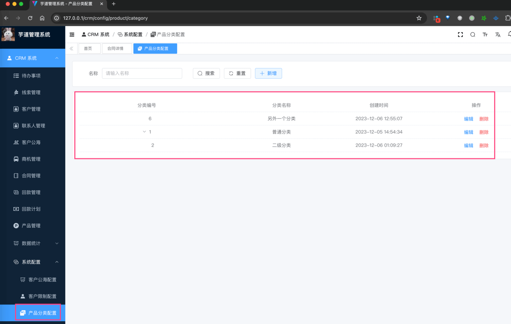
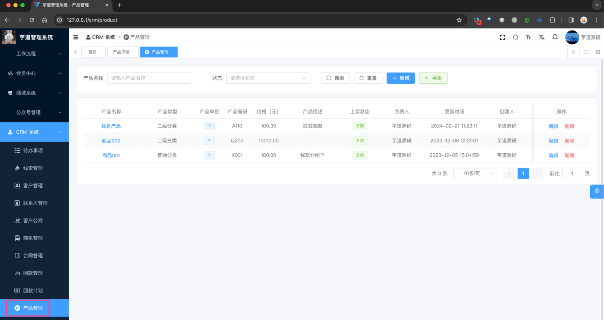
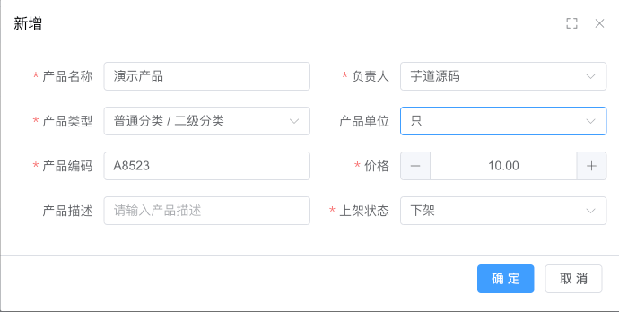
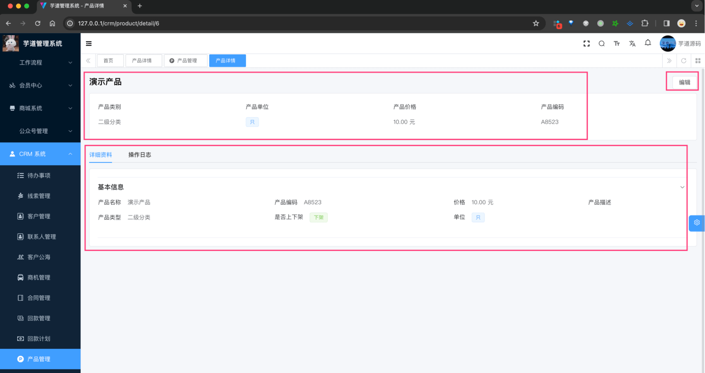

目录

# 【产品】产品管理、产品分类

友情提示：

考虑到 ERP 和 CRM 的解耦，CRM 独立做了一个产品模块。

如果你的系统即用到 ERP 又用到 CRM，并且希望使用一套产品，则可以以 ERP 产品为主进行改造。

产品模块，由 `yudao-module-crm-biz` 后端模块的 `product` 包实现，主要有产品信息、产品分类等功能。如下图所示：


## [#](#_1-产品分类) 1. 产品分类

产品分类，由 CrmProductCategoryController 提供接口。

### [#](#_1-1-表结构) 1.1 表结构

> 省略 creator/create\_time/updater/update\_time/deleted/tenant\_id 等通用字段

```sql
CREATE TABLE `crm_product_category` (
  `id` bigint NOT NULL AUTO_INCREMENT COMMENT '分类编号',
  `name` varchar(100) CHARACTER SET utf8mb4 COLLATE utf8mb4_unicode_ci NOT NULL COMMENT '分类名称',
  
  `parent_id` bigint NOT NULL COMMENT '父级编号',
  PRIMARY KEY (`id`) USING BTREE
) ENGINE=InnoDB AUTO_INCREMENT=7 DEFAULT CHARSET=utf8mb4 COLLATE=utf8mb4_unicode_ci COMMENT='CRM 产品分类表';

```

分类目前支持 2 级分类，即 `parent_id` 为 0 的是一级分类，否则是二级分类。

### [#](#_1-2-管理后台) 1.2 管理后台

对应 \[CRM 系统 -> 系统配置 -> 产品分类\] 菜单，对应 `yudao-ui-admin-vue3` 项目的 `@/views/crm/product/category` 目录。



## [#](#_2-产品管理) 2. 产品管理

产品管理，由 CrmProductController 提供接口。

### [#](#_2-1-表结构) 2.1 表结构

> 省略 creator/create\_time/updater/update\_time/deleted/tenant\_id 等通用字段

```sql
CREATE TABLE `crm_product` (
  `id` bigint NOT NULL AUTO_INCREMENT COMMENT '产品编号',
  `name` varchar(100) CHARACTER SET utf8mb4 COLLATE utf8mb4_unicode_ci NOT NULL COMMENT '产品名称',
  
  `category_id` bigint NOT NULL COMMENT '产品分类编号',
  `unit` tinyint DEFAULT NULL COMMENT '单位',
  `status` tinyint NOT NULL DEFAULT '1' COMMENT '状态',

  `owner_user_id` bigint NOT NULL COMMENT '负责人的用户编号',  
  `no` varchar(20) CHARACTER SET utf8mb4 COLLATE utf8mb4_unicode_ci NOT NULL COMMENT '产品编码',
  `price` decimal(24,6) DEFAULT '0.000000' COMMENT '价格，单位：元',
  `description` varchar(100) CHARACTER SET utf8mb4 COLLATE utf8mb4_unicode_ci DEFAULT NULL COMMENT '产品描述',
  PRIMARY KEY (`id`) USING BTREE
) ENGINE=InnoDB AUTO_INCREMENT=6 DEFAULT CHARSET=utf8mb4 COLLATE=utf8mb4_unicode_ci COMMENT='CRM 产品表';

```

① `unit` 字段：产品单位，对应 `crm_product_unit` 数据字典。

② `status` 字段：产品状态，0 开启、1 禁用。

③ `category_id` 字段：产品分类编号，对应 `crm_product_category` 表。

其它字段，都是一些信息字段，暂时没有什么特殊逻辑。

### [#](#_2-2-管理后台) 2.2 管理后台

对应 \[CRM 系统 -> 产品管理 -> 产品管理\] 菜单，对应 `yudao-ui-admin-vue3` 项目的 `@/views/crm/product` 目录。



① 点击【新增】按钮，随便填写一些信息，点击「确认」按钮，即可新增一个产品。如下图所示：



④ 点击“产品名称”，进入产品详情页，可以查看产品的详细信息，如下图所示：

