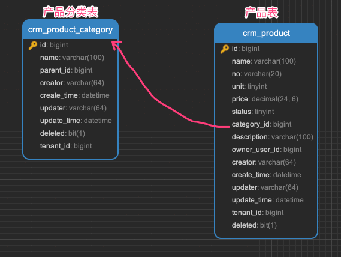
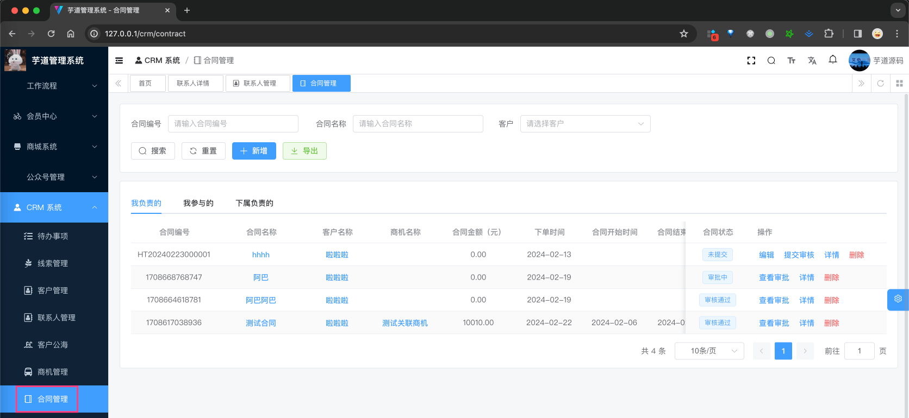
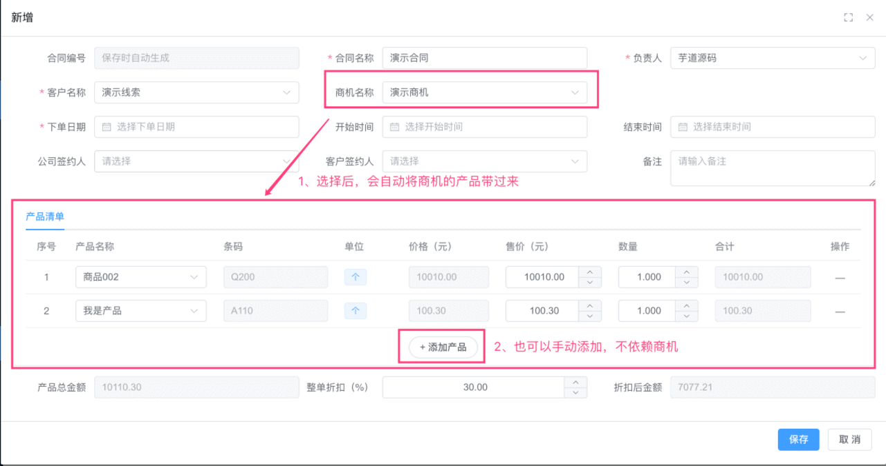
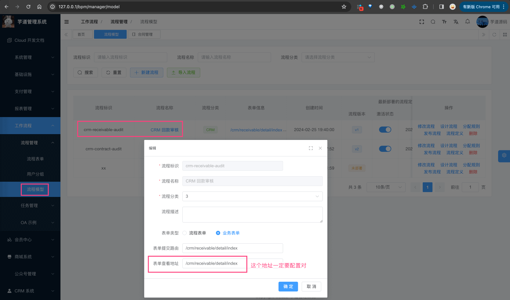
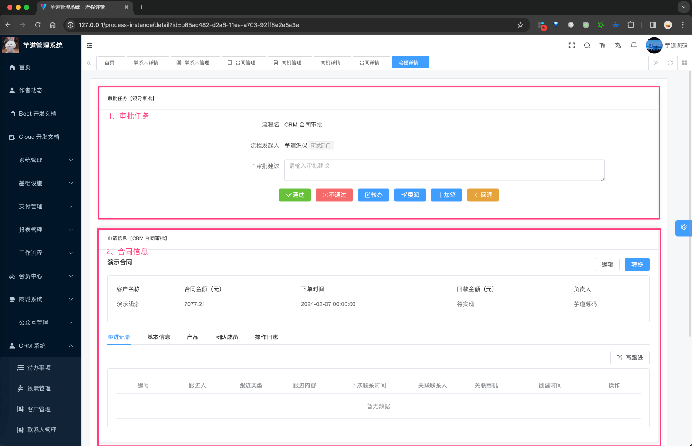
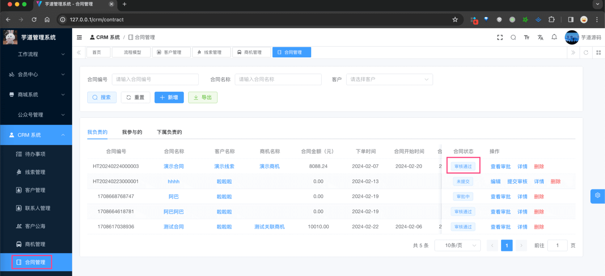
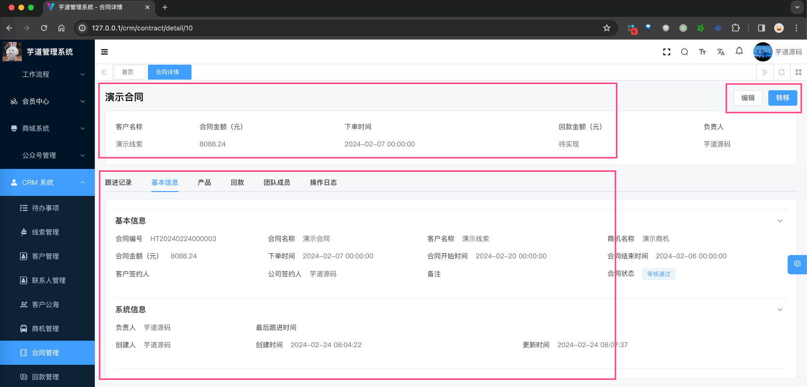
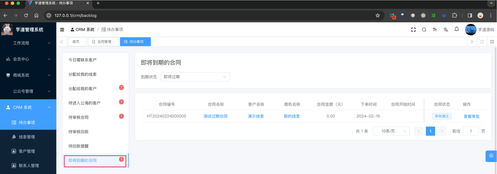
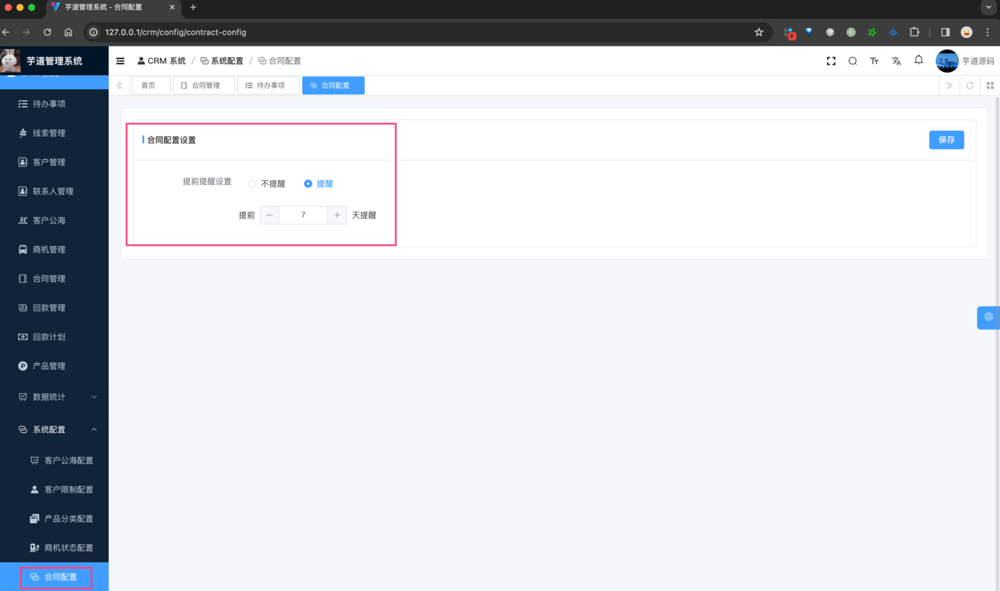

目录

# 【合同】合同管理、合同提醒

合同模块，由 `yudao-module-crm-biz` 后端模块的 `contract` 包实现，已经和 [BPM 工作流](/bpm/) 打通审批。

## [#](#_1-合同) 1. 合同

合同，由 `yudao-module-crm-biz` 后端模块的 `business` 包的 CrmContractController 实现。表关系如下：



### [#](#_1-表结构) 1. 表结构

> 【合同表】省略 creator/create\_time/updater/update\_time/deleted/tenant\_id 等通用字段

```sql
CREATE TABLE `crm_contract` (
  `id` bigint NOT NULL AUTO_INCREMENT COMMENT '编号，主键自增',
  `name` varchar(128) CHARACTER SET utf8mb4 COLLATE utf8mb4_unicode_ci NOT NULL COMMENT '合同名称',
  `no` varchar(128) CHARACTER SET utf8mb4 COLLATE utf8mb4_unicode_ci NOT NULL COMMENT '合同编号',
  
  `customer_id` bigint NOT NULL COMMENT '客户编号',
  `business_id` bigint DEFAULT NULL COMMENT '商机编号',
  
  `contact_last_time` datetime DEFAULT NULL COMMENT '最后跟进时间',
  
  `owner_user_id` bigint DEFAULT NULL COMMENT '负责人的用户编号',
  
  `process_instance_id` varchar(64) COLLATE utf8mb4_unicode_ci DEFAULT NULL COMMENT '工作流编号',
  `audit_status` tinyint NOT NULL DEFAULT '0' COMMENT '审批状态',

  `total_product_price` decimal(24,6) DEFAULT NULL COMMENT '产品总金额',
  `discount_percent` decimal(24,6) DEFAULT NULL COMMENT '整单折扣',
  `total_price` decimal(10,2) DEFAULT NULL COMMENT '合同总金额',
  
  `order_date` datetime DEFAULT NULL COMMENT '下单日期',
  `start_time` datetime DEFAULT NULL COMMENT '开始时间',
  `end_time` datetime DEFAULT NULL COMMENT '结束时间',
  `sign_contact_id` bigint DEFAULT NULL COMMENT '联系人编号',
  `sign_user_id` bigint DEFAULT NULL COMMENT '公司签约人',
  
  PRIMARY KEY (`id`) USING BTREE
) ENGINE=InnoDB AUTO_INCREMENT=8 DEFAULT CHARSET=utf8mb4 COLLATE=utf8mb4_unicode_ci COMMENT='CRM 合同表';

```

① `no` 字段：合同编号，系统自动生成的，目前格式是 `{prefix}{yyyyMMdd}{6 位自增}`。具体可见 ErpNoRedisDAO 类。

② `customer_id` 字段：客户编号，对应 `crm_customer` 表的 `id` 字段，必填。

③ `business_id` 字段：商机编号，对应 `crm_business` 表的 `id` 字段，选填。在选择商机时，会自动带出商机的 `crm_business_product` 表的产品信息，稍后会看到

④ `contact_last_time` 字段：跟进相关，和线索类似。不重复赘述，详细可见 [《【通用】跟进记录》](/crm/follow-up/) 文档。

⑤ `owner_user_id` 字段：合同的负责人编号，和线索类似。不重复赘述，详细可见 [《【通用】数据权限》](/crm/permission/) 文档。

⑥ `process_instance_id` 字段：工作流编号，用于和 [BPM 工作流](/bpm/) 打通审批。提交审批后，会自动创建一个工作流实例，并记录到该字段。

`audit_status` 字段：审批结果，目前由 CrmAuditStatusEnum 枚举，目前有 5 个状态：未提交、审批中、审批通过、审批不通过、已取消。

⑤ `total_product_price`、`discount_percent`、`total_price` 字段：合同的金额相关，关系是 `total_price = total_product_price * discount_percent`。

其中，`total_product_price` 字段是 `crm_contract_product` 表的 `total_price * count` 的累加。

⑥ 从 `order_date` 到 `sign_user_id` 字段：合同的信息字段，比较简单，不重复赘述。

> 【合同产品表】省略 creator/create\_time/updater/update\_time/deleted/tenant\_id 等通用字段

```sql
CREATE TABLE `crm_contract_product` (
  `id` bigint NOT NULL AUTO_INCREMENT COMMENT '主键',
  
  `contract_id` bigint NOT NULL COMMENT '合同编号',
  `product_id` bigint NOT NULL COMMENT '产品编号',
  
  `product_price` decimal(24,6) NOT NULL COMMENT '产品单价',
  `contract_price` decimal(24,6) NOT NULL COMMENT '合同价格',
  `count` decimal(24,6) NOT NULL COMMENT '数量',
  `total_price` decimal(24,6) NOT NULL COMMENT '总计价格',
  
  PRIMARY KEY (`id`) USING BTREE
) ENGINE=InnoDB AUTO_INCREMENT=39 DEFAULT CHARSET=utf8mb4 COLLATE=utf8mb4_unicode_ci ROW_FORMAT=DYNAMIC COMMENT='CRM 合同产品关联表';

```

友情提示：整体和商机产品表 \`crm\_business\_product\` 类似。因为本身商机进一步转化后，就是合同。

① `contract_id` 字段：合同编号，对应 `crm_contract` 表的 `id` 字段。

`product_id` 字段：产品编号，对应 `crm_product` 表的 `id` 字段。

② `product_price` 字段：产品单价，**冗余**，来自 `crm_product` 表的 `price` 字段。目的是，和 `contract_price` 字段比较，看看是否有折扣。

`count`、`total_price` 字段：数量、总计价格。

### [#](#_2-管理后台) 2. 管理后台

对应 \[CRM 系统 -> 合同管理\] 菜单，对应 `yudao-ui-admin-vue3` 项目的 `@/views/crm/contract` 目录。



① 点击【新增】按钮，随便填写一些信息，点击「确认」按钮，即可新增一条合同。如下图所示：



② 点击【提交审批】按钮，可以提交审批。如下图所示：


友情提示：

合同对应的审批流程，需要自己在 \[工作流程 -> 流程管理 -> 流程模型\] 菜单，配置一个流程标识为 `crm-contract-audit` 的流程模型。如下图所示：



如果不了解怎么配置的同学，可以学习下 [《BPM 工作流》](/bpm/) 的文档。

提交完成后，会自动创建一个工作流实例，并记录到 `process_instance_id` 字段。之后可点击【查看审批】按钮，查看审批详情。如下图所示：



点击审批【通过】按钮，将合同审批通过，此时它会回调 CrmContractResultListener 监听器，更新合同的 `audit_status` 字段为审批通过。如下图所示：



③ 点击“合同名称”，进入合同详情页，可以查看合同的详细信息，如下图所示：



## [#](#_2-合同配置) 2. 合同配置

客户公海配置，由 `yudao-module-crm-biz` 后端模块的 `contract` 包的 CrmContractConfigController 实现。

### [#](#_2-1-表结构) 2.1 表结构

> 省略 creator/create\_time/updater/update\_time/deleted/tenant\_id 等通用字段

```sql
CREATE TABLE `crm_contract_config` (
  `id` bigint NOT NULL AUTO_INCREMENT COMMENT '编号',
  `notify_enabled` tinyint(1) DEFAULT NULL COMMENT '是否开启提前提醒',
  `notify_days` int DEFAULT NULL COMMENT '提前提醒天数',
  PRIMARY KEY (`id`) USING BTREE
) ENGINE=InnoDB AUTO_INCREMENT=2 DEFAULT CHARSET=utf8mb4 COLLATE=utf8mb4_unicode_ci COMMENT='CRM 合同配置表';

```

目前主要是合同提醒功能。

`notify_enabled` 字段：是否开启提前提醒。如果开启，合同的结束时间 `end_time` 超过今天，并且小于 `notify_days` 天的，可以在 \[CRM 系统 -> 待办事项\] 菜单中，看到提醒。如下图所示：



### [#](#_2-2-管理后台) 2.2 管理后台

对应 \[CRM 系统 -> 系统配置 -> 合同配置\] 菜单，对应 `yudao-ui-admin-vue3` 项目的 `@/views/contract/config` 目录。

