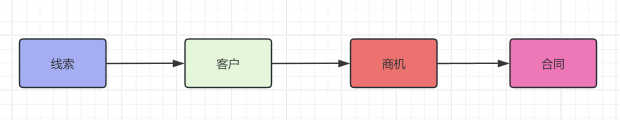
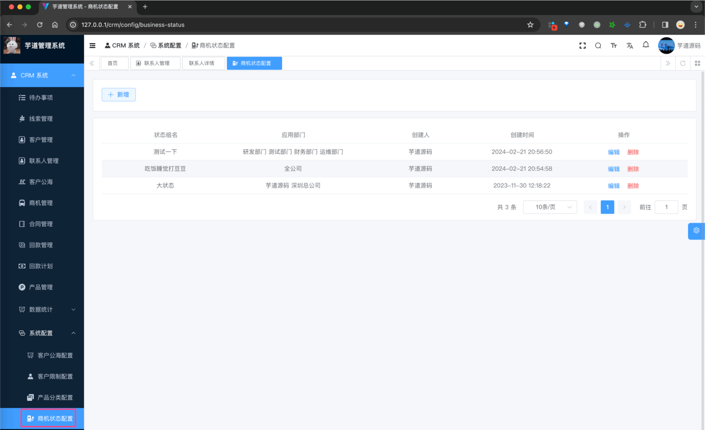
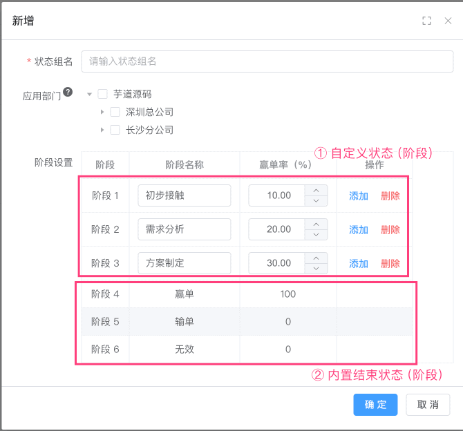
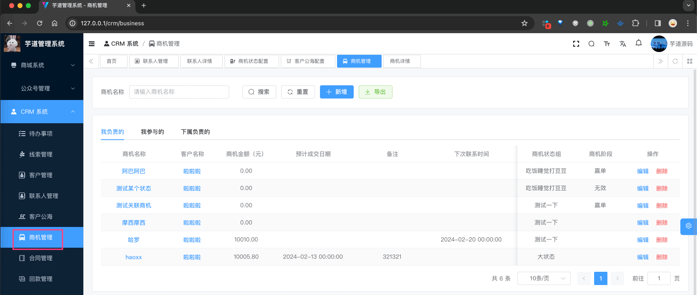
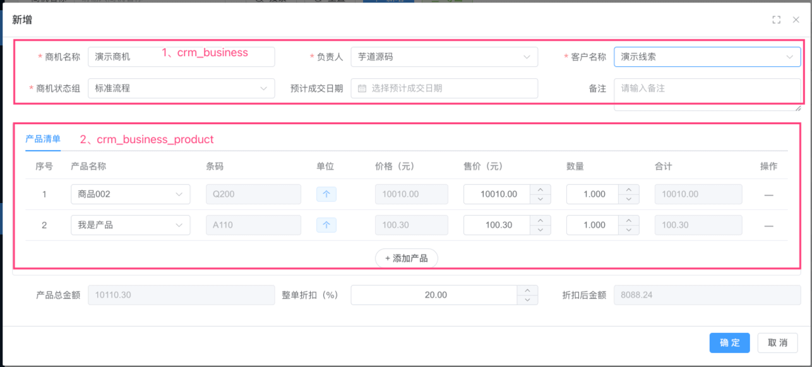
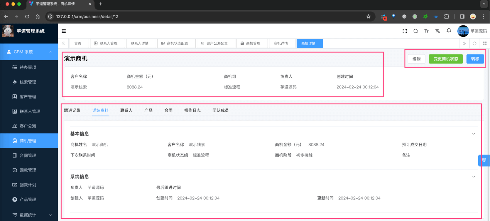
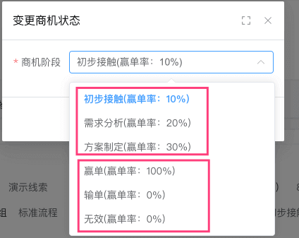
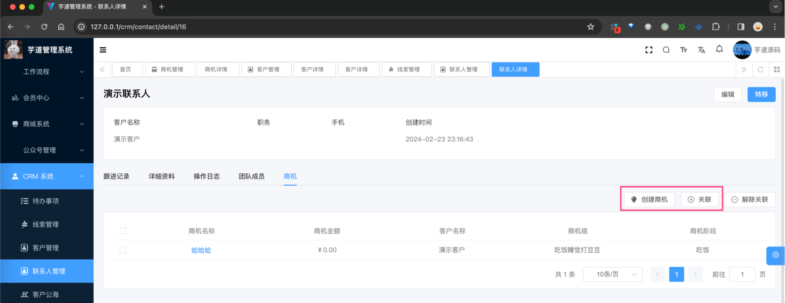
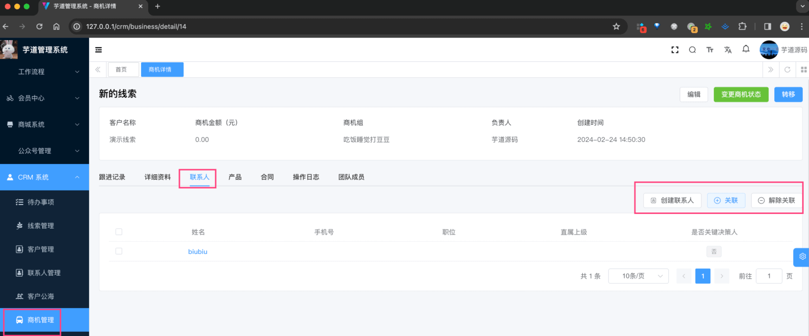

目录

# 【商机】商机管理、商机状态

CRM 商机，是指 CRM 系统中可能转化为实际销售的潜在业务机会【商机】，这些机会有可能转化为实际的销售【合同】。



一个商机，通常需要经过一系列的销售阶段，如挖掘、资格验证、需求分析、价值评估等，最后才能成为一笔实际的交易。因此，整体的表结构如下：


* * *

商机模块，由 `yudao-module-crm-biz` 后端模块的 `business` 包实现，包括两个部分：商机信息、商机状态配置。

## [#](#_1-商机状态) 1. 商机状态

商机状态，由 `yudao-module-crm-biz` 后端模块的 `business` 包的 CrmBusinessStatusController 实现。

### [#](#_1-1-表结构) 1.1 表结构

> 【商机状态组表】省略 creator/create\_time/updater/update\_time/deleted/tenant\_id 等通用字段

```sql
CREATE TABLE `crm_business_status_type` (
  `id` bigint NOT NULL AUTO_INCREMENT COMMENT '主键',
  `name` varchar(100) CHARACTER SET utf8mb4 COLLATE utf8mb4_unicode_ci NOT NULL COMMENT '状态组名',
  
  `dept_ids` varchar(255) CHARACTER SET utf8mb4 COLLATE utf8mb4_unicode_ci NOT NULL COMMENT '使用的部门编号',
  PRIMARY KEY (`id`) USING BTREE
) ENGINE=InnoDB AUTO_INCREMENT=6 DEFAULT CHARSET=utf8mb4 COLLATE=utf8mb4_unicode_ci COMMENT='CRM 商机状态组表';

```

为什么需要商机状态组表？因为不同的商机，它的状态流程是不一样的。比如：

*   状态组 1：“初步接触”、“需求分析”、“方案制定”、“商务谈判”、“合同签订”、“赢单”、“输单”、“无效”等等
*   状态组 2：“功能演示”、“直接付款”、“赢单”、“输单”、“无效”等等。

当然无论哪种状态组，结束时必然是 CrmBusinessEndStatusEnum 枚举，对应“赢单”、“输单”、“无效”三种。

① `name` 字段：状态组名字。

② `dept_ids` 字段：哪些部门可以使用该状态组。如果不设置，默认全公司。

> 【商机状态（阶段）表】省略 creator/create\_time/updater/update\_time/deleted/tenant\_id 等通用字段

```sql
CREATE TABLE `crm_business_status` (
  `id` bigint NOT NULL AUTO_INCREMENT COMMENT '主键',
  `type_id` bigint NOT NULL COMMENT '状态类型编号',
  `name` varchar(100) CHARACTER SET utf8mb4 COLLATE utf8mb4_unicode_ci NOT NULL COMMENT '状态类型名',
  `percent` decimal(24,6) NOT NULL COMMENT '赢单率',
  `sort` int NOT NULL DEFAULT '1' COMMENT '排序',
  PRIMARY KEY (`id`) USING BTREE
) ENGINE=InnoDB AUTO_INCREMENT=9 DEFAULT CHARSET=utf8mb4 COLLATE=utf8mb4_unicode_ci COMMENT='CRM 商机状态表';

```

① `type_id` 字段：状态类型（阶段）编号，对应 `crm_business_status_type` 表的 `id` 字段。

② `name` 字段：状态类型（阶段）名字。`percent` 字段：赢单率，即该状态下的商机最终成交的概率。

当然，这 2 个本质也是字段，没什么特殊逻辑。

### [#](#_1-2-管理后台) 1.2 管理后台

对应 \[CRM 系统 -> 系统配置 -> 商机状态配置\] 菜单，对应 `yudao-ui-admin-vue3` 项目的 `@/views/crm/business/status` 目录。



点击【新增】按钮，可以新增商机状态组，如下图所示：



## [#](#_2-商机) 2. 商机

商机，由 `yudao-module-crm-biz` 后端模块的 `business` 包的 CrmBusinessController 实现。

### [#](#_2-1-表结构) 2.1 表结构

> 【商机表】省略 creator/create\_time/updater/update\_time/deleted/tenant\_id 等通用字段

```sql
CREATE TABLE `crm_business` (
  `id` bigint NOT NULL AUTO_INCREMENT COMMENT '编号',
  `name` varchar(100) CHARACTER SET utf8mb4 COLLATE utf8mb4_0900_ai_ci NOT NULL COMMENT '商机名称',
  `customer_id` bigint NOT NULL COMMENT '客户编号',

  `owner_user_id` bigint DEFAULT NULL COMMENT '负责人的用户编号',
  
  `follow_up_status` bit(1) DEFAULT b'0' COMMENT '跟进状态',
  `contact_last_time` datetime DEFAULT NULL COMMENT '最后跟进时间',
  `contact_next_time` datetime DEFAULT NULL COMMENT '下次联系时间',
  
  `status_type_id` bigint DEFAULT NULL COMMENT '商机状态类型编号',
  `status_id` bigint DEFAULT NULL COMMENT '商机状态编号',
  `end_status` tinyint DEFAULT NULL COMMENT '结束状态：1-赢单 2-输单3-无效',
  
  `deal_time` datetime DEFAULT NULL COMMENT '预计成交日期',
  `remark` varchar(500) CHARACTER SET utf8mb4 COLLATE utf8mb4_0900_ai_ci DEFAULT NULL COMMENT '备注',

  `total_product_price` decimal(24,6) DEFAULT NULL COMMENT '产品总金额，单位：元',
  `discount_percent` decimal(24,6) DEFAULT NULL COMMENT '整单折扣，百分比',
  `total_price` decimal(24,6) DEFAULT NULL COMMENT '商机总金额，单位：元',

  PRIMARY KEY (`id`) USING BTREE
) ENGINE=InnoDB AUTO_INCREMENT=12 DEFAULT CHARSET=utf8mb4 COLLATE=utf8mb4_0900_ai_ci COMMENT='CRM 商机表';

```

① `customer_id` 字段：客户编号，对应 `crm_customer` 表的 `id` 字段，必填。

② `owner_user_id` 字段：，商机的负责人编号，和线索类似。不重复赘述，详细可见 [《【通用】数据权限》](/crm/permission/) 文档。

③ 从 `follow_up_status` 到 `contact_next_time` 字段：跟进相关，和线索类似。不重复赘述，详细可见 [《【通用】跟进记录》](/crm/follow-up/) 文档。

④ `status_type_id` 字段：商机状态类型编号，对应 `crm_business_status_type` 表的 `id` 字段。`status_id` 字段：商机状态编号，对应 `crm_business_status` 表的 `id` 字段。

当商机结束时，会记录 `end_status` 字段，对应 CrmBusinessEndStatusEnum 枚举，最终就是“赢单”、“输单”、“无效”三种。

⑤ `total_product_price`、`discount_percent`、`total_price` 字段：商机的金额相关，关系是 `total_price = total_product_price * discount_percent`。

其中，`total_product_price` 字段是 `crm_business_product` 表的 `total_price * count` 的累加。

> 【商机产品表】省略 creator/create\_time/updater/update\_time/deleted/tenant\_id 等通用字段

```sql
CREATE TABLE `crm_business_product` (
  `id` bigint NOT NULL AUTO_INCREMENT COMMENT '主键',
  
  `business_id` bigint NOT NULL COMMENT '商机编号',
  `product_id` bigint NOT NULL COMMENT '产品编号',
  
  `product_price` decimal(24,6) NOT NULL COMMENT '产品单价',
  `business_price` decimal(24,6) NOT NULL COMMENT '商机价格',
  `count` decimal(24,6) NOT NULL COMMENT '数量',
  `total_price` decimal(24,6) NOT NULL COMMENT '总计价格',
  
  PRIMARY KEY (`id`) USING BTREE
) ENGINE=InnoDB AUTO_INCREMENT=33 DEFAULT CHARSET=utf8mb4 COLLATE=utf8mb4_unicode_ci ROW_FORMAT=DYNAMIC COMMENT='CRM 商机产品关联表';

```

① `business_id` 字段：商机编号，对应 `crm_business` 表的 `id` 字段。

`product_id` 字段：产品编号，对应 `crm_product` 表的 `id` 字段。

② `product_price` 字段：产品单价，**冗余**，来自 `crm_product` 表的 `price` 字段。目的是，和 `business_price` 字段比较，看看是否有折扣。

`count`、`total_price` 字段：数量、总计价格。

### [#](#_2-2-管理后台) 2.2 管理后台

对应 \[CRM 系统 -> 商机管理\] 菜单，对应 `yudao-ui-admin-vue3` 项目的 `@/views/crm/business` 目录。



① 点击【新增】按钮，随便填写一些信息，点击「确认」按钮，即可新增一条商机。如下图所示：



② 点击“商机名称”，进入商机详情页，可以查看商机的详细信息，如下图所示：



③ 点击【变更商机状态】按钮，可以变更商机的状态，如下图所示：



可以多次变更，直到 `end_status` 字段有值，即商机结束，即“赢单”、“输单”、“无效”三种。

## [#](#_3-联系人与商机的关联) 3. 联系人与商机的关联

联系人与商机之间，可以进行关联。这个功能，由 `yudao-module-crm-biz` 后端模块的 `contact` 包的 CrmContactController 实现。

### [#](#_3-1-表结构) 3.1 表结构

```sql
CREATE TABLE `crm_contact_business` (
  `id` int NOT NULL AUTO_INCREMENT COMMENT '主键',
  `contact_id` int DEFAULT NULL COMMENT '联系人id',
  `business_id` int DEFAULT NULL COMMENT '商机id',
  PRIMARY KEY (`id`)
) ENGINE=InnoDB AUTO_INCREMENT=34 DEFAULT CHARSET=utf8mb4 COLLATE=utf8mb4_unicode_ci COMMENT='CRM 联系人商机关联表';

```

比较简单，就是 `contact_id` 字段和 `business_id` 字段的关联。

### [#](#_3-2-管理后台) 3.2 管理后台

① 在联系人详情页，在 \[商机\] 标签页，可以查看联系人关联的商机，如下图所示：



*   点击【创建商机】按钮，可以创建一个新的商机，同时关联到当前联系人
*   点击【关联】按钮，可以关联已有的商机到当前联系人。但是要注意，只能关联联系人 `customer_id` 字段相同的商机

② 在商机详情页，在 \[联系人\] 标签页，可以查看商机关联的联系人，如下图所示：



*   点击【创建联系人】按钮，可以创建一个新的联系人，同时关联到当前商机
*   点击【关联】按钮，可以关联已有的联系人到当前商机。但是要注意，只能关联商机 `customer_id` 字段相同的联系人