目录

# 【回款】回款管理、回款计划

CRM 回款，主要指的是在销售过程中，企业与客户签订销售【合同】后，从客户那里实际收到的款项的记录。

回款模块，由 `yudao-module-crm-biz` 后端模块的 `receivable` 包实现，已经和 [BPM 工作流](/bpm/) 打通审批。

目前有两种回款链路，因此表关系如下图所示：

*   【合同】=>【回款】
*   【合同】=>【回款计划】=>【回款】


## [#](#_1-回款) 1. 回款

回款，由 `yudao-module-crm-biz` 后端模块的 `receivable` 包的 CrmReceivableController 实现。

### [#](#_1-表结构) 1. 表结构

> 【回款表】省略 creator/create\_time/updater/update\_time/deleted/tenant\_id 等通用字段

```sql
CREATE TABLE `crm_receivable` (
  `id` bigint NOT NULL AUTO_INCREMENT COMMENT 'ID',
  `no` varchar(100) CHARACTER SET utf8mb4 COLLATE utf8mb4_unicode_ci NOT NULL COMMENT '回款编号',
  
  `customer_id` bigint NOT NULL COMMENT '客户ID',
  `contract_id` bigint NOT NULL COMMENT '合同ID',
  
  `plan_id` bigint DEFAULT NULL COMMENT '回款计划ID',
  
  `owner_user_id` bigint DEFAULT NULL COMMENT '负责人的用户编号',
  
  `audit_status` tinyint NOT NULL COMMENT '审批状态',
  `process_instance_id` varchar(64) COLLATE utf8mb4_unicode_ci DEFAULT NULL COMMENT '工作流编号',

  `price` decimal(24,6) NOT NULL COMMENT '回款金额',
  
  `return_time` datetime DEFAULT NULL COMMENT '回款日期',
  `return_type` int DEFAULT NULL COMMENT '回款方式',
  `remark` varchar(500) CHARACTER SET utf8mb4 COLLATE utf8mb4_unicode_ci DEFAULT NULL COMMENT '备注',
  PRIMARY KEY (`id`) USING BTREE
) ENGINE=InnoDB AUTO_INCREMENT=29 DEFAULT CHARSET=utf8mb4 COLLATE=utf8mb4_unicode_ci COMMENT='CRM 回款管理';

```

① `no` 字段：回款编号，系统自动生成的，目前格式是 `{prefix}{yyyyMMdd}{6 位自增}`。具体可见 ErpNoRedisDAO 类。

② `customer_id` 和 `contract_id` 字段：客户编号和合同编号，对应 `crm_customer` 表和 `crm_contract` 表的 `id` 字段，必填。

③ `plan_id` 字段：回款计划编号，对应 `crm_receivable_plan` 表的 `id` 字段，选填。只有在【合同】=>【回款计划】=>【回款】的情况下，才会有值。

④ `owner_user_id` 字段：回款的负责人编号，和线索类似。不重复赘述，详细可见 [《【通用】数据权限》](/crm/permission/) 文档。

⑤ `process_instance_id` 字段：工作流编号，用于和 [BPM 工作流](/bpm/) 打通审批。提交审批后，会自动创建一个工作流实例，并记录到该字段。

`audit_status` 字段：审批结果，目前由 CrmAuditStatusEnum 枚举，目前有 5 个状态：未提交、审批中、审批通过、审批不通过、已取消。

⑥ `price` 字段：回款金额。一个合同可能有多次回款，它总的回款金额不能超过合同金额。

⑦ `return_time`、`return_type`、`remark` 字段：回款日期、回款方式、备注。就是信息字段，没什么特殊逻辑。

### [#](#_2-2-管理后台) 2.2 管理后台

对应 \[CRM 系统 -> 回款管理\] 菜单，对应 `yudao-ui-admin-vue3` 项目的 `@/views/crm/receivable` 目录。

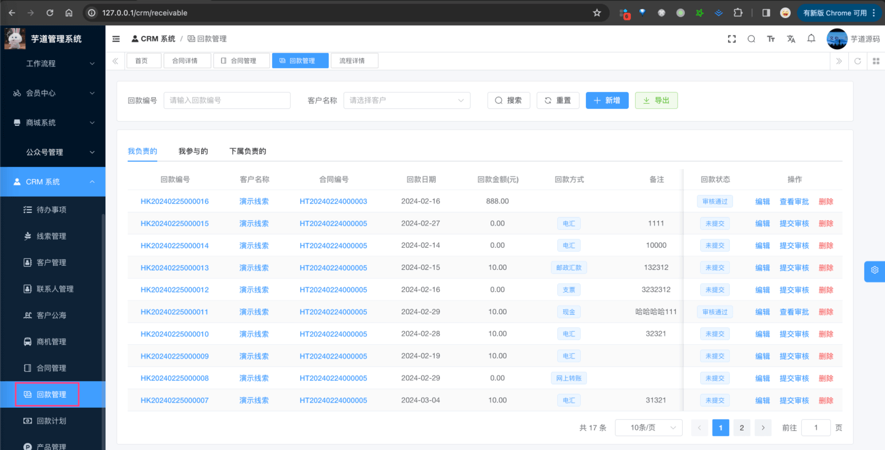

① 参考 [《【合同】合同管理、合同提醒》](/crm/contract) 文档，创建一个合同。注意，必须审核通过，才能进行回款。

② 点击【新增】按钮，随便填写一些信息，点击「确认」按钮，即可新增一条回款。如下图所示：

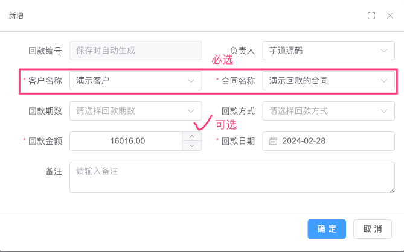

这样，我们就完成了【合同】=>【回款】的整个回款链路。

② 点击【提交审批】按钮，可以提交审批。如下图所示：

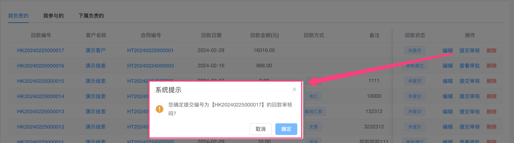

友情提示：

回款对应的审批流程，需要自己在 \[工作流程 -> 流程管理 -> 流程模型\] 菜单，配置一个流程标识为 `crm-receivable-audit` 的流程模型。如下图所示：


如果不了解怎么配置的同学，可以学习下 [《BPM 工作流》](/bpm/) 的文档。

提交完成后，会自动创建一个工作流实例，并记录到 `process_instance_id` 字段。之后可点击【查看审批】按钮，查看审批详情。如下图所示：

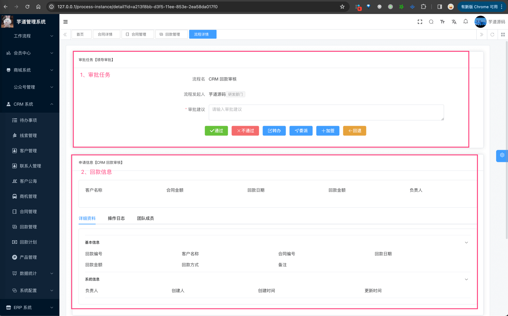

点击审批【通过】按钮，将回款审批通过，此时它会回调 CrmReceivableResultListener 监听器，更新回款的 `audit_status` 字段为审批通过。如下图所示：

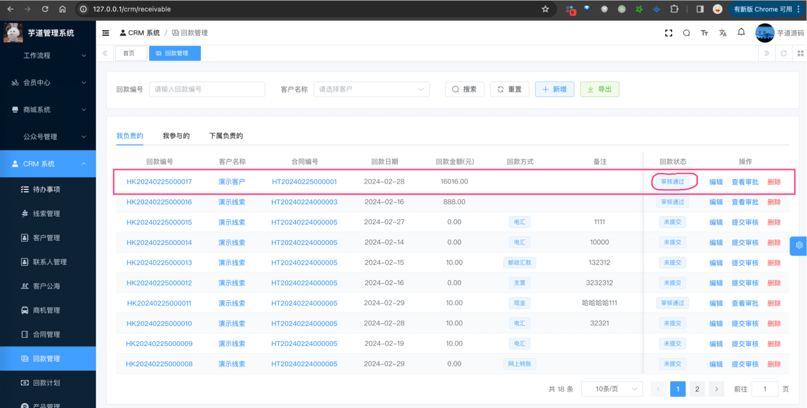

③ 点击“回款编号”，进入回款详情页，可以查看回款的详细信息，如下图所示：

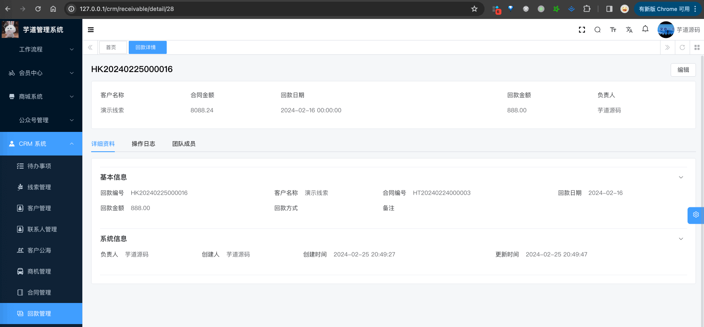

* * *

另外，也可以在【合同】的详情页，进行【回款】的创建。如下图所示：


## [#](#_2-回款计划) 2. 回款计划

回款计划，由 `yudao-module-crm-biz` 后端模块的 `receivable` 包的 CrmReceivablePlanController 实现。

### [#](#_2-1-表结构) 2.1 表结构

> 【回款计划表】省略 creator/create\_time/updater/update\_time/deleted/tenant\_id 等通用字段

```sql
CREATE TABLE `crm_receivable_plan` (
  `id` bigint NOT NULL AUTO_INCREMENT COMMENT 'ID',
  
  `period` bigint NOT NULL COMMENT '期数',
  
  `customer_id` bigint NOT NULL COMMENT '客户编号',
  `contract_id` bigint NOT NULL COMMENT '合同编号',
  
  `owner_user_id` bigint DEFAULT NULL COMMENT '负责人编号',
  
  `receivable_id` bigint DEFAULT NULL COMMENT '回款编号',
  
  `return_time` datetime DEFAULT NULL COMMENT '计划回款日期',
  `return_type` tinyint DEFAULT NULL COMMENT '计划还款方式',
  `price` decimal(24,6) NOT NULL COMMENT '计划回款金额',
  `remind_days` bigint DEFAULT NULL COMMENT '提前几天提醒',
  `remind_time` datetime DEFAULT NULL COMMENT '提醒日期',
  `remark` varchar(500) CHARACTER SET utf8mb4 COLLATE utf8mb4_unicode_ci DEFAULT NULL COMMENT '备注',
  PRIMARY KEY (`id`) USING BTREE
) ENGINE=InnoDB AUTO_INCREMENT=7 DEFAULT CHARSET=utf8mb4 COLLATE=utf8mb4_unicode_ci COMMENT='CRM 回款计划';

```

由于 `crm_receivable_plan` 是 `crm_receivable` 的计划（草稿），所以结构上非常相似。

① `period` 字段：期数，比如第一期、第二期、第三期等。目前是基于 `contract_id` 在 `crm_receivable_plan` 表中的最大期数加 1。

② `customer_id` 和 `contract_id` 字段：客户编号和合同编号，对应 `crm_customer` 表和 `crm_contract` 表的 `id` 字段，必填。

③ `owner_user_id` 字段：回款计划的负责人编号，和线索类似。不重复赘述，详细可见 [《【通用】数据权限》](/crm/permission/) 文档。

④ `receivable_id` 字段：回款编号，对应 `crm_receivable` 表的 `id` 字段，选填。

只有在【合同】=>【回款计划】=>【回款】的情况下，才会有值。即基于【回款计划】创建【回款】时，会将【回款】的 `id` 字段记录到这里。

⑤ `return_time`、`return_type`、`price`、`remind_days`、`remind_time`、`remark` 字段：回款日期、回款方式、回款金额、提醒天数、提醒日期、备注。就是信息字段，没什么特殊逻辑。

不过 `remind_time` 字段，有点特殊，它是 `return_time` 字段减去 `remind_days` 字段的日期，后续用于提醒，如下图所示：

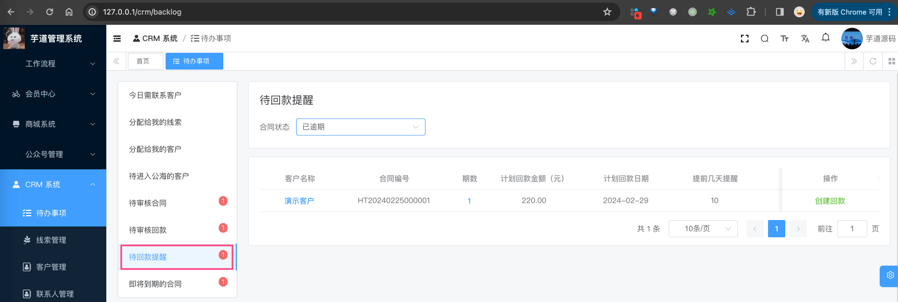

### [#](#_2-2-管理后台-2) 2.2 管理后台

对应 \[CRM 系统 -> 回款计划\] 菜单，对应 `yudao-ui-admin-vue3` 项目的 `@/views/crm/receivable/plan` 目录。

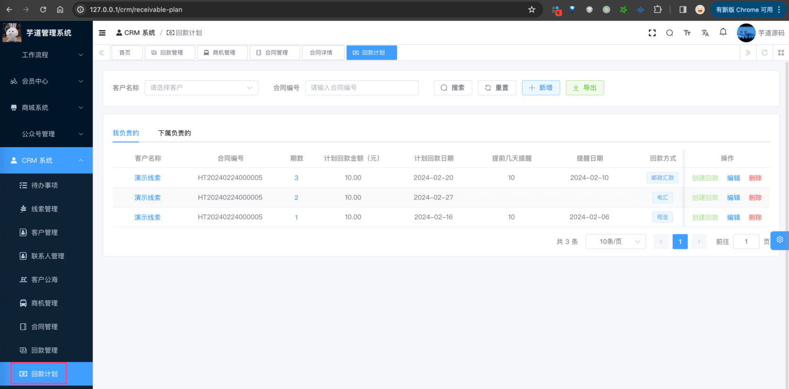

① 点击【新增】按钮，随便填写一些信息，点击「确认」按钮，即可新增一条回款计划。如下图所示：


② 点击【创建回款】按钮，可以创建回款。如下图所示：

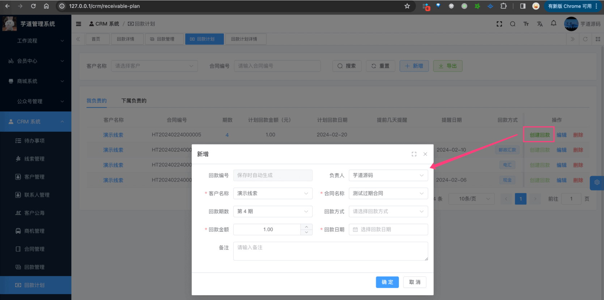

这样，我们就完成了【合同】=>【回款计划】=>【回款】的整个回款链路。

③ 点击“期数”，进入回款计划详情页，可以查看回款计划的详细信息，如下图所示：

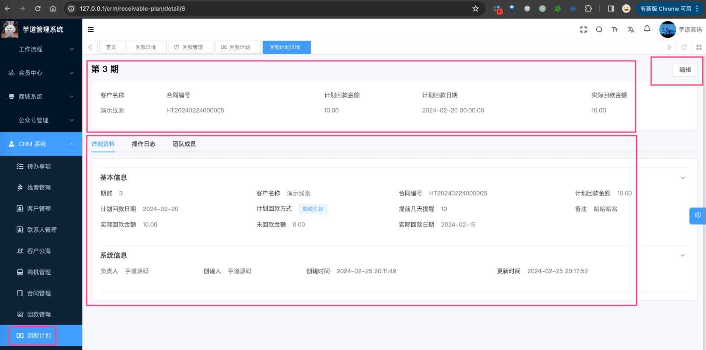

* * *

另外，也可以在【合同】的详情页，进行【回款计划】的创建。如下图所示：

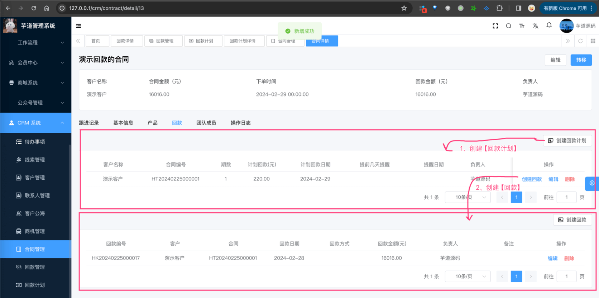