目录

# 【客户】客户管理、公海客户

本文接 [《【线索】线索管理》](/crm/clue)，主要讲解四部分：客户信息、客户公海配置、客户限制配置、联系人。它们的表关系如下图所示：


## [#](#_1-客户) 1. 客户

客户模块，由 `yudao-module-crm-biz` 后端模块的 `customer` 包的 CrmCustomerController 实现，包括客户管理（我的客户）、公海客户。其中，公海客户是指没有负责人的客户，可以被人分配或者领取成为负责人。

### [#](#_1-表结构) 1. 表结构

> 省略 creator/create\_time/updater/update\_time/deleted/tenant\_id 等通用字段

```sql
CREATE TABLE `crm_customer` (
  `id` bigint NOT NULL AUTO_INCREMENT COMMENT '编号，主键自增',
  `name` varchar(255) CHARACTER SET utf8mb4 COLLATE utf8mb4_unicode_ci DEFAULT NULL COMMENT '客户名称',
  
  `owner_user_id` bigint DEFAULT NULL COMMENT '负责人的用户编号',
  `owner_time` datetime NOT NULL COMMENT '成为负责人的时间',
  `lock_status` bit(1) NOT NULL DEFAULT b'0' COMMENT '锁定状态',
  `deal_status` bit(1) NOT NULL DEFAULT b'0' COMMENT '成交状态',
  
  `follow_up_status` tinyint(1) NOT NULL DEFAULT '0' COMMENT '跟进状态',
  `contact_last_time` datetime DEFAULT NULL COMMENT '最后跟进时间',
  `contact_last_content` varchar(255) CHARACTER SET utf8mb4 COLLATE utf8mb4_unicode_ci DEFAULT NULL COMMENT '最后跟进内容',
  `contact_next_time` datetime DEFAULT NULL COMMENT '下次联系时间',
  
  `mobile` varchar(20) CHARACTER SET utf8mb4 COLLATE utf8mb4_unicode_ci DEFAULT NULL COMMENT '手机',
  `telephone` varchar(20) CHARACTER SET utf8mb4 COLLATE utf8mb4_unicode_ci DEFAULT NULL COMMENT '电话',
  `qq` varchar(20) CHARACTER SET utf8mb4 COLLATE utf8mb4_unicode_ci DEFAULT NULL COMMENT 'QQ',
  `wechat` varchar(255) CHARACTER SET utf8mb4 COLLATE utf8mb4_unicode_ci DEFAULT NULL COMMENT '微信',
  `email` varchar(255) CHARACTER SET utf8mb4 COLLATE utf8mb4_unicode_ci DEFAULT NULL COMMENT '邮箱',
  `area_id` bigint DEFAULT NULL COMMENT '地区编号',
  `detail_address` varchar(255) CHARACTER SET utf8mb4 COLLATE utf8mb4_unicode_ci DEFAULT NULL COMMENT '详细地址',
  `industry_id` int DEFAULT NULL COMMENT '所属行业',
  `level` int DEFAULT NULL COMMENT '客户等级',
  `source` int DEFAULT NULL COMMENT '客户来源',
  `remark` varchar(500) CHARACTER SET utf8mb4 COLLATE utf8mb4_unicode_ci DEFAULT NULL COMMENT '备注',
  PRIMARY KEY (`id`) USING BTREE,
  KEY `owner_user_id` (`owner_user_id`) USING BTREE
) ENGINE=InnoDB AUTO_INCREMENT=17 DEFAULT CHARSET=utf8mb4 COLLATE=utf8mb4_unicode_ci COMMENT='CRM 客户表';

```

友情提示：客户表的字段，和线索表的字段类似，只是多了 \`lock\_status\`、\`deal\_status\` 字段。

① `owner_user_id` 字段：客户的负责人编号，和线索类似。不重复赘述，详细可见 [《【通用】数据权限》](/crm/permission/) 文档。

差别在多了 `owner_time` 字段，成为负责人超过一定时间后，客户自动释放进入公海。当然，如果客户被 `lock_status` 锁定，或者有 `deal_status` 成交，就不会释放。

② 从 `follow_up_status` 到 `contact_next_time` 字段：跟进相关，和线索类似。不重复赘述，详细可见 [《【通用】跟进记录》](/crm/follow-up/) 文档。

③ 从 `mobile` 到 `remark` 字段：客户的基本信息，和客户一致，不重复赘述。

### [#](#_1-2-管理后台-客户管理) 1.2 管理后台（客户管理）

对应 \[CRM 系统 -> 客户管理\] 菜单，对应 `yudao-ui-admin-vue3` 项目的 `@/views/crm/customer` 目录。

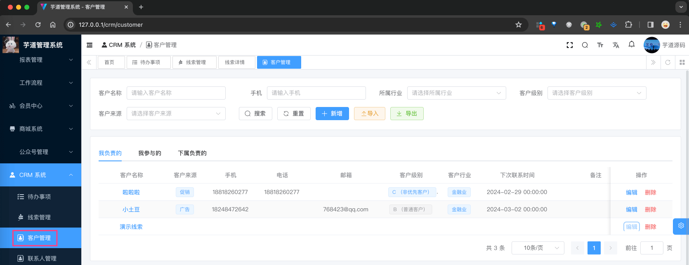

① 点击【新增】按钮，随便填写一些信息，点击「确认」按钮，即可新增一条客户。如下图所示：

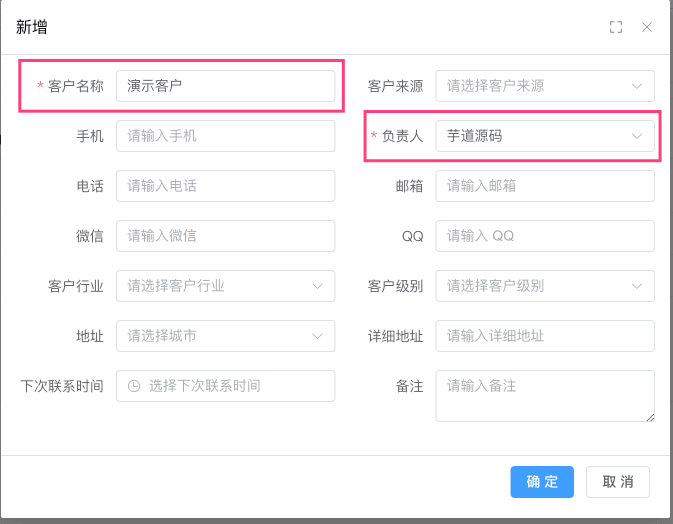

② 点击“客户名称”，进入客户详情页，可以查看客户的详细信息，如下图所示：

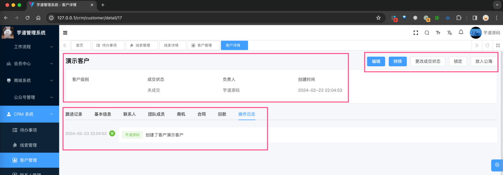

③ 点击【更改成交状态】按钮，标记客户 `deal_status` 为已成交，这样它就不会自动进入公海。

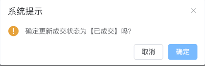

同理，点击【更改锁定状态】按钮，标记客户 `lock_status` 为已锁定。

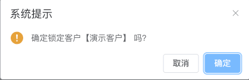

### [#](#_1-3-管理后台-公海客户) 1.3 管理后台（公海客户）

① 点击【放入公海】按钮，将 `owner_user_id` 字段置空，即可放入公海。


放入公海后，可以在 \[CRM 系统 -> 公海客户\] 菜单中，可以看到该客户。如下图所示：

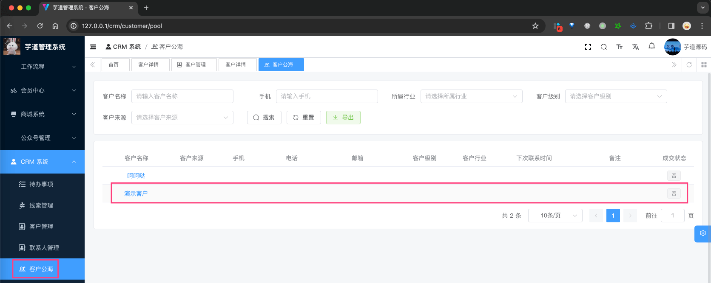

② 继续点击该公海客户的“客户名称”，还是进入客户详情页，如下图所示：

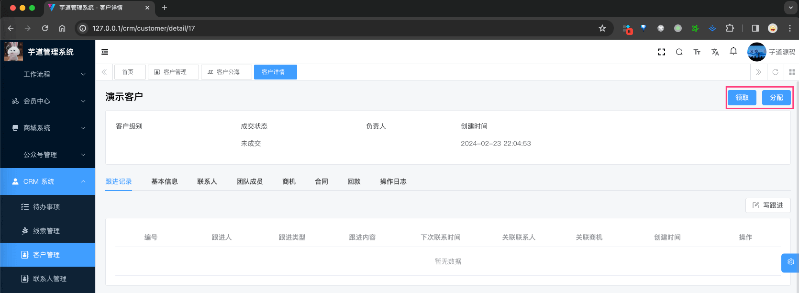

③ 此时，可以点击【领取】或【分配】按钮，将公海客户分配给自己或者其它人。如下图所示：

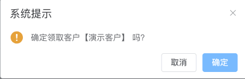

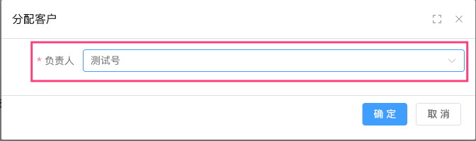

## [#](#_2-客户限制配置) 2. 客户限制配置

客户限制配置，由 `yudao-module-crm-biz` 后端模块的 `customer` 包的 CrmCustomerLimitConfigController 实现。

### [#](#_2-1-表结构) 2.1 表结构

> 省略 creator/create\_time/updater/update\_time/deleted/tenant\_id 等通用字段

```sql
CREATE TABLE `crm_customer_limit_config` (
  `id` bigint NOT NULL AUTO_INCREMENT COMMENT '编号',
  
  `type` int NOT NULL COMMENT '规则类型 1: 拥有客户数限制，2:锁定客户数限制',
  
  `user_ids` varchar(2048) CHARACTER SET utf8mb4 COLLATE utf8mb4_unicode_ci DEFAULT '' COMMENT '规则适用人群',
  `dept_ids` varchar(2048) CHARACTER SET utf8mb4 COLLATE utf8mb4_unicode_ci DEFAULT '' COMMENT '规则适用部门',
  
  `max_count` int NOT NULL COMMENT '数量上限',
  `deal_count_enabled` tinyint DEFAULT NULL COMMENT '成交客户是否占有拥有客户数(当 type = 1 时)',
  
  PRIMARY KEY (`id`) USING BTREE
) ENGINE=InnoDB AUTO_INCREMENT=2 DEFAULT CHARSET=utf8mb4 COLLATE=utf8mb4_unicode_ci COMMENT='CRM 客户限制配置表';

```

① `type` 字段：规则类型，1 表示拥有客户数限制，2 表示锁定客户数限制。这样的话，可以避免一个人拥有太多客户，或者锁定太多客户。

② `user_ids` 和 `dept_ids` 字段：规则适用人群和部门，可以根据人群和部门来限制客户数量。

③ `max_count` 字段：数量上限，即最多拥有或者锁定的客户数量。

`deal_count_enabled` 字段：成交客户是否占有拥有客户数，当 `type` = 1 时，表示成交客户是否占有拥有客户数。这样的话，可以避免一个人拥有太多成交客户。

### [#](#_2-2-管理后台) 2.2 管理后台

对应 \[CRM 系统 -> 系统配置 -> 客户限制配置\] 菜单，对应 `yudao-ui-admin-vue3` 项目的 `@/views/crm/limitConfig` 目录。

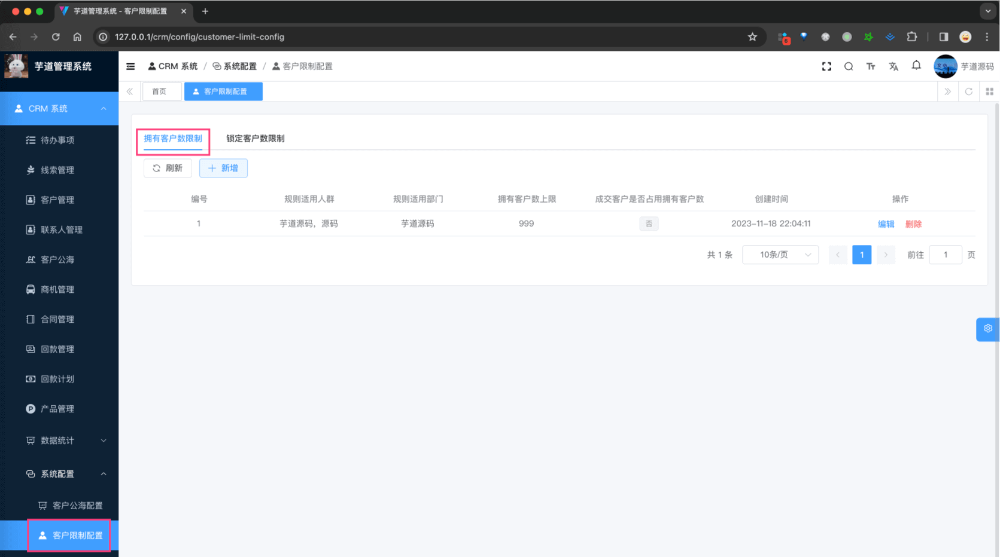

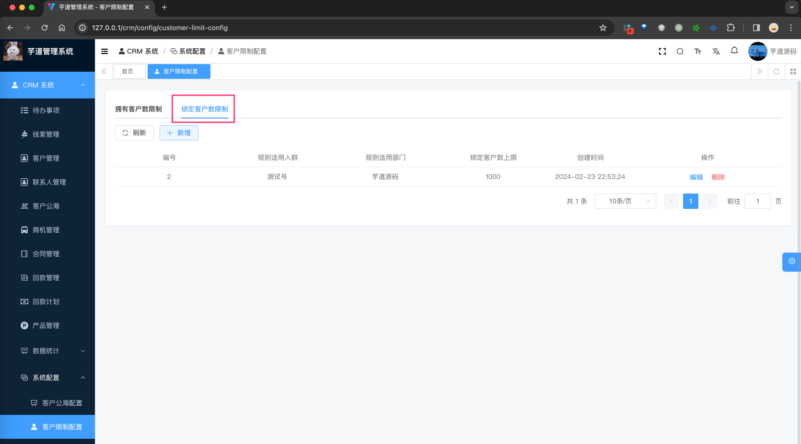

## [#](#_3-客户公海配置) 3. 客户公海配置

客户公海配置，由 `yudao-module-crm-biz` 后端模块的 `customer` 包的 CrmCustomerPoolConfigController 实现。

### [#](#_3-1-表结构) 3.1 表结构

> 省略 creator/create\_time/updater/update\_time/deleted/tenant\_id 等通用字段

```sql
CREATE TABLE `crm_customer_pool_config` (
  `id` bigint NOT NULL AUTO_INCREMENT COMMENT '编号',
  
  `enabled` tinyint(1) NOT NULL COMMENT '是否启用客户公海',
  `contact_expire_days` int DEFAULT NULL COMMENT '未跟进放入公海天数',
  `deal_expire_days` int DEFAULT NULL COMMENT '未成交放入公海天数',
  
  `notify_enabled` tinyint(1) DEFAULT NULL COMMENT '是否开启提前提醒',
  `notify_days` int DEFAULT NULL COMMENT '提前提醒天数',
  PRIMARY KEY (`id`) USING BTREE
) ENGINE=InnoDB AUTO_INCREMENT=2 DEFAULT CHARSET=utf8mb4 COLLATE=utf8mb4_unicode_ci COMMENT='CRM 客户公海配置表';

```

① `enabled` 字段：是否启用客户公海。如果启用，那么超过 `contact_expire_days` 天未跟进的客户，或者超过 `deal_expire_days` 天未成交的客户，就会自动进入公海。

目前，该功能是通过 CrmCustomerAutoPutPoolJob 定时任务实现的。你可以参考 [《定时任务》](/job/) 文档，自己配置每 5 分钟执行一次。

② `notify_enabled` 字段：是否开启提前提醒。如果开启，那么超过 `notify_days` 天未跟进的客户，或者超过 `notify_days` 天未成交的客户，可以在 \[CRM 系统 -> 待办事项\] 菜单中，看到提醒。如下图所示：

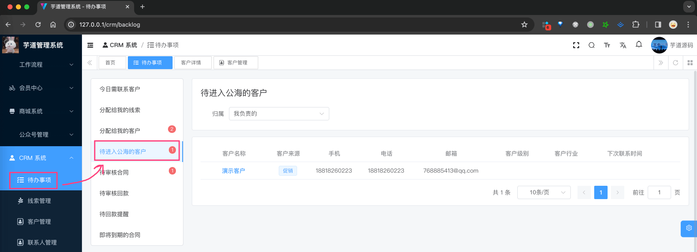

### [#](#_3-2-管理后台) 3.2 管理后台

对应 \[CRM 系统 -> 系统配置 -> 客户公海配置\] 菜单，对应 `yudao-ui-admin-vue3` 项目的 `@/views/crm/poolConfig` 目录。

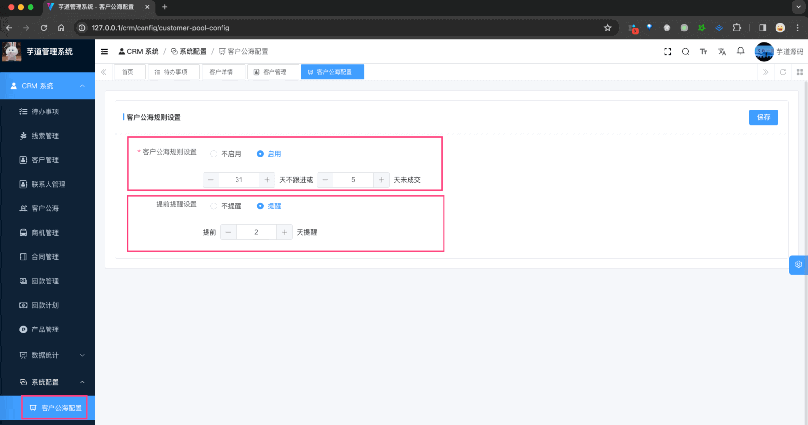

## [#](#_4-联系人) 4. 联系人

联系人模块，由 `yudao-module-crm-biz` 后端模块的 `contact` 包实现。

### [#](#_4-1-表结构) 4.1 表结构

> 省略 creator/create\_time/updater/update\_time/deleted/tenant\_id 等通用字段

```sql
CREATE TABLE `crm_contact` (
  `id` bigint NOT NULL AUTO_INCREMENT COMMENT '主键',
  `name` varchar(128) CHARACTER SET utf8mb4 COLLATE utf8mb4_unicode_ci DEFAULT NULL COMMENT '联系人名称',
  `customer_id` bigint DEFAULT NULL COMMENT '客户编号',

  `owner_user_id` varchar(256) CHARACTER SET utf8mb4 COLLATE utf8mb4_unicode_ci DEFAULT NULL COMMENT '负责人用户编号',
  
  `contact_last_time` datetime DEFAULT NULL COMMENT '最后跟进时间',
  `contact_last_content` varchar(255) CHARACTER SET utf8mb4 COLLATE utf8mb4_unicode_ci DEFAULT NULL COMMENT '最后跟进内容',
  `contact_next_time` datetime DEFAULT NULL COMMENT '下次联系时间',
  
  `mobile` varchar(16) CHARACTER SET utf8mb4 COLLATE utf8mb4_unicode_ci DEFAULT NULL COMMENT '手机号',
  `telephone` varchar(16) CHARACTER SET utf8mb4 COLLATE utf8mb4_unicode_ci DEFAULT NULL COMMENT '电话',
  `email` varchar(128) CHARACTER SET utf8mb4 COLLATE utf8mb4_unicode_ci DEFAULT NULL COMMENT '电子邮箱',
  `qq` int DEFAULT NULL,
  `wechat` varchar(128) CHARACTER SET utf8mb4 COLLATE utf8mb4_unicode_ci DEFAULT NULL,
  `area_id` bigint DEFAULT NULL COMMENT '地区',
  `detail_address` varchar(256) CHARACTER SET utf8mb4 COLLATE utf8mb4_unicode_ci DEFAULT NULL COMMENT '地址',
  
  `sex` int DEFAULT NULL COMMENT '性别',
  `master` bit(1) DEFAULT NULL COMMENT '是否关键决策人',
  `parent_id` bigint DEFAULT NULL COMMENT '直系上属',
  `post` varchar(32) CHARACTER SET utf8mb4 COLLATE utf8mb4_unicode_ci DEFAULT NULL COMMENT '职务',
  `tenant_id` bigint DEFAULT NULL,
  PRIMARY KEY (`id`) USING BTREE
) ENGINE=InnoDB AUTO_INCREMENT=16 DEFAULT CHARSET=utf8mb4 COLLATE=utf8mb4_unicode_ci COMMENT='CRM 联系人';

```

① `customer_id` 字段：联系人所属的客户编号，它必须关联到客户表的 `id` 字段。

② `owner_user_id` 字段：联系人的负责人编号，和线索类似。不重复赘述，详细可见 [《【通用】数据权限》](/crm/permission/) 文档。

③ 从 `contact_last_time` 到 `contact_next_time` 字段：跟进相关，和线索类似。不重复赘述，详细可见 [《【通用】跟进记录》](/crm/follow-up/) 文档。

④ 从 `mobile` 到 `detail_address` 字段：联系人的基本信息，和客户一致，不重复赘述。

差异的点，是额外增加了 `sex`、`master`、`parent_id`、`post` 字段。不过它们也是信息字段，没有什么特殊逻辑。

### [#](#_4-2-管理后台) 4.2 管理后台

对应 \[CRM 系统 -> 联系人管理\] 菜单，对应 `yudao-ui-admin-vue3` 项目的 `@/views/crm/contact` 目录。

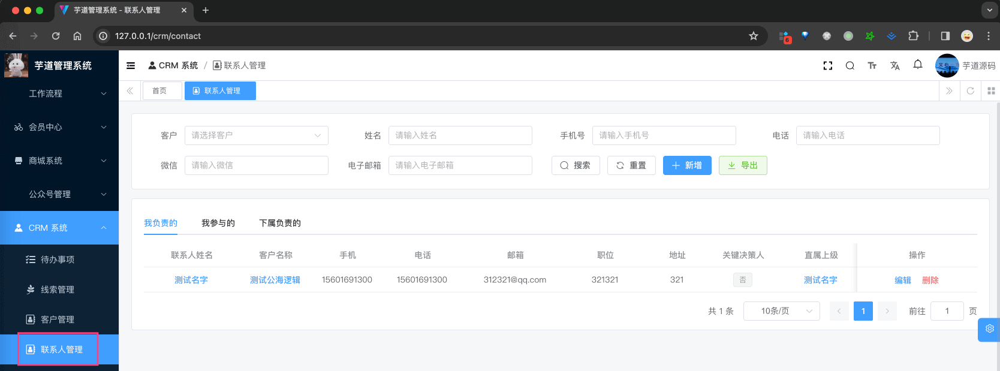

① 点击【新增】按钮，随便填写一些信息，点击「确认」按钮，即可新增一条联系人。如下图所示：

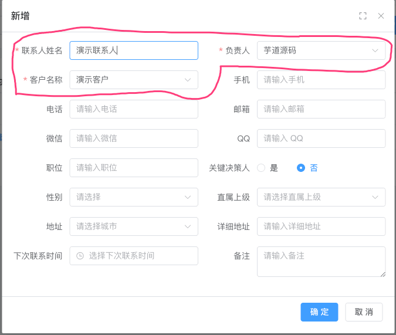

② 点击“联系人名称”，进入联系人详情页，可以查看联系人的详细信息，如下图所示：

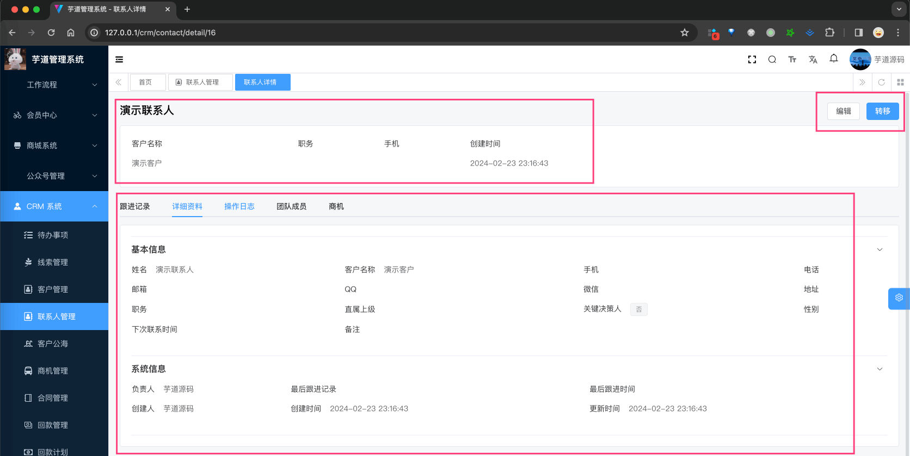

具体操作比较简单，只有【编辑】、【转移】，所以联系人本质上还是客户的信息补充。