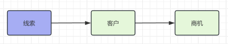
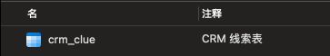
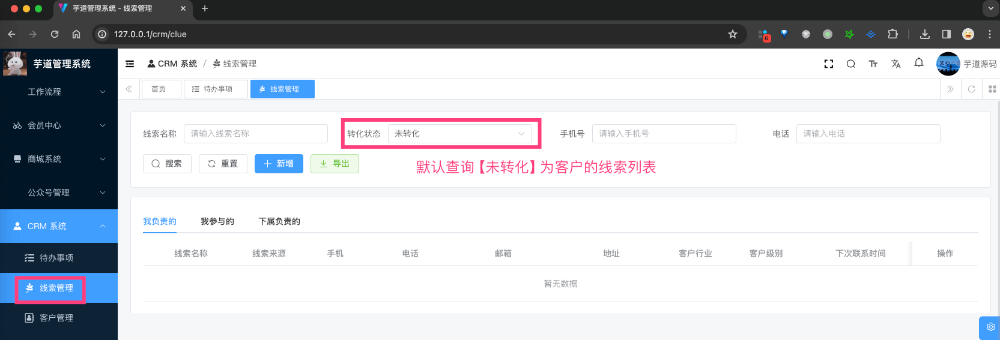
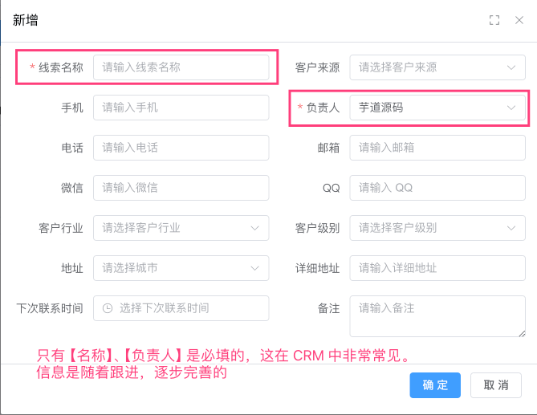
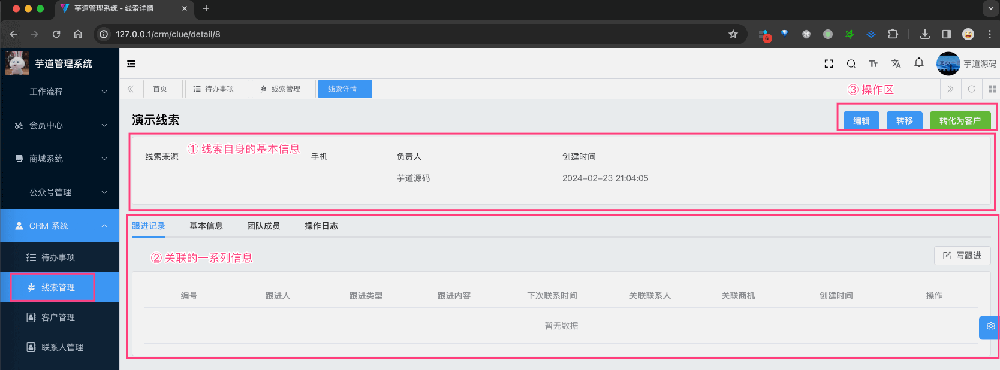
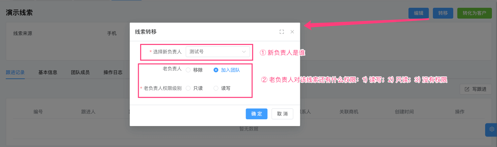
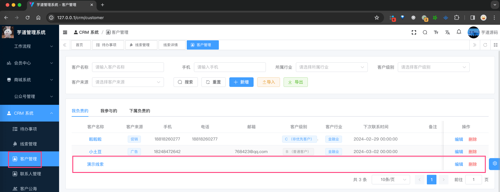

目录

# 【线索】线索管理

CRM 线索，是指 CRM 系统中关于公司、个人和商机的原始信息，这些信息主要源自于各种渠道的交流，如活动、电话咨询、广告投放、老客户介绍、或购买来的原始数据等。



这些线索有可能成为企业的潜在【客户】，当有机会沟通后客户表达出购买【产品】意向，并留下联系方式等信息后，就可以转换为【商机】。

* * *

线索模块，由 `yudao-module-crm-biz` 后端模块的 `clue` 包实现，只有线索功能。如下图所示：



## [#](#_1-表结构) 1. 表结构

> 省略 creator/create\_time/updater/update\_time/deleted/tenant\_id 等通用字段

```sql
CREATE TABLE `crm_clue` (
  `id` bigint NOT NULL AUTO_INCREMENT COMMENT '编号，主键自增',
  `name` varchar(128) CHARACTER SET utf8mb4 COLLATE utf8mb4_unicode_ci NOT NULL DEFAULT '' COMMENT '线索名称',
  
  `owner_user_id` bigint NOT NULL COMMENT '负责人的用户编号',

  `follow_up_status` bit(1) DEFAULT b'0' COMMENT '跟进状态',
  `contact_last_time` datetime DEFAULT NULL COMMENT '最后跟进时间',
  `contact_last_content` varchar(255) CHARACTER SET utf8mb4 COLLATE utf8mb4_unicode_ci DEFAULT NULL COMMENT '最后跟进内容',
  `contact_next_time` datetime DEFAULT NULL COMMENT '下次联系时间',
  
  `transform_status` bit(1) DEFAULT b'0' COMMENT '转化状态',
  `customer_id` bigint DEFAULT NULL COMMENT '客户编号',
  
  `mobile` varchar(20) CHARACTER SET utf8mb4 COLLATE utf8mb4_unicode_ci DEFAULT NULL COMMENT '手机号',
  `telephone` varchar(20) CHARACTER SET utf8mb4 COLLATE utf8mb4_unicode_ci DEFAULT NULL COMMENT '电话',
  `qq` varchar(20) CHARACTER SET utf8mb4 COLLATE utf8mb4_unicode_ci DEFAULT NULL COMMENT 'QQ',
  `wechat` varchar(255) CHARACTER SET utf8mb4 COLLATE utf8mb4_unicode_ci DEFAULT NULL COMMENT '微信',
  `email` varchar(255) CHARACTER SET utf8mb4 COLLATE utf8mb4_unicode_ci DEFAULT NULL COMMENT '邮箱',
  `area_id` bigint DEFAULT NULL COMMENT '地区编号',
  `detail_address` varchar(255) CHARACTER SET utf8mb4 COLLATE utf8mb4_unicode_ci DEFAULT NULL COMMENT '详细地址',
  `industry_id` int DEFAULT NULL COMMENT '所属行业',
  `level` int DEFAULT NULL COMMENT '客户等级',
  `source` int DEFAULT NULL COMMENT '客户来源',
  `remark` varchar(500) CHARACTER SET utf8mb4 COLLATE utf8mb4_unicode_ci DEFAULT NULL COMMENT '备注',
  PRIMARY KEY (`id`) USING BTREE
) ENGINE=InnoDB AUTO_INCREMENT=8 DEFAULT CHARSET=utf8mb4 COLLATE=utf8mb4_unicode_ci COMMENT='CRM 线索表';

```

① `owner_user_id` 字段：线索的负责人编号，对应 `system_users` 表的 `id` 字段。在 CRM 系统中，线索、客户、商机、合同等等，都有负责人的概念，你可以理解它是“销售”的概念，负责客户的全流程跟进。

后续可见 [《【通用】数据权限》](/crm/permission/) 文档。

② `follow_up_status` 字段：跟进状态，`true` 表示已跟进，`false` 表示未跟进。在 CRM 系统中，线索、客户、商机、合同等等，也都有跟进状态的概念，客户是被一步步跟进，直到成交出【合同】，最后【回款】。

`contact_last_time`、`contact_last_content`、`contact_next_time` 字段：最后跟进时间、最后跟进内容、下次联系时间。

后续可见 [《【通用】跟进记录》](/crm/follow-up/) 文档。

③ `transform_status` 字段：转化状态，`true` 表示已转化，`false` 表示未转化。

当转化后，会创建出一条客户记录，此时 `customer_id` 字段会指向客户的编号。

④ 从 `mobile` 到 `remark` 字段：线索的基本信息，包括手机号、电话、QQ、微信、邮箱、地区、详细地址、所属行业、客户等级、客户来源、备注等。

## [#](#_2-管理后台) 2. 管理后台

对应 \[CRM 系统 -> 线索管理\] 菜单，对应 `yudao-ui-admin-vue3` 项目的 `@/views/crm/clue` 目录。



① 点击【新增】按钮，随便填写一些信息，点击「确认」按钮，即可新增一条线索。如下图所示：



② 点击“线索名称”，进入线索详情页，可以查看线索的详细信息，如下图所示：



详情可以分成 3 个部分：

*   顶部：线索的基本信息
*   下面：线索的关联信息
*   右上角：线索的操作按钮

友情提示：客户、联系人、合同等其它模块的详情页，也是类似的结构，都有基本信息、关联信息、操作按钮。

③ 点击【转移】按钮，可以修改线索的负责人，如下图所示：



友情提示：客户、联系人、合同等其它模块的转移功能，也是类似的操作。

④ 点击【转化为客户】按钮，可以将线索转化为客户。转化后，会创建出一条客户记录，此时 `customer_id` 字段会指向客户的编号，如下图所示：



* * *

如果你要批量转移线索，可参考 [#451 (opens new window)](https://github.com/YunaiV/ruoyi-vue-pro/pull/451)、[#31 (opens new window)](https://github.com/yudaocode/yudao-ui-admin-vue3/pull/31)