目录

# 【通用】数据权限

数据权限，由 `yudao-module-crm-biz` 后端模块的 `permission` 包实现，支持某个人对某个数据（线索、客户、商机、合同等等），有对应的权限。

目前权限由 CrmPermissionLevelEnum 枚举，包括 3 种：`OWNER`（负责人）、`WRITE`（读写）、`READ`（只读），并且 `OWNER > WRITE > READ`。

友情提示：

为什么不使用全局封装的 \[《数据权限》\])(/data-permission) 呢？

目前 CRM 系统的数据权限比较灵活，部分功能无法很好的支持。例如说：

*   全局的数据权限，只支持对某个数据的操作权限，而 CRM 需要分 OWNER、WRITE、READ 三种权限
*   全局的数据全量，对关联数据的权限控制，无法很好的支持。例如说：对某个客户有 WRITE 权限时，可以 WRITE 它下面的联系人、商机、合同等等

你可以理解全局的数据权限是基于 DB（DAO）层面实现的，而 CRM 的数据权限是基于 Service 层面实现的。

## [#](#_1-表结构) 1. 表结构

> 省略 creator/create\_time/updater/update\_time/deleted/tenant\_id 等通用字段

```sql
CREATE TABLE `crm_permission` (
  `id` bigint NOT NULL AUTO_INCREMENT COMMENT '编号',

  `user_id` bigint NOT NULL DEFAULT '0' COMMENT '用户编号',
  
  `biz_type` tinyint NOT NULL DEFAULT '100' COMMENT '数据类型',
  `biz_id` bigint NOT NULL DEFAULT '0' COMMENT '数据编号',
  
  `level` int NOT NULL DEFAULT '0' COMMENT '会员等级',
  PRIMARY KEY (`id`) USING BTREE
) ENGINE=InnoDB AUTO_INCREMENT=86 DEFAULT CHARSET=utf8mb4 COLLATE=utf8mb4_unicode_ci COMMENT='CRM 数据权限表';

```

基本就是三要素：

*   人：`user_id` 字段
*   数据：`biz_type` + `biz_id` 字段。其中 `biz_type` 由 CrmBizTypeEnum 枚举，包括线索、客户、联系人、商机、合同、回款等等
*   权限：`level` 字段。由 CrmPermissionLevelEnum 枚举，包括 `OWNER`、`WRITE`、`READ` 三种

### [#](#_1-1-owner-负责人) 1.1 `OWNER` 负责人

① 每个数据在新增时，会插入一条 `OWNER` 的权限。例如说，新增一个客户，会插入一条 `OWNER` 的权限。如下图所示：

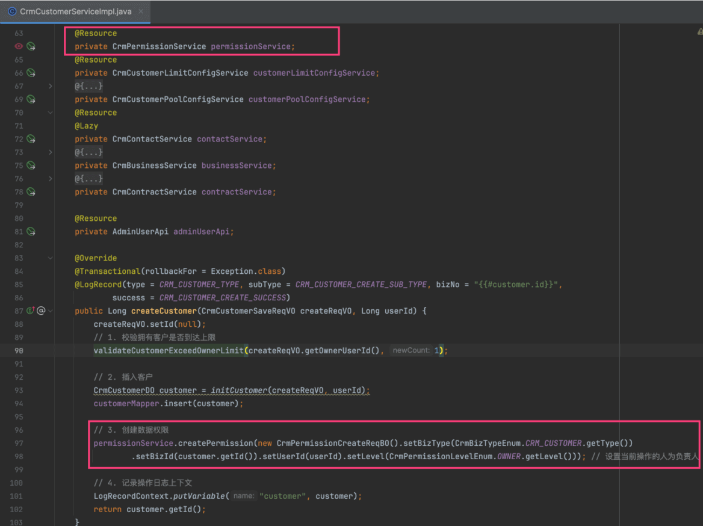

② 每个数据在转移时，会对新、老负责人的权限做不同的处理。例如说，联系人转移给其他人，会更新对应的权限。如下图所示：

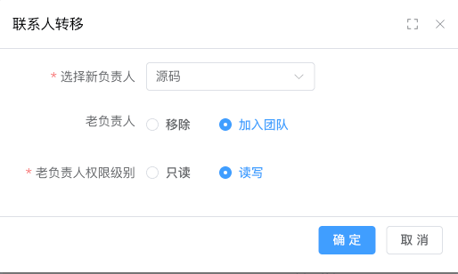

*   老负责人，会将对应的 `crm_permission` 的 `level` 更新为 `READ`
*   新负责人，会插入一条 `OWNER` 的权限

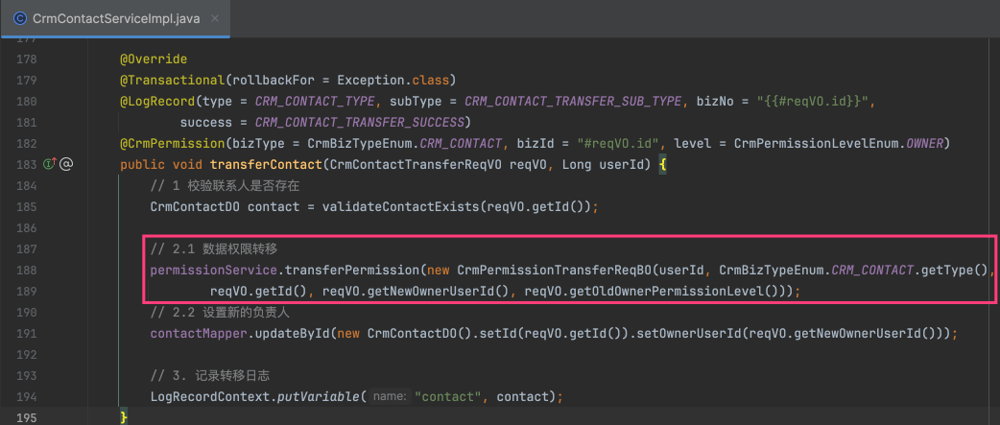

### [#](#_1-2-write-读写、read-只读) 1.2 `WRITE` 读写、`READ` 只读

在每个数据的详情界面，有一个 \[团队成员\] 的功能，可以查看当前数据的权限，同时可以修改 `WRITE` 和 `READ` 的权限。如下图所示：

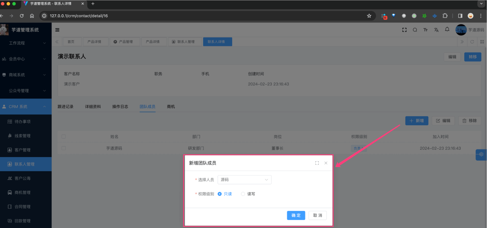

这是一个通用的功能，不需要每个数据都实现一遍，在 CrmPermissionController 已经统一实现。如下图所示：

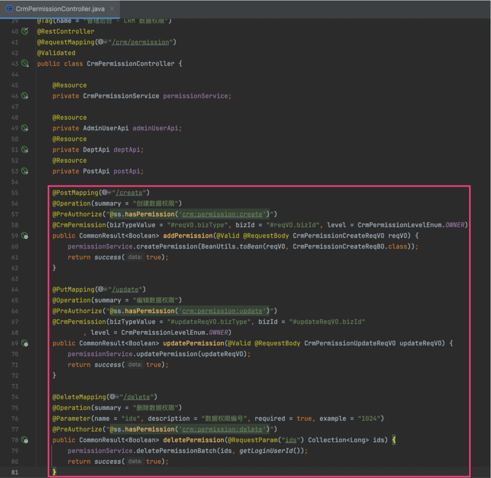

友情提示：为什么转移负责人不能在 CrmPermissionController 统一实现呢？

考虑到查询方便，每个数据记录自身会有 `owner_user_id` 字段，转移时需要更新，所以没一起实现。

## [#](#_3-后端实现) 3. 后端实现
### [#](#_2-1-操作校验) 2.1 操作校验

操作校验，通过 `@CrmPermission` 注解实现，只要添加在 Service 方法上，即可实现对应的权限校验。

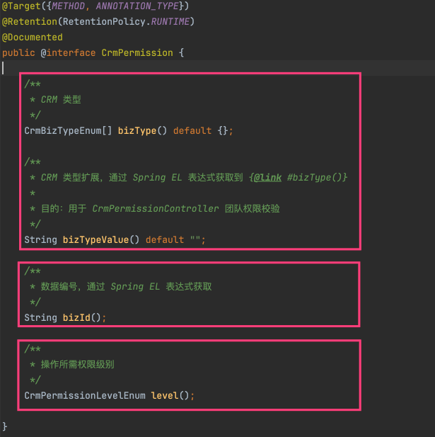

① 使用示例，如下图所示：

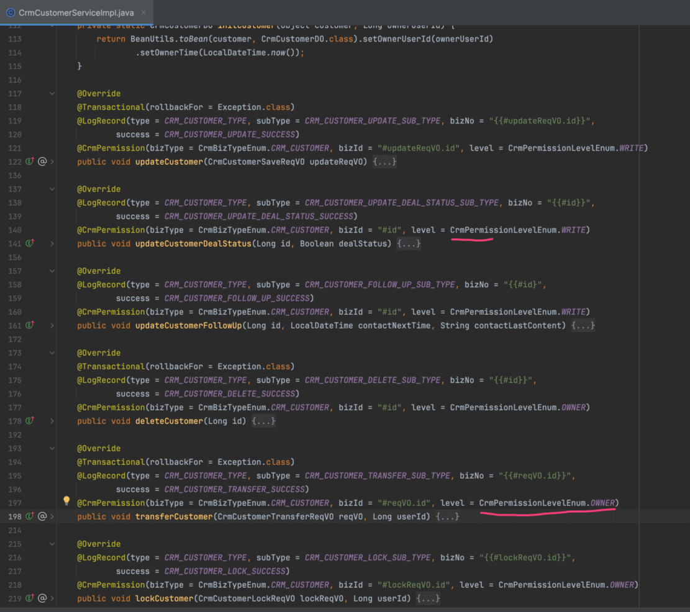

② 通过 Spring AOP 实现，可见 CrmPermissionAspect 类，如下图所示：

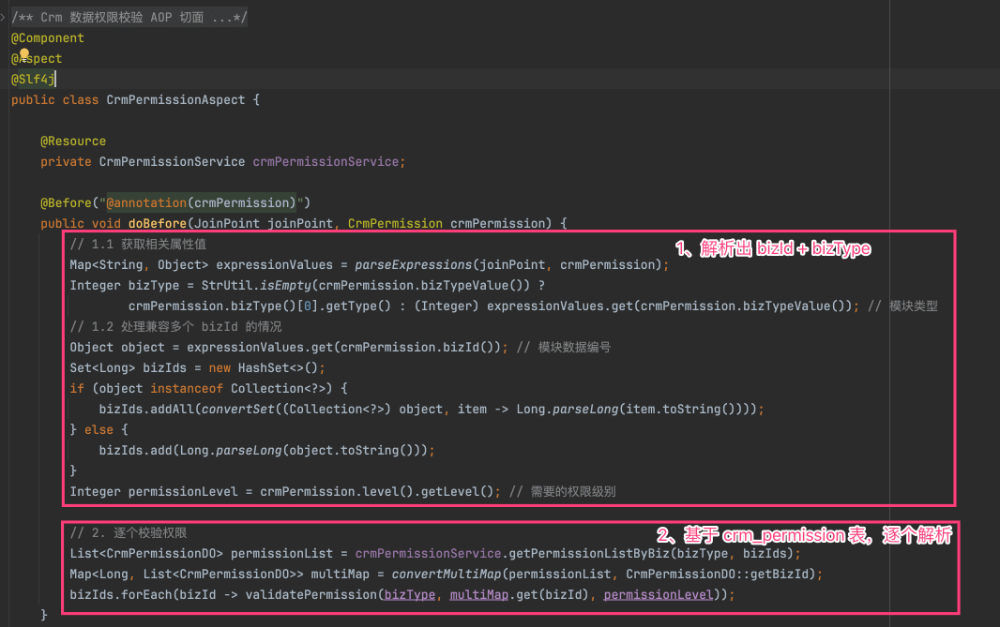

通过这个类，我们也可以看出为什么要有 `crm_permission` 表。如果没有这个表，我们需要查询每个业务的数据，通过它们的字段，判断当前用户是否有权限，这样拓展性比较差。

③ 【CRM 管理员】的角色枚举是 `crm_admin`，它和全局的【超级管理员】 `super_admin` 是分开的。如下图所示：

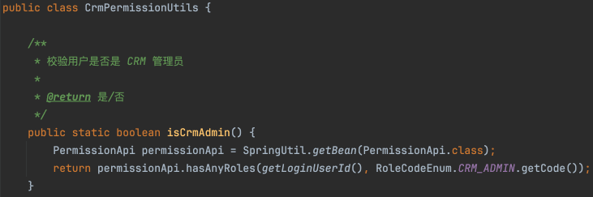

也就是说，把【CRM 管理员】分配给某个人时，可以查询和操作所有 CRM 的数据。

### [#](#_2-2-查询过滤) 2.2 查询过滤

在数据的列表界面，我们需要在 DB 数据库查询的时候，就将没有 `READ` 权限的数据过滤掉。

疑问：为什么不通过类似 \`@CrmPermission\` 注解实现呢？

可以实现，但是会查询特别多没权限的数据到内存中，导致性能比较差。

这个无法通用实现，目前是每个业务 Mapper 拼接 SQL 实现，通过联表查询 `crm_permission` 表，进行过滤。如下图所示：

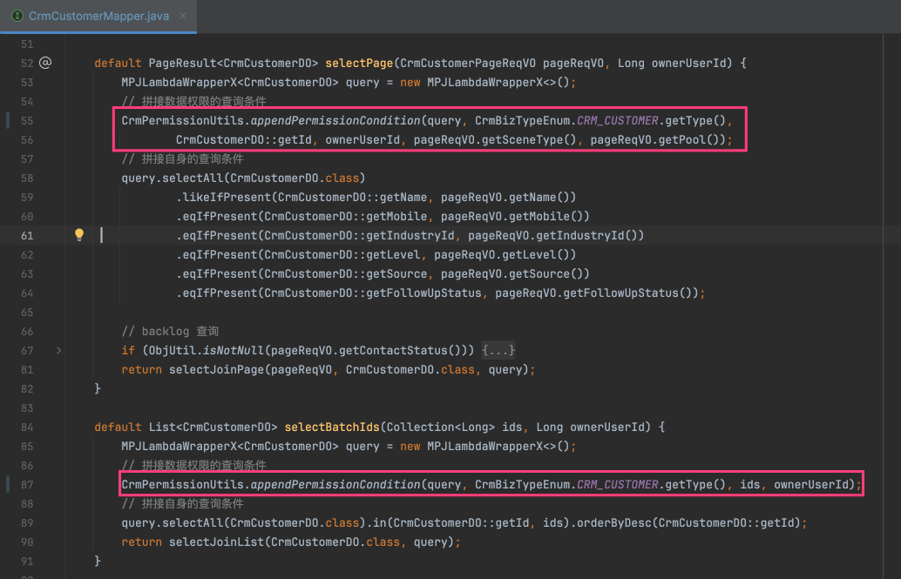

核心的拼接逻辑在 CrmPermissionUtils 的 `#appendPermissionCondition(...)` 方法里，不是很复杂，可以自己瞅瞅。如下图所示：

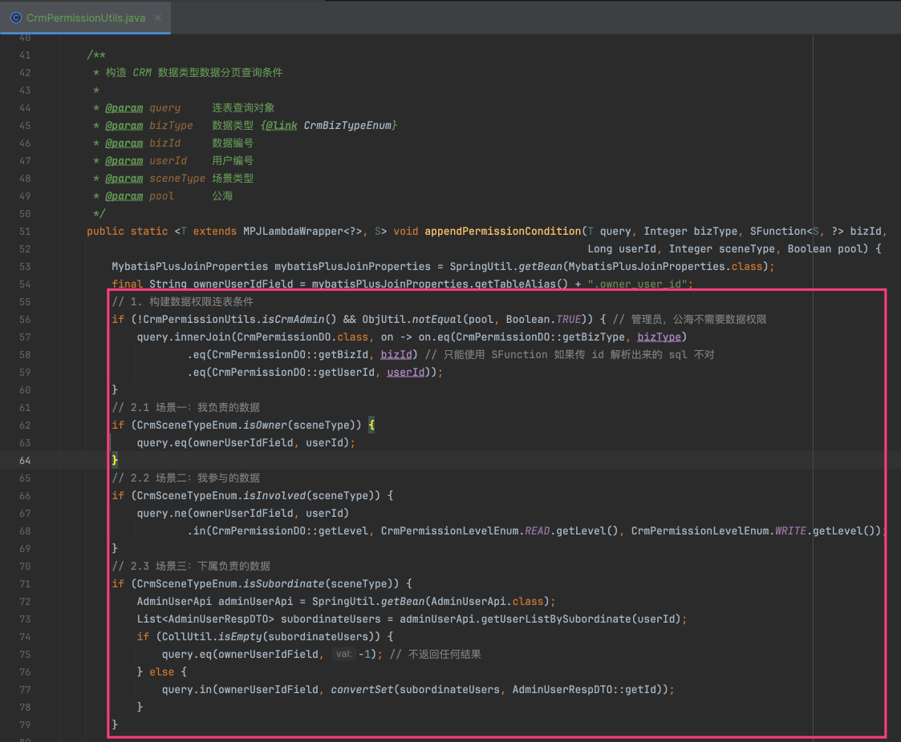

另外，CRM 系统的所有管理界面，都有一个 CrmSceneTypeEnum 枚举，分成 3 种场景：`OWNER` 我负责的，`INVOLVED` 我参与的、`SUBORDINATE` 下属负责的，也是通过上面查询实现的。

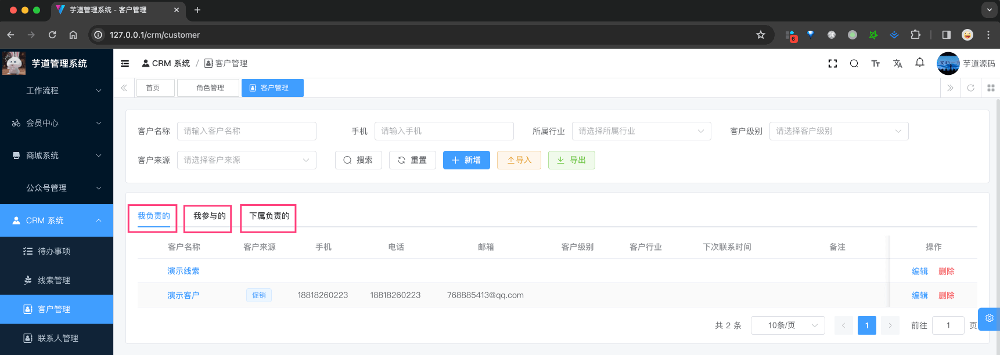

画外音

看到这里，在回过头看为什么不基于全局的 \[《数据权限》\])(/data-permission) 实现，是不是有点明白了呢？

在设计系统的数据权限，我们总是渴望通过全局的、自动化的方式实现。但是，实际上，业务的数据权限是非常复杂的，很难通过全局的方式实现。

因此，我们需要在业务层面，实现对应的数据权限逻辑。嘿嘿~