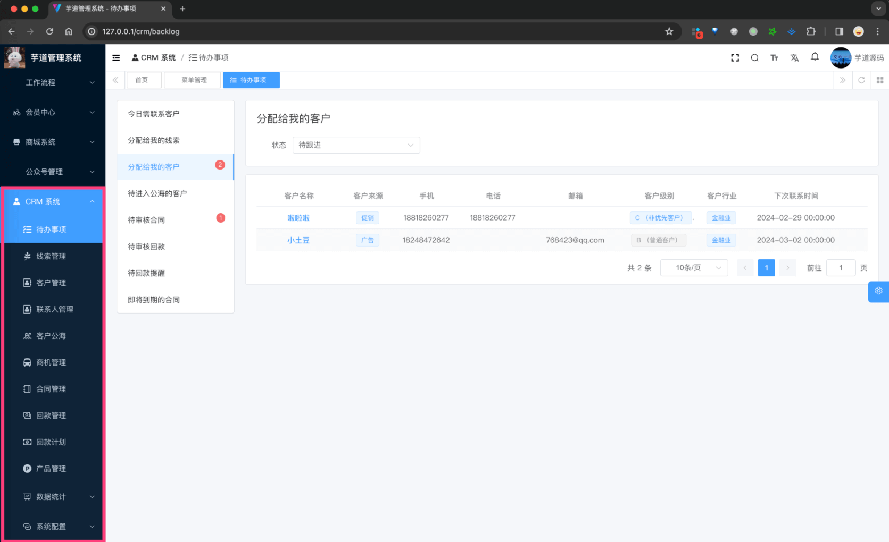

目录

# 功能开启

进度说明：

*   管理后台，请使用 [https://gitee.com/yudaocode/yudao-ui-admin-vue3 (opens new window)](https://gitee.com/yudaocode/yudao-ui-admin-vue3) 仓库的 `master` 分支
*   后端项目，请使用 [https://gitee.com/zhijiantianya/yudao-cloud (opens new window)](https://gitee.com/zhijiantianya/yudao-cloud) 仓库的 `master`（JDK8） 或 `master-jdk17`（JDK17/21） 分支

CRM 系统，后端由 `yudao-module-crm` 模块实现，前端由 `yudao-ui-admin-vue3` 的 `crm` 目录实现。

只需要启动 `yudao-module-crm` 服务，就可以使用 CRM 的功能。步骤如下：

*   第一步，导入 CRM 系统的 SQL 数据库脚本
*   第二步，启动服务，确认功能是否生效

补充说明：

由于 CRM 合同、回款使用到 BPM 的审批功能，所以你需要先看 [《工作流》](/bpm/) 文档，将工作流开启！

## [#](#_1-1-第一步-导入-sql) 1.1 第一步，导入 SQL

点击 [`crm-2024-02-26.sql.zip` (opens new window)](https://t.zsxq.com/15v3qYyNi) 下载附件，解压出 SQL 文件，然后导入到数据库中。

所以表名字，都使用 `crm_` 作为前缀。

## [#](#_1-2-第二步-启动服务) 1.2 第二步，启动服务

① 运行该服务的 [CRMServerApplication (opens new window)](https://github.com/YunaiV/yudao-cloud/blob/master/yudao-module-crm/yudao-module-crm-biz/src/main/java/cn/iocoder/yudao/module/crm/CrmServerApplication.java) 启动类，看到 `"Started CrmServerApplication in 5.963 seconds (JVM running for 6.253)"` 说明开启成功。

② 然后，访问前端的 CRM 城菜单，确认功能是否生效。如下图所示：

至此，我们就成功开启了 CRM 的功能 🙂