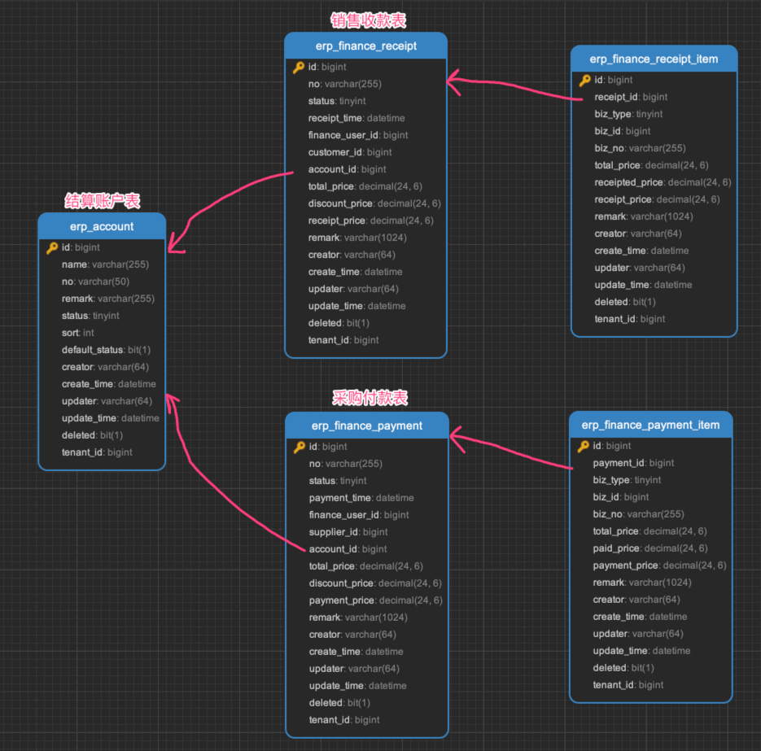
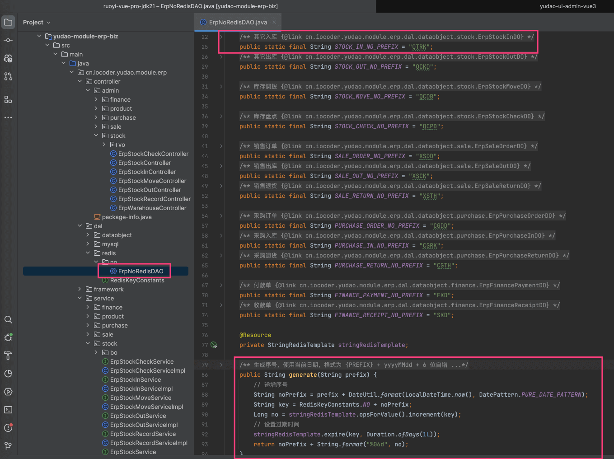
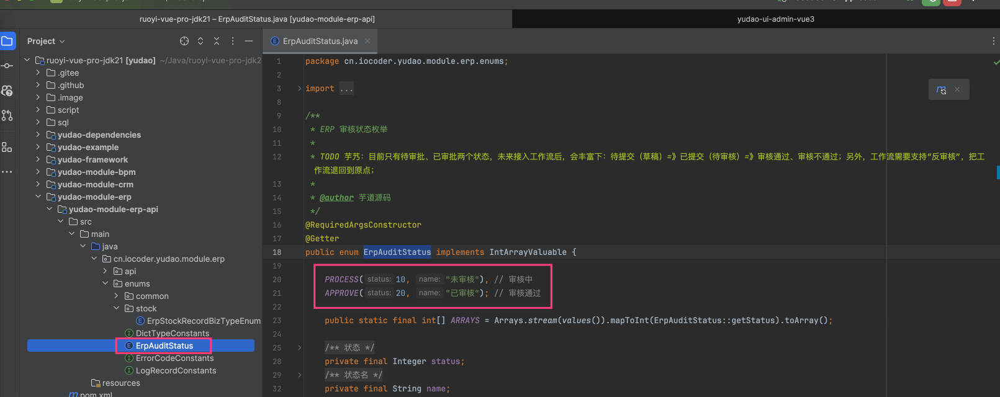
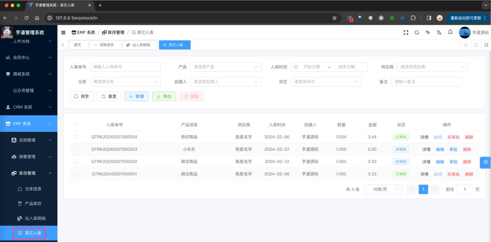
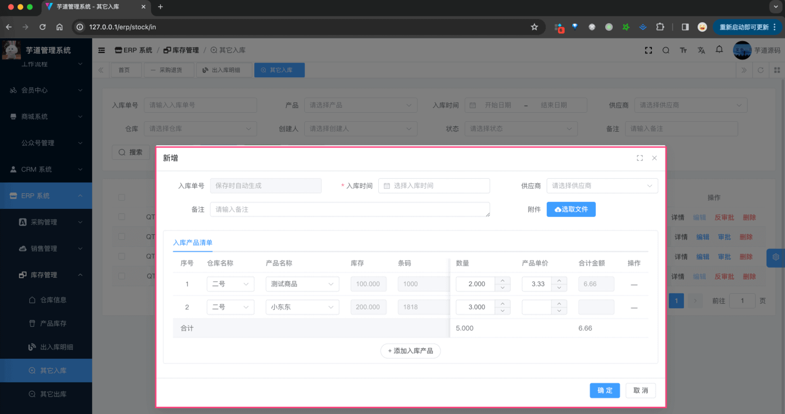
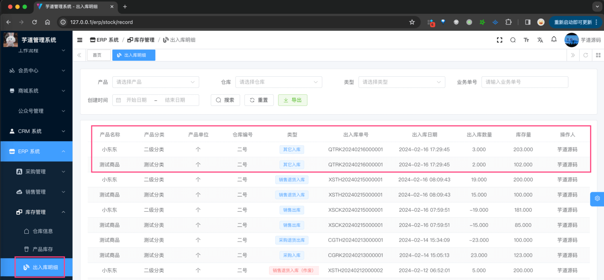
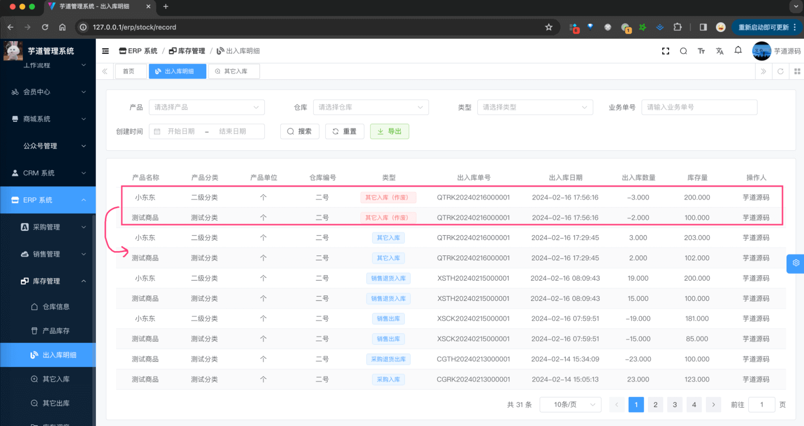
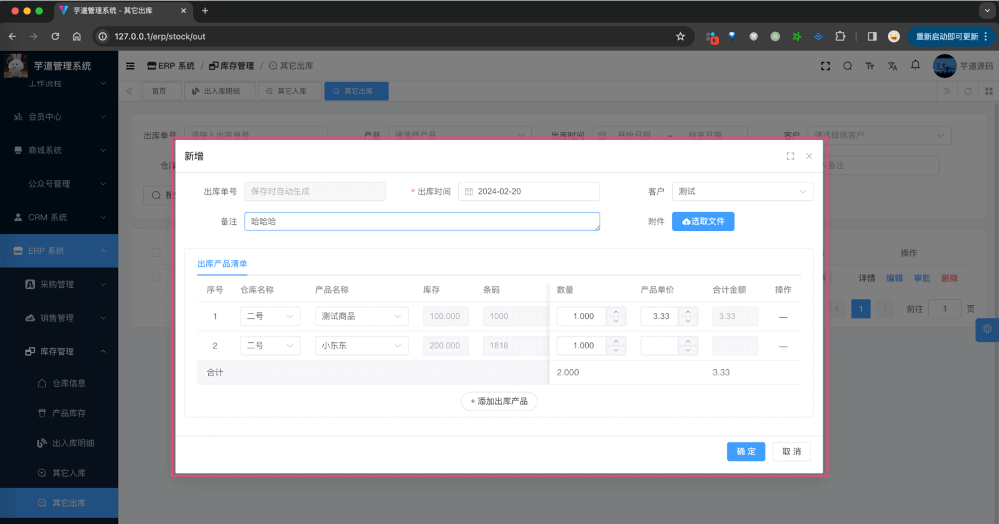
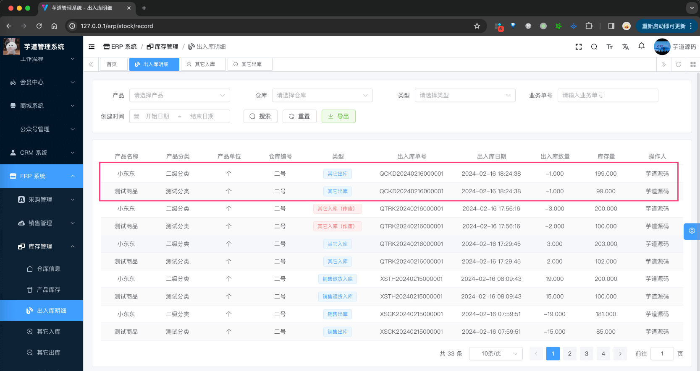

目录

# 【库存】其它入库、其它出库

本文接 [《【库存】仓库、产品库存、库存明细》](/erp/stock/)，主要讲解库存管理的其它入库、其它出库。它们的表关系如下图所示：



## [#](#_1-其它入库) 1. 其它入库

其它入库，由 ErpStockInController 提供接口，一些 ERP 系统也会称为“仓库入库”，将产品从仓库放进去，**增加** 产品的库存。

为什么要叫“其它”入库呢？是指除了采购入库、生产入库之外的其它入库操作。

### [#](#_1-表结构) 1. 表结构

`erp_stock_in` 表和 `erp_stock_in_item` 表，分别对应入库单和入库项。

> 省略 creator/create\_time/updater/update\_time/deleted/tenant\_id 等通用字段

```sql
CREATE TABLE `erp_stock_in` (
  `id` bigint NOT NULL AUTO_INCREMENT COMMENT '入库编号',
  `no` varchar(255) COLLATE utf8mb4_unicode_ci NOT NULL COMMENT '入库单号',
  
  `supplier_id` bigint DEFAULT NULL COMMENT '供应商编号',
  `in_time` datetime NOT NULL COMMENT '入库时间',
  
  `total_count` decimal(24,6) NOT NULL COMMENT '合计数量',
  `total_price` decimal(24,6) NOT NULL COMMENT '合计金额，单位：元',
  
  `status` tinyint NOT NULL COMMENT '状态',
  
  `remark` varchar(255) CHARACTER SET utf8mb4 COLLATE utf8mb4_unicode_ci DEFAULT NULL COMMENT '备注',
  `file_url` varchar(255) CHARACTER SET utf8mb4 COLLATE utf8mb4_unicode_ci DEFAULT NULL COMMENT '附件 URL',
  PRIMARY KEY (`id`)
) ENGINE=InnoDB AUTO_INCREMENT=9 DEFAULT CHARSET=utf8mb4 COLLATE=utf8mb4_unicode_ci COMMENT='ERP 其它入库单表';

```

① `no`：入库单号，一般是系统自动生成的，目前格式是 `{prefix}{yyyyMMdd}{6 位自增}`。具体可见 ErpNoRedisDAO 类，如下图所示：



② `supplier_id`：供应商编号。

③ `total_count` 和 `total_price`：合计数量和金额，目前只是记录，并无特殊逻辑。

④ `status`：状态，统一使用 ErpAuditStatus 枚举类，只有“未审批”、“已审批”两个状态，后续会接入到 [BPM 工作流](/bpm/) 中。



* * *

```sql
CREATE TABLE `erp_stock_in_item` (
  `id` bigint NOT NULL AUTO_INCREMENT COMMENT '入库项编号',
  
  `in_id` bigint NOT NULL COMMENT '入库编号',
  
  `warehouse_id` bigint NOT NULL COMMENT '仓库编号',
  `product_id` bigint NOT NULL COMMENT '产品编号',
  
  `product_unit_id` bigint NOT NULL COMMENT '产品单位编号',
  `product_price` decimal(24,6) DEFAULT NULL COMMENT '产品单价',
  `count` decimal(24,6) NOT NULL COMMENT '产品数量',
  `total_price` decimal(24,6) DEFAULT NULL COMMENT '合计金额，单位：元',
  
  `remark` varchar(255) CHARACTER SET utf8mb4 COLLATE utf8mb4_unicode_ci DEFAULT NULL COMMENT '备注',
  PRIMARY KEY (`id`)
) ENGINE=InnoDB AUTO_INCREMENT=10 DEFAULT CHARSET=utf8mb4 COLLATE=utf8mb4_unicode_ci COMMENT='ERP 其它入库单项表';

```

① `in_id`：入库编号，关联到上面的 `erp_stock_in` 表。

② `warehouse_id` 和 `product_id`：分别关联到仓库和产品。

③ `product_unit_id`、`product_price`、`count` 和 `total_price`：产品单位编号、产品单价、数量和金额。

其中 `total_price` 等于 `product_price * count`。

### [#](#_1-2-管理后台) 1.2 管理后台

对应 \[ERP 系统 -> 库存管理 -> 其它入库\] 菜单，对应 `yudao-ui-admin-vue3` 项目的 `@/views/erp/stock/in` 目录。



① 点击「新增」按钮，随便填写一些信息，点击「确认」按钮，即可新增一条其它入库单。



② 点击该入库单的「审批」按钮，审批通过该入库单，此时状态会变成“已审批”，同时增加对应的库存、新增库存明细。如下图所示：



③ 点击该入库单的「反审批」按钮，反审批该入库单，此时状态会变成“未审批”，同时减少对应的库存、新增库存明细。如下图所示：



## [#](#_2-其它出库) 2. 其它出库

其它出库，由 ErpStockOutController 提供接口，一些 ERP 系统也会称为“仓库出库”，将产品从仓库拿出来，**减少** 产品的库存。

为什么要叫“其它”出库呢？是指除了销售出库、生产出库之外的其它出库操作。

### [#](#_2-表结构) 2. 表结构

友情提示：其它出库相关的表，和其它入库相关的表结构基本一致。

`erp_stock_out` 表和 `erp_stock_out_item` 表，分别对应出库单和出库项。

> 省略 creator/create\_time/updater/update\_time/deleted/tenant\_id 等通用字段

```sql
CREATE TABLE `erp_stock_out` (
  `id` bigint NOT NULL AUTO_INCREMENT COMMENT '出库编号',
  `no` varchar(255) CHARACTER SET utf8mb4 COLLATE utf8mb4_unicode_ci NOT NULL COMMENT '出库单号',
  
  `customer_id` bigint DEFAULT NULL COMMENT '客户编号',
  `out_time` datetime NOT NULL COMMENT '出库时间',
  
  `total_count` decimal(24,6) NOT NULL COMMENT '合计数量',
  `total_price` decimal(24,6) NOT NULL COMMENT '合计金额，单位：元',
  
  `status` tinyint NOT NULL COMMENT '状态',
  
  `remark` varchar(255) CHARACTER SET utf8mb4 COLLATE utf8mb4_unicode_ci DEFAULT NULL COMMENT '备注',
  `file_url` varchar(255) CHARACTER SET utf8mb4 COLLATE utf8mb4_unicode_ci DEFAULT NULL COMMENT '附件 URL',
  PRIMARY KEY (`id`)
) ENGINE=InnoDB AUTO_INCREMENT=11 DEFAULT CHARSET=utf8mb4 COLLATE=utf8mb4_unicode_ci COMMENT='ERP 其它入库单表';

```

① `no`：出库单号，一般是系统自动生成的，目前格式是 `{prefix}{yyyyMMdd}{6 位自增}`。具体可见 ErpNoRedisDAO 类。

② `customer_id`：客户编号。

③ `total_count` 和 `total_price`：合计数量和金额，目前只是记录，并无特殊逻辑。

④ `status`：状态，统一使用 ErpAuditStatus 枚举类，只有“未审批”、“已审批”两个状态。

* * *

```sql
CREATE TABLE `erp_stock_out_item` (
  `id` bigint NOT NULL AUTO_INCREMENT COMMENT '出库项编号',
  `out_id` bigint NOT NULL COMMENT '出库编号',
  
  `warehouse_id` bigint NOT NULL COMMENT '仓库编号',
  `product_id` bigint NOT NULL COMMENT '产品编号',
  
  `product_unit_id` bigint NOT NULL COMMENT '产品单位编号',
  `product_price` decimal(24,6) DEFAULT NULL COMMENT '产品单价',
  `count` decimal(24,6) NOT NULL COMMENT '产品数量',
  `total_price` decimal(24,6) DEFAULT NULL COMMENT '合计金额，单位：元',
  
  `remark` varchar(255) CHARACTER SET utf8mb4 COLLATE utf8mb4_unicode_ci DEFAULT NULL COMMENT '备注',
  PRIMARY KEY (`id`)
) ENGINE=InnoDB AUTO_INCREMENT=12 DEFAULT CHARSET=utf8mb4 COLLATE=utf8mb4_unicode_ci COMMENT='ERP 其它出库单项表';

```

① `out_id`：出库编号，关联到上面的 `erp_stock_out` 表。

② `warehouse_id` 和 `product_id`：分别关联到仓库和产品。

③ `product_unit_id`、`product_price`、`count` 和 `total_price`：产品单位编号、产品单价、数量和金额。

其中 `total_price` 等于 `product_price * count`。

### [#](#_2-2-管理后台) 2.2 管理后台

对应 \[ERP 系统 -> 库存管理 -> 其它出库\] 菜单，对应 `yudao-ui-admin-vue3` 项目的 `@/views/erp/stock/out` 目录。


① 点击「新增」按钮，随便填写一些信息，点击「确认」按钮，即可新增一条其它出库单。



② 点击该出库单的「审批」按钮，审批通过该出库单，此时状态会变成“已审批”，同时减少对应的库存、新增库存明细。如下图所示：



③ 点击该出库单的「反审批」按钮，反审批该出库单，此时状态会变成“未审批”，同时增加对应的库存、新增库存明细。如下图所示：

