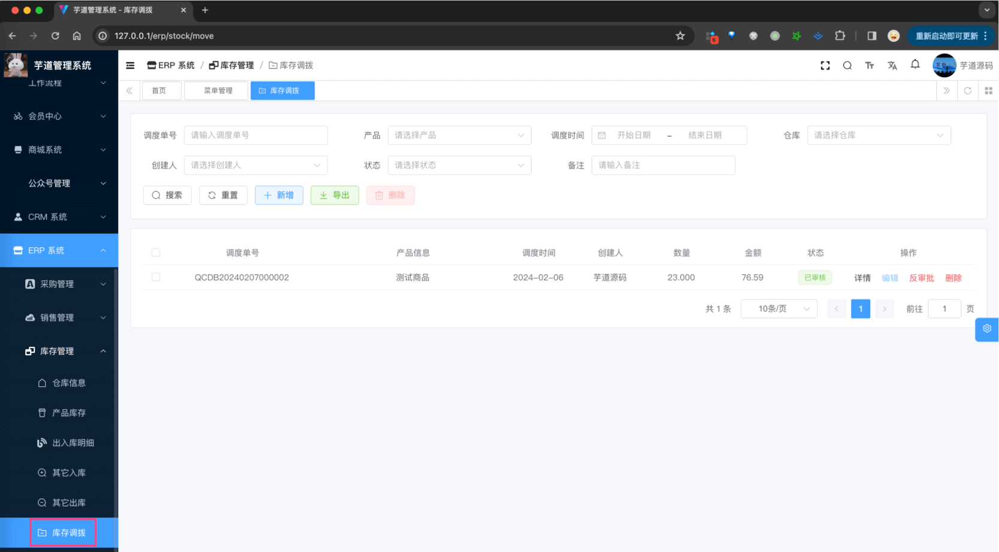
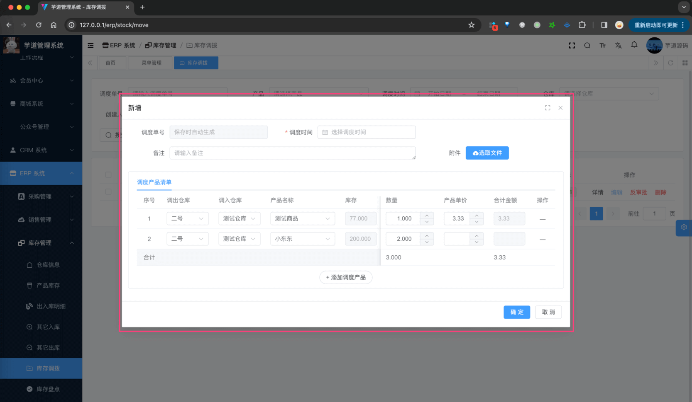
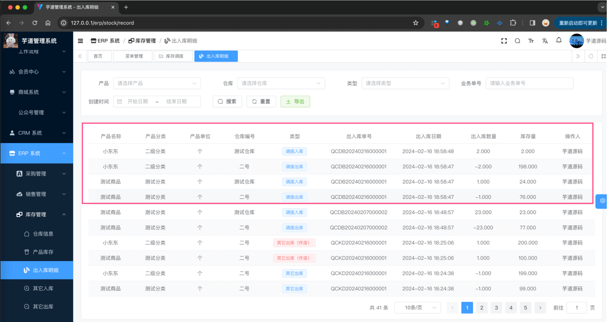
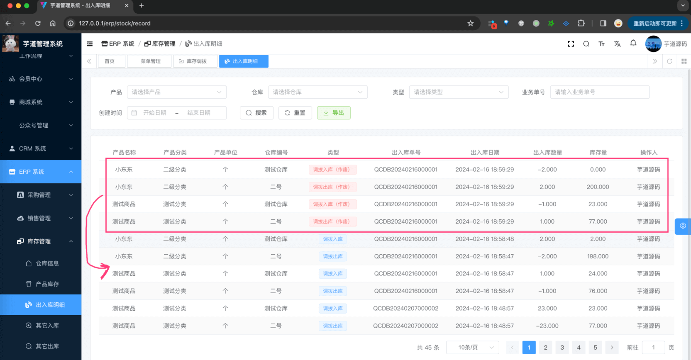
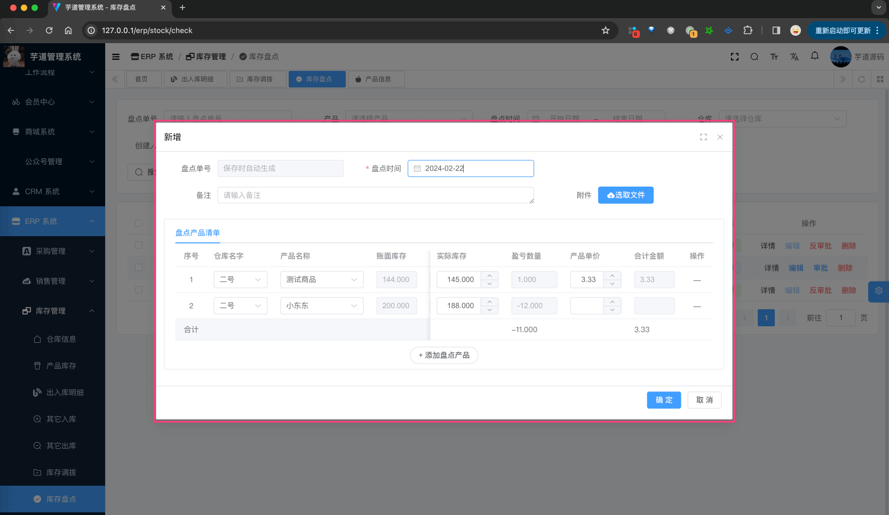
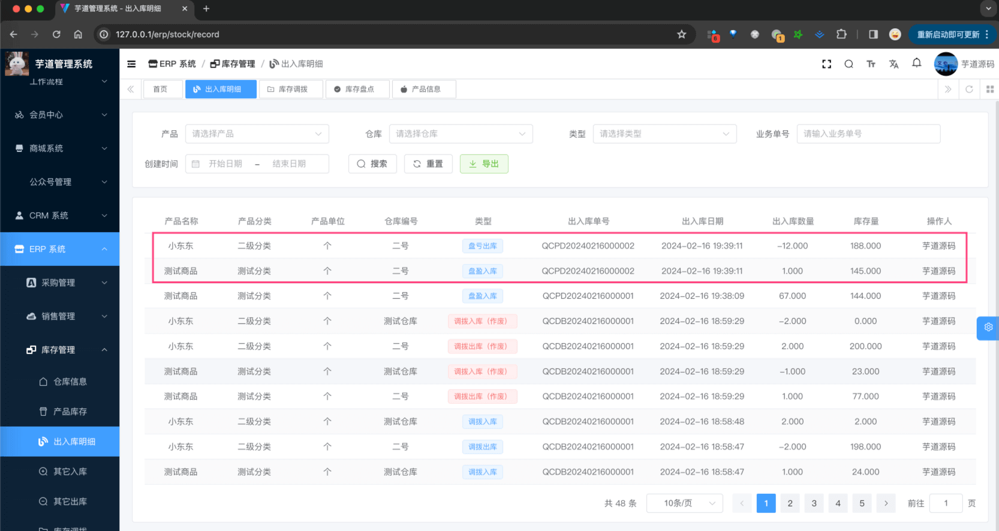
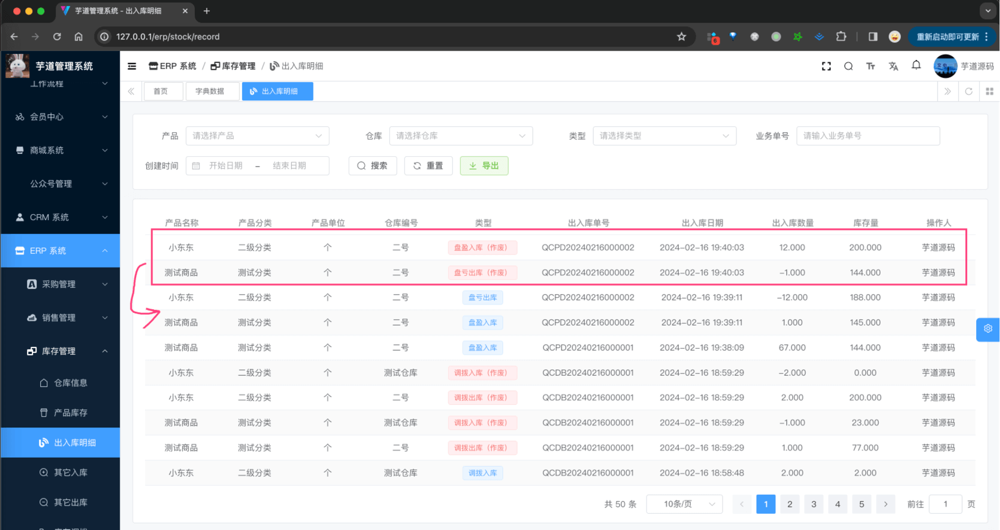

目录

# 【库存】库存调拨、库存盘点

本文接 [《【库存】其它入库、其它出库》](/erp/stock-in-out/)，主要讲解库存管理的库存调拨、库存盘点。它们的表关系如下图所示：


## [#](#_1-库存调拨) 1. 库存调拨

库存调拨，由 ErpStockMoveController 提供接口，将产品从一个仓库调拨到另一个仓库，**减少** 来源仓库的库存，**增加** 目标仓库的库存。

### [#](#_1-表结构) 1. 表结构

`erp_stock_move` 表和 `erp_stock_move_item` 表，分别对应调拨单和调拨项。

> 省略 creator/create\_time/updater/update\_time/deleted/tenant\_id 等通用字段

```sql
CREATE TABLE `erp_stock_move` (
  `id` bigint NOT NULL AUTO_INCREMENT COMMENT '调拨编号',
  `no` varchar(255) CHARACTER SET utf8mb4 COLLATE utf8mb4_unicode_ci NOT NULL COMMENT '调拨单号',
  `move_time` datetime NOT NULL COMMENT '调拨时间',
  
  `total_count` decimal(24,6) NOT NULL COMMENT '合计数量',
  `total_price` decimal(24,6) NOT NULL COMMENT '合计金额，单位：元',
  `status` tinyint NOT NULL COMMENT '状态',
  
  `remark` varchar(255) CHARACTER SET utf8mb4 COLLATE utf8mb4_unicode_ci DEFAULT NULL COMMENT '备注',
  `file_url` varchar(255) CHARACTER SET utf8mb4 COLLATE utf8mb4_unicode_ci DEFAULT NULL COMMENT '附件 URL',
  PRIMARY KEY (`id`)
) ENGINE=InnoDB AUTO_INCREMENT=11 DEFAULT CHARSET=utf8mb4 COLLATE=utf8mb4_unicode_ci COMMENT='ERP 库存调拨单表';

```

① `no`：调拨单号，一般是系统自动生成的，目前格式是 `{prefix}{yyyyMMdd}{6 位自增}`。具体可见 ErpNoRedisDAO 类。

② `total_count` 和 `total_price`：合计数量和金额，目前只是记录，并无特殊逻辑。

③ `status`：状态，统一使用 ErpAuditStatus 枚举类，只有“未审批”、“已审批”两个状态。

* * *

```sql
CREATE TABLE `erp_stock_move_item` (
  `id` bigint NOT NULL AUTO_INCREMENT COMMENT '调拨项编号',
  
  `move_id` bigint NOT NULL COMMENT '调拨编号',
 
  `from_warehouse_id` bigint NOT NULL COMMENT '调出仓库编号',
  `to_warehouse_id` bigint NOT NULL COMMENT '调入仓库编号',
   
  `product_id` bigint NOT NULL COMMENT '产品编号',
  `product_unit_id` bigint NOT NULL COMMENT '产品单位编号',
  `product_price` decimal(24,6) DEFAULT NULL COMMENT '产品单价',
  `count` decimal(24,6) NOT NULL COMMENT '产品数量',
  `total_price` decimal(24,6) DEFAULT NULL COMMENT '合计金额，单位：元',
  
  `remark` varchar(255) CHARACTER SET utf8mb4 COLLATE utf8mb4_unicode_ci DEFAULT NULL COMMENT '备注',
  PRIMARY KEY (`id`)
) ENGINE=InnoDB AUTO_INCREMENT=11 DEFAULT CHARSET=utf8mb4 COLLATE=utf8mb4_unicode_ci COMMENT='ERP 库存调拨项表';

```

① `move_id`：调拨编号，关联到上面的 `erp_stock_move` 表。

② `from_warehouse_id` 和 `to_warehouse_id`：调出（来源）仓库编号和调入（目标）仓库编号。

③ `product_id`、`product_unit_id`、`product_price`、`count` 和 `total_price`：产品编号、产品单位编号、产品单价、数量和金额。

其中 `total_price` 等于 `product_price * count`。

### [#](#_2-管理后台) 2. 管理后台

对应 \[ERP 系统 -> 库存管理 -> 库存调拨\] 菜单，对应 `yudao-ui-admin-vue3` 项目的 `@/views/erp/stock/move` 目录。



① 点击「新增」按钮，随便填写一些信息，点击「确认」按钮，即可新增一条调拨单。



② 点击该调拨单的「审批」按钮，审批通过该出库单，此时状态会变成“已审批”，同时会减少来源仓库的库存、增加目标仓库的库存、新增 `2n` 条库存变动记录。如下图所示：



③ 点击该调拨单的「反审批」按钮，反审批该调拨单，此时状态会变成“未审批”，同时会增加来源仓库的库存、减少目标仓库的库存、新增 `2n` 条库存变动记录。如下图所示：



## [#](#_2-库存盘点) 2. 库存盘点

库存盘点，由 ErpStockCheckController 提供接口，盘点产品在仓库的具体库存，**修改** 它在该仓库的库存。

### [#](#_2-1-表结构) 2.1 表结构

`erp_stock_check` 表和 `erp_stock_check_item` 表，分别对应盘点单和盘点项。

> 省略 creator/create\_time/updater/update\_time/deleted/tenant\_id 等通用字段

```sql
CREATE TABLE `erp_stock_check` (
  `id` bigint NOT NULL AUTO_INCREMENT COMMENT '盘点编号',
  
  `no` varchar(255) CHARACTER SET utf8mb4 COLLATE utf8mb4_unicode_ci NOT NULL COMMENT '盘点单号',
  `check_time` datetime NOT NULL COMMENT '盘点时间',
  
  `total_count` decimal(24,6) NOT NULL COMMENT '合计数量',
  `total_price` decimal(24,6) NOT NULL COMMENT '合计金额，单位：元',
  
  `status` tinyint NOT NULL COMMENT '状态',
  
  `remark` varchar(255) CHARACTER SET utf8mb4 COLLATE utf8mb4_unicode_ci DEFAULT NULL COMMENT '备注',
  `file_url` varchar(255) CHARACTER SET utf8mb4 COLLATE utf8mb4_unicode_ci DEFAULT NULL COMMENT '附件 URL',
  PRIMARY KEY (`id`)
) ENGINE=InnoDB AUTO_INCREMENT=13 DEFAULT CHARSET=utf8mb4 COLLATE=utf8mb4_unicode_ci COMMENT='ERP 库存盘点单表';

```

① `no`：盘点单号，一般是系统自动生成的，目前格式是 `{prefix}{yyyyMMdd}{6 位自增}`。具体可见 ErpNoRedisDAO 类。

② `total_count` 和 `total_price`：合计数量和金额，目前只是记录，并无特殊逻辑。

③ `status`：状态，统一使用 ErpAuditStatus 枚举类，只有“未审批”、“已审批”两个状态。

* * *

```sql
CREATE TABLE `erp_stock_check_item` (
  `id` bigint NOT NULL AUTO_INCREMENT COMMENT '调拨项编号',
  
  `check_id` bigint NOT NULL COMMENT '调拨编号',
  
  `warehouse_id` bigint NOT NULL COMMENT '仓库编号',
  `product_id` bigint NOT NULL COMMENT '产品编号',
  
  `product_unit_id` bigint NOT NULL COMMENT '产品单位编号',
  `product_price` decimal(24,6) DEFAULT NULL COMMENT '产品单价',
  `count` decimal(24,6) NOT NULL COMMENT '盈亏数量',
  `total_price` decimal(24,6) DEFAULT NULL COMMENT '合计金额，单位：元',
  
  `stock_count` decimal(24,6) NOT NULL COMMENT '账面数量（当前库存）',
  `actual_count` decimal(24,6) NOT NULL COMMENT '实际数量（实际库存）',
  
  `remark` varchar(255) CHARACTER SET utf8mb4 COLLATE utf8mb4_unicode_ci DEFAULT NULL COMMENT '备注',
  PRIMARY KEY (`id`)
) ENGINE=InnoDB AUTO_INCREMENT=14 DEFAULT CHARSET=utf8mb4 COLLATE=utf8mb4_unicode_ci COMMENT='ERP 库存盘点项表';

```

① `check_id`：盘点编号，关联到上面的 `erp_stock_check` 表。

② `warehouse_id` 和 `product_id`：仓库编号和产品编号，表示被盘点的产品在该仓库的库存。

③ `product_unit_id`、`product_price`、`count` 和 `total_price`：产品单位编号、产品单价、盈亏数量和金额。

其中 `total_price` 等于 `product_price * count`。

④ `stock_count` 和 `actual_count`：账面数量（当前库存）和实际数量（实际库存），这 2 个字段的差值就是盈亏数量 `count`。

不过也要注意，这 2 个字段更多是冗余，核心还是 `count` 表示盈亏。如果 `count` 是正数则库存增加（入库），`count` 是负数则库存减少（出库）。

### [#](#_2-2-管理后台) 2.2 管理后台

对应 \[ERP 系统 -> 库存管理 -> 库存盘点\] 菜单，对应 `yudao-ui-admin-vue3` 项目的 `@/views/erp/stock/check` 目录。

① 点击「新增」按钮，随便填写一些信息，点击「确认」按钮，即可新增一条盘点单。



② 点击该盘点单的「审批」按钮，审批通过该盘点单，此时状态会变成“已审批”，同时会修改对应的库存、新增库存明细。如下图所示：



③ 点击该盘点单的「反审批」按钮，反审批该盘点单，此时状态会变成“未审批”，同时会修改对应的库存、新增库存明细。如下图所示：

