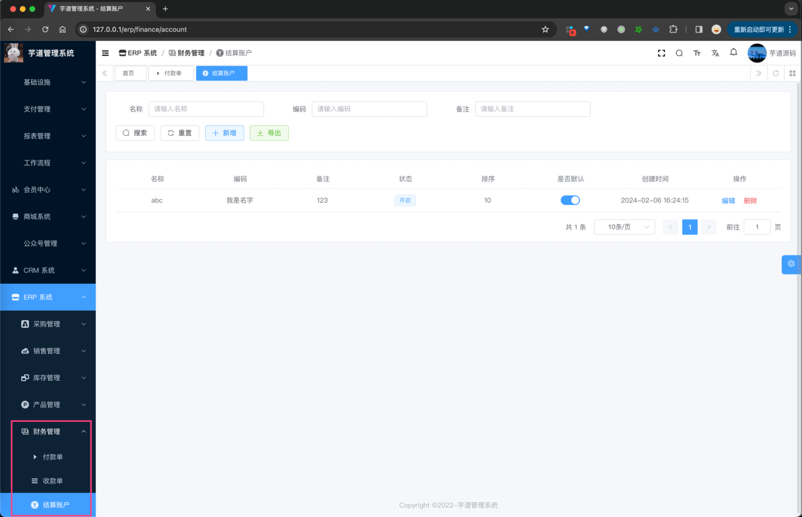
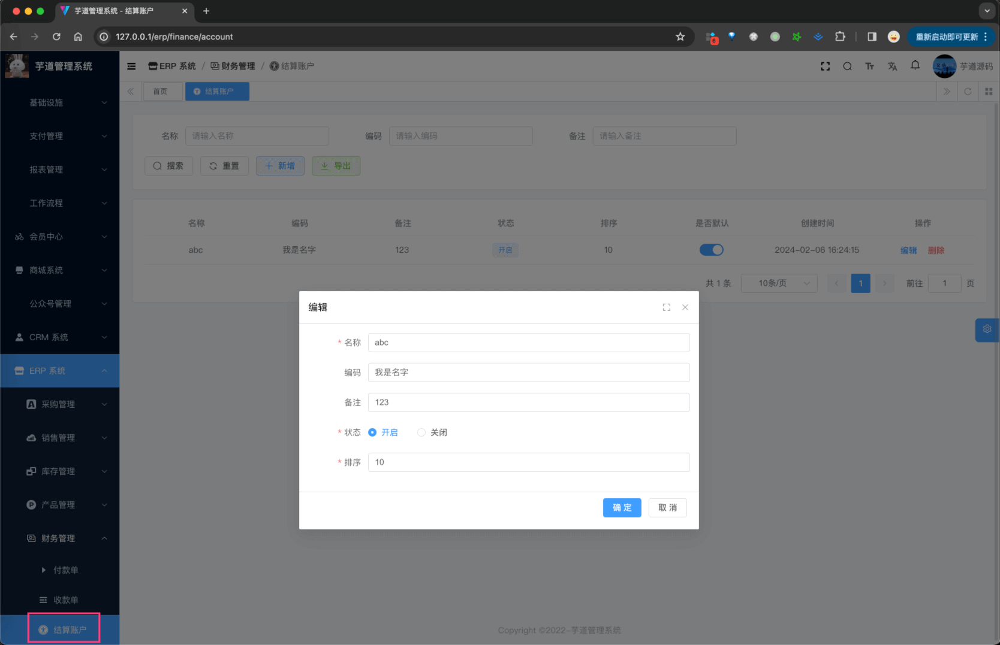
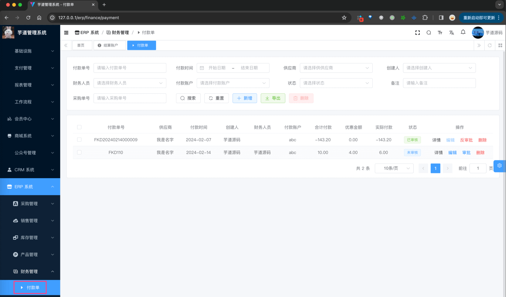
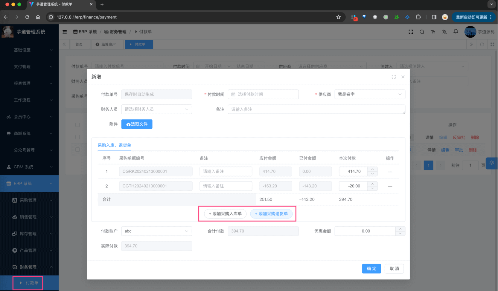
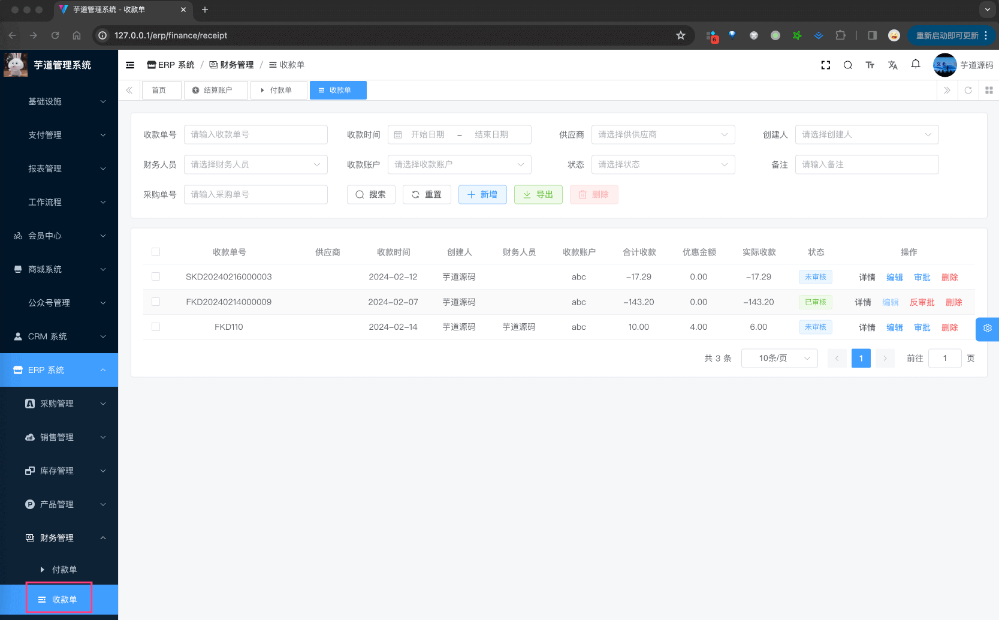
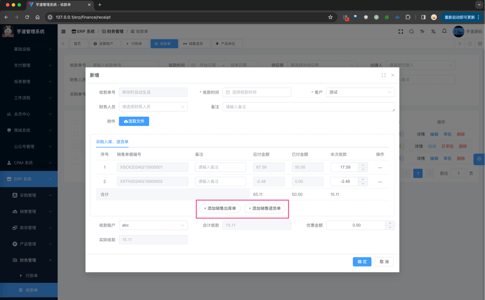

目录

# 【财务】采购付款、销售收款

财务管理，由 `yudao-module-erp-biz` 后端模块的 `finance` 包实现，主要包括如下菜单：



友情提示：目前财务相关的功能还做的相对简单，后续会继续增强！！！

本文，我们主要讲解结算账户、采购付款、销售收款三个功能。它们的表关系如下图所示：


## [#](#_1-结算账户) 1. 结算账户

结算账户，由 ErpAccountController 提供接口，是指公司与供应商、客户之间的结算账户。

### [#](#_1-1-表结构) 1.1 表结构

> 省略 creator/create\_time/updater/update\_time/deleted/tenant\_id 等通用字段

```sql
CREATE TABLE `erp_account` (
  `id` bigint NOT NULL AUTO_INCREMENT COMMENT '结算账户编号',
  `name` varchar(255) COLLATE utf8mb4_unicode_ci NOT NULL COMMENT '账户名称',
  `no` varchar(50) CHARACTER SET utf8mb4 COLLATE utf8mb4_unicode_ci DEFAULT NULL COMMENT '账户编码',
  `remark` varchar(255) CHARACTER SET utf8mb4 COLLATE utf8mb4_unicode_ci DEFAULT NULL COMMENT '备注',
  `status` tinyint NOT NULL COMMENT '开启状态',
  `sort` int NOT NULL COMMENT '排序',
  `default_status` bit(1) DEFAULT b'0' COMMENT '是否默认',
  PRIMARY KEY (`id` DESC)
) ENGINE=InnoDB AUTO_INCREMENT=2 DEFAULT CHARSET=utf8mb4 COLLATE=utf8mb4_unicode_ci COMMENT='ERP 结算账户';

```

都是一些信息字段，仅仅用于展示，没有什么特殊逻辑。

### [#](#_1-2-管理后台) 1.2 管理后台

对应 \[ERP 系统 -> 财务管理 -> 结算账户\] 菜单，对应 `yudao-ui-admin-vue3` 项目的 `@/views/erp/finance/account` 目录。



## [#](#_2-采购付款) 2. 采购付款

采购付款，由 ErpFinancePaymentController 提供接口，用于对采购入库进行付款，以及对采购退货进行退款。

### [#](#_2-1-表结构) 2.1 表结构

`erp_finance_payment` 表和 `erp_finance_payment_item` 表，分别对应录付款单和付款单明细。

> 省略 creator/create\_time/updater/update\_time/deleted/tenant\_id 等通用字段

```sql
CREATE TABLE `erp_finance_payment` (
  `id` bigint NOT NULL AUTO_INCREMENT COMMENT '编号',
  
  `no` varchar(255) COLLATE utf8mb4_unicode_ci NOT NULL COMMENT '付款单号',
  
  `status` tinyint NOT NULL COMMENT '状态',
  `payment_time` datetime NOT NULL COMMENT '付款时间',
  
  `supplier_id` bigint NOT NULL COMMENT '供应商编号',
  `finance_user_id` bigint DEFAULT NULL COMMENT '财务人员编号',
  `account_id` bigint NOT NULL COMMENT '付款账户编号',
  
  `total_price` decimal(24,6) NOT NULL COMMENT '合计价格，单位：元',
  `discount_price` decimal(24,6) NOT NULL COMMENT '优惠金额，单位：元',
  `payment_price` decimal(24,6) NOT NULL COMMENT '实付金额，单位：分',
  
  `remark` varchar(1024) CHARACTER SET utf8mb4 COLLATE utf8mb4_0900_ai_ci DEFAULT NULL COMMENT '备注',
  PRIMARY KEY (`id`)
) ENGINE=InnoDB AUTO_INCREMENT=11 DEFAULT CHARSET=utf8mb4 COLLATE=utf8mb4_unicode_ci COMMENT='ERP 付款单表';

```

① `no`：付款单号，一般是系统自动生成的，目前格式是 `{prefix}{yyyyMMdd}{6 位自增}`。具体可见 ErpNoRedisDAO 类。

② `status`：审核状态，统一使用 ErpAuditStatus 枚举类，只有“未审批”、“已审批”两个状态。

③ `supplier_id`：供应商编号，关联 `erp_supplier` 表。

`account_id`：结算账户编号，关联上面的 `erp_account` 表。

④ `total_price`、`discount_price`、`payment_price`：合计价格、优惠金额、实付金额。

其中，`payment_price` 等于 `total_price - discount_price`。

* * *

```sql
CREATE TABLE `erp_finance_payment_item` (
  `id` bigint NOT NULL AUTO_INCREMENT COMMENT '编号',
  
  `payment_id` bigint NOT NULL COMMENT '付款单编号',
  
  `biz_type` tinyint NOT NULL COMMENT '业务类型',
  `biz_id` bigint NOT NULL COMMENT '业务编号',
  `biz_no` varchar(255) COLLATE utf8mb4_unicode_ci NOT NULL COMMENT '业务单号',
  
  `total_price` decimal(24,6) NOT NULL COMMENT '应付欠款，单位：分',
  `paid_price` decimal(24,6) NOT NULL COMMENT '已付欠款，单位：分',
  `payment_price` decimal(24,6) NOT NULL COMMENT '本次付款，单位：分',
  
  `remark` varchar(1024) CHARACTER SET utf8mb4 COLLATE utf8mb4_unicode_ci DEFAULT NULL COMMENT '备注',
  PRIMARY KEY (`id`)
) ENGINE=InnoDB AUTO_INCREMENT=20 DEFAULT CHARSET=utf8mb4 COLLATE=utf8mb4_unicode_ci COMMENT='ERP 付款项表';

```

① `payment_id`：付款单编号，关联 `erp_finance_payment` 表。

② `biz_type`、`biz_id`、`biz_no`：业务类型、业务编号、业务单号。

其中 `biz_type` 由 ErpBizTypeEnum 枚举，目前使用“采购入库”、“采购退货”两种类型。

③ `total_price`、`paid_price`、`payment_price`：应付欠款、已付欠款、本次付款。

其中，`payment_price` 等于 `total_price - paid_price`。

不过也要注意，这 `total_price`、`paid_price` 字段更多是冗余，核心还是 `payment_price` 表示本次付款。

### [#](#_2-2-管理后台) 2.2 管理后台

对应 \[ERP 系统 -> 财务管理 -> 采购单\] 菜单，对应 `yudao-ui-admin-vue3` 项目的 `@/views/erp/finance/payment` 目录。



点击「新增」按钮，随便填写一些信息，点击「确认」按钮，即可新增一条付款单。



友情提示：只有审批通过的采购入库、采购退货单才能进行选择添加。

## [#](#_3-销售收款) 3. 销售收款

友情提示：“销售”和“采购”目前是基本一致的，只是“销售”是从“客户”收款，“采购”是向“供应商”付款。

销售收款，由 ErpFinanceReceiptController 提供接口，用于对销售出库进行收款，以及对销售退货进行退款。

### [#](#_3-1-表结构) 3.1 表结构

`erp_finance_receipt` 表和 `erp_finance_receipt_item` 表，分别对应录收款单和收款单明细。

> 省略 creator/create\_time/updater/update\_time/deleted/tenant\_id 等通用字段

```sql
CREATE TABLE `erp_finance_receipt` (
  `id` bigint NOT NULL AUTO_INCREMENT COMMENT '编号',
  
  `no` varchar(255) CHARACTER SET utf8mb4 COLLATE utf8mb4_unicode_ci NOT NULL COMMENT '收款单号',
  
  `status` tinyint NOT NULL COMMENT '状态',
  `receipt_time` datetime NOT NULL COMMENT '收款时间',
  
  `customer_id` bigint NOT NULL COMMENT '客户编号',
  `account_id` bigint NOT NULL COMMENT '收款账户编号',
  `finance_user_id` bigint DEFAULT NULL COMMENT '财务人员编号',
  
  `total_price` decimal(24,6) NOT NULL COMMENT '合计价格，单位：元',
  `discount_price` decimal(24,6) NOT NULL COMMENT '优惠金额，单位：元',
  `receipt_price` decimal(24,6) NOT NULL COMMENT '实收金额，单位：分',
  
  `remark` varchar(1024) CHARACTER SET utf8mb4 COLLATE utf8mb4_0900_ai_ci DEFAULT NULL COMMENT '备注',
  PRIMARY KEY (`id`)
) ENGINE=InnoDB AUTO_INCREMENT=14 DEFAULT CHARSET=utf8mb4 COLLATE=utf8mb4_unicode_ci COMMENT='ERP 收款单表';

```

① `no`：收款单号，一般是系统自动生成的，目前格式是 `{prefix}{yyyyMMdd}{6 位自增}`。具体可见 ErpNoRedisDAO 类。

② `status`：审核状态，统一使用 ErpAuditStatus 枚举类，只有“未审批”、“已审批”两个状态。

③ `customer_id`：客户编号，关联 `erp_customer` 表。

`account_id`：结算账户编号，关联上面的 `erp_account` 表。

④ `total_price`、`discount_price`、`receipt_price`：合计价格、优惠金额、实收金额。

其中，`receipt_price` 等于 `total_price - discount_price`。

* * *

```sql
CREATE TABLE `erp_finance_receipt_item` (
  `id` bigint NOT NULL AUTO_INCREMENT COMMENT '编号',
  
  `receipt_id` bigint NOT NULL COMMENT '收款单编号',
  
  `biz_type` tinyint NOT NULL COMMENT '业务类型',
  `biz_id` bigint NOT NULL COMMENT '业务编号',
  `biz_no` varchar(255) CHARACTER SET utf8mb4 COLLATE utf8mb4_unicode_ci NOT NULL COMMENT '业务单号',
  
  `total_price` decimal(24,6) NOT NULL COMMENT '应收金额，单位：分',
  `receipted_price` decimal(24,6) NOT NULL COMMENT '已收金额，单位：分',
  `receipt_price` decimal(24,6) NOT NULL COMMENT '本次收款，单位：分',
  
  `remark` varchar(1024) CHARACTER SET utf8mb4 COLLATE utf8mb4_unicode_ci DEFAULT NULL COMMENT '备注',
  PRIMARY KEY (`id`)
) ENGINE=InnoDB AUTO_INCREMENT=24 DEFAULT CHARSET=utf8mb4 COLLATE=utf8mb4_unicode_ci COMMENT='ERP 收款项表';

```

① `receipt_id`：收款单编号，关联 `erp_finance_receipt` 表。

② `biz_type`、`biz_id`、`biz_no`：业务类型、业务编号、业务单号。

其中 `biz_type` 由 ErpBizTypeEnum 枚举，目前使用“销售出库”、“销售退货”两种类型。

③ `total_price`、`receipted_price`、`receipt_price`：应收金额、已收金额、本次收款。

其中，`receipt_price` 等于 `total_price - receipted_price`。

不过也要注意，这 `total_price`、`receipted_price` 字段更多是冗余，核心还是 `receipt_price` 表示本次收款。

### [#](#_3-2-管理后台) 3.2 管理后台

对应 \[ERP 系统 -> 财务管理 -> 收款单\] 菜单，对应 `yudao-ui-admin-vue3` 项目的 `@/views/erp/finance/receipt` 目录。



点击「新增」按钮，随便填写一些信息，点击「确认」按钮，即可新增一条收款单。



友情提示：只有审批通过的销售出库、销售退货单才能进行选择添加。