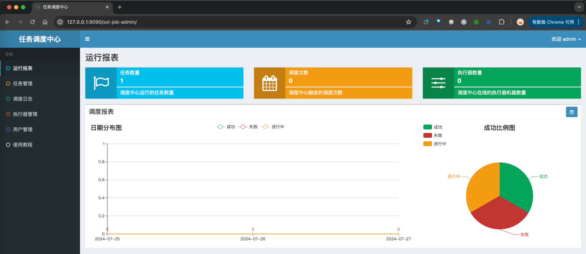
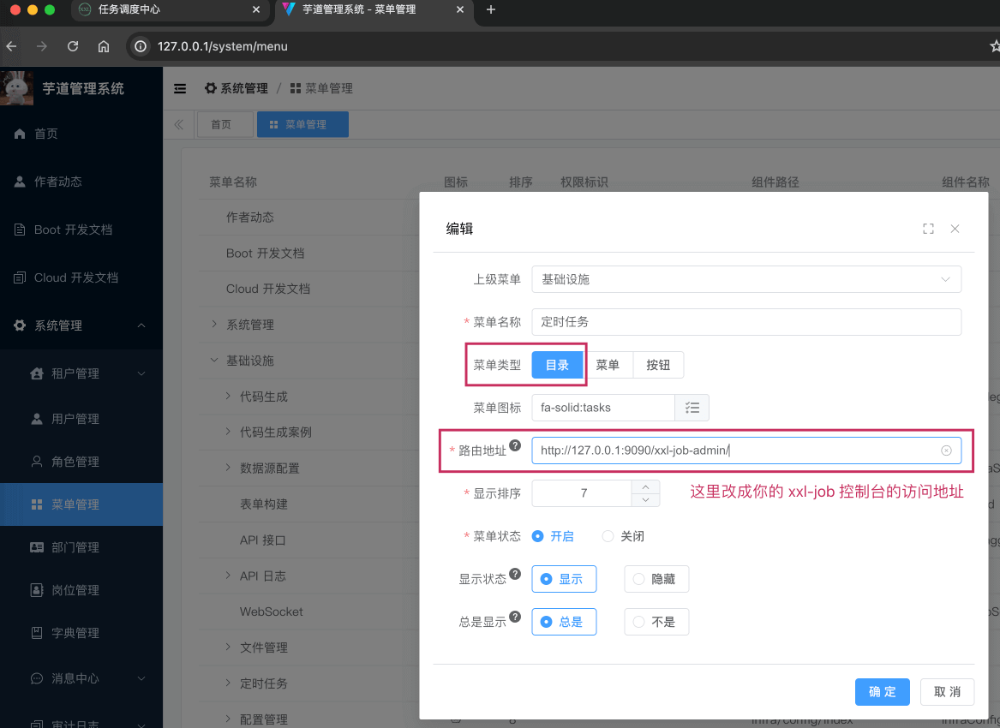
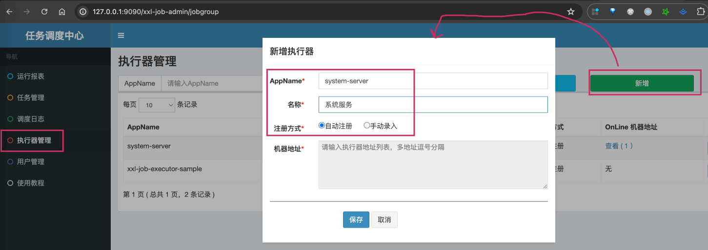
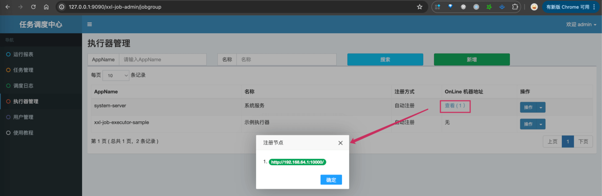
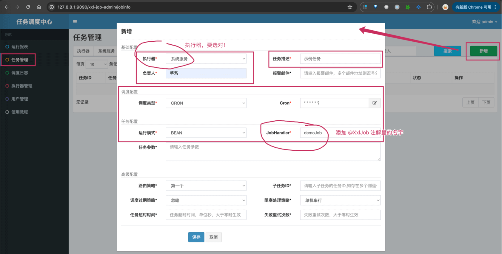

目录

# 定时任务 XXL Job

定时任务的使用场景主要如下：

*   时间驱动处理场景：每分钟扫描超时支付的订单，活动状态刷新，整点发送优惠券。
*   批量处理数据：按月批量统计报表数据，批量更新短信状态，实时性要求不高。

年度最佳定时任务：每个月初的工资单的推送！！！

项目基于 XXL Job 实现分布式定时任务，支持动态控制任务的添加、修改、开启、暂停、删除、执行一次等操作。



疑问：为什么使用 XXL-Job 呢？

目前国内开源的 Job 框架，经历过大规模的中大厂的考验，稳定性和功能性都是有保障的，目前可能只有 XXL-Job 和 Elastic-Job 两个选择。

相对来说，XXL-Job 更加轻量级，大家更容易上手。

## [#](#_1-如何搭建-xxl-job-调度中心) 1. 如何搭建 XXL Job 调度中心

① 参见 [《芋道 XXL-Job 极简入门》 (opens new window)](https://www.iocoder.cn/XXL-JOB/install/?qun) 文档的「4. 搭建调度中心 」部分。

② 搭建完成后，需要修改管理后台的 \[基础设施 -> 定时任务\] 菜单，指向你的 XXL-Job 地址。如下图所示：



## [#](#_2-如何编写-xxl-job-定时任务) 2. 如何编写 XXL Job 定时任务

友情提示：以 yudao-module-system 服务为例子。

### [#](#_2-1-引入依赖) 2.1 引入依赖

在 `yudao-module-system-biz` 模块的 [`pom.xml` (opens new window)](https://github.com/YunaiV/yudao-cloud/blob/master/yudao-module-system/yudao-module-system-biz/pom.xml) 中，引入 `yudao-spring-boot-starter-job` 技术组件。如下所示：

```xml
<dependency>
    <groupId>cn.iocoder.cloud</groupId>
    <artifactId>yudao-spring-boot-starter-job</artifactId>
</dependency>

```

该组件基于 XXL Job 框架的封装，实现它的 Spring Boot Starter 配置。

### [#](#_2-2-添加配置) 2.2 添加配置

① 在 [`application.yaml` (opens new window)](https://github.com/YunaiV/yudao-cloud/blob/master/yudao-module-system/yudao-module-system-biz/src/main/resources/application.yaml#L86-L93) 中，添加 `xxl.job` 配置。如下所示：

```yaml
--- #################### 定时任务相关配置 ####################

xxl:
  job:
    executor:
      appname: ${spring.application.name} # 执行器 AppName
      logpath: ${user.home}/logs/xxl-job/${spring.application.name} # 执行器运行日志文件存储磁盘路径
    accessToken: default_token # 执行器通讯TOKEN

```

*   注意，`xxl.job.accessToken` 配置，需要改成你的 XXL Job 调度中心的访问令牌。

② 在 [`application-local.yaml` (opens new window)](https://github.com/YunaiV/yudao-cloud/blob/master/yudao-module-system/yudao-module-system-biz/src/main/resources/application-local.yaml#L80-L85) 中，添加 `xxl.job` 配置。如下所示：

```yaml
--- #################### 定时任务相关配置 ####################

xxl:
  job:
    enabled: true # 是否开启调度中心，默认为 true 开启
    admin:
      addresses: http://127.0.0.1:9090/xxl-job-admin # 调度中心部署跟地址

```

③ 在 XXL-Job 的 \[执行器管理\] 菜单中，添加该服务作为 XXL-Job 的执行器。如下图所示：



*   AppName：使用服务的 `spring.application.name` 即可，这个是我们项目所封装和约定的，例如说该服务是 `system-server`
*   名称：没有强制要求，此处我们填写“系统服务”
*   注册方式：使用“自动注册”即可，稍后我们启动该服务后，会看到注册上来

④ 启动该项目的 SystemServerApplication 类，看到如下日志，说明注册成功：

```bash
2024-07-27 13:21:52.724 |  INFO 2109 | main [TID: N/A] c.i.y.f.q.c.YudaoXxlJobAutoConfiguration | [xxlJobExecutor][初始化 XXL-Job 执行器的配置]

2024-07-27 13:21:53.432 |  INFO 2109 | main [TID: N/A] c.xxl.job.core.executor.XxlJobExecutor   | >>>>>>>>>>> xxl-job register jobhandler success, name:demoJob, jobHandler:com.xxl.job.core.handler.impl.MethodJobHandler@7827b580[class cn.iocoder.yudao.module.system.job.demo.DemoJob$$SpringCGLIB$$0#execute]

2024-07-27 13:21:53.496 |  INFO 2109 | Thread-13 [TID: N/A] com.xxl.job.core.server.EmbedServer      | >>>>>>>>>>> xxl-job remoting server start success, nettype = class com.xxl.job.core.server.EmbedServer, port = 10000

```

*   其中，第 2 行的 `demoJob` 是我们在 yudao-module-system 提供的一个示例 Job。

另外，我们也可以在 XXL-Job 的 \[任务管理\] 菜单中，看到注册成功的信息。如下图所示：



### [#](#_2-3-创建-job-定时任务) 2.3 创建 Job 定时任务

友情提示：继续以 yudao-module-system 服务为例子。

在 `yudao-module-system-biz` 模块的 `job` 包下，我们已经提供了一个 DemoJob 示例，代码如下：

```java
@Component
public class DemoJob {

    @XxlJob("demoJob")
    @TenantJob
    public void execute() {
        System.out.println("美滋滋");
    }

}

```

疑问：为什么 Job 查询数据库时，报多租户的错误？

需要声明 [`@TenantJob` (opens new window)](https://github.com/YunaiV/yudao-cloud/blob/master/yudao-framework/yudao-spring-boot-starter-biz-tenant/src/main/java/cn/iocoder/yudao/framework/tenant/core/job/TenantJob.java) 注解在 Job 类上，实现**并行**遍历每个租户，执行定时任务的逻辑。

更多多租户的内容，可见 [《开发指南 —— SaaS 多租户》](/saas-tenant/) 文档。

① 在 XXL-Job 的 \[任务管理\] 菜单中，点击 \[新增\] 按钮，填写定时任务的信息。如下图所示：



② 点击该任务后的 \[操作\] 按钮，选择 \[执行一次\] 按钮，执行一次该任务。然后，我们可以在 IDEA 看到 `美滋滋` 的输出。

如此，我们便完成了一个简单的定时任务的编写。撒花~~~

## [#](#_4-更多使用教程) 4. 更多使用教程

可参见 [《芋道 Spring Boot 定时任务入门》 (opens new window)](http://www.iocoder.cn/Spring-Boot/Job/?yudao) 文章的「5. 快速入门 XXL-JOB」部分。

常用的 Cron 表达式如下：

```bash
0 0 10,14,16 * * ? 每天上午 10 点，下午 2 点、4 点 
0 0/30 9-17 * * ? 朝九晚五工作时间内，每半小时 
0 0 12 ? * WED 表示每个星期三中午 12 点 
0 0 12 * * ? 每天中午 12 点触发 
0 15 10 ? * * 每天上午 10:15 触发 
0 15 10 * * ? 每天上午 10:15 触发 
0 15 10 * * ? * 每天上午 10:15 触发 
0 15 10 * * ? 2005 2005 年的每天上午 10:15 触发 
0 * 14 * * ? 在每天下午 2 点到下午 2:59 期间，每 1 分钟触发 
0 0/5 14 * * ? 在每天下午 2 点到下午 2:55 期间，每 5 分钟触发 
0 0/5 14,18 * * ? 在每天下午 2 点到 2:55 期间和下午 6 点到 6:55 期间，每 5 分钟触发 
0 0-5 14 * * ? 在每天下午 2 点到下午 2:05 期间，每 1 分钟触发 
0 10,44 14 ? 3 WED 每年三月的星期三的下午 2:10 和 2:44 触发 
0 15 10 ? * MON-FRI 周一至周五的上午 10:15 触发 
0 15 10 15 * ? 每月15日上午 10:15 触发 
0 15 10 L * ? 每月最后一日的上午 10:15 触发 
0 15 10 ? * 6L 每月的最后一个星期五上午 10:15 触发 
0 15 10 ? * 6L 2002-2005 2002 年至 2005 年，每月的最后一个星期五上午 10:15 触发 
0 15 10 ? * 6#3 每月的第三个星期五上午 10:15 触发

```