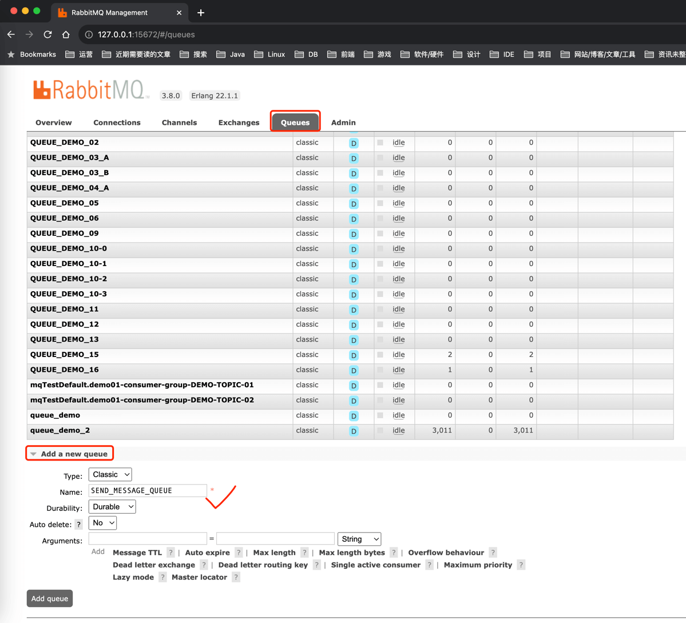
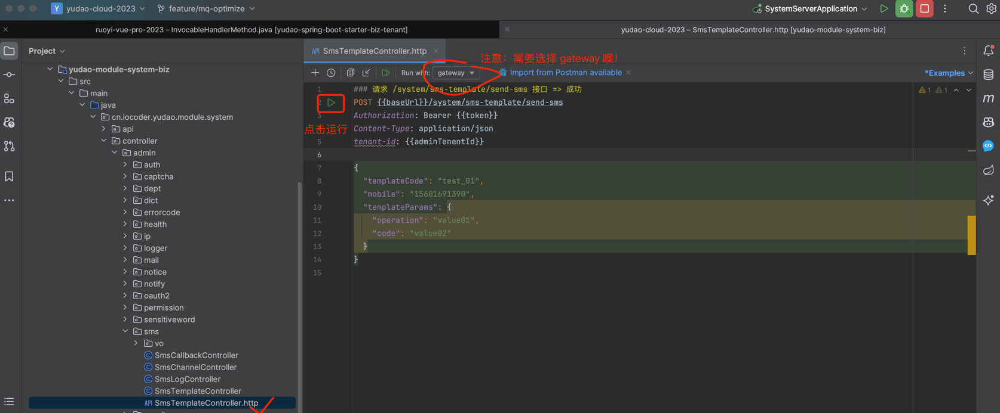

目录

# 消息队列（RabbitMQ）

## [#](#rabbitmq-spring) RabbitMQ-Spring

[`yudao-spring-boot-starter-mq` (opens new window)](https://github.com/YunaiV/yudao-cloud) 技术组件，基于 RabbitMQ 实现分布式消息队列。

如果你对 RabbitMQ 不太了解，可以看看 [《芋道 Spring Boot 消息队列 RabbitMQ 入门》 (opens new window)](https://www.iocoder.cn/Spring-Boot/RabbitMQ/?yudao) 文档。

如何安装一个 RabbitMQ 服务？

参考 [《芋道 RabbitMQ 极简入门 》 (opens new window)](https://www.iocoder.cn/RabbitMQ/install/?yudao) 文档。

## [#](#_2-使用示例) 2. 使用示例

友情提示：下文操作的都是 yudao-module-system 服务

以【短信发送】举例子，改造使用 RabbitMQ 作为消息队列。

## [#](#_2-0-引入依赖与配置) 2.0 引入依赖与配置

① 在 `yudao-module-system-biz` 模块中，引入 `yudao-spring-boot-starter-mq` 技术组件。如下所示：

```xml
<dependency>
    <groupId>cn.iocoder.cloud</groupId>
    <artifactId>yudao-spring-boot-starter-mq</artifactId>
</dependency>

```

② 修改 `yudao-spring-boot-starter-mq` 的 `pom.xml` 文件，引入 `spring-rabbit` 依赖。如下所示：

```xml
<!-- 实际只要删除  <optional>true</optional> 部分即可 -->
<dependency>
    <groupId>org.springframework.amqp</groupId>
    <artifactId>spring-rabbit</artifactId>
</dependency>

```

记得需要手动在 IDEA 刷新下 Maven 依赖。

③ 修改 `application-local.xml` 配置文件，添加 RabbitMQ 配置。如下所示：

```yaml
spring:
  # RabbitMQ 配置项，对应 RabbitProperties 配置类
  rabbitmq:
    host: 127.0.0.1 # RabbitMQ 服务的地址
    port: 5672 # RabbitMQ 服务的端口
    username: guest # RabbitMQ 服务的账号
    password: guest # RabbitMQ 服务的密码

```

ps：默认已经添加，无需操作。

### [#](#_2-1-message-消息) 2.1 Message 消息

① 在 `message` 包下，修改 SmsSendMessage 类，短信发送消息。代码如下：

```java
@Data
public class SmsSendMessage implements Serializable { // 重点：需要添加 Serializable 接口 

    public static final String QUEUE = "SEND_MESSAGE_QUEUE"; // 重点：需要增加消息对应的 Queue

    /**
     * 短信日志编号
     */
    @NotNull(message = "短信日志编号不能为空")
    private Long logId;
    /**
     * 手机号
     */
    @NotNull(message = "手机号不能为空")
    private String mobile;
    /**
     * 短信渠道编号
     */
    @NotNull(message = "短信渠道编号不能为空")
    private Long channelId;
    /**
     * 短信 API 的模板编号
     */
    @NotNull(message = "短信 API 的模板编号不能为空")
    private String apiTemplateId;
    /**
     * 短信模板参数
     */
    private List<KeyValue<String, Object>> templateParams;

}

```

② 在 RabbitMQ 控制台，新增 `"SEND_MESSAGE_QUEUE"` 队列。如下图所示：



### [#](#_2-2-smsproducer-生产者) 2.2 SmsProducer 生产者

在 `producer` 包下，修改 SmsProducer 类，Sms 短信相关消息的生产者。代码如下：

```java
@Slf4j
@Component
public class SmsProducer {

    @Resource
    private RabbitTemplate rabbitTemplate; // 重点：注入 RabbitTemplate 对象

    /**
     * 发送 {@link SmsSendMessage} 消息
     *
     * @param logId 短信日志编号
     * @param mobile 手机号
     * @param channelId 渠道编号
     * @param apiTemplateId 短信模板编号
     * @param templateParams 短信模板参数
     */
    public void sendSmsSendMessage(Long logId, String mobile,
                                   Long channelId, String apiTemplateId, List<KeyValue<String, Object>> templateParams) {
        SmsSendMessage message = new SmsSendMessage().setLogId(logId).setMobile(mobile);
        message.setChannelId(channelId).setApiTemplateId(apiTemplateId).setTemplateParams(templateParams);
        rabbitTemplate.convertAndSend(SmsSendMessage.QUEUE, message); // 重点：使用 RabbitTemplate 发送消息
    }

}

```

### [#](#_2-3-smssendconsumer-消费者) 2.3 SmsSendConsumer 消费者

在 `consumer` 包下，修改 SmsSendConsumer 类，SmsSendMessage 的消费者。代码如下：

```java
@Component
@RabbitListener(queues = SmsSendMessage.QUEUE) // 重点：添加 @RabbitListener 注解，声明消费的 queue
@Slf4j
public class SmsSendConsumer {

    @Resource
    private SmsSendService smsSendService;

    @RabbitHandler // 重点：添加 @RabbitHandler 注解，实现消息的消费
    public void onMessage(SmsSendMessage message) {
        log.info("[onMessage][消息内容({})]", message);
        smsSendService.doSendSms(message);
    }

}

```

### [#](#_2-4-简单测试) 2.4 简单测试

〇 Run 启动 Gateway 网关服务，因为需要它来调用服务。

① Debug 启动后端项目，可以在 SmsProducer 和 SmsSendConsumer 上面打上断点，稍微调试下。

② 打开 `SmsTemplateController.http` 文件，使用 IDEA httpclient 发起请求，发送短信。如下图所示：



如果 IDEA 控制台看到 `[onMessage][消息内容` 日志内容，说明消息的发送和消费成功。