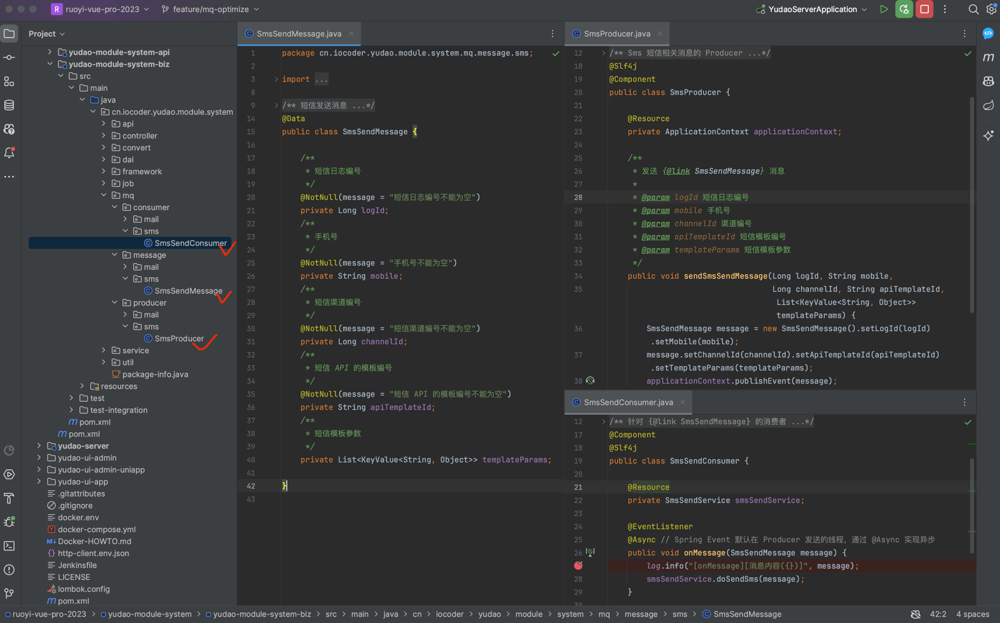

目录

# 消息队列（内存）

## [#](#_1-spring-event) 1. Spring Event

[`yudao-spring-boot-starter-mq` (opens new window)](https://github.com/YunaiV/yudao-cloud) 技术组件，提供了 Redis、RocketMQ、RabbitMQ、Kafka 分布式消息队列的封装。

考虑到部分同学的项目对消息队列的要求不高，又不想引入额外部署的消息队列，所以**默认**使用 Spring Event 实现【内存】级别的消息队列。

疑问：为什么默认不使用 Redis 作为消息队列？

这确实是一种选择，但是想要使用 Redis 实现可靠的消息队列，必须使用 Redis 5.0 版本的 Stream 特性。

这样一方面对 Redis 要求的版本比较高，另一方面大多数同学对 Redis Stream 基本不了解，生产经验不足。

如果你对 Spring Event 不太了解，可以看看 [《芋道 Spring Boot 事件机制 Event 入门》 (opens new window)](https://www.iocoder.cn/Spring-Boot/Event/?yudao) 文档。

## [#](#_2-使用示例) 2. 使用示例

友情提示：下文操作的都是 yudao-module-system 服务

以【短信发送】举例子，我们来看看 Spring Event 的使用。如下图所示：



### [#](#_2-1-message-消息) 2.1 Message 消息

在 `message` 包下，新建 SmsSendMessage 类，短信发送消息。代码如下：

```java
@Data
public class SmsSendMessage {

    /**
     * 短信日志编号
     */
    @NotNull(message = "短信日志编号不能为空")
    private Long logId;
    /**
     * 手机号
     */
    @NotNull(message = "手机号不能为空")
    private String mobile;
    /**
     * 短信渠道编号
     */
    @NotNull(message = "短信渠道编号不能为空")
    private Long channelId;
    /**
     * 短信 API 的模板编号
     */
    @NotNull(message = "短信 API 的模板编号不能为空")
    private String apiTemplateId;
    /**
     * 短信模板参数
     */
    private List<KeyValue<String, Object>> templateParams;

}

```

### [#](#_2-2-smsproducer-生产者) 2.2 SmsProducer 生产者

在 `producer` 包下，新建 SmsProducer 类，Sms 短信相关消息的生产者。代码如下：

```java
@Slf4j
@Component
public class SmsProducer {

    @Resource
    private ApplicationContext applicationContext;

    /**
     * 发送 {@link SmsSendMessage} 消息
     *
     * @param logId 短信日志编号
     * @param mobile 手机号
     * @param channelId 渠道编号
     * @param apiTemplateId 短信模板编号
     * @param templateParams 短信模板参数
     */
    public void sendSmsSendMessage(Long logId, String mobile,
                                   Long channelId, String apiTemplateId, List<KeyValue<String, Object>> templateParams) {
        SmsSendMessage message = new SmsSendMessage().setLogId(logId).setMobile(mobile);
        message.setChannelId(channelId).setApiTemplateId(apiTemplateId).setTemplateParams(templateParams);
        applicationContext.publishEvent(message);
    }

}

```

### [#](#_2-3-smssendconsumer-消费者) 2.3 SmsSendConsumer 消费者

在 `consumer` 包下，新建 SmsSendConsumer 类，SmsSendMessage 的消费者。代码如下：

```java
@Component
@Slf4j
public class SmsSendConsumer {

    @Resource
    private SmsSendService smsSendService;

    @EventListener
    @Async // Spring Event 默认在 Producer 发送的线程，通过 @Async 实现异步
    public void onMessage(SmsSendMessage message) {
        log.info("[onMessage][消息内容({})]", message);
        smsSendService.doSendSms(message);
    }

}

```

### [#](#_2-4-简单测试) 2.4 简单测试

〇 Run 启动 Gateway 网关服务，因为需要它来调用服务。

① Debug 启动 `yudao-module-system` 服务，可以在 SmsProducer 和 SmsSendConsumer 上面打上断点，稍微调试下。

② 打开 `SmsTemplateController.http` 文件，使用 IDEA httpclient 发起请求，发送短信。如下图所示：


如果 IDEA 控制台看到 `[onMessage][消息内容` 日志内容，说明消息的发送和消费成功。