目录

# 会员等级、积分、签到

本小节，我们主要看看会员等级、积分、签到相关的表。

## [#](#_1-会员等级) 1. 会员等级

会员等级，将会员分成不同的等级，给予相应的折扣。例如说：商城下单时，会员等级为 1 的用户，可以享受 9 折优惠。

它的后端由 `level` 包实现，表关系如下图所示：

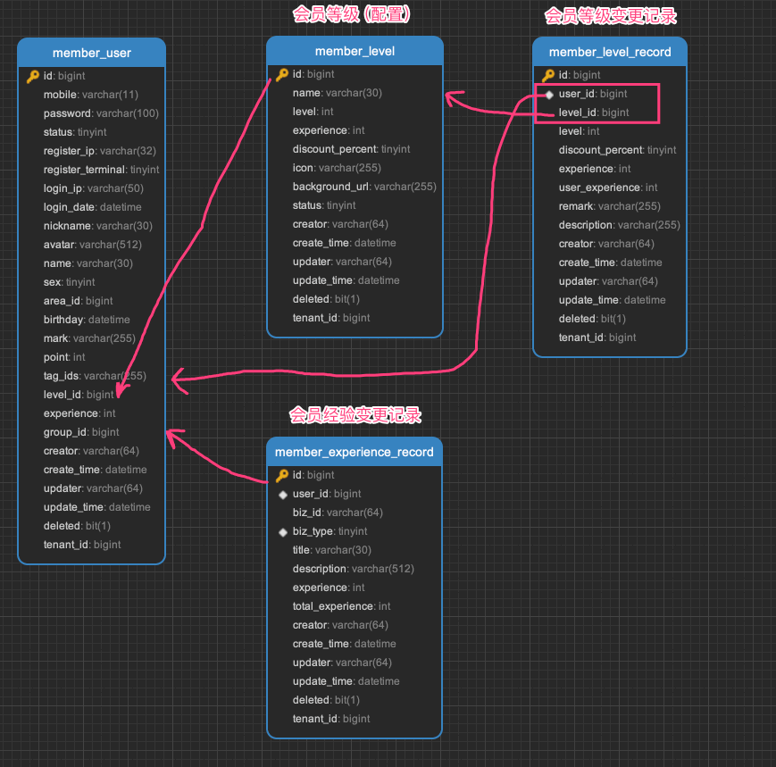

### [#](#_1-1-表结构) 1.1 表结构

`member_level` 表，会员等级（配置）表，由 MemberLevelService 实现。表结构如下：

> 省略 creator/create\_time/updater/update\_time/deleted/tenant\_id 等通用字段

```sql
CREATE TABLE `member_level` (
  `id` bigint NOT NULL AUTO_INCREMENT COMMENT '编号',
  `name` varchar(30) CHARACTER SET utf8mb4 COLLATE utf8mb4_unicode_ci NOT NULL DEFAULT '' COMMENT '等级名称',
  `level` int NOT NULL DEFAULT '0' COMMENT '等级',
  `experience` int NOT NULL DEFAULT '0' COMMENT '升级经验',
  `discount_percent` tinyint NOT NULL DEFAULT '100' COMMENT '享受折扣',
  `icon` varchar(255) CHARACTER SET utf8mb4 COLLATE utf8mb4_unicode_ci NOT NULL DEFAULT '' COMMENT '等级图标',
  `background_url` varchar(255) CHARACTER SET utf8mb4 COLLATE utf8mb4_unicode_ci NOT NULL DEFAULT '' COMMENT '等级背景图',
  `status` tinyint NOT NULL DEFAULT '0' COMMENT '状态',
  PRIMARY KEY (`id`) USING BTREE
) ENGINE=InnoDB AUTO_INCREMENT=4 DEFAULT CHARSET=utf8mb4 COLLATE=utf8mb4_unicode_ci COMMENT='会员等级';

```

① `level` 字段：会员等级，从 1 开始，越大等级越高。

② `experience` 字段：升级经验，当用户的经验值达到此值时，会员等级自动升级。

③ `discount_percent` 字段：享受折扣，例如说：100 表示不打折，90 表示 9 折，80 表示 8 折。

* * *

`member_level_record` 表，会员等级记录变更表，由 MemberLevelRecordService 实现。表结构如下：

> 省略 creator/create\_time/updater/update\_time/deleted/tenant\_id 等通用字段

```sql
CREATE TABLE `member_level_record` (
  `id` bigint NOT NULL AUTO_INCREMENT COMMENT '编号',
  `user_id` bigint NOT NULL DEFAULT '0' COMMENT '用户编号',
  `level_id` bigint NOT NULL DEFAULT '0' COMMENT '等级编号',
  `level` int NOT NULL DEFAULT '0' COMMENT '会员等级',
  `discount_percent` tinyint NOT NULL DEFAULT '100' COMMENT '享受折扣',
  `experience` int NOT NULL DEFAULT '0' COMMENT '升级经验',
  `remark` varchar(255) CHARACTER SET utf8mb4 COLLATE utf8mb4_unicode_ci NOT NULL DEFAULT '' COMMENT '备注',
  `description` varchar(255) CHARACTER SET utf8mb4 COLLATE utf8mb4_unicode_ci NOT NULL DEFAULT '' COMMENT '描述',
  
  `user_experience` int NOT NULL DEFAULT '0' COMMENT '会员此时的经验',
  PRIMARY KEY (`id`) USING BTREE,
  KEY `idx_user_id` (`user_id`) USING BTREE COMMENT '会员等级记录-用户编号'
) ENGINE=InnoDB AUTO_INCREMENT=33 DEFAULT CHARSET=utf8mb4 COLLATE=utf8mb4_unicode_ci COMMENT='会员等级记录';

```

每次会员等级变更时，都会记录到此表中。并且，会记录 `user_experience` 字段，表示会员此时的经验值。

* * *

`member_experience_record` 表，会员经验变更记录表，由 MemberExperienceRecordService 实现。表结构如下：

> 省略 creator/create\_time/updater/update\_time/deleted/tenant\_id 等通用字段

```sql
CREATE TABLE `member_experience_record` (
  `id` bigint NOT NULL AUTO_INCREMENT COMMENT '编号',
  `user_id` bigint NOT NULL DEFAULT '0' COMMENT '用户编号',
  `biz_id` varchar(64) CHARACTER SET utf8mb4 COLLATE utf8mb4_unicode_ci NOT NULL DEFAULT '' COMMENT '业务编号',
  `biz_type` tinyint NOT NULL DEFAULT '0' COMMENT '业务类型',
  `title` varchar(30) CHARACTER SET utf8mb4 COLLATE utf8mb4_unicode_ci NOT NULL DEFAULT '' COMMENT '标题',
  `description` varchar(512) CHARACTER SET utf8mb4 COLLATE utf8mb4_unicode_ci NOT NULL DEFAULT '' COMMENT '描述',
  `experience` int NOT NULL DEFAULT '0' COMMENT '经验',
  `total_experience` int NOT NULL DEFAULT '0' COMMENT '变更后的经验',
  PRIMARY KEY (`id`) USING BTREE,
  KEY `idx_user_id` (`user_id`) USING BTREE COMMENT '会员经验记录-用户编号',
  KEY `idx_user_biz_type` (`user_id`,`biz_type`) USING BTREE COMMENT '会员经验记录-用户业务类型'
) ENGINE=InnoDB AUTO_INCREMENT=63 DEFAULT CHARSET=utf8mb4 COLLATE=utf8mb4_unicode_ci COMMENT='会员经验记录';

```

每次会员经验变更时，都会记录到此表中。并且，会记录 `total_experience` 字段，表示变更后的经验值。

另外，`biz_type` 字段，表示业务类型，对应 MemberExperienceBizTypeEnum 枚举，目前有管理员调整、签到奖励、下单奖励等等。

### [#](#_1-2-管理后台) 1.2 管理后台

① 会员等级，对应 \[会员系统 -> 会员中心 -> 会员等级\] 菜单，对应 `yudao-ui-admin-vue3` 项目的 `views/member/level/index.vue` 目录。如下图所示：

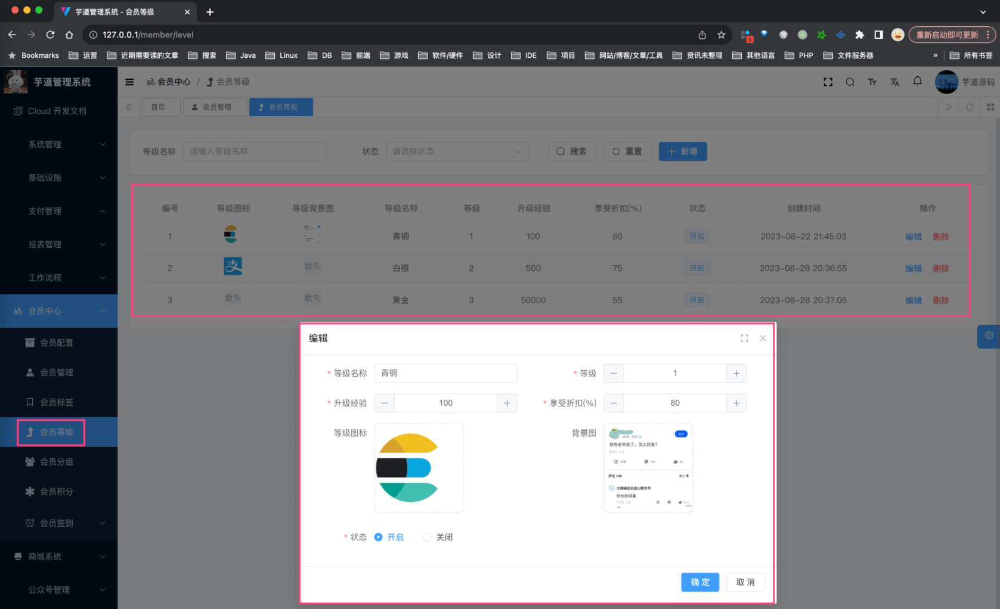

② 会员详情的 \[成长值\] 标签，可以查看 `member_experience_record` 表的记录，对应 `views/member/user/detail/UserExperienceRecordList.vue` 组件。如下图所示：

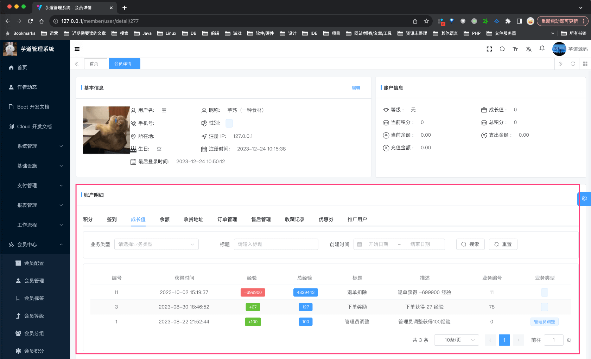

### [#](#_1-3-移动端) 1.3 移动端

① 会员等级、经验信息，在 `yudao-mall-uniapp` 暂时没有展示。

② 商城下单时，会员等级的折扣计算，通过 TradeMemberLevelPriceCalculator 实现。

## [#](#_2-会员积分) 2. 会员积分

会员积分，一般用于积分抵扣金额。例如说：商城下单时，会员积分为 100 的用户，可以抵扣 1 元。

它的后端由 `point` 包的 MemberPointRecordService 实现。

### [#](#_2-1-表结构) 2.1 表结构

> 省略 creator/create\_time/updater/update\_time/deleted/tenant\_id 等通用字段

```sql
CREATE TABLE `member_point_record` (
  `id` bigint NOT NULL AUTO_INCREMENT COMMENT '自增主键',
  
  `user_id` bigint NOT NULL COMMENT '用户编号',
  
  `biz_id` varchar(255) CHARACTER SET utf8mb4 COLLATE utf8mb4_unicode_ci NOT NULL COMMENT '业务编码',
  `biz_type` tinyint NOT NULL COMMENT '业务类型',
  `title` varchar(255) CHARACTER SET utf8mb4 COLLATE utf8mb4_unicode_ci NOT NULL COMMENT '积分标题',
  `description` varchar(5000) CHARACTER SET utf8mb4 COLLATE utf8mb4_unicode_ci DEFAULT NULL COMMENT '积分描述',
  
  `point` int NOT NULL COMMENT '积分',
  `total_point` int NOT NULL COMMENT '变动后的积分',
  PRIMARY KEY (`id`) USING BTREE,
  KEY `index_userId` (`user_id`) USING BTREE,
  KEY `index_title` (`title`) USING BTREE
) ENGINE=InnoDB AUTO_INCREMENT=89 DEFAULT CHARSET=utf8mb4 COLLATE=utf8mb4_unicode_ci COMMENT='用户积分记录';

```

① `user_id` 字段：用户编号，属于哪个会员用户。

② `biz_type` 字段：业务类型，对应 MemberPointBizTypeEnum 枚举，目前有管理员调整、签到奖励、下单奖励等等。

③ `point`、`total_point` 字段：积分、变动后的积分。所以会员积分变更时，都会记录到此表中。

### [#](#_2-2-管理后台) 2.2 管理后台

① 对应 \[会员系统 -> 会员中心 -> 会员积分\] 菜单，对应 `yudao-ui-admin-vue3` 项目的 `views/member/point/record` 目录。如下图所示：

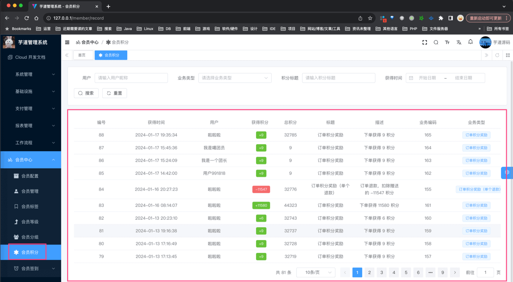

② 会员详情的 \[积分\] 标签，可以查看 `member_point_record` 表的记录，对应 `views/member/user/detail/UserPointList.vue` 组件。如下图所示：

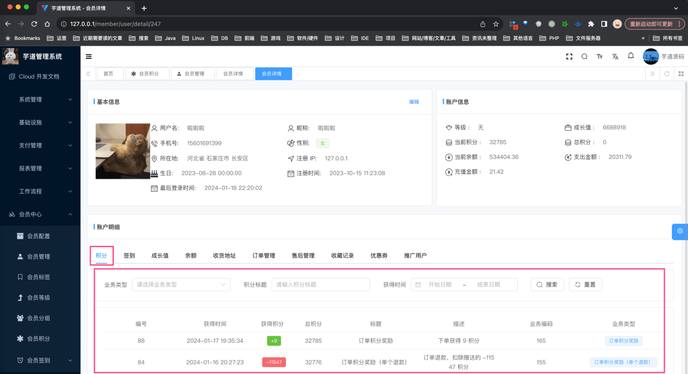

### [#](#_2-3-移动端) 2.3 移动端

点击 uni-app 底部的 \[我的\] 导航，点击 \[积分\] 菜单，进入积分信息界面，对应 `yudao-mall-uniapp` 项目的 `pages/user/wallet/score.vue` 页面。如下图所示：

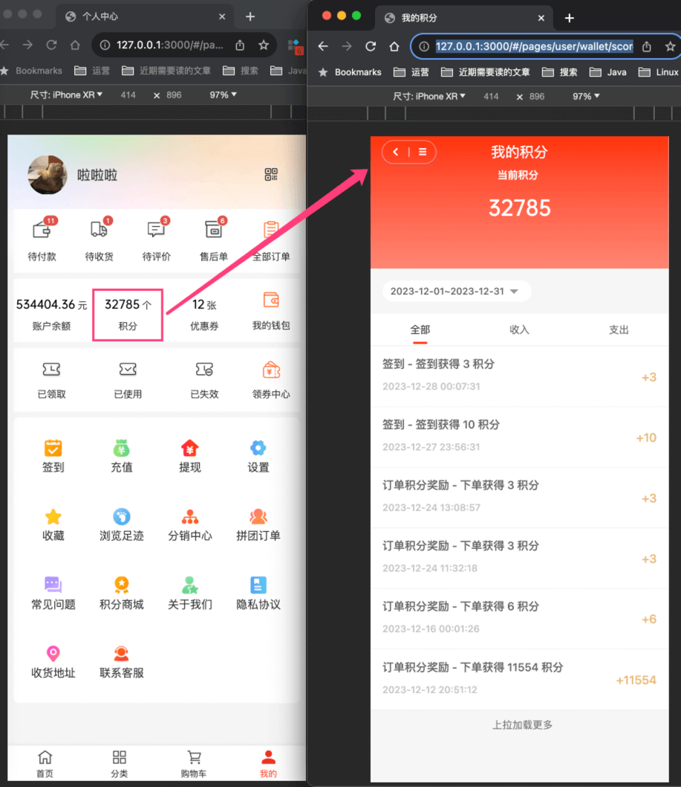

## [#](#_3-会员签到) 3. 会员签到

会员签到，通过每日签到，获得积分、经验等奖励。

它的后端由 `signin` 包实现，表关系如下图所示：

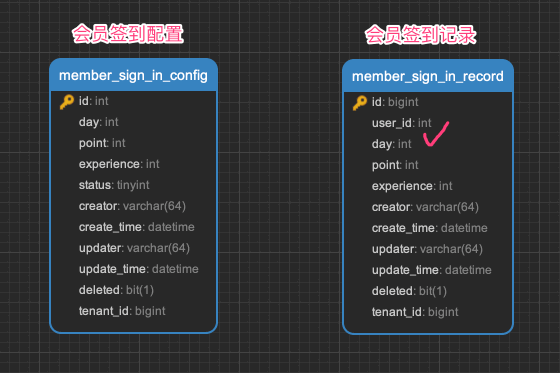

### [#](#_3-1-表结构) 3.1 表结构

`member_sign_in_config` 表，会员签到配置表，由 MemberSignInConfigService 实现。表结构如下：

> 省略 creator/create\_time/updater/update\_time/deleted/tenant\_id 等通用字段

```sql
CREATE TABLE `member_sign_in_config` (
  `id` int NOT NULL AUTO_INCREMENT COMMENT '编号',
  `day` int NOT NULL COMMENT '第几天',
  `point` int NOT NULL COMMENT '奖励积分',
  `experience` int NOT NULL DEFAULT '0' COMMENT '奖励经验',
  `status` tinyint NOT NULL COMMENT '状态',
  PRIMARY KEY (`id`) USING BTREE
) ENGINE=InnoDB AUTO_INCREMENT=13 DEFAULT CHARSET=utf8mb4 COLLATE=utf8mb4_unicode_ci COMMENT='签到规则';

```

① `day` 字段：第几天，例如说：第 1 天、第 2 天、第 3 天等等。

② `point`、`experience` 字段：奖励积分、奖励经验。

* * *

`member_sign_in_record` 表，会员签到记录表，由 MemberSignInRecordService 实现。表结构如下：

> 省略 creator/create\_time/updater/update\_time/deleted/tenant\_id 等通用字段

```sql
CREATE TABLE `member_sign_in_record` (
  `id` bigint NOT NULL AUTO_INCREMENT COMMENT '签到自增id',
  
  `user_id` int DEFAULT NULL COMMENT '签到用户',
  
  `day` int DEFAULT NULL COMMENT '第几天签到',
  
  `point` int NOT NULL DEFAULT '0' COMMENT '签到的分数',
  `experience` int NOT NULL DEFAULT '0' COMMENT '奖励经验',
  PRIMARY KEY (`id`) USING BTREE
) ENGINE=InnoDB AUTO_INCREMENT=12 DEFAULT CHARSET=utf8mb4 COLLATE=utf8mb4_unicode_ci COMMENT='签到记录';

```

① `user_id` 字段：用户编号，属于哪个会员用户。

② `day` 字段：第几天签到，例如说：第 1 天、第 2 天、第 3 天等等。

③ `point`、`experience` 字段：签到的分数、奖励经验。冗余的原因，是 `member_sign_in_config` 表的 `point`、`experience` 字段，可能会变更。

### [#](#_3-2-管理后台) 3.2 管理后台

① 对应 \[会员系统 -> 会员中心 -> 会员签到 -> 签到配置\] 菜单，对应 `yudao-ui-admin-vue3` 项目的 `views/member/signin/config` 目录。如下图所示：

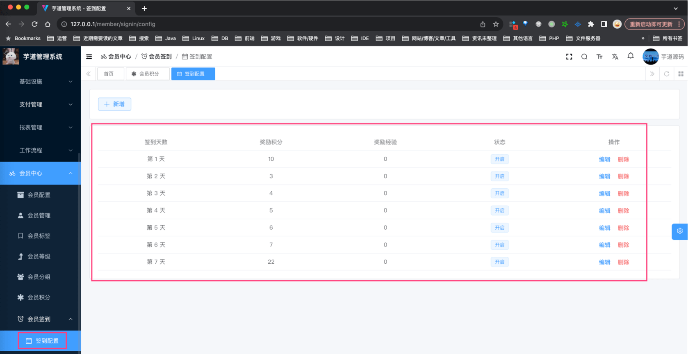

② 对应 \[会员系统 -> 会员中心 -> 会员签到 -> 签到记录\] 菜单，对应 `yudao-ui-admin-vue3` 项目的 `views/member/signin/record` 目录。如下图所示：

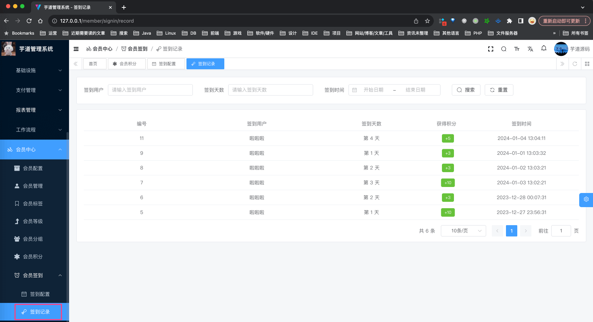

③ 会员详情的 \[签到\] 标签，可以查看 `member_sign_in_record` 表的记录，对应 `views/member/user/detail/UserSignList.vue` 组件。如下图所示：

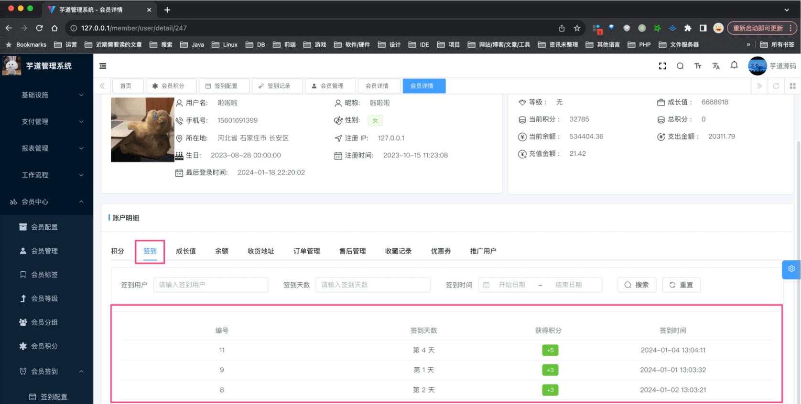

### [#](#_3-3-移动端) 3.3 移动端

点击 uni-app 底部的 \[我的\] 导航，点击 \[签到\] 菜单，进入签到界面，对应 `yudao-mall-uniapp` 项目的 `pages/app/sign.vue` 页面。如下图所示：

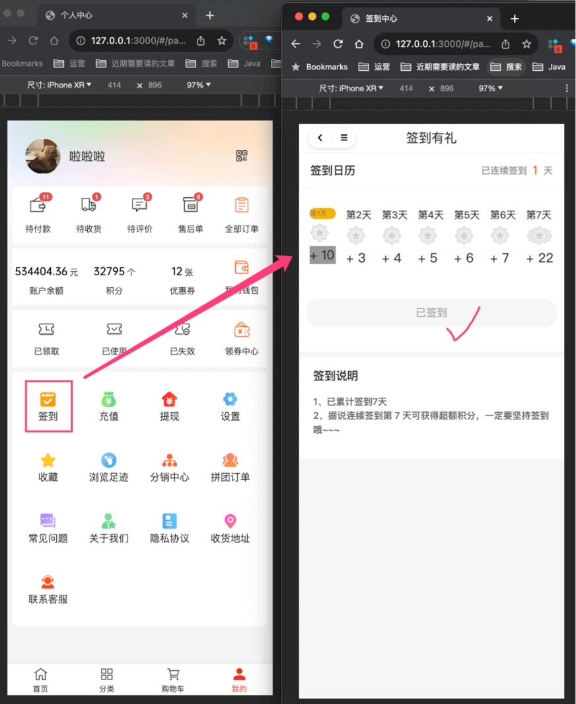