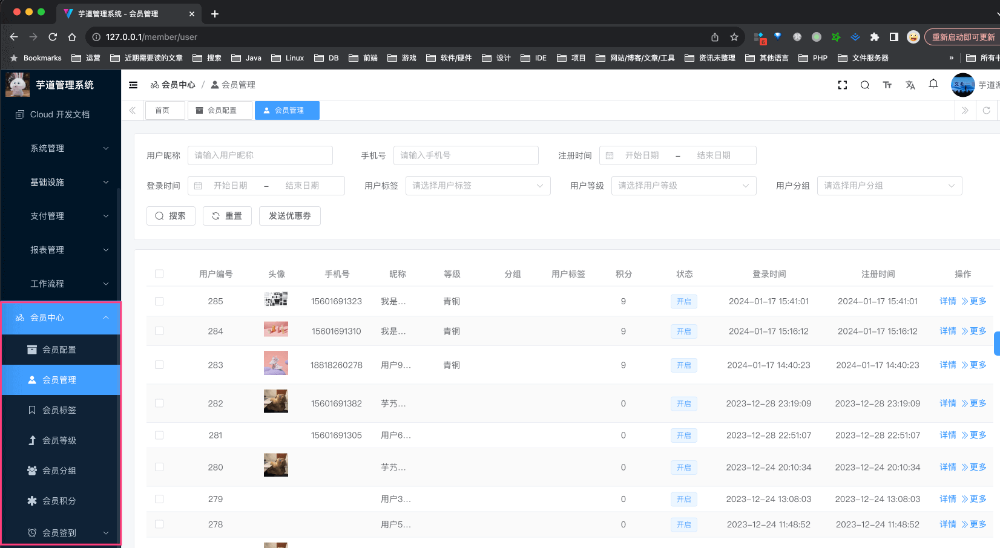

目录

# 功能开启

## [#](#_1-概述) 1. 概述

会员中心，围绕“会员”建设，包括会员用户、VIP 等级、经验、积分、签到等一系列的功能。

疑问：什么是会员？

对于管理系统来说，管理员是它的用户，也就是项目中的 `system_users` 表

而对于商城、论坛、博客等前台系统来说，会员是它的用户，也就是会员中心的 `member_user` 表。

* * *

只需要启动 `yudao-module-member` 服务，就可以使用会员中心的功能。步骤如下：

*   第一步，导入会员的 SQL 数据库脚本
*   第二步，启动服务，确认功能是否生效

## [#](#_1-第一步-导入-sql) 1. 第一步，导入 SQL

点击 [`member-2024-01-18.sql.zip` (opens new window)](https://t.zsxq.com/16XkmImMO) 下载附件，解压出 SQL 文件，然后导入到数据库中。

友情提示：↑↑↑ member.sql 是可以点击下载的！ ↑↑↑

## [#](#_2-第二步-启动服务) 2. 第二步，启动服务

① 运行该服务的 [MemberServerApplication (opens new window)](https://github.com/YunaiV/yudao-cloud/blob/master/yudao-module-member/yudao-module-member-biz/src/main/java/cn/iocoder/yudao/module/member/MemberServerApplication.java) 启动类，看到 `"Started MemberServerApplication in 18.105 seconds"` 说明开启成功。

② 然后，访问前端的会员菜单，确认功能是否生效。如下图所示：

至此，我们就成功开启了会员中心的功能 🙂

## [#](#_3-第三步-前端-商城-启动) 3. 第三步，前端（商城）启动

可阅读 [《商城 - 功能开启》](/mall/build/) 文档，目前商城 uni-app 接入会员中心进行购物。