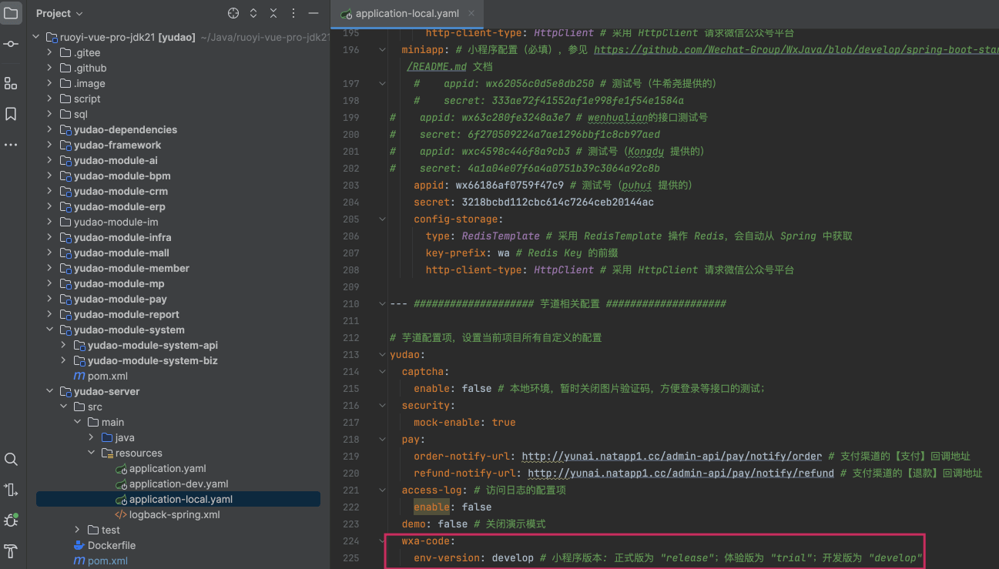
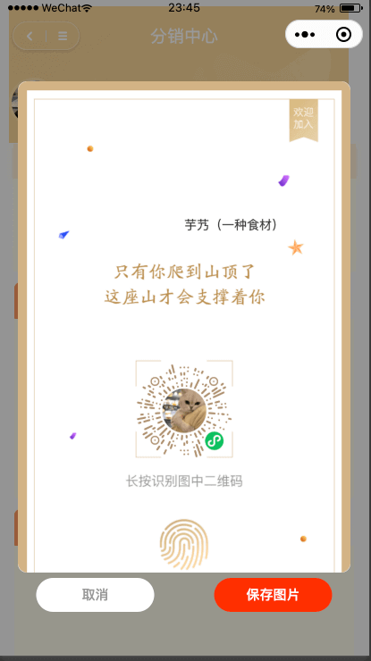

目录

# 微信小程序码

前置阅读文章：

*   [《用户体系》](/user-center/)
*   [《三方登录》](/social-user/)

本文是 [《三方登录》](/social-user/) 的延伸，讲解 [`yudao-mall-uniapp` (opens new window)](https://github.com/yudaocode/yudao-mall-uniapp) 商城小程序如何实现微信 **小程序** 码的功能。对应的官方文档如下：

*   [《【服务端】小程序码》 (opens new window)](https://developers.weixin.qq.com/miniprogram/dev/OpenApiDoc/qrcode-link/qr-code/getQRCode.html)

## [#](#_1-小程序准备) 1. 小程序准备

在后端 [生成小程序码 (opens new window)](https://developers.weixin.qq.com/miniprogram/dev/OpenApiDoc/qrcode-link/qr-code/getUnlimitedQRCode.html) 时，需要传递 `env_version` 参数，要打开的小程序版本：

*   `release` 为正式版为
*   `trial` 为体验版
*   `develop` 为开发版

因此，在 `application-${profile}.yaml` 配置文件中，有对应的 `yudao.wxa-code.env-version` 配置项，如下图所示：

一般情况下，如果是开发测试，不用修改，直接使用默认的 `develop` 即可。

## [#](#_2-功能演示-代码实现) 2. 功能演示 & 代码实现

本小节，我们以【商城】分销的分享二维码为例，演示如何实现小程序码的功能。在开始之前，你需要做如下事情：

*   参考 [《快速启动【前端】》](/quick-start-front) 文档，把 `yudao-uniapp-mall` 商城项目跑起来，并使用 HBuilderX + 微信开发者工具进行调试
*   参考 [《商城功能开启》](/mall/build) 文档，开启商城功能

点击 uni-app 的【分销中心】，然后点击【邀请海报】按钮，之后点击【生成海报】按钮，即可生成小程序码。如下图所示：

这里，它调用的是 AppSocialUserController 的 `#getWxaQrcode(...)` 方法，提供的 HTTP 接口。它的内部，调用 SocialClientApi 的 `#getWxaQrcode(...)` 方法，从而调用微信的 [生成小程序码 (opens new window)](https://developers.weixin.qq.com/miniprogram/dev/OpenApiDoc/qrcode-link/qr-code/getUnlimitedQRCode.html) 接口，生成小程序码。