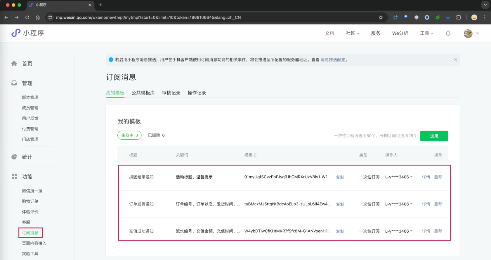
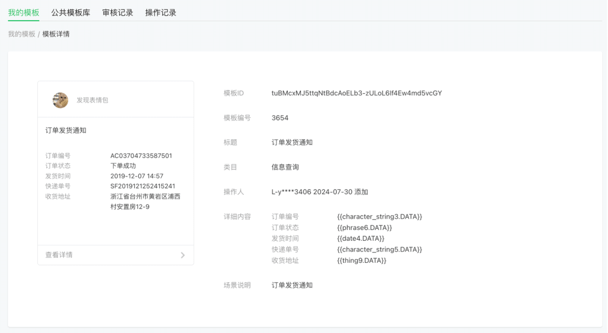
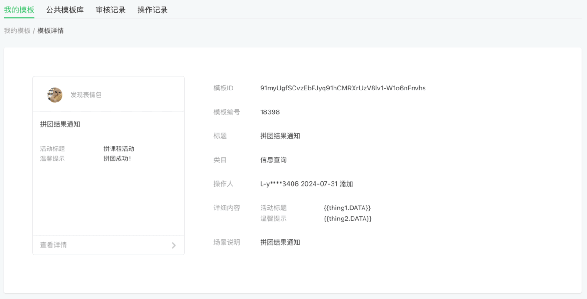
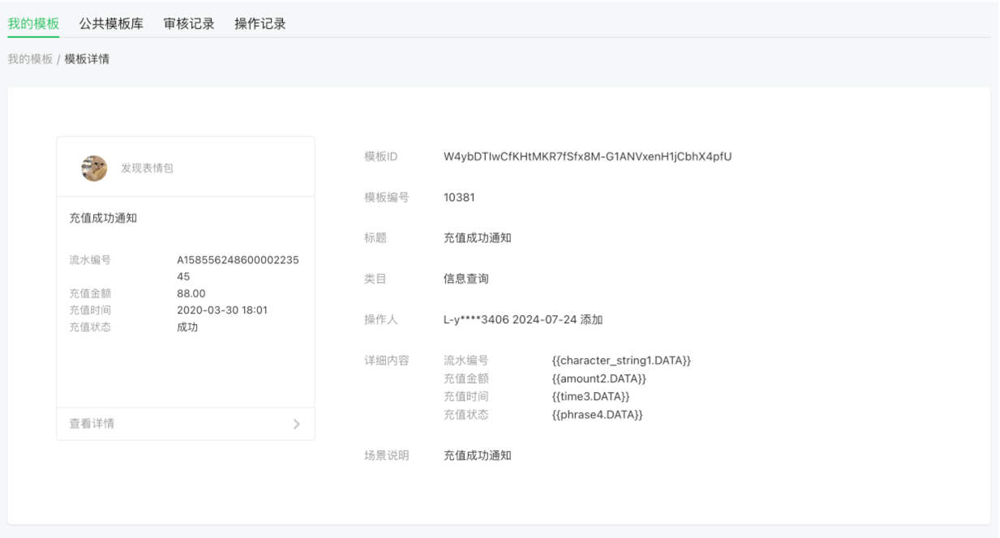
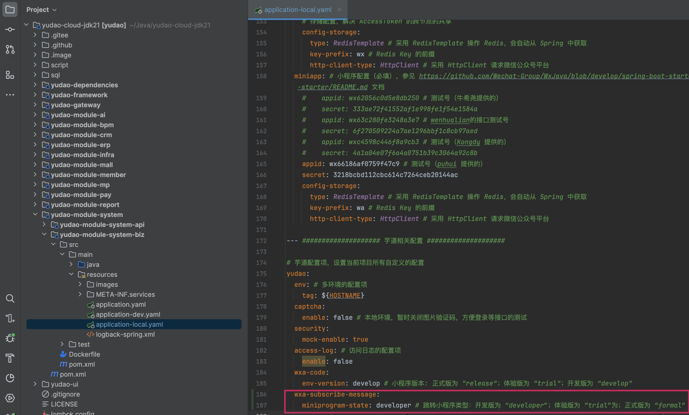
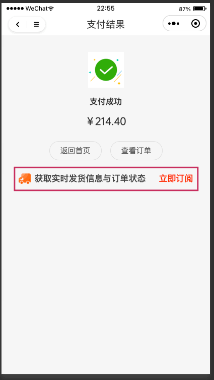
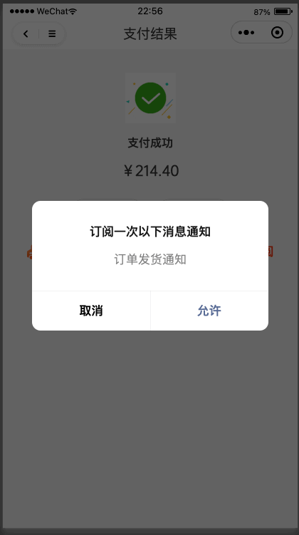
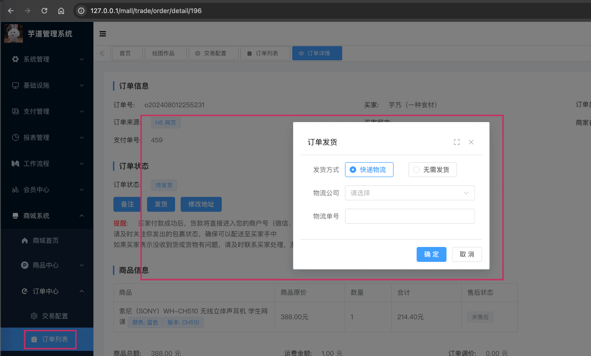
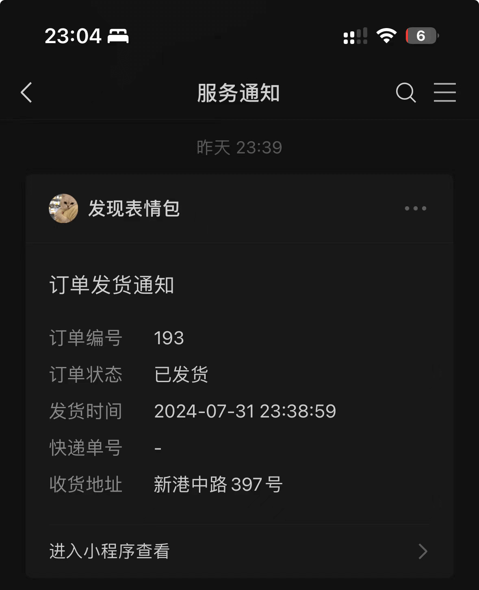

目录

# 微信小程序订阅消息

前置阅读文章：

*   [《用户体系》](/user-center/)
*   [《三方登录》](/social-user/)

本文是 [《三方登录》](/social-user/) 的延伸，讲解 [`yudao-mall-uniapp` (opens new window)](https://github.com/yudaocode/yudao-mall-uniapp) 商城小程序如何实现微信 **小程序** 订阅消息的功能。对应的官方文档如下：

*   [《【开发指南】订阅消息》 (opens new window)](https://developers.weixin.qq.com/miniprogram/dev/framework/open-ability/subscribe-message-overview.html)
*   [《【前端】订阅消息》 (opens new window)](https://developers.weixin.qq.com/miniprogram/dev/api/open-api/subscribe-message/wx.requestSubscribeMessage.html)
*   [《【服务端】订阅消息》 (opens new window)](https://developers.weixin.qq.com/miniprogram/dev/OpenApiDoc/mp-message-management/subscribe-message/deleteMessageTemplate.html)

## [#](#_1-小程序准备) 1. 小程序准备
### [#](#_1-1-模版申请) 1.1 模版申请

目前订阅消息，无法使用之前的“测试小程序”，必须进行正式小程序的申请！

申请后，可以在 \[微信小程序 -> 功能 -> 订阅消息\] 菜单，申请对应的订阅消息模版。如下图所示：

上图可以看到三个模版，是目前项目已经接入的订阅消息：

*   【商城】订单发货通知：管理员在后台发货后，通知用户 
    
*   【商城】拼团结果通知：用户拼团成功后，通知用户 
    
*   【支付】充值成功通知：用户充值成功后，通知用户 
    

而这些模版，我们是无法编辑，而是在【公共模板库】选用后，进入【我的模版】。

### [#](#_1-2-后端配置) 1.2 后端配置

在后端 [发送订阅消息 (opens new window)](https://developers.weixin.qq.com/miniprogram/dev/OpenApiDoc/mp-message-management/subscribe-message/sendMessage.html) 时，需要传递 `miniprogram_state` 参数，用于区分跳转小程序类型：

*   `developer` 为开发版
*   `trial` 为体验版
*   `formal` 为正式版

因此，在 `application-${profile}.yaml` 配置文件中，有对应的 `yudao.wxa-subscribe-message.miniprogram-state` 配置项，如下图所示：

一般情况下，如果是开发测试，不用修改，直接使用默认的 `developer` 即可。

## [#](#_2-功能演示-代码实现) 2. 功能演示 & 代码实现

本小节，我们以【商城】订单发货通知为例，演示如何实现订阅消息的功能。在开始之前，你需要做如下事情：

*   参考 [《快速启动【前端】》](/quick-start-front) 文档，把 `yudao-uniapp-mall` 商城项目跑起来，并使用 HBuilderX + 微信开发者工具进行调试
*   参考 [《商城功能开启》](/mall/build) 文档，开启商城功能
*   在 \[微信小程序 -> 功能 -> 订阅消息\] 菜单，配置好“订单发货通知”模版

### [#](#_2-1-uni-app-获取订阅模版列表) 2.1 uni-app 获取订阅模版列表

在 uni-app 打开时，会调用后端的 AppSocialUserController 的 `#getSubscribeTemplateList()` 方法，获取订阅消息模版列表。

目的是，uni-app 在调用 [`wx.requestSubscribeMessage(Object object)` (opens new window)](https://developers.weixin.qq.com/miniprogram/dev/api/open-api/subscribe-message/wx.requestSubscribeMessage.html) 发起订阅消息时，需要传递 `tmplIds` 消息模版的编号。

友情提示：

由于暂时没做微信小程序的订阅消息的模版管理，所以暂时通过它的模版名称来匹配的。算是约定大于配置吧~

不过因为小程序的订阅消息模版是只能 **选用**，标题是固定的，所以这个约定是可行的。

### [#](#_2-2-uni-app-发起订阅消息) 2.2 uni-app 发起订阅消息

第一步，在 uni-app 中，下单并完成支付，然后会进入支付成功页。如下图所示：

第二步，点击【立即订阅】按钮，发起对“订单发货通知”的订阅消息。如下图所示：

它的实现，通过调用项目的 `sheep/platform/provider/wechat/miniProgram.js` 的 `#subscribeMessage(...)` 方法，从而调用微信的 `wx.requestSubscribeMessage(Object object)` 方法，发起订阅消息的请求。

### [#](#_2-3-后端发送订阅消息) 2.3 后端发送订阅消息

第一步，在管理后台，点击 \[商城系统 -> 订单中心 -> 订单列表\] 菜单，找到对应的订单，点击【发货】按钮，发起对订单的发货操作。如下图所示：

它的内部，通过调用项目的 SocialClientApi 的 `#sendWxaSubscribeMessage(...)` 方法，从而调用微信的 [发送订阅消息 (opens new window)](https://developers.weixin.qq.com/miniprogram/dev/OpenApiDoc/mp-message-management/subscribe-message/sendMessage.html) 接口，发送订阅消息的请求。

第二步，拿出手机微信（PC 电脑上看不到），在【服务通知】中，可以看到对应的订阅消息。如下图所示：

如果没有收到订阅消息，可以在 IDEA 控制台，搜 `[sendSubscribeMessage]` 关键字，查看是否有异常日志输出。

## [#](#_3-其它业务如何接入) 3. 其它业务如何接入？

参考上述小节的内容：

*   第一步，在 uni-app 项目中，需要调用项目的 `sheep/platform/provider/wechat/miniProgram.js` 的 `#subscribeMessage(...)` 方法，发起订阅
*   第二步，在后端项目中，需要调用 SocialClientApi 的 `#sendWxaSubscribeMessage(...)` 方法，发送订阅消息

当然，肯定需要在微信小程序那，配置对应的订阅消息模版。