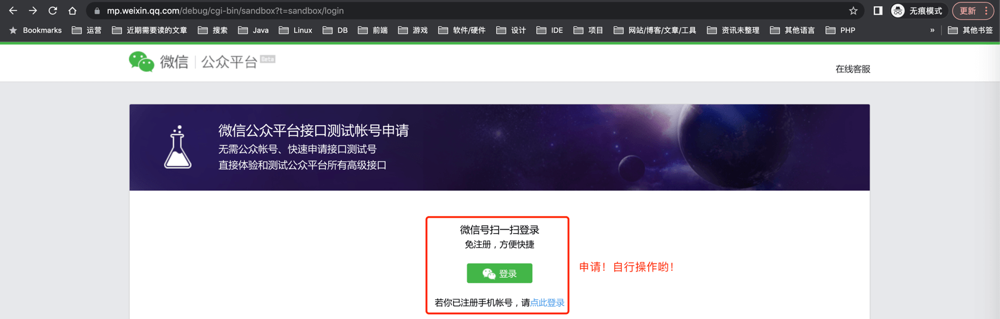
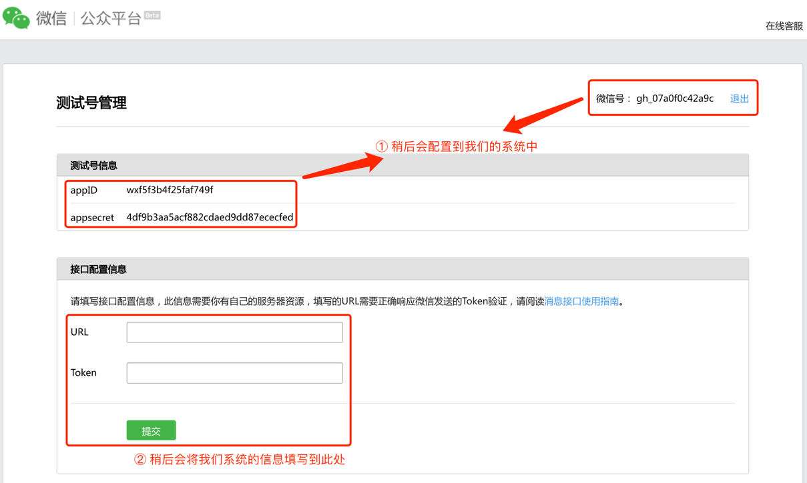
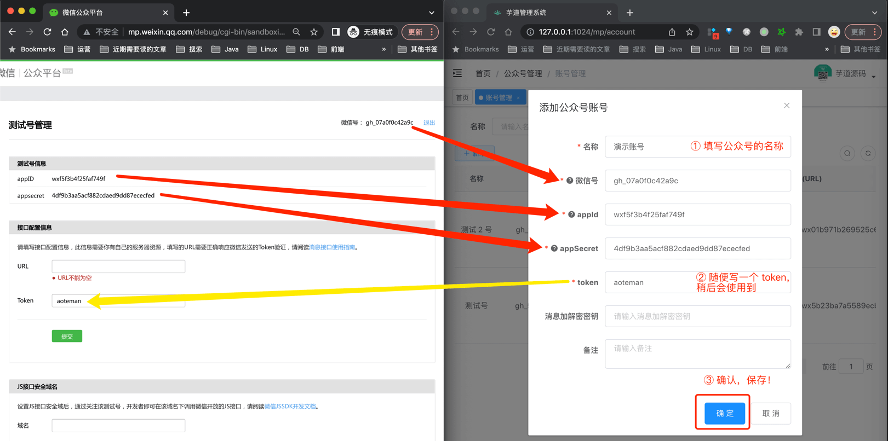
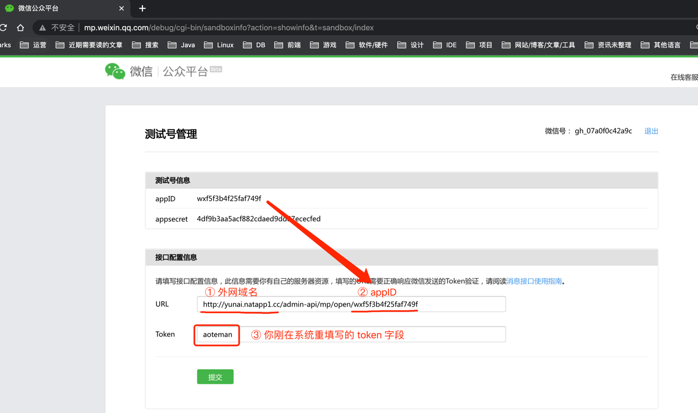
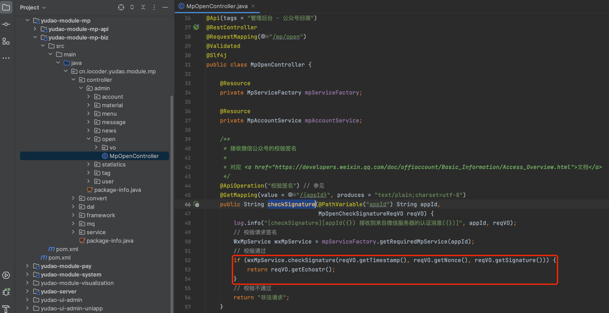
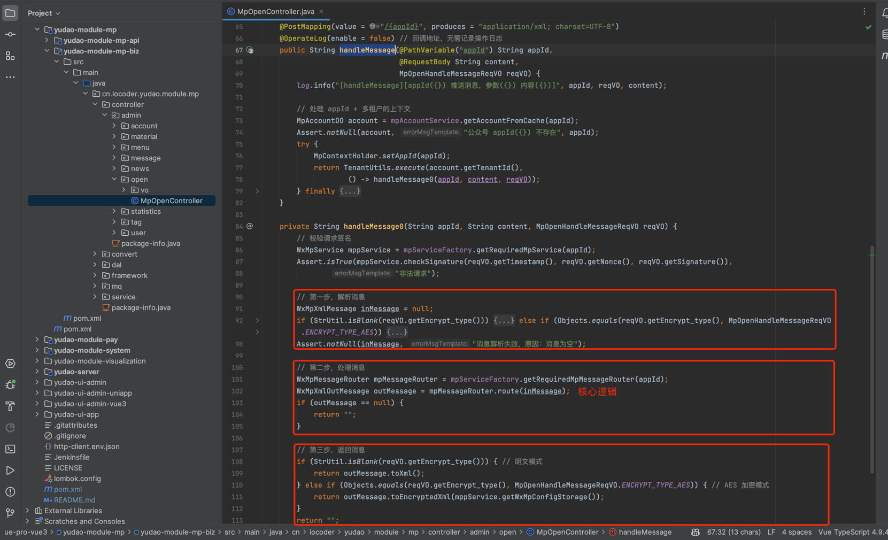
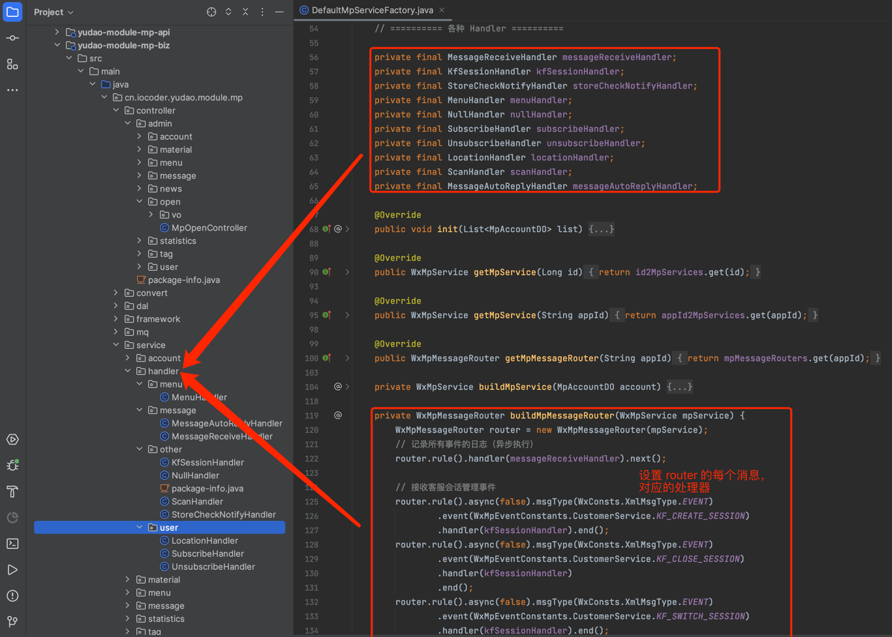

目录

# 公众号接入

本章节，讲解如果将你的公众号，接入到系统中。步骤如下：

*   第一步，申请公众号（可选）
*   第二步，在系统中，添加公众号账号
*   第三步，在公众号中，配置接入信息

## [#](#_1-配置步骤) 1. 配置步骤

本小节，手把手教你如何将公众号接入到系统中。

### [#](#第一步-申请公众号-可选) 第一步，申请公众号（可选）

友情提示：如果你已经有公众号，可以忽略这一步。

① 如果你还没有公众号，可以申请一个测试帐号。

申请地址：[微信公众平台接口测试帐号申请 (opens new window)](https://mp.weixin.qq.com/debug/cgi-bin/sandbox?t=sandbox/login)

② 申请完成后，获得一个测试号。如下图所示：

### [#](#第二步-添加公众号账号) 第二步，添加公众号账号

点击 \[公众号管理 -> 账号管理\] 菜单，添加一个公众号账号。如下图所示：

### [#](#第三步-配置接入信息) 第三步，配置接入信息

① 由于公众号通知需要外网地址，可参考 [《内网穿透》](/natapp/) 文档，将本地的 48080 端口，转发到外网中。这里，我的域名是 `http://yunai.natapp1.cc`。

② 打开微信公众号界面，填写 URL 和 Token 信息。如下图所示：

点击提交后，看到“配置成功”提示，说明配置成功。

## [#](#_2-实现代码) 2. 实现代码

本小节，将介绍如何实现公众号接入的代码。

### [#](#_2-1-表结构) 2.1 表结构

公众号账号对应 `mp_account` 表，结构如下图所示：

### [#](#_2-2-账号管理界面) 2.2 账号管理界面

*   前端：[/@views/mp/account (opens new window)](https://github.com/yudaocode/yudao-ui-admin-vue2/blob/master/src/views/mp/account/index.vue)
*   后端：[MpAccountController (opens new window)](https://github.com/YunaiV/yudao-cloud/blob/master/yudao-module-mp/yudao-module-mp-biz/src/main/java/cn/iocoder/yudao/module/mp/controller/admin/account/MpAccountController.java)

### [#](#_2-3-配置接入回调) 2.3 配置接入回调

在 [第三步，配置接入信息](#%E7%AC%AC%E4%B8%89%E6%AD%A5-%E9%85%8D%E7%BD%AE%E6%8E%A5%E5%85%A5%E4%BF%A1%E6%81%AF) 时，微信公众号会回调系统的 `GET /admin-api/mp/open/{appID}` 接口，进行接入配置的验证。对应 [MpOpenController (opens new window)](https://github.com/YunaiV/yudao-cloud/blob/master/yudao-module-mp/yudao-module-mp-biz/src/main/java/cn/iocoder/yudao/module/mp/controller/admin/open/MpOpenController.java#L39-L57) 类的 `checkSignature` 方法，如下图所示：

对应 [《微信公众号官方文档 —— 接入指南》 (opens new window)](https://developers.weixin.qq.com/doc/offiaccount/Basic_Information/Access_Overview.html#%E7%AC%AC%E4%BA%8C%E6%AD%A5%EF%BC%9A%E9%AA%8C%E8%AF%81%E6%B6%88%E6%81%AF%E7%9A%84%E7%A1%AE%E6%9D%A5%E8%87%AA%E5%BE%AE%E4%BF%A1%E6%9C%8D%E5%8A%A1%E5%99%A8) 文档。

友情提示：

项目使用的微信工具开发包是 [`weixin-java-mp` (opens new window)](https://github.com/Wechat-Group/WxJava/tree/develop/weixin-java-mp)，超级好用！

### [#](#_2-4-消息处理) 2.4 消息处理

配置接入完成后，用户发给公众号的消息，公众号都会回调到 `POST /admin-api/mp/open/{appID}` 接口，进行消息的处理。对应 [MpOpenController (opens new window)](https://github.com/YunaiV/yudao-cloud/blob/master/yudao-module-mp/yudao-module-mp-biz/src/main/java/cn/iocoder/yudao/module/mp/controller/admin/open/MpOpenController.java#L59-L114) 类的 `handleMessage` 方法，如下图所示：

核心逻辑是第二步，再解析到消息后，交给 WxMpMessageRouter 进行消息的处理。WxMpMessageRouter 在 [DefaultMpServiceFactory (opens new window)](https://github.com/YunaiV/yudao-cloud/blob/master/yudao-module-mp/yudao-module-mp-biz/src/main/java/cn/iocoder/yudao/module/mp/controller/admin/open/MpOpenController.java#L59-L114) 初始化，设置每种消息对应的 [`handler` (opens new window)](https://github.com/YunaiV/yudao-cloud/blob/master/yudao-module-mp/yudao-module-mp-biz/src/main/java/cn/iocoder/yudao/module/mp/service/handler/) 处理器。如下图所示：

具体每个处理器的实现，后续每个章节单独详细讲解。