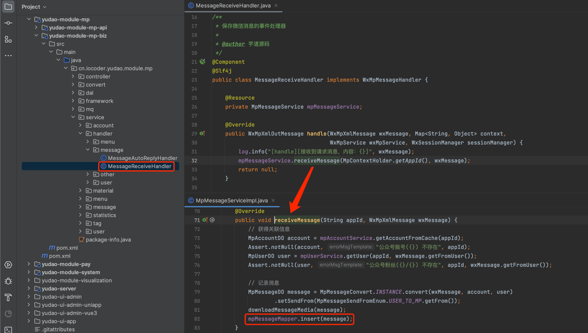
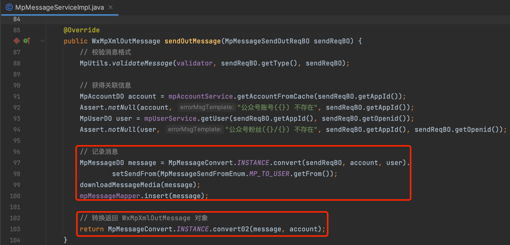
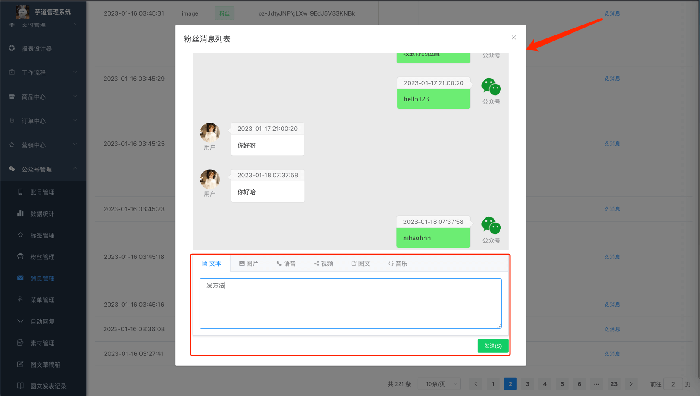
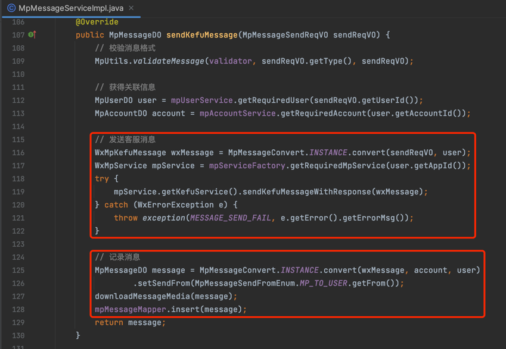

目录

# 公众号消息

本章节，讲解公众号消息的相关内容，对应 \[公众号管理 -> 消息管理\] 菜单。如下图所示：

## [#](#_1-表结构) 1. 表结构

公众号消息对应 `mp_message` 表，结构如下图所示：

① `type` 字段：消息类型，包括文本、图片、语音、视频、小视频、图文、音乐、地理位置、链接、事件等类型，对应 `mp_message_type` 字典。

② `send_from` 字段：消息发送方，分成两类：

*   【接收】用户发送给公众号：[接收普通消息 (opens new window)](https://developers.weixin.qq.com/doc/offiaccount/Message_Management/Receiving_standard_messages.html)、[接收事件推送 (opens new window)](https://developers.weixin.qq.com/doc/offiaccount/Message_Management/Receiving_event_pushes.html)
*   【发送】公众号发给用户：[被动回复用户消息 (opens new window)](https://developers.weixin.qq.com/doc/offiaccount/Message_Management/Passive_user_reply_message.html)、[客服消息 (opens new window)](https://developers.weixin.qq.com/doc/offiaccount/Message_Management/Service_Center_messages.html)

## [#](#_2-消息管理界面) 2. 消息管理界面

*   前端：[/@views/mp/message (opens new window)](https://github.com/yudaocode/yudao-ui-admin-vue2/blob/master/src/views/mp/message/index.vue)
*   后端：[MpMessageController (opens new window)](https://github.com/YunaiV/yudao-cloud/blob/master/yudao-module-mp/yudao-module-mp-biz/src/main/java/cn/iocoder/yudao/module/mp/controller/admin/message/MpMessageController.java)

## [#](#_3-【接收】) 3.【接收】
### [#](#_3-1-接收普通消息) 3.1 接收普通消息

> 对应 [《微信公众号官方文档 —— 接收普通消息》 (opens new window)](https://developers.weixin.qq.com/doc/offiaccount/Message_Management/Receiving_standard_messages.html) 文档。

当用户向公众账号发消息时，会被 [MessageReceiveHandler (opens new window)](https://github.com/YunaiV/yudao-cloud/blob/master/yudao-module-mp/yudao-module-mp-biz/src/main/java/cn/iocoder/yudao/module/mp/service/handler/message/MessageReceiveHandler.java) 处理，记录到 `mp_message` 表，消息类型为文本、图片、语音、视频、小视频、地理位置、链接。如下图所示：

### [#](#_3-2-接收事件消息) 3.2 接收事件消息

> 对应 [《微信公众号官方文档 —— 接收事件推送》 (opens new window)](https://developers.weixin.qq.com/doc/offiaccount/Message_Management/Receiving_event_pushes.html) 文档。

在用户和公众号产交互的过程中，会被 [MessageReceiveHandler (opens new window)](https://github.com/YunaiV/yudao-cloud/blob/master/yudao-module-mp/yudao-module-mp-biz/src/main/java/cn/iocoder/yudao/module/mp/service/handler/message/MessageReceiveHandler.java) 处理，记录到 `mp_message` 表，消息类型仅为事件。

## [#](#_4-【发送】) 4.【发送】
### [#](#_4-1-被动回复用户消息) 4.1 被动回复用户消息

> 对应 [《微信公众号官方文档 —— 被动回复用户消息》 (opens new window)](https://developers.weixin.qq.com/doc/offiaccount/Message_Management/Passive_user_reply_message.html) 文档。

在被动回复用户消息时，统一由 [MpMessageServiceImpl (opens new window)](https://github.com/YunaiV/yudao-cloud/blob/master/yudao-module-mp/yudao-module-mp-biz/src/main/java/cn/iocoder/yudao/module/mp/service/message/MpMessageServiceImpl.java#L85-L104) 的 `sendOutMessage` 方法来构建回复消息，也会记录到 `mp_message` 表，消息类型为文本、图片、语音、视频、音乐、图文。如下图所示：

### [#](#_4-2-主动发送客服消息) 4.2 主动发送客服消息

> 对应 [《微信公众号官方文档 —— 客服消息》 (opens new window)](https://developers.weixin.qq.com/doc/offiaccount/Message_Management/Service_Center_messages.html) 文档。

点击消息管理界面的【消息】按钮，可以主动发送客服消息给用户。如下图所示：

主动发送客服消息，统一由 [MpMessageServiceImpl (opens new window)](https://github.com/YunaiV/yudao-cloud/blob/master/yudao-module-mp/yudao-module-mp-biz/src/main/java/cn/iocoder/yudao/module/mp/service/message/MpMessageServiceImpl.java#L106-L130) 的 `sendKefuMessage` 方法来构建客服消息，也会记录到 `mp_message` 表，消息类型为文本、图片、语音、视频、音乐、图文。如下图所示：

