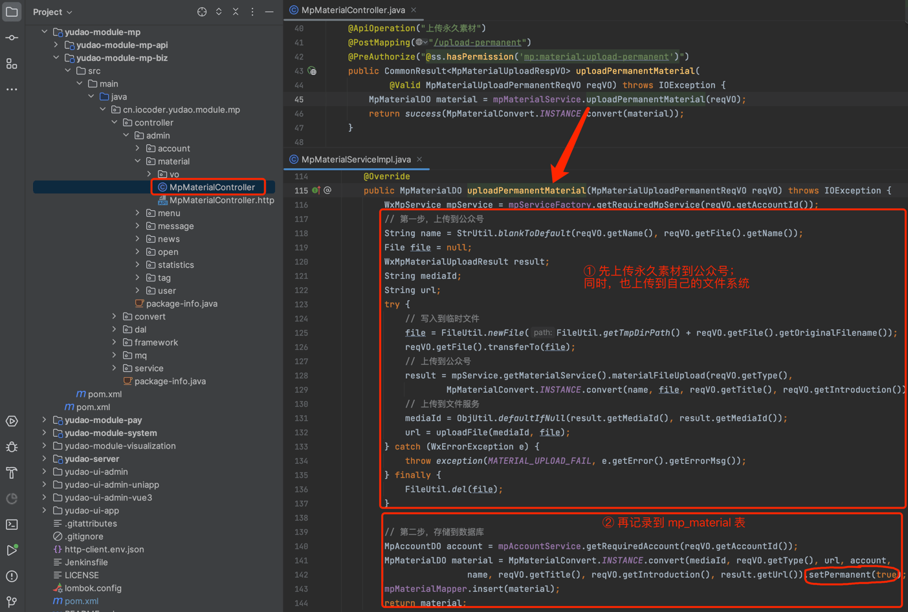
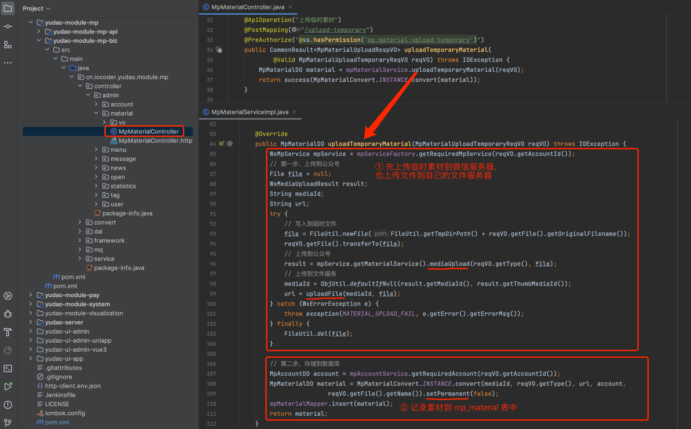
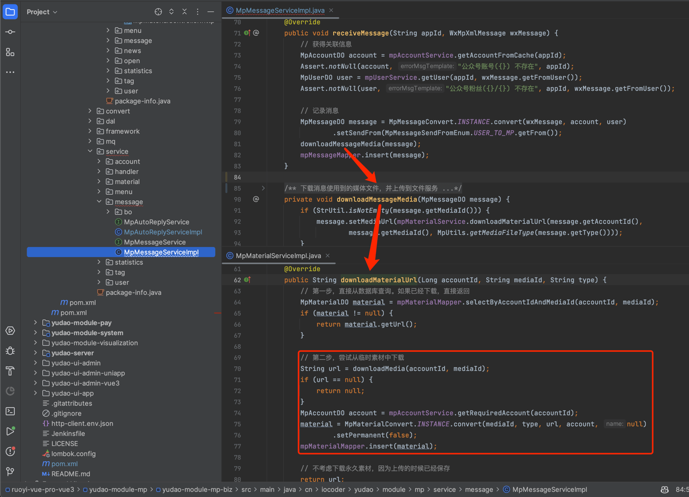

目录

# 公众号素材

本章节，讲解公众号素材的相关内容，包括图片、语音、视频素材，不包括图文素材。对应 \[公众号管理 -> 素材管理\] 菜单，如下图所示：

在配置公众号的自动回复、菜单的自动回复、主动给用户发送消息时，都可以使用素材。

## [#](#_1-表结构) 1. 表结构

公众号素材对应 `mp_material` 表，结构如下图所示：

① `type` 字段：素材类型。对应微信的素材类型，包括 `image` 图片、`voice` 语音、`video` 视频。

② `media_id` 字段：素材的媒体编号，对应微信公众号的 media\_id。

③ `permanent` 字段：是否永久。`true` 代表 [永久素材 (opens new window)](https://developers.weixin.qq.com/doc/offiaccount/Asset_Management/Adding_Permanent_Assets.html)，`false` 代表 [临时素材 (opens new window)](https://developers.weixin.qq.com/doc/offiaccount/Asset_Management/New_temporary_materials.html)。

④ `mp_url` 字段：公众号存储素材的 URL 地址，有且仅有永久素材才有。

⑤ `url` 字段：存储在自己文件服务器上的 URL 地址，解决临时素材只在微信服务器上保存 3 天的问题，也解决图片素材的 `mp_url` 无法在自己管理后台显示的问题。

## [#](#_2-素材管理界面) 2. 素材管理界面

*   前端：[/@views/mp/material (opens new window)](https://github.com/yudaocode/yudao-ui-admin-vue2/blob/master/src/views/mp/material/index.vue)
*   后端：[MpMaterialController (opens new window)](https://github.com/YunaiV/yudao-cloud/blob/master/yudao-module-mp/yudao-module-mp-biz/src/main/java/cn/iocoder/yudao/module/mp/controller/admin/material/MpMaterialController.java)

## [#](#_3-永久素材) 3. 永久素材

> 对应 [《微信公众号官方文档 —— 永久素材》 (opens new window)](https://developers.weixin.qq.com/doc/offiaccount/Asset_Management/Adding_Permanent_Assets.html) 文档。

[MpMaterialController (opens new window)](https://github.com/YunaiV/yudao-cloud/blob/master/yudao-module-mp/yudao-module-mp-biz/src/main/java/cn/iocoder/yudao/module/mp/controller/admin/material/MpMaterialController.java#L40-L47) 的 `uploadPermanentMaterial` 方法对应的接口，实现了上传【永久】素材到公众号。如下图所示：

## [#](#_4-临时素材) 4. 临时素材

> 对应 [《微信公众号官方文档 —— 临时素材》 (opens new window)](https://developers.weixin.qq.com/doc/offiaccount/Asset_Management/New_temporary_materials.html) 文档。

① 来源一：主动发送客服消息给用户时，如果是图片、语音、视频素材，需要先上传到微信服务器，获得到 `media_id` 后，才能发送给用户。

此时，可调用 [MpMaterialController (opens new window)](https://github.com/YunaiV/yudao-cloud/blob/master/yudao-module-mp/yudao-module-mp-biz/src/main/java/cn/iocoder/yudao/module/mp/controller/admin/material/MpMaterialController.java#L31-L38) 的 `uploadTemporaryMaterial` 方法对应的接口，实现了上传【临时】素材到公众号。如下图所示：

② 来源二：在接收到用户消息时，如果是图片、语音、视频素材，需要先下载到自己的文件服务器上，避免超过 3 天后无法访问的问题。如下图所示：

