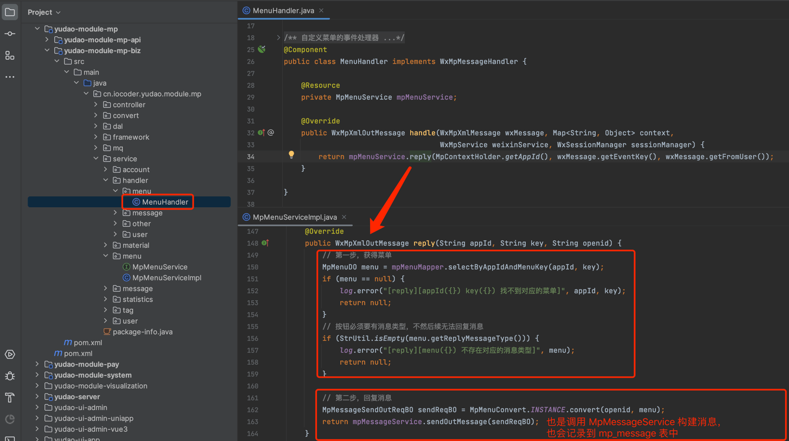

目录

# 公众号菜单

本章节，讲解公众号菜单的相关内容，对应 \[公众号管理 -> 菜单管理\] 菜单，对应 [《微信公众号官方文档 —— 自定义菜单》 (opens new window)](https://developers.weixin.qq.com/doc/offiaccount/Custom_Menus/Creating_Custom-Defined_Menu.html) 文档。如下图所示：

## [#](#_1-表结构) 1. 表结构

公众号菜单对应 `mp_menu` 表，结构如下图所示：

`type` 字段：按钮类型。如果类型为 `CLICK` 点击回复时，可进行文本、图片、语音、视频、图文、音乐消息。

## [#](#_2-菜单管理界面) 2. 菜单管理界面

*   前端：[/@views/mp/menu (opens new window)](https://github.com/yudaocode/yudao-ui-admin-vue2/blob/master/src/views/mp/menu/index.vue)
*   后端：[MpMenuController (opens new window)](https://github.com/YunaiV/yudao-cloud/blob/master/yudao-module-mp/yudao-module-mp-biz/src/main/java/cn/iocoder/yudao/module/mp/controller/admin/menu/MpMenuController.java)

## [#](#_3-点击回复) 3. 点击回复

用户点击菜单按钮时，会接收事件消息，进而被 [MenuHandler (opens new window)](https://github.com/YunaiV/yudao-cloud/blob/master/yudao-module-mp/yudao-module-mp-biz/src/main/java/cn/iocoder/yudao/module/mp/service/handler/menu/MenuHandler.java) 处理。如果类型为 `CLICK` 点击回复时，自动回复对应的消息。如下图所示：

