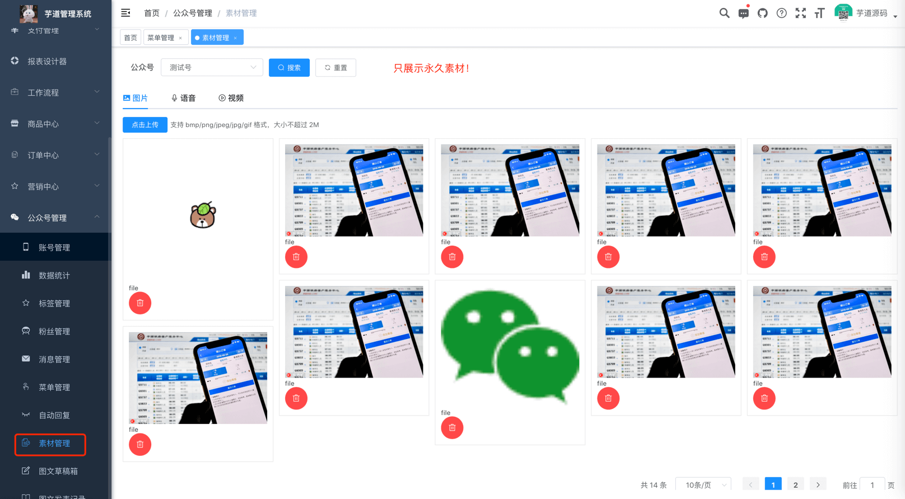
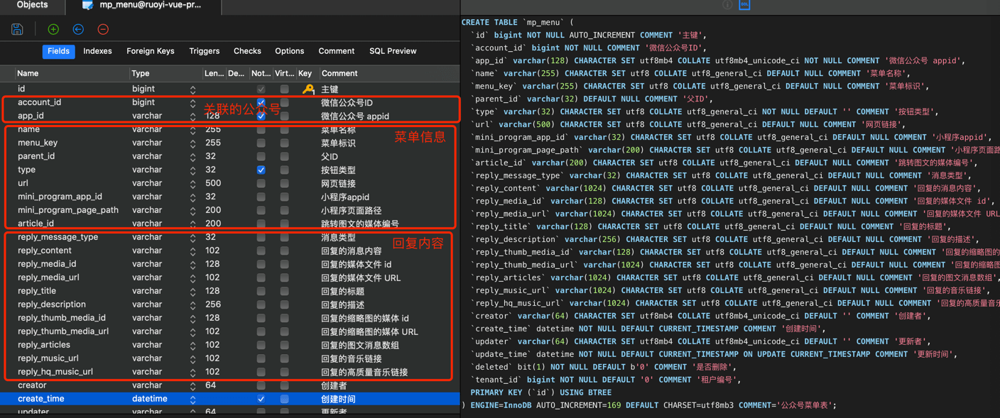
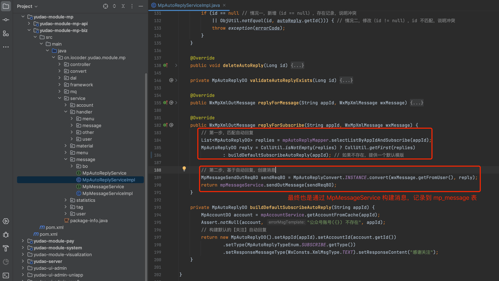
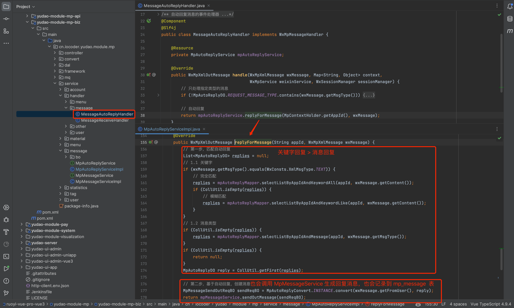

目录

# 自动回复

本章节，讲解自动回复的相关内容，对应 \[公众号管理 -> 自动回复\] 菜单。如下图所示：

在用户关注、发送消息时，公众号可以自动回复消息给用户。

## [#](#_1-表结构) 1. 表结构

自动回复对应 `mp_auto_reply` 表，结构如下图所示：

`type` 字段：回复类型，

*   1 - 关注回复：用户关注公众号时
*   3 - 关键字回复：消息类型为文本时，匹配到关键字
*   2 - 消息回复：没有匹配到关键字时，根据消息类型

## [#](#_2-自动回复界面) 2. 自动回复界面

*   前端：[/@views/mp/autoReply (opens new window)](https://github.com/yudaocode/yudao-ui-admin-vue2/blob/master/src/views/mp/autoReply/index.vue)
*   后端：[MpAutoReplyController (opens new window)](https://github.com/YunaiV/yudao-cloud/blob/master/yudao-module-mp/yudao-module-mp-biz/src/main/java/cn/iocoder/yudao/module/mp/controller/admin/message/MpAutoReplyController.java)

## [#](#_3-关注回复) 3. 关注回复

用户关注公众号时，被动回复用户消息，由 [MpAutoReplyServiceImpl (opens new window)](https://github.com/YunaiV/yudao-cloud/blob/master/yudao-module-mp/yudao-module-mp-biz/src/main/java/cn/iocoder/yudao/module/mp/service/message/MpAutoReplyServiceImpl.java#L181-L200) 的 `replyForSubscribe` 方法来生成回复内容。如下图所示：

## [#](#_4-消息回复-关键字回复) 4. 消息回复 & 关键字回复

用户发送消息给公众号时，自动回复消息给用户，分为两种情况：

*   关键字回复：消息类型为文本时，匹配到关键字，自动回复消息
*   消息回复：没有匹配到关键字时，根据消息类型，自动回复消息

这两种情况，由 [MessageAutoReplyHandler (opens new window)](https://github.com/YunaiV/yudao-cloud/blob/master/yudao-module-mp/yudao-module-mp-biz/src/main/java/cn/iocoder/yudao/module/mp/service/handler/message/MessageAutoReplyHandler.java) 调用 [MpAutoReplyServiceImpl (opens new window)](https://github.com/YunaiV/yudao-cloud/blob/master/yudao-module-mp/yudao-module-mp-biz/src/main/java/cn/iocoder/yudao/module/mp/service/message/MpAutoReplyServiceImpl.java#L154-L179) 的 `replyForMessage` 方法来生成回复内容。如下图所示：

