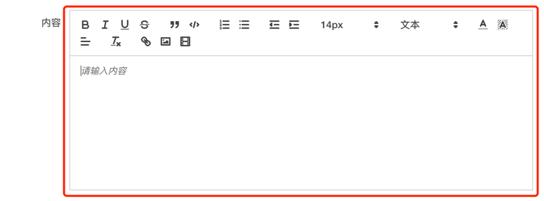
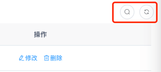
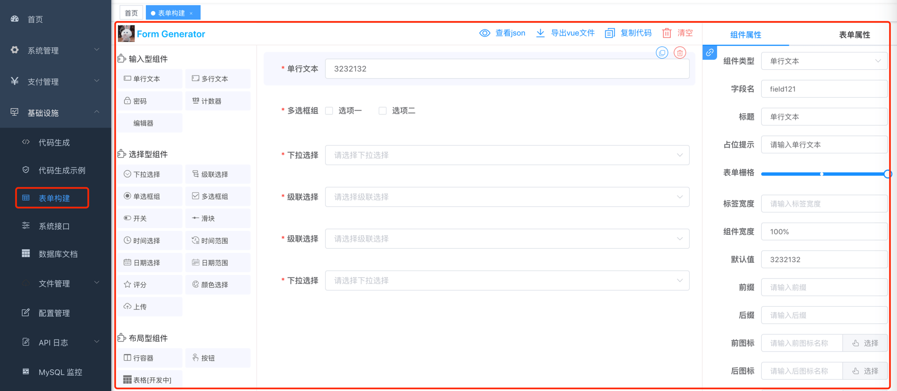
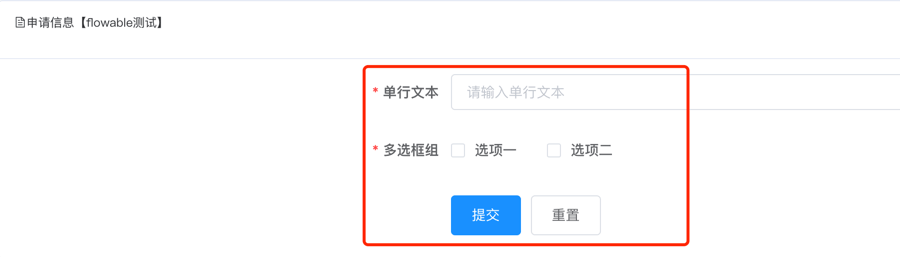
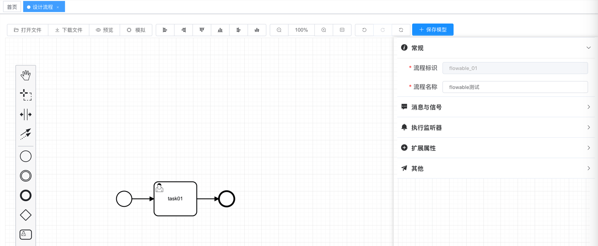

目录

# 开发规范

## [#](#_1-view-页面) 1. view 页面

在 [`@views` (opens new window)](https://github.com/yudaocode/yudao-ui-admin-vue2/tree/master/src/views) 目录下，每个模块对应一个目录，它的所有功能的 `.vue` 都放在该目录里。


一般来说，一个路由对应一个 `.vue` 文件。

## [#](#_2-api-请求) 2. api 请求

在 [`@/api` (opens new window)](https://github.com/yudaocode/yudao-ui-admin-vue2/tree/master/src/api) 目录下，每个模块对应一个 `.api` 文件。



每个 API 方法，会调用 `request` 方法，发起对后端 RESTful API 的调用。

### [#](#_2-1-请求封装) 2.1 请求封装

[`@/utils/request` (opens new window)](https://github.com/yudaocode/yudao-ui-admin-vue2/blob/master/src/utils/request.js) 基于 [axios (opens new window)](http://axios-js.com/zh-cn/docs/index.html) 封装，统一处理 GET、POST 方法的请求参数、请求头，以及错误提示信息等。

#### [#](#_2-1-1-创建-axios-实例) 2.1.1 创建 axios 实例

*   `baseURL` 基础路径
*   `timeout` 超时时间

实现代码

```javascript
import axios from 'axios'

// 创建 axios 实例
const service = axios.create({
    // axios 中请求配置有 baseURL 选项，表示请求 URL 公共部分
    baseURL: process.env.VUE_APP_BASE_API + '/admin-api/', // 此处的 /admin-api/ 地址，原因是后端的基础路径为 /admin-api/
    // 超时
    timeout: 10000
})

```
#### [#](#_2-1-2-request-拦截器) 2.1.2 Request 拦截器

*   `Authorization`、`tenant-id` 请求头
*   GET 请求参数的拼接

实现代码

```javascript
import { getToken } from '@/utils/auth'
import { getTenantEnable } from "@/utils/ruoyi";
import Cookies from "js-cookie";

service.interceptors.request.use(config => {
    // 是否需要设置 token
    const isToken = (config.headers || {}).isToken === false
    if (getToken() && !isToken) {
        config.headers['Authorization'] = 'Bearer ' + getToken() // 让每个请求携带自定义token 请根据实际情况自行修改
    }
    // 设置租户
    if (getTenantEnable()) {
        const tenantId = Cookies.get('tenantId');
        if (tenantId) {
            config.headers['tenant-id'] = tenantId;
        }
    }
    // get 请求映射 params 参数
    if (config.method === 'get' && config.params) {
        let url = config.url + '?';
        for (const propName of Object.keys(config.params)) {
            const value = config.params[propName];
            var part = encodeURIComponent(propName) + "=";
            if (value !== null && typeof(value) !== "undefined") {
                if (typeof value === 'object') {
                    for (const key of Object.keys(value)) {
                        let params = propName + '[' + key + ']';
                        var subPart = encodeURIComponent(params) + "=";
                        url += subPart + encodeURIComponent(value[key]) + "&";
                    }
                } else {
                    url += part + encodeURIComponent(value) + "&";
                }
            }
        }
        url = url.slice(0, -1);
        config.params = {};
        config.url = url;
    }
    return config
}, error => {
    console.log(error)
    Promise.reject(error)
})

```
#### [#](#_2-1-3-response-拦截器) 2.1.3 Response 拦截器

*   Token 失效、登录过期时，跳回首页
*   请求失败，Message 错误提示

实现代码

```javascript
import { Notification, MessageBox, Message } from 'element-ui'
import store from '@/store'
import errorCode from '@/utils/errorCode'
import Cookies from "js-cookie";

export let isRelogin = { show: false };

service.interceptors.response.use(res => {
    // 未设置状态码则默认成功状态
    const code = res.data.code || 200;
    // 获取错误信息
    const msg = errorCode[code] || res.data.msg || errorCode['default']
    if (code === 401) {
      if (!isRelogin.show) {
        isRelogin.show = true;
        MessageBox.confirm('登录状态已过期，您可以继续留在该页面，或者重新登录', '系统提示', {
            confirmButtonText: '重新登录',
            cancelButtonText: '取消',
            type: 'warning'
          }
        ).then(() => {
          isRelogin.show = false;
          store.dispatch('LogOut').then(() => {
            location.href = '/index';
          })
        }).catch(() => {
          isRelogin.show = false;
        });
      }
      return Promise.reject('无效的会话，或者会话已过期，请重新登录。')
    } else if (code === 500) {
      Message({
        message: msg,
        type: 'error'
      })
      return Promise.reject(new Error(msg))
    } else if (code !== 200) {
      Notification.error({
        title: msg
      })
      return Promise.reject('error')
    } else { // 请求成功！
      return res.data
    }
  },
  error => {
    console.log('err' + error)
    let { message } = error;
    if (message === "Network Error") {
      message = "后端接口连接异常";
    }
    else if (message.includes("timeout")) {
      message = "系统接口请求超时";
    }
    else if (message.includes("Request failed with status code")) {
      message = "系统接口" + message.substr(message.length - 3) + "异常";
    }
    Message({
      message: message,
      type: 'error',
      duration: 5 * 1000
    })
    return Promise.reject(error)
  }
)

```
### [#](#_2-2-交互流程) 2.2 交互流程

一个完整的前端 UI 交互到服务端处理流程，如下图所示：


以 \[系统管理 -> 用户管理\] 菜单为例，查看它是如何读取用户列表的。代码如下：

```javascript
// ① api/system/user.js
import request from '@/utils/request'

// 查询用户列表
export function listUser(query) {
    return request({
        url: '/system/user/page',
        method: 'get',
        params: query
    })
}

// ② views/system/user/index.vue
import { listUser } from "@/api/system/user";

export default {
  data() {
    userList: null,
    loading: true
  },
  methods: {
    getList() {
      this.loading = true
      listUser().then(response => {
        this.userList = response.rows
        this.loading = false
      })
    }
  }
}

```

### [#](#_2-3-自定义-baseurl-基础路径) 2.3 自定义 `baseURL` 基础路径

如果想要自定义的 `baseURL` 基础路径，可以通过 `baseURL` 进行直接覆盖。示例如下：

```javascript
export function listUser(query) {
    return request({
        url: '/system/user/page',
        method: 'get',
        params: query,
        baseURL: 'https://www.iocoder.cn' // 自定义
    })
}

```

## [#](#_3-component-组件) 3. component 组件

① 在 [`@/components` (opens new window)](https://github.com/yudaocode/yudao-ui-admin-vue2/tree/master/src/components) 目录下，实现**全局**组件，被所有模块所公用。例如说，富文本编辑器、各种各搜索组件、封装的分页组件等等。



② 每个模块的业务组件，可实现在 `views` 目录下，自己模块的目录的 `components` 目录下，避免单个 `.vue` 文件过大，降低维护成功。例如说，`@/views/pay/app/components/xxx.vue`。



## [#](#_4-style-样式) 4. style 样式

① 在 [`@/styles` (opens new window)](https://github.com/yudaocode/yudao-ui-admin-vue2/tree/master/src/styles) 目录下，实现**全局**样式，被所有页面所公用。



② 每个 `.vue` 页面，可在 `<style />` 标签中添加样式，注意需要添加 `scoped` 表示只作用在当前页面里，避免造成全局的样式污染。

