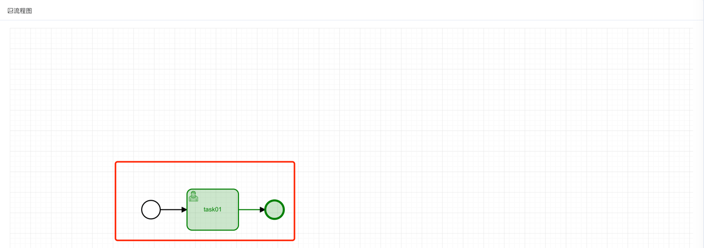
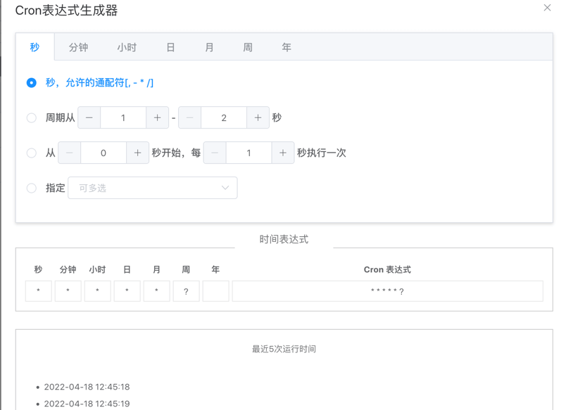

目录

# 菜单路由

前端项目基于 element-ui-admin 实现，它的 [路由和侧边栏 (opens new window)](https://panjiachen.github.io/vue-element-admin-site/zh/guide/essentials/router-and-nav.html#%E9%85%8D%E7%BD%AE%E9%A1%B9) 是组织起一个后台应用的关键骨架。

侧边栏和路由是绑定在一起的，所以你只有在 [@/router/index.js (opens new window)](https://github.com/yudaocode/yudao-ui-admin-vue2/blob/master/src/router/index.js) 下面配置对应的路由，侧边栏就能动态的生成了，大大减轻了手动重复编辑侧边栏的工作量。

当然，这样就需要在配置路由的时候，遵循一些约定的规则。

## [#](#_1-路由配置) 1. 路由配置

首先，我们了解一下本项目配置路由时，提供了哪些配置项：

```js
// 当设置 true 的时候该路由不会在侧边栏出现 如 401，login 等页面，或者如一些编辑页面 /edit/1
hidden: true // (默认 false)

// 当设置 noRedirect 的时候该路由在面包屑导航中不可被点击
redirect: 'noRedirect'

// 1. 当你一个路由下面的 children 声明的路由大于 1 个时，自动会变成嵌套的模式。例如说，组件页面
// 2. 只有一个时，会将那个子路由当做根路由显示在侧边栏。例如说，如引导页面
// 若你想不管路由下面的 children 声明的个数都显示你的根路由，
// 你可以设置 alwaysShow: true，这样它就会忽略之前定义的规则，一直显示根路由
alwaysShow: true

name: 'router-name' // 设定路由的名字，一定要填写不然使用 <keep-alive> 时会出现各种问题
meta: {
  roles: ['admin', 'editor'] // 设置该路由进入的权限，支持多个权限叠加
  title: 'title' // 设置该路由在侧边栏和面包屑中展示的名字
  icon: 'svg-name' // 设置该路由的图标，支持 svg-class，也支持 el-icon-x element-ui 的 icon
  noCache: true // 如果设置为 true，则不会被 <keep-alive> 缓存(默认 false)
  breadcrumb: false //  如果设置为 false，则不会在breadcrumb面包屑中显示(默认 true)
  affix: true // 如果设置为 true，它则会固定在 tags-view 中(默认 false)

  // 当路由设置了该属性，则会高亮相对应的侧边栏。
  // 这在某些场景非常有用，比如：一个文章的列表页路由为：/article/list
  // 点击文章进入文章详情页，这时候路由为 /article/1，但你想在侧边栏高亮文章列表的路由，就可以进行如下设置
  activeMenu: '/article/list'
}

```

普通示例

```json
{
  path: '/system/test',
  component: Layout,
  redirect: 'noRedirect',
  hidden: false,
  alwaysShow: true,
  meta: { title: '系统管理', icon : "system" },
  children: [{
    path: 'index',
    component: (resolve) => require(['@/views/index'], resolve),
    name: 'Test',
    meta: {
      title: '测试管理',
      icon: 'user'
    }
  }]
}

```

外链示例

```json
{
  path: 'https://www.iocoder.cn',
  meta: { title: '芋道源码', icon : "guide" }
}

```

## [#](#_2-路由) 2. 路由

项目的路由分为两种：静态路由、动态路由。

### [#](#_2-1-静态路由) 2.1 静态路由

静态路由，代表那些不需要动态判断权限的路由，如登录页、404、个人中心等通用页面。

在 [@/router/index.js (opens new window)](https://github.com/yudaocode/yudao-ui-admin-vue2/blob/master/src/router/index.js) 的 `constantRoutes`，就是配置对应的公共路由。如下图所示：


### [#](#_2-2-动态路由) 2.2 动态路由

动态路由，代表那些需要根据用户动态判断权限，并通过 [addRoutes (opens new window)](https://router.vuejs.org/guide/advanced/dynamic-routing.html#adding-routes) 动态添加的页面，如用户管理、角色管理等功能页面。

在用户登录成功后，会触发 [`@/store/modules/permission.js` (opens new window)](https://github.com/yudaocode/yudao-ui-admin-vue2/blob/master/src/store/modules/permission.js#L29) 请求后端的菜单 RESTful API 接口，获取用户**有权限**的菜单列表，并转化添加到路由中。如下图所示：


友情提示：

1.  动态路由可以在 \[系统管理 -> 菜单管理\] 进行新增和修改操作，请求的后端 RESTful API 接口是 [`/admin-api/system/auth/get-permission-info` (opens new window)](https://github.com/YunaiV/ruoyi-vue-pro/blob/master/yudao-module-system/yudao-module-system-biz/src/main/java/cn/iocoder/yudao/module/system/controller/admin/auth/AuthController.java#L107-L110)
2.  动态路由在生产环境下会默认使用路由懒加载，实现方式参考 [loadView (opens new window)](https://github.com/yudaocode/yudao-ui-admin-vue2/blob/master/src/store/modules/permission.js#L108-L110) 方法的判断

### [#](#_2-3-路由跳转) 2.3 路由跳转

使用 `router.push` 方法，可以实现跳转到不同的页面。

```js
// 简单跳转
this.$router.push({ path: "/system/user" });

// 跳转页面并设置请求参数，使用 `query` 属性
this.$router.push({ path: "/system/user", query: {id: "1", name: "芋道"} });

```

## [#](#_3-菜单管理) 3. 菜单管理

项目的菜单在 \[系统管理 -> 菜单管理\] 进行管理，支持**无限**层级，提供目录、菜单、按钮三种类型。如下图所示：


菜单可在 \[系统管理 -> 角色管理\] 被分配给角色。如下图所示：


### [#](#_3-1-新增目录) 3.1 新增目录

① 大多数情况下，目录是作为菜单的【分类】：


② 目录也提供实现【外链】的能力：


### [#](#_3-2-新增菜单) 3.2 新增菜单


### [#](#_3-3-新增按钮) 3.3 新增按钮



## [#](#_4-权限控制) 4. 权限控制

前端通过权限控制，隐藏用户没有权限的按钮等，实现功能级别的权限。

友情提示：前端的权限控制，主要是提升用户体验，避免操作后发现没有权限。

最终在请求到后端时，还是会进行一次权限的校验。

### [#](#_4-1-v-haspermi-指令) 4.1 v-hasPermi 指令

[`v-hasPermi` (opens new window)](https://github.com/yudaocode/yudao-ui-admin-vue2/blob/master/src/directive/permission/hasPermi.js) 指令，基于权限字符，进行权限的控制。

```html
<!-- 单个 -->
<el-button v-hasPermi="['system:user:create']">存在权限字符串才能看到</el-button>

<!-- 多个，满足任一一个即可 -->
<el-button v-hasPermi="['system:user:create', 'system:user:update']">包含权限字符串才能看到</el-button>

```

### [#](#_4-2-v-hasrole-指令) 4.2 v-hasRole 指令

[`v-hasRole` (opens new window)](https://github.com/yudaocode/yudao-ui-admin-vue2/blob/master/src/directive/permission/hasRole.js) 指令，基于角色标识，机进行的控制。

```html
<!-- 单个 -->
<el-button v-hasRole="['admin']">管理员才能看到</el-button>

<!-- 多个，满足任一一个即可 -->
<el-button v-hasRole="['role1', 'role2']">包含角色才能看到</el-button>

```

### [#](#_4-3-结合-v-if-指令) 4.3 结合 v-if 指令

在某些情况下，它是不适合使用 `v-hasPermi` 或 `v-hasRole` 指令，如元素标签组件。此时，只能通过手动设置 `v-if`，通过使用全局权限判断函数，用法是基本一致的。

```html
<template>
  <el-tabs>
    <el-tab-pane v-if="checkPermi(['system:user:create'])" label="用户管理" name="user">用户管理</el-tab-pane>
    <el-tab-pane v-if="checkPermi(['system:user:create', 'system:user:update'])" label="参数管理" name="menu">参数管理</el-tab-pane>
    <el-tab-pane v-if="checkRole(['admin'])" label="角色管理" name="role">角色管理</el-tab-pane>
    <el-tab-pane v-if="checkRole(['admin','common'])" label="定时任务" name="job">定时任务</el-tab-pane>
   </el-tabs>
</template>

<script>
import { checkPermi, checkRole } from "@/utils/permission"; // 权限判断函数

export default{
   methods: {
    checkPermi,
    checkRole
  }
}
</script>

```

## [#](#_5-页面缓存) 5. 页面缓存

由于目前 `keep-alive` 和 `router-view` 是强耦合的，而且查看 Vue 的文档和源码不难发现 `keep-alive` 的 `include` 默认是优先匹配组件的 `name` ，所以在编写路由 `router` 和路由对应的 view component 的时候一定要确保 两者的 name 是完全一致的。

注意，切记 view component 的 `name` 命名时候尽量保证唯一性，切记不要和某些组件的命名重复了，不然会递归引用最后内存溢出等问题。

友情提示：页面缓存是什么？

简单来说，Tab 切换时，开启页面缓存的 Tab 保持原本的状态，不进行刷新。

详细可见 [Vue 文档 —— KeepAlive (opens new window)](https://vuejs.org/guide/built-ins/keep-alive.html)

### [#](#_5-1-静态路由的示例) 5.1 静态路由的示例

① router 路由的 `name` 声明如下：

```js
{
  path: 'create-form',
  component: ()=>import('@/views/form/create'),
  name: 'createForm',
  meta: { title: 'createForm', icon: 'table' }
}

```

② view component 的 `name` 声明如下：

```js
export default {
  name: 'createForm'
}

```

一定要保证两者的名字相同，切记写重或者写错。默认如果不写 `name` 就不会被缓存，详情见 [issue (opens new window)](https://github.com/vuejs/vue/issues/6938#issuecomment-345728620)。

### [#](#_5-2-动态路由的示例) 5.2 动态路由的示例

